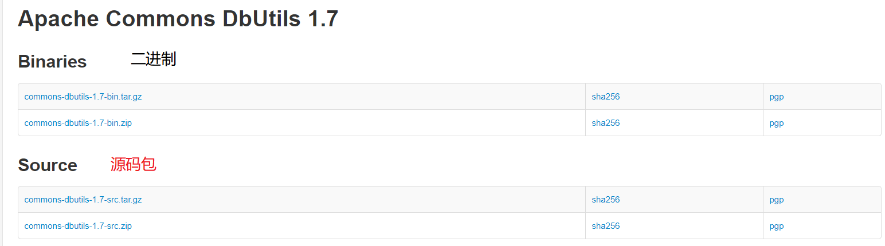
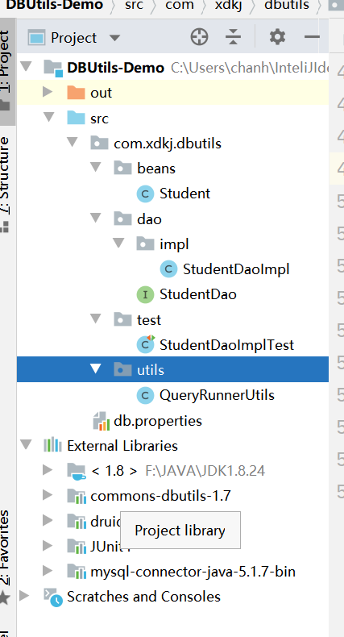
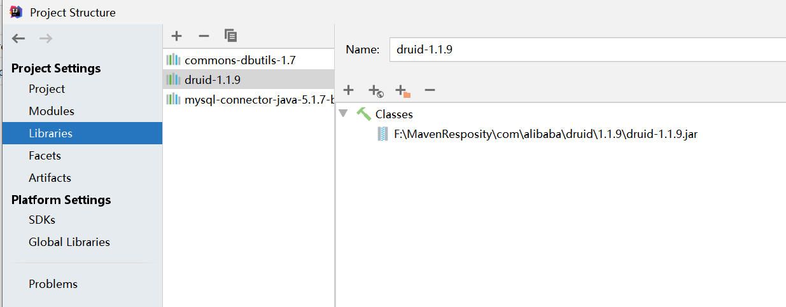

# DButils

## 1. DBUtils

> Commons DbUtils是[Apache](https://baike.baidu.com/item/Apache/8512995)组织提供的一个对[JDBC](https://baike.baidu.com/item/JDBC)进行简单封装的开源工具类库，使用它能够简化[JDBC](https://baike.baidu.com/item/JDBC)应用程序的开发，同时也不会影响程序的性能。

### 1.1 下载DBUtilsjar包

[Dbutils官方下载](http://commons.apache.org/proper/commons-dbutils/download_dbutils.cgi)



### 1.2 导入jar包

**新建项目**



**导入jar包**



### 1.3 构建工具类QueryRunnerUtils

**db.properties**

```properties
driverClassName=com.mysql.jdbc.Driver
username=root
password=root
url=jdbc:mysql://localhost:3306/hehe?useSSL=true&useEncoding=true&characterEncoding=utf8
initialSize=5
maxActive=20
maxWait=60000
keepAlive=true
```


```java
package com.xdkj.dbutils.utils;

import com.alibaba.druid.pool.DruidDataSourceFactory;
import org.apache.commons.dbutils.QueryRunner;

import javax.sql.DataSource;
import java.io.IOException;
import java.io.InputStream;
import java.util.Properties;

/**
 * ClassName QueryRunnerUtils
 * Description:
 *
 * @Author:一尘
 * @Version:1.0
 * @Date:2021-01-13-15:23
 */
public class QueryRunnerUtils {
    //返回一个数据源
    public  static DataSource getDtaSource(){
        InputStream inputStream = QueryRunnerUtils.class.getClassLoader().getResourceAsStream("db.properties");
        Properties properties = new Properties();
        DataSource dataSource = null;
        try {
            properties.load(inputStream);
            dataSource =   DruidDataSourceFactory.createDataSource(properties);
        } catch (IOException e) {
            e.printStackTrace();
        } catch (Exception e) {
            e.printStackTrace();
        }
        return  dataSource;
    }
    //返回QueryRunner

    public  static QueryRunner getRunner(){
        return  new QueryRunner(getDtaSource());
    }

}

```

### 1.4 构建实体类和接口

```java
public class Student {
    private int id;
    private String name;
    private String sex;
    private Date birth;
    private String department;
    private String address;
    private  int age;
    ...getter setter...
}
```


```java
package com.xdkj.dbutils.dao;

import com.xdkj.dbutils.beans.Student;

import java.util.List;

public interface StudentDao {
    //查询所有
    List<Student> queryAll();
    //根据id查询
    Student queryById(int id);
    //模糊查询
    List<Student> queryLikeName(String name);
    //添加
     int addStudent(Student student);
     //修改
     int updateStudent(Student student);
     //删除
     int deleteStudent(Student student);
}

```

```java
package com.xdkj.dbutils.dao.impl;

import com.xdkj.dbutils.beans.Student;
import com.xdkj.dbutils.dao.StudentDao;
import com.xdkj.dbutils.utils.QueryRunnerUtils;
import org.apache.commons.dbutils.QueryRunner;
import org.apache.commons.dbutils.handlers.BeanHandler;
import org.apache.commons.dbutils.handlers.BeanListHandler;

import java.sql.SQLException;
import java.util.List;

/**
 * ClassName StudentDaoImpl
 * Description:
 *
 * @Author:一尘
 * @Version:1.0
 * @Date:2021-01-13-15:36
 */
public class StudentDaoImpl implements StudentDao {
    //执行sql语句并返回结果值
    private QueryRunner runner = QueryRunnerUtils.getRunner();

    @Override
    public List<Student> queryAll() {
        List<Student> list = null;
        try {
            list = runner.query("select * from student", new BeanListHandler<Student>(Student.class));
        } catch (SQLException throwables) {
            throwables.printStackTrace();
        }
        return list;
    }

    @Override
    public Student queryById(int id) {
        Student student = null;
        try {
            student = runner.query("select * from student where id = ?", new BeanHandler<Student>(Student.class), id);
        } catch (SQLException throwables) {
            throwables.printStackTrace();
        }
        return student;
    }

    @Override
    public List<Student> queryLikeName(String name) {
        List<Student> list = null;
        try {
            list = runner.query("select * from student where name like concat('%',?,'%')", new BeanListHandler<>(Student.class), name);
        } catch (SQLException throwables) {
            throwables.printStackTrace();
        }
        return list;
    }

    @Override
    public int addStudent(Student student) {
        int result = 0;
        try {
           result = runner.update("insert into student values(null,?,?,?,?,?,?)"
                    , student.getName()
                    , student.getSex()
                    , student.getBirth()
                    , student.getDepartment()
                    , student.getAddress()
                    , student.getAge());
        } catch (SQLException throwables) {
            throwables.printStackTrace();
        }
        return result;
    }

    @Override
    public int updateStudent(Student student) {
        int result =0;
        try {
           result = runner.update("update student set name = ? where id = ?",student.getName(),student.getId());
        } catch (SQLException throwables) {
            throwables.printStackTrace();
        }
        return result;
    }

    @Override
    public int deleteStudent(Student student) {
        int result = 0;
        try {
            result = runner.update("delete from student where id =?",student.getId());
        } catch (SQLException throwables) {
            throwables.printStackTrace();
        }
        return result;
    }
}

```

### 1.5 测试

```java
package com.xdkj.dbutils.test;

import com.xdkj.dbutils.beans.Student;
import com.xdkj.dbutils.dao.StudentDao;
import com.xdkj.dbutils.dao.impl.StudentDaoImpl;
import org.junit.Test;

import java.util.List;

import static org.junit.Assert.*;

public class StudentDaoImplTest {
    private StudentDao studentDao = new StudentDaoImpl();
    @Test
    public void queryAll() {
        List<Student> list = studentDao.queryAll();
        for (Student student : list) {
            System.out.println(student);
        }
    }

    @Test
    public void queryById() {
        System.out.println(studentDao.queryById(903));
    }

    @Test
    public void queryLikeName() {
        System.out.println(studentDao.queryLikeName("d"));
    }

    @Test
    public void addStudent() {
        Student student = new Student();
        student.setName("梅超风");
        student.setSex("女");
        student.setBirth(null);
        student.setDepartment("九阴白骨爪");
        student.setAddress("蒙古");
        student.setAge(30);
        System.out.println(studentDao.addStudent(student));

    }

    @Test
    public void updateStudent() {
        Student student = new Student();
        student.setName("陈玄风");
        student.setId(92906);
        System.out.println(studentDao.updateStudent(student));
    }

    @Test
    public void deleteStudent() {
        Student student = new Student();
        student.setId(92906);
        System.out.println(studentDao.deleteStudent(student));
    }
}
```

## 2. QueryRunner

> 执行sql语句并处理ResultSet
>
> + query 执行查询语句
> + update 执行  update insert delete

### 2.1 Query

query(sql,new BeanListHandler<>());  处理查询结果是一个集合

query(sql,new BeanHandler<>()); 处理查询结果是一个对象

update(sql,param1,param2);

## 3. ResultSetHandler 结果集处理器

### 3.1 BeanListHandler 

> 将集合的结果集合封装到ResultSet 的集合中

