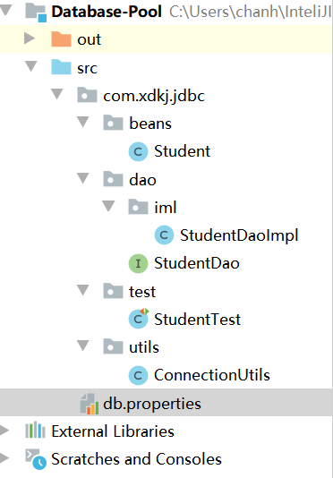
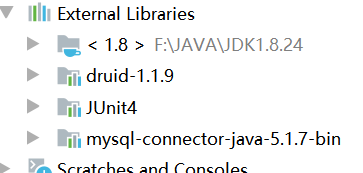

# JDBC


> Java数据库连接，（Java Database Connectivity，简称JDBC）是[Java语言](https://baike.baidu.com/item/Java语言)中用来规范客户端程序如何来访问数据库的[应用程序接口](https://baike.baidu.com/item/应用程序接口/10418844)，提供了诸如查询和更新数据库中数据的方法。JDBC也是Sun Microsystems的商标。我们通常说的JDBC是面向关系型数据库的。

## 1. 下载Mysql提供的数据库驱动jar包

[maven Mysql驱动的jar包](https://mvnrepository.com/artifact/mysql/mysql-connector-java/5.1.49)

[Mysql官网提供的](https://dev.mysql.com/downloads/connector/j/)


[Mysql-connector-java文档](https://dev.mysql.com/doc/connector-j/5.1/en/)

## 2. 我们使用使用java连接数据库

### 2.1 我们新建项目和导入jar包

**新建项目**


**导入需要的驱动jar包**


构建以后的jar包


### 2.2. 构建数据库连接工具类

```java
package com.xdkj.jdbc.utils;

import java.sql.Connection;
import java.sql.DriverManager;
import java.sql.SQLException;

public class ConnectionUtils {
	/*数据源连接信息:
	 * 	用户名:
	 * 	密码:
	 * 	主机:
	 * 	端口:
	 * 连接的路径:
	 * */
	private static String USERNAME= "root";
	private static String PASSWORD= "root";
	//mysql连接的路径
	private static String URL= "jdbc:mysql://localhost:3306/hehe";
	
	public static Connection getConnection() {
		Connection con = null;
		//加载数据路驱动
		try {
			Class.forName("com.mysql.jdbc.Driver");
			con = DriverManager.getConnection(URL, USERNAME, PASSWORD);
		} catch (ClassNotFoundException e) {
			e.printStackTrace();
		} catch (SQLException e) {
			e.printStackTrace();
		}
		return con;
	}
	//关闭数据库的连接
	public static void close(Connection con) {
		try {
			if(con!=null) {
				con.close();
			}
		} catch (SQLException e) {
			e.printStackTrace();
		}
	}
}

```

### 2.3 . 构建数据库映射的类

```sql
public class Student {
	private int id;
	private String name;
	private String sex;
	private Date  birth;
	private String department;
	private String address;
	private int age;
	.....get set....
	}
```

### 2.4  构建实体类的接口和实现类

**Student**

```java
public class Student {
	private int id;
	private String name;
	private String sex;
	private Date  birth;
	private String department;
	private String address;
	private int age;
	.....get set....
	}

```

**StudentDao**

```java
package com.xdkj.jdbc.dao;

import java.util.List;

import com.xdkj.jdbc.entity.Student;

public interface StudentDao {
	List<Student> selectAll();
}

```

**StudentDaoImpl**

```java
package com.xdkj.jdbc.dao.impl;

import java.sql.Connection;
import java.sql.ResultSet;
import java.sql.SQLException;
import java.sql.Statement;
import java.util.ArrayList;
import java.util.List;

import com.xdkj.jdbc.dao.StudentDao;
import com.xdkj.jdbc.entity.Student;
import com.xdkj.jdbc.utils.ConnectionUtils;

public class StudentDaoImpl implements StudentDao {

	//获取数据库的连接
	Connection  con =ConnectionUtils.getConnection();
	//获取 静态sql执行器  写死的sql
	Statement  sta = null;
	//获取结果集合
	ResultSet rs = null;
	@Override
	public List<Student> selectAll() {
		List<Student> list = new ArrayList<>();
		try {
			String sql = "select * from student";
			sta = con.createStatement();
			rs = sta.executeQuery(sql);
			//遍历结果集
			while(rs.next()) {
				Student student = new Student();
				//通过列的下标获取
				student.setId(rs.getInt(1));
				student.setName(rs.getString(2));
				student.setSex(rs.getString(3));
				student.setBirth(rs.getDate(4));
				student.setDepartment(rs.getString(5));
				student.setAddress(rs.getString(6));
				student.setAge(rs.getInt(7));
				//从数据获取一条数据 封装一条数据  放入List集合中
				list.add(student);
			}
		} catch (SQLException e) {
			e.printStackTrace();
		}
		return list;
	}

}

```

### 2.5 测试查询

```java
package com.xdkj.jdbc.test;

import java.util.List;

import com.xdkj.jdbc.dao.StudentDao;
import com.xdkj.jdbc.dao.impl.StudentDaoImpl;
import com.xdkj.jdbc.entity.Student;

public class StudentTest {

	public static void main(String[] args) {
		StudentDao studentDao  = new StudentDaoImpl();
		List<Student> list = studentDao.selectAll();
		System.out.println(list);
	}

}

```

```properties
[Student [id=901, name=李世民, sex=男, birth=1985-01-01, department=计算机系, address=北京市海淀区, age=25]]
```

## 3. Statement

+ executeQuery(sql);
+ executeUpdate(sql);

> 执行静态的sql语句并返回执行结果的结果集合。
>
> 什么是静态的Sql？ 写死的sql
>
> 因为这个sql语句是写死的不能传参数。所以我们实际开发中不用Statement 使用PreparedStatement

```java
package com.xdkj.jdbc.dao.impl;

import java.sql.Connection;
import java.sql.ResultSet;
import java.sql.SQLException;
import java.sql.Statement;
import java.util.ArrayList;
import java.util.List;

import com.xdkj.jdbc.dao.StudentDao;
import com.xdkj.jdbc.entity.Student;
import com.xdkj.jdbc.utils.ConnectionUtils;

public class StudentDaoImpl implements StudentDao {

	//获取数据库的连接
	Connection  con =ConnectionUtils.getConnection();
	//获取 静态sql执行器  写死的sql
	Statement  sta = null;
	//获取结果集合
	ResultSet rs = null;
	@Override
	public List<Student> selectAll() {
		List<Student> list = new ArrayList<>();
		try {
			String sql = "select * from student";
			sta = con.createStatement();
			rs = sta.executeQuery(sql);
			//遍历结果集
			while(rs.next()) {
				Student student = new Student();
				//通过列的下标获取
				student.setId(rs.getInt(1));
				student.setName(rs.getString(2));
				student.setSex(rs.getString(3));
				student.setBirth(rs.getDate(4));
				student.setDepartment(rs.getString(5));
				student.setAddress(rs.getString(6));
				student.setAge(rs.getInt(7));
				//从数据获取一条数据 封装一条数据  放入List集合中
				list.add(student);
			}
		} catch (SQLException e) {
			e.printStackTrace();
		}
		return list;
	}
	@Override
	public Student selectById(int id) {
		String sql = "select * from student where id = 901";
		Student student = null;
		try {
			sta = con.createStatement();
			rs = sta.executeQuery(sql);
			if(rs.next()) {
				student = 	new Student();
				student.setId(rs.getInt(1));
				student.setName(rs.getString(2));
				student.setSex(rs.getString(3));
				student.setBirth(rs.getDate(4));
				student.setDepartment(rs.getString(5));
				student.setAddress(rs.getString(6));
				student.setAge(rs.getInt(7));
			}
		} catch (SQLException e) {
			// TODO Auto-generated catch block
			e.printStackTrace();
		}
		return student;
	}
	@Override
	public int addStudent() {
		String sql ="insert into student values(null,'admin','男',1990,'计算机系','陕西省西安市',99);";
		int result = 0;
		try {
			sta = con.createStatement();
			result = sta.executeUpdate(sql);
		} catch (SQLException e) {
			e.printStackTrace();
		}
		return result;
	}
	@Override
	public int updateStudent() {
		String sql = "update student set name ='张三丰' where id = '92900'";
		int result = 0;
		try {
			sta = con.createStatement();
			result = sta.executeUpdate(sql);
		} catch (SQLException e) {
			// TODO Auto-generated catch block
			e.printStackTrace();
		}
		
		return result;
	}
	@Override
	public int deleteStudent() {
		String sql = "delete  from student where id > 920 ";
		int result = 0;
		try {
			sta = con.createStatement();
			result = sta.executeUpdate(sql);
		} catch (SQLException e) {
			// TODO Auto-generated catch block
			e.printStackTrace();
		}
		
		return result;
	}

}

```

**使用数据库的字段名称**

```java
@Override
	public Student selectById(int id) {
		String sql = "select * from student where id = 901";
		Student student = null;
		try {
			sta = con.createStatement();
			rs = sta.executeQuery(sql);
			if(rs.next()) {
				student = 	new Student();
				student.setId(rs.getInt("id"));
				student.setName(rs.getString("name"));
				student.setSex(rs.getString("sex"));
				student.setBirth(rs.getDate("birth"));
				student.setDepartment(rs.getString("department"));
				student.setAddress(rs.getString("address"));
				student.setAge(rs.getInt("age"));
			}
		} catch (SQLException e) {
			// TODO Auto-generated catch block
			e.printStackTrace();
		}
		return student;
	}
```

## 4. JUNIT 单元测试

> 单元测试就是使用java提供的@Test注解进行局部的方法测试


```java
package com.xdkj.jdbc.test;

import java.util.List;

import org.junit.Test;

import com.xdkj.jdbc.dao.StudentDao;
import com.xdkj.jdbc.dao.impl.StudentDaoImpl;
import com.xdkj.jdbc.entity.Student;

public class StudentTest {
		StudentDao studentDao = new StudentDaoImpl();
	/*
	 * public static void main(String[] args) { StudentDao studentDao = new
	 * StudentDaoImpl(); //List<Student> list = studentDao.selectAll();
	 * //System.out.println(list);
	 * 
	 * Student selectById = studentDao.selectById(0);
	 * System.out.println(selectById); }
	 */
	@Test
	public void addStudent() {
		int addStudent = studentDao.addStudent();
		System.out.println(addStudent);
	}
	@Test
	public void updateStudent() {
		
	}
}

```

## 5. 出现乱码问题

```sql
	private static String USERNAME= "root";
	private static String PASSWORD= "root";
	//mysql连接的路径
	private static String URL= "jdbc:mysql://localhost:3306/hehe?useSSL=true&useEncoding=true&characterEncoding=utf8";
```

## 6. PreparedStatement 预编译的Sql语句

> 预编译的sql语句:
>
> ? 占位符
>
> 在编译sql语句的过程中使用？作为占位符，在根据方法传入的参数类型使用preparedStatement的set 方法使用传入的实际参数替换编译以后sql语句中的?
>
> 提高了sql语句和代码的复用性，效率提高。 


```java
package com.xdkj.jdbc.dao.impl;

import java.sql.Connection;
import java.sql.PreparedStatement;
import java.sql.ResultSet;
import java.sql.SQLException;
import java.util.ArrayList;
import java.util.Date;
import java.util.List;

import com.xdkj.jdbc.dao.StudentDao;
import com.xdkj.jdbc.entity.Student;
import com.xdkj.jdbc.utils.ConnectionUtils;

public class StudentDaoImpl2 implements StudentDao {

	private Connection con = ConnectionUtils.getConnection();
	private PreparedStatement  pre = null;
	private ResultSet rs = null;
	@Override
	public List<Student> selectAll() {
		List<Student> list = new ArrayList<>();
		String sql = "select * from student";
		try {
			pre = con.prepareStatement(sql);
			rs = 	pre.executeQuery();
			while(rs.next()) {
				Student student = new Student();
				//通过列的下标获取
				student.setId(rs.getInt(1));
				student.setName(rs.getString(2));
				student.setSex(rs.getString(3));
				student.setBirth(rs.getDate(4));
				student.setDepartment(rs.getString(5));
				student.setAddress(rs.getString(6));
				student.setAge(rs.getInt(7));
				//从数据获取一条数据 封装一条数据  放入List集合中
				list.add(student);
			}
		} catch (SQLException e) {
			// TODO Auto-generated catch block
			e.printStackTrace();
		}
		return list;
	}

	@Override
	public Student selectById(int id) {
		//java中先编译后运行
		String sql = "select * from student where id = ?";
		Student  student = null;
		try {
			pre = 	con.prepareStatement(sql);
			//使用传入的参数替换占位符号
			//1代表第一个问号
			pre.setInt(1, id);
		
			rs = pre.executeQuery();
			
			if(rs.next()) {
				student = 	new Student();
				student.setId(rs.getInt("id"));
				student.setName(rs.getString("name"));
				student.setSex(rs.getString("sex"));
				student.setBirth(rs.getDate("birth"));
				student.setDepartment(rs.getString("department"));
				student.setAddress(rs.getString("address"));
				student.setAge(rs.getInt("age"));
			}
			
		} catch (SQLException e) {
			// TODO Auto-generated catch block
			e.printStackTrace();
		}
		return student;
	}

	@Override
	public int addStudent() {
		int result = 0;
		String sql = "insert into student values(null,?,?,?,?,?,?);";
		try {
			pre = con.prepareStatement(sql);
			pre.setString(1, "赵敏");
			pre.setString(2, "女");
			pre.setDate(3, null);
			pre.setString(4, "英语系");
			pre.setString(5, "陕西省西安市");
			pre.setInt(6, 100);
			
			result = pre.executeUpdate();
			
		} catch (SQLException e) {
			e.printStackTrace();
		}
		
		return result;
	}

	@Override
	public int updateStudent() {
		int result = 0;
		String sql = "update student set name =?,age=?,address=? where id = ?";
		try {
			pre = con.prepareStatement(sql);
			pre.setString(1, "白眉鹰王");
			pre.setInt(2, 999);
			pre.setString(3, "北京市昌平区");
			pre.setInt(4, 901);
			 result = pre.executeUpdate();
		} catch (SQLException e) {
			// TODO Auto-generated catch block
			e.printStackTrace();
		}
		
		return result;
	}

	@Override
	public int deleteStudent() {
		String sql = "delete from student where id = ?";
		int result = 0;
		try {
			pre = con.prepareStatement(sql);
			pre.setInt(1, 92903);
		result = pre.executeUpdate();
		} catch (SQLException e) {
			// TODO Auto-generated catch block
			e.printStackTrace();
		}
	
		return result;
	}
	 @Override
    public List<Student> selectByName(String name) {
        String sql = "select * from student where name like concat('%',?,'%') ";
        List<Student> list = new ArrayList<>();
        try {
            pre = con.prepareStatement(sql);
             pre.setString(1,name);
            rs = pre.executeQuery();
            while(rs.next()){
              Student   student = new Student();
                student.setId(rs.getInt("id"));
                student.setName(rs.getString("name"));
                student.setSex(rs.getString("sex"));
                student.setBirth(rs.getDate("birth"));
                student.setDepartment(rs.getString("department"));
                student.setAddress(rs.getString("address"));
                student.setAge(rs.getInt("age"));
                list.add(student);
            }
        } catch (SQLException throwables) {
            throwables.printStackTrace();
        }

        return list;
    }

}

```

```java
package com.xdkj.jdbc.test;

import java.util.List;

import org.junit.Test;

import com.xdkj.jdbc.dao.StudentDao;
import com.xdkj.jdbc.dao.impl.StudentDaoImpl2;
import com.xdkj.jdbc.entity.Student;

public class StudentTest2 {
	
	StudentDao studentDao = new StudentDaoImpl2();
	@Test
	public void selectAll() {
		List<Student> list = studentDao.selectAll();
		System.out.println(list);
	}
	
	@Test
	public void selectById() {
		Student student = studentDao.selectById(901);
		System.out.println(student);
	}
	
	@Test
	public void addStudent() {
		int addStudent = studentDao.addStudent();
		System.out.println(addStudent);
	}
	
	@Test
	public void updateStudent() {
		int addStudent = studentDao.updateStudent();
		System.out.println(addStudent);
	}
	
	@Test
	public void deleteStudent() {
		int addStudent = studentDao.deleteStudent();
		System.out.println(addStudent);
	}
}

```

**接口有参数**

```sql
package com.xdkj.jdbc.dao;

import com.xdkj.jdbc.entity.Student;

public interface StudentMapper {
	int addStudent(Student student);
}

```

```java
package com.xdkj.jdbc.dao.impl;

import java.sql.Connection;
import java.sql.PreparedStatement;
import java.sql.ResultSet;
import java.sql.SQLException;

import com.xdkj.jdbc.dao.StudentMapper;
import com.xdkj.jdbc.entity.Student;
import com.xdkj.jdbc.utils.ConnectionUtils;

public class StudentMapperImpl implements StudentMapper {
	private Connection con = ConnectionUtils.getConnection();
	private PreparedStatement  pre = null;
	private ResultSet rs = null;
	@Override
	public int addStudent(Student student) {
		int result = 0;
	String sql = "insert into student values(null,?,?,?,?,?,?);";
		try {
			pre = con.prepareStatement(sql);
			pre.setString(1, student.getName());
			pre.setString(2, student.getSex());
			pre.setDate(3, null);
			pre.setString(4, student.getDepartment());
			pre.setString(5, student.getAddress());
			pre.setInt(6, student.getAge());
			
			result = pre.executeUpdate();
		} catch (SQLException e) {
			// TODO Auto-generated catch block
			e.printStackTrace();
		}
		
		return result;
	}
public static void main(String[] args) {
	Student student = new Student();
		student.setName("小昭");
		student.setSex("女");
		student.setDepartment("中文系");
		student.setAddress("光明顶");
		student.setAge(30);
	
int result = 	new StudentMapperImpl().addStudent(student);
System.out.println(result);
}
}

```

## 7. 数据库连接池

> 数据库连接池负责分配、管理和释放数据库连接，它允许应用程序重复使用一个现有的数据库连接，而不是再重新建立一个；释放空闲时间超过最大空闲时间的数据库连接来避免因为没有释放数据库连接而引起的数据库连接遗漏。这项技术能明显提高对数据库操作的性能。

### 7.1 Druid德鲁伊数据库连接池

[中文官网](https://github.com/alibaba/druid/wiki/%E5%B8%B8%E8%A7%81%E9%97%AE%E9%A2%98)



需要的jar包



### 7.2 db.properties

```sql
jdbc.Driver=com.mysql.jdbc.Driver
jdbc.Url=jdbc:mysql://localhost:3306/hehe?useSSL=true&useEncoding=true&characterEncoding=utf8
jdbc.UserName=root
jdbc.Password=root
#数据库连接池的参数
#初始的连接数大小
jdbc.initialSize=5
#最大的激活数
jdbc.maxActive=20
#配置获取连接等待超时的时间
jdbc.maxWait=60000

```

### 7.3 ConnectionUtils

```sql
package com.xdkj.jdbc.utils;

import com.alibaba.druid.pool.DruidDataSource;

import java.io.IOException;
import java.io.InputStream;
import java.sql.Connection;
import java.sql.DriverManager;
import java.sql.SQLException;
import java.util.Properties;

/**
 * ClassName ConnectioUtils
 * Description:数据库连接工具
 *
 * @Author:一尘
 * @Version:1.0
 * @Date:2021-01-13-11:13
 */
public class ConnectionUtils {
    //获取外部配置的数据源信息
    public   static DruidDataSource getDataSource() {
   InputStream in = ConnectionUtils.class.getClassLoader().getResourceAsStream("db.properties");
        Properties properties = new Properties();
        DruidDataSource dataSource = null;
        try {
            properties.load(in);
            //使用Druid数据库连接池
                dataSource  = new DruidDataSource();
                Class.forName("com.mysql.jdbc.Driver");
                dataSource.setDriver(DriverManager.getDriver(properties.getProperty("jdbc.Url")));
                dataSource.setPassword(properties.getProperty("jdbc.Password"));
                dataSource.setUsername(properties.getProperty("jdbc.UserName"));
                dataSource.setUrl(properties.getProperty("jdbc.Url"));
                dataSource.setMaxActive(Integer.parseInt(properties.getProperty("jdbc.maxActive")));
                dataSource.setMaxWait(Long.parseLong(properties.getProperty("jdbc.maxWait")));
        } catch (IOException e) {
            e.printStackTrace();
        } catch (SQLException throwables) {
            throwables.printStackTrace();
        } catch (ClassNotFoundException e) {
            e.printStackTrace();
        }
    return  dataSource;
    }
    public  static Connection  getConnection() throws SQLException {
            return  getDataSource().getConnection();
    }
}

```

### 7.4 Student实体类

```java
public class Student {
    private  int id;
    private String name;
    private String sex;
    private Date birth;
    private String department;
    private String address;
    private int age;
    .....set get....
    }
```

**StudentDao*

```java
package com.xdkj.jdbc.dao;

import com.xdkj.jdbc.beans.Student;

import java.util.List;

public interface StudentDao {
    List<Student> selectAll();
}

```

```java
package com.xdkj.jdbc.dao.iml;

import com.xdkj.jdbc.beans.Student;
import com.xdkj.jdbc.dao.StudentDao;
import com.xdkj.jdbc.utils.ConnectionUtils;

import java.sql.Connection;
import java.sql.PreparedStatement;
import java.sql.ResultSet;
import java.sql.SQLException;
import java.util.ArrayList;
import java.util.List;

/**
 * ClassName StudentDaoImpl
 * Description:
 *
 * @Author:一尘
 * @Version:1.0
 * @Date:2021-01-13-11:35
 */
public class StudentDaoImpl  implements StudentDao {
    private Connection connection = ConnectionUtils.getConnection();
    private PreparedStatement pre;
    private ResultSet rs;
    public StudentDaoImpl() throws SQLException {
    }

    @Override
    public List<Student> selectAll() {
        List<Student> list = new ArrayList<>();
        String sql = "select * from student";
        try {
            pre = connection.prepareStatement(sql);
            rs = pre.executeQuery();
            while(rs.next()){
                    Student   student = new Student();
                    student.setId(rs.getInt("id"));
                    student.setName(rs.getString("name"));
                    student.setSex(rs.getString("sex"));
                    student.setBirth(rs.getDate("birth"));
                    student.setDepartment(rs.getString("department"));
                    student.setAddress(rs.getString("address"));
                    student.setAge(rs.getInt("age"));
                    list.add(student);
            }
        } catch (SQLException throwables) {
            throwables.printStackTrace();
        }
        return list;
    }
}

```

```java
package com.xdkj.jdbc.test;

import com.xdkj.jdbc.beans.Student;
import com.xdkj.jdbc.dao.StudentDao;
import com.xdkj.jdbc.dao.iml.StudentDaoImpl;
import com.xdkj.jdbc.utils.ConnectionUtils;
import org.junit.Test;

import java.sql.SQLException;
import java.util.List;

/**
 * ClassName StudentTest
 * Description:
 *
 * @Author:一尘
 * @Version:1.0
 * @Date:2021-01-13-11:28
 */
public class StudentTest {


    public StudentTest() throws SQLException {
    }

    @Test
    public void getConnection() throws SQLException {
        System.out.println(ConnectionUtils.getConnection());
    }
    StudentDao studentDao = new StudentDaoImpl();


    @Test
    public  void seelctALl(){
        List<Student> list = studentDao.selectAll();
        for (Student student : list) {
            System.out.println(student);
        }
    }

}

```

