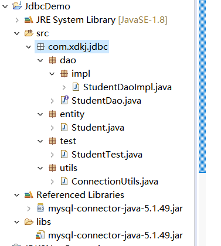
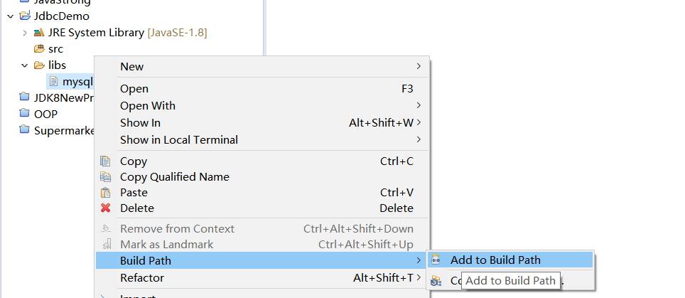
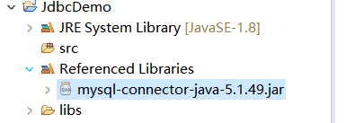
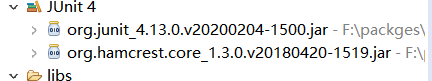

# JDBC


> Java数据库连接，（Java Database Connectivity，简称JDBC）是[Java语言](https://baike.baidu.com/item/Java语言)中用来规范客户端程序如何来访问数据库的[应用程序接口](https://baike.baidu.com/item/应用程序接口/10418844)，提供了诸如查询和更新数据库中数据的方法。JDBC也是Sun Microsystems的商标。我们通常说的JDBC是面向关系型数据库的。

## 1. 下载Mysql提供的数据库驱动jar包

[maven Mysql驱动的jar包](https://mvnrepository.com/artifact/mysql/mysql-connector-java/5.1.49)

[Mysql官网提供的](https://dev.mysql.com/downloads/connector/j/)


[Mysql-connector-java文档](https://dev.mysql.com/doc/connector-j/5.1/en/)

## 2. 我们使用使用java连接数据库

### 2.1 我们新建项目和导入jar包

**新建项目**



**导入需要的驱动jar包**



构建以后的jar包



### 2.2. 构建数据库连接工具类

```sql
package com.xdkj.jdbc.utils;

import java.sql.Connection;
import java.sql.DriverManager;
import java.sql.SQLException;

public class ConnectionUtils {
	/*数据源连接信息:
	 * 	用户名:
	 * 	密码:
	 * 	主机:
	 * 	端口:
	 * 连接的路径:
	 * */
	private static String USERNAME= "root";
	private static String PASSWORD= "root";
	//mysql连接的路径
	private static String URL= "jdbc:mysql://localhost:3306/hehe";
	
	public static Connection getConnection() {
		Connection con = null;
		//加载数据路驱动
		try {
			Class.forName("com.mysql.jdbc.Driver");
			con = DriverManager.getConnection(URL, USERNAME, PASSWORD);
		} catch (ClassNotFoundException e) {
			e.printStackTrace();
		} catch (SQLException e) {
			e.printStackTrace();
		}
		return con;
	}
	//关闭数据库的连接
	public static void close(Connection con) {
		try {
			if(con!=null) {
				con.close();
			}
		} catch (SQLException e) {
			e.printStackTrace();
		}
	}
}

```

### 2.3 . 构建数据库映射的类

```sql
public class Student {
	private int id;
	private String name;
	private String sex;
	private Date  birth;
	private String department;
	private String address;
	private int age;
	.....get set....
	}
```

### 2.4  构建实体类的接口和实现类

**Student**

```sql
public class Student {
	private int id;
	private String name;
	private String sex;
	private Date  birth;
	private String department;
	private String address;
	private int age;
	.....get set....
	}

```

**StudentDao**

```sql
package com.xdkj.jdbc.dao;

import java.util.List;

import com.xdkj.jdbc.entity.Student;

public interface StudentDao {
	List<Student> selectAll();
}

```

**StudentDaoImpl**

```sql
package com.xdkj.jdbc.dao.impl;

import java.sql.Connection;
import java.sql.ResultSet;
import java.sql.SQLException;
import java.sql.Statement;
import java.util.ArrayList;
import java.util.List;

import com.xdkj.jdbc.dao.StudentDao;
import com.xdkj.jdbc.entity.Student;
import com.xdkj.jdbc.utils.ConnectionUtils;

public class StudentDaoImpl implements StudentDao {

	//获取数据库的连接
	Connection  con =ConnectionUtils.getConnection();
	//获取 静态sql执行器  写死的sql
	Statement  sta = null;
	//获取结果集合
	ResultSet rs = null;
	@Override
	public List<Student> selectAll() {
		List<Student> list = new ArrayList<>();
		try {
			String sql = "select * from student";
			sta = con.createStatement();
			rs = sta.executeQuery(sql);
			//遍历结果集
			while(rs.next()) {
				Student student = new Student();
				//通过列的下标获取
				student.setId(rs.getInt(1));
				student.setName(rs.getString(2));
				student.setSex(rs.getString(3));
				student.setBirth(rs.getDate(4));
				student.setDepartment(rs.getString(5));
				student.setAddress(rs.getString(6));
				student.setAge(rs.getInt(7));
				//从数据获取一条数据 封装一条数据  放入List集合中
				list.add(student);
			}
		} catch (SQLException e) {
			e.printStackTrace();
		}
		return list;
	}

}

```

### 2.5 测试查询

```sql
package com.xdkj.jdbc.test;

import java.util.List;

import com.xdkj.jdbc.dao.StudentDao;
import com.xdkj.jdbc.dao.impl.StudentDaoImpl;
import com.xdkj.jdbc.entity.Student;

public class StudentTest {

	public static void main(String[] args) {
		StudentDao studentDao  = new StudentDaoImpl();
		List<Student> list = studentDao.selectAll();
		System.out.println(list);
	}

}

```

```properties
[Student [id=901, name=李世民, sex=男, birth=1985-01-01, department=计算机系, address=北京市海淀区, age=25]]
```

## 3. Statement

+ executeQuery(sql);
+ executeUpdate(sql);

> 执行静态的sql语句并返回执行结果的结果集合。
>
> 什么是静态的Sql？ 写死的sql
>
> 因为这个sql语句是写死的不能传参数。所以我们实际开发中不用Statement 使用PreparedStatement

```sql
package com.xdkj.jdbc.dao.impl;

import java.sql.Connection;
import java.sql.ResultSet;
import java.sql.SQLException;
import java.sql.Statement;
import java.util.ArrayList;
import java.util.List;

import com.xdkj.jdbc.dao.StudentDao;
import com.xdkj.jdbc.entity.Student;
import com.xdkj.jdbc.utils.ConnectionUtils;

public class StudentDaoImpl implements StudentDao {

	//获取数据库的连接
	Connection  con =ConnectionUtils.getConnection();
	//获取 静态sql执行器  写死的sql
	Statement  sta = null;
	//获取结果集合
	ResultSet rs = null;
	@Override
	public List<Student> selectAll() {
		List<Student> list = new ArrayList<>();
		try {
			String sql = "select * from student";
			sta = con.createStatement();
			rs = sta.executeQuery(sql);
			//遍历结果集
			while(rs.next()) {
				Student student = new Student();
				//通过列的下标获取
				student.setId(rs.getInt(1));
				student.setName(rs.getString(2));
				student.setSex(rs.getString(3));
				student.setBirth(rs.getDate(4));
				student.setDepartment(rs.getString(5));
				student.setAddress(rs.getString(6));
				student.setAge(rs.getInt(7));
				//从数据获取一条数据 封装一条数据  放入List集合中
				list.add(student);
			}
		} catch (SQLException e) {
			e.printStackTrace();
		}
		return list;
	}
	@Override
	public Student selectById(int id) {
		String sql = "select * from student where id = 901";
		Student student = null;
		try {
			sta = con.createStatement();
			rs = sta.executeQuery(sql);
			if(rs.next()) {
				student = 	new Student();
				student.setId(rs.getInt(1));
				student.setName(rs.getString(2));
				student.setSex(rs.getString(3));
				student.setBirth(rs.getDate(4));
				student.setDepartment(rs.getString(5));
				student.setAddress(rs.getString(6));
				student.setAge(rs.getInt(7));
			}
		} catch (SQLException e) {
			// TODO Auto-generated catch block
			e.printStackTrace();
		}
		return student;
	}
	@Override
	public int addStudent() {
		String sql ="insert into student values(null,'admin','男',1990,'计算机系','陕西省西安市',99);";
		int result = 0;
		try {
			sta = con.createStatement();
			result = sta.executeUpdate(sql);
		} catch (SQLException e) {
			e.printStackTrace();
		}
		return result;
	}
	@Override
	public int updateStudent() {
		String sql = "update student set name ='张三丰' where id = '92900'";
		int result = 0;
		try {
			sta = con.createStatement();
			result = sta.executeUpdate(sql);
		} catch (SQLException e) {
			// TODO Auto-generated catch block
			e.printStackTrace();
		}
		
		return result;
	}
	@Override
	public int deleteStudent() {
		String sql = "delete  from student where id > 920 ";
		int result = 0;
		try {
			sta = con.createStatement();
			result = sta.executeUpdate(sql);
		} catch (SQLException e) {
			// TODO Auto-generated catch block
			e.printStackTrace();
		}
		
		return result;
	}

}

```

**使用数据库的字段名称**

```sql
@Override
	public Student selectById(int id) {
		String sql = "select * from student where id = 901";
		Student student = null;
		try {
			sta = con.createStatement();
			rs = sta.executeQuery(sql);
			if(rs.next()) {
				student = 	new Student();
				student.setId(rs.getInt("id"));
				student.setName(rs.getString("name"));
				student.setSex(rs.getString("sex"));
				student.setBirth(rs.getDate("birth"));
				student.setDepartment(rs.getString("department"));
				student.setAddress(rs.getString("address"));
				student.setAge(rs.getInt("age"));
			}
		} catch (SQLException e) {
			// TODO Auto-generated catch block
			e.printStackTrace();
		}
		return student;
	}
```

## 4. JUNIT 单元测试

> 单元测试就是使用java提供的@Test注解进行局部的方法测试



```sql
package com.xdkj.jdbc.test;

import java.util.List;

import org.junit.Test;

import com.xdkj.jdbc.dao.StudentDao;
import com.xdkj.jdbc.dao.impl.StudentDaoImpl;
import com.xdkj.jdbc.entity.Student;

public class StudentTest {
		StudentDao studentDao = new StudentDaoImpl();
	/*
	 * public static void main(String[] args) { StudentDao studentDao = new
	 * StudentDaoImpl(); //List<Student> list = studentDao.selectAll();
	 * //System.out.println(list);
	 * 
	 * Student selectById = studentDao.selectById(0);
	 * System.out.println(selectById); }
	 */
	@Test
	public void addStudent() {
		int addStudent = studentDao.addStudent();
		System.out.println(addStudent);
	}
	
	@Test
	public void updateStudent() {
		
	}
}

```

## 5. PreparedStatement 预编译的Sql语句

> 


