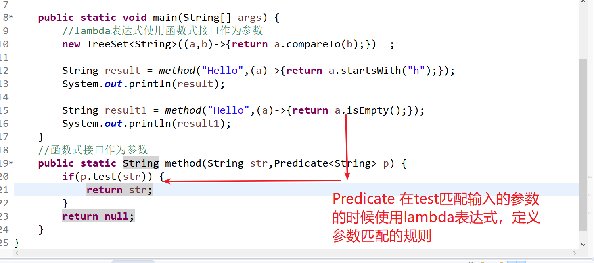

# JDK8/9/10新特性

## 1. Lambda表达式

前面学习过匿名内部类，匿名内部类使用起来好用，但是很多人还是理解起来比较难一点，JDK8以后加入了:

1. 函数式接口 ：接口中只有一个抽象方法，接口必须使用@FunctionalInterface修饰
2. 使用函数式接口主要是为了使用重写以后的接口的方法。

### 1.1 Lambda表达式的什么

(参数列表)->{方法的具体实现};

-> (goesto)

```java
package com.xdkj.jdk8;

import java.util.Comparator;

@FunctionalInterface
public interface Play {
	void hello();
}

```

```java
package com.xdkj.jdk8;

public class PlayDemo {

	public static void main(String[] args) {
		//匿名内部类实现接口
	Play play = 	new Play() {
			@Override
			public void hello() {
				System.out.println("Hello Interface");
			}
			
		};
		play.hello();
		//使用lambda表达式去实现函数接口方法的调用
		Play play1 = ()->{
			System.out.println("Hello");
		};
		play1.hello();
	}

}

```

### 1.2 Lambda表达式 有参数

```java
package com.xdkj.jdk8;
@FunctionalInterface
public interface Say {
	void say(String str,int num);
}

```

```java
package com.xdkj.jdk8;

public class SayDemo {

	public static void main(String[] args) {
		//lambda表达式中参数不需要数据类型
		Say say = (a,b)->{
			System.out.println(a+b);
		};
		say.say("Hello", 99);
		say.say("admin", 88);
		//没有返回值类型
		//方法的执行语句只有一行可以省略{}
		Say say1 = (a,b)->System.out.println(a+b);
		//System.out.println("----------");
		
		say1.say("Hello", 99);
		say1.say("admin", 88);
	}

}

```

### 1.3 有返回值

```java
package com.xdkj.jdk8;
@FunctionalInterface
public interface Jump {
	int jump();
}

```

```java
package com.xdkj.jdk8;

public class JumpDemo {

	public static void main(String[] args) {
		//有返回值的lambda表达式
		Jump jump =()->{return 123;};
		int num = jump.jump();
		System.out.println(num);
		//return 的lambda表达式不可以省略{}
		Jump jump1 =()->{return 123;};
	}
}

```

```java
package com.xdkj.jdk8;
@FunctionalInterface
public interface Jump {
	int jump(int num);
}

```

```java
package com.xdkj.jdk8;

public class JumpDemo {

	public static void main(String[] args) {
		//有返回值的lambda表达式
		Jump jump =(a)->{return 123+a;};
		int num = jump.jump(22);
		System.out.println(num);
		//return 的lambda表达式不可以省略{}
		Jump jump1 =(b)->{return 123;};
	}
}

```

### 1.4 使用Lambda表达式实现多线程

```java
package com.xdkj.jdk8;

import java.util.Comparator;

public class RunnableDemo {

	public static void main(String[] args) {
        //lambda表达式实现多线程
		Runnable runAble = ()->{
			for(int i=0;i<=100;i++) {
				try {
					Thread.sleep(1000);
					System.out.println(Thread.currentThread().getName());
				} catch (InterruptedException e) {
					e.printStackTrace();
				}
			}
		};
		new Thread(runAble).start();
		new Thread(runAble).start();
		new Thread(runAble).start();
		
		Comparator<String> com = (a,b)->{return a.compareTo(b);};
		int result = com.compare("Hello", "World");
		System.out.println(result);
	}
}

```

## 2 函数式接口作为参数

### 2.1Predicate

在JDK1.8以后提供可很多的函数式的接口专门为我们所使用

> 是对传入的参数进行条件精确匹配

```java
package com.xdkj.jdk8;

import java.util.TreeSet;
import java.util.function.Predicate;

public class FuctionalInterfaceParameters {

	public static void main(String[] args) {
		//lambda表达式使用函数式接口作为参数
		new TreeSet<String>((a,b)->{return a.compareTo(b);})  ;
		
		String result = method("Hello",(a)->{return a.startsWith("h");});
		System.out.println(result);
		
		String result1 = method("Hello",(a)->{return a.isEmpty();});
		System.out.println(result1);
	}	
	//函数式接口作为参数
	public static String method(String str,Predicate<String> p) {
		if(p.test(str)) {
			return str;
		}
		return null;
	}
}

```



```java
package com.xdkj.jdk8;

import java.util.TreeSet;
import java.util.function.Predicate;

public class FuctionalInterfaceParameters {

	public static void main(String[] args) {
		//lambda表达式使用函数式接口作为参数
		new TreeSet<String>((a,b)->{return a.compareTo(b);})  ;
		
		String result = method("Hello",(a)->{return a.startsWith("h");});
		System.out.println(result);
		
		String result1 = method("Hello",(a)->{return a.isEmpty();});
		System.out.println(result1);
		

		String result2 = method("Hello",(a)->{return a.length() >= 12&&a.length()<=6;});
		System.out.println(result2);
	}	
	//函数式接口作为参数
	public static String method(String str,Predicate<String> p) {
		if(p.test(str)) {
			return str;
		}
		return null;
	}
	/*
	 * //判断字符串是否为空 public static String method1(String str) { if(!(str == null &&
	 * str.equals(""))) { return str; } if(str.length()<=6&&str.length()>=12) {
	 * return "用户名长度不合法!"; } return "数据位空"; }
	 */
}

```

### 2.2 Consumer

> 对传入的参数执行某一个操作

```java
package com.xdkj.jdk8;

import java.util.ArrayList;
import java.util.List;
import java.util.function.Consumer;

public class ConsumerDemo {

	public static void main(String[] args) {
		method("Hello",(b)->{System.out.println(b.substring(2));});
		//对数组中每一个元素执行相同的操作
		method2(new int[]{22,33,44,55,66,77},(a)->{ System.out.println(a+20);});
		
		List<Integer> list = new ArrayList<>();
		method2(new int[]{22,33,44,55,66,77},(a)->{ 
			if(a>50) {
				list.add(a);
			}
		});
		System.out.println(list);
	}
	//Consumer用户函数式接口 对传入的参数执行操作
	public static void  method(String str,Consumer<String> con) {
		 con.accept(str);
	}
	
	public static void method2(int [] nums,Consumer<Integer> con) {
		for(int i : nums) {
			con.accept(i);
		}
	}
}

```

### 2.3 Supplier

```java
package com.xdkj.jdk8;

import java.util.function.Supplier;

public class SupplierDemo {

	public static void main(String[] args) {
		//方法的引用 new String();
		Supplier<Student> sup = Student::new ;
		//get一次 new一次对象
		Student stu = sup.get();
		Student stu1 = sup.get();
		System.out.println(stu == stu1);//false
	}

}

```

## 3. 方法的引用 ::

```java
package com.xdkj.jdk8;

import java.util.function.Consumer;
import java.util.function.Supplier;

public class MethodReference {

	public static void main(String[] args) {
		method("Hello",(a)->{System.out.println(a.concat("World"));});
		//方法引用
		method("Hello",System.out::println);
		
		Student student = new Student();
		
		Supplier<Student> student1 = Student::new;
		
		//方法引用静态方法
		method1("123",System.out::println);
		
	}
	public static void  method(String str,Consumer<String > con) {
			con.accept(str);
	}
	public static void  method1(String str,Consumer<String > con) {
		con.accept(str);
	}
}

```

## 4. Stream集合流 :imp:

```java
package com.xdkj.jdk8;

import java.util.Arrays;
import java.util.List;
import java.util.stream.Stream;
//静态导入
import static java.util.stream.Collectors.toList;
public class StreamDemo {

	public static void main(String[] args) {
		List<String> list = Arrays.asList("Hello", "World", "", "java", "Haha", "Jump", "Song", "");
		List<Integer> list1 = Arrays.asList(88, 2, 45, 63, 56, 99, 41, 22, 13, 9, 100);
		method(list);
		method2(list1);
		method3(list1);
	}

	public static void method(List<String> list) {
		// 将集合转换为流
		Stream stream = list.stream();
		stream
				// 获取流中不能为空的数据
				.filter((a) -> {
					return !a.equals("");
				})
				// 变量流中的数据并打印出来
				// .forEach(System.out::println);
				.forEach((a) -> System.out.println(a));
	}

	public static void method2(List<Integer> list) {

		int max = list.stream()
				.filter((a) -> {return a <= 100 && a >= 30;})
				.max((a, b) -> {return a - b;})
				.get();
		System.out.println(max);
	}
	
	public static void method3(List<Integer> list) {
		 List<Integer> collect = list.stream()
				.filter((a) -> {return a <= 100 && a >= 30;})
				.collect(toList());
		 System.out.println(collect);
	}
}

```

## 5. 新的日期API（JDK1.8的）

## 6. 函数接口

