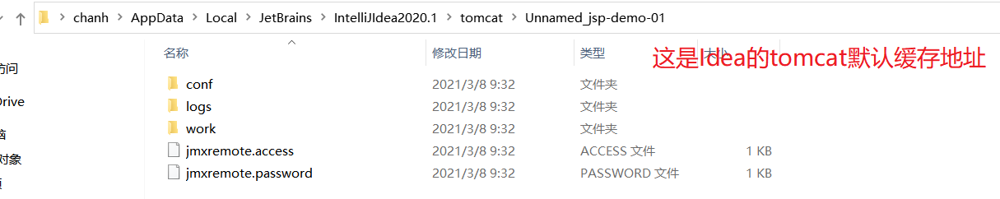
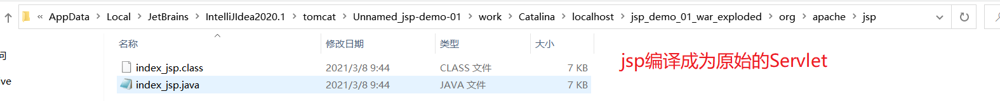
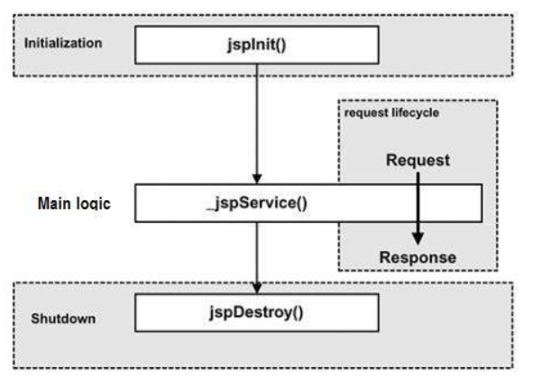
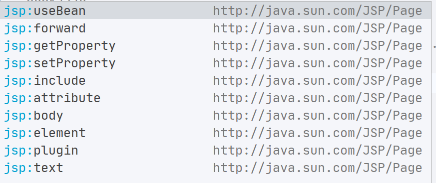
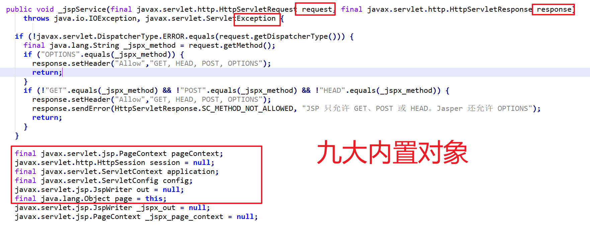
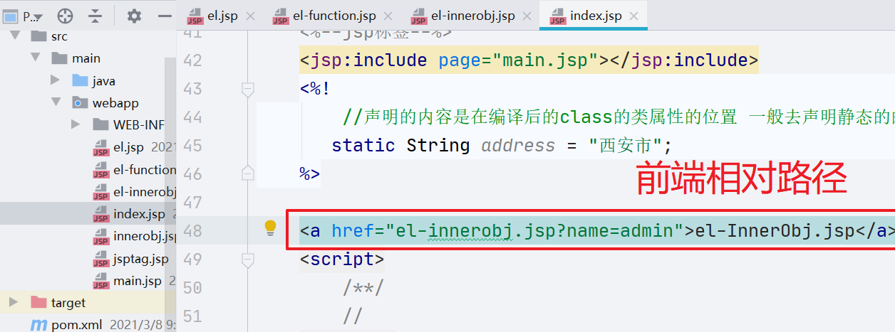

# JSP技术

>JSP**（全称**J**ava**S**erver **P**ages）是由[Sun Microsystems](https://baike.baidu.com/item/Sun Microsystems)公司主导创建的一种[动态网页技术](https://baike.baidu.com/item/动态网页技术/9415956)标准。JSP部署于网络服务器上，可以响应客户端发送的请求，并根据请求内容动态地生成[HTML](https://baike.baidu.com/item/HTML)、[XML](https://baike.baidu.com/item/XML)或其他格式文档的[Web](https://baike.baidu.com/item/Web)网页，然后返回给请求者。JSP技术以[Java](https://baike.baidu.com/item/Java)语言作为[脚本语言](https://baike.baidu.com/item/脚本语言)，为用户的[HTTP](https://baike.baidu.com/item/HTTP)请求提供服务，并能与服务器上的其它Java程序共同处理复杂的业务需求。
>
>JSP将Java代码和特定变动内容嵌入到静态的页面中，实现以静态页面为模板，动态生成其中的部分内容。JSP引入了被称为“JSP动作”的XML标签，用来调用内建功能。另外，可以创建JSP标签库，然后像使用标准HTML或XML标签一样使用它们。标签库能增强功能和服务器性能，而且不受[跨平台](https://baike.baidu.com/item/跨平台)问题的限制。JSP文件在运行时会被其编译器转换成更原始的[Servlet](https://baike.baidu.com/item/Servlet)代码。JSP编译器可以把JSP文件编译成用Java代码写的Servlet，然后再由Java编译器来编译成能快速执行的二进制[机器码](https://baike.baidu.com/item/机器码)，也可以直接编译成二进制码。
>
>jsp 就是Servlet

## 1.1 Jsp核心知识

### 1.1.1 jsp 片段

```jsp
<%@ page import="java.util.Scanner" %>
<%@ page language="java" contentType="text/html; charset=UTF-8"
         pageEncoding="UTF-8"%>
<!DOCTYPE html>
<html>
<head>
    <meta charset="UTF-8">
    <title>index</title>
    <style>
        /**/
    </style>
</head>
<body>
    <!--Html注释-->
    <h2>Hello World!</h2>
    <%--jsp注释--%>
    <%--jsp片段  jsp页面书写java代码--%>
    <%
        //java代码
        System.out.println("Hello Jsp Page!!!!");
        int [] arr = new int[6];
        System.out.println(arr);
        double  num = Math.ceil(Math.random()*10);
        Scanner s = new Scanner(System.in);

    %>
    <%--片段拼接--%>
    <%
        for(int i = 0;i<=5;i++){
    %>
        <p>Hello jsp pice</p>
    <%}%>

    <script>
        /**/
        //
    </script>
</body>
</html>

```

### 1.1.2 jsp注释

jsp注释是在页面源码中可以看到 浏览器不会编译 也不会解析 在浏览器源码中看不到!

```html
<%@ page language="java" contentType="text/html; charset=UTF-8"
    pageEncoding="UTF-8"%>
<!DOCTYPE html>
<html>
<head>
    <meta charset="UTF-8">
    <title>index</title>
    <style>
        /**/
    </style>
</head>
<body>
    <!--Html注释-->
    <h2>Hello World!</h2>
    <%--jsp注释--%>
    <script>
        /**/
        //
    </script>
</body>
</html>

```

### 1.1.3 jsp 表达式 

> 在编译后的servlet中使用out.print(new Date()) 直接输出到页面  表达式只能执行一行代码  在代码末尾不能添加分号

```jsp
 <%--jsp表达式--%>
    <%=new Date()%>
```

### 1.1.4 jsp 指令 <%@ %>

+ page   jsp页面
+ include 
+ taglib

#### 1.1.4.1 include 指令

```jsp
 <%--jsp 指令--%>
    <%--静态包含： include指令 编译的时候会编译成为一个页面
         动态包含:  编译的时候分开编译 运行的时候在进行引用
    --%>
   <%-- <%@ include file="main.jsp"%>--%>
    <%--jsp标签--%>
    <jsp:include page="main.jsp"></jsp:include>
```

#### 1.1.5 jsp声明<%! %>

> ```
> <%!
>     //声明的内容是在编译后的class的类属性的位置 一般去声明静态的的内容
>    static String address = "西安市";
> %>
> ```

## 2. Jsp原理

### 2.1JSP执行原理

> jsp就是Servlet 在服务器启动的时候Jsp页面被编译为Servlet ,jsp的注释不会被编译进去。jsp片段会进行拼接。





```java
/*
 * Generated by the Jasper component of Apache Tomcat
 * Version: Apache Tomcat/9.0.37
 * Generated at: 2021-03-08 01:44:37 UTC
 * Note: The last modified time of this file was set to
 *       the last modified time of the source file after
 *       generation to assist with modification tracking.
 */
package org.apache.jsp;

import javax.servlet.*;
import javax.servlet.http.*;
import javax.servlet.jsp.*;
import java.util.Date;
import java.util.Scanner;

public final class index_jsp extends org.apache.jasper.runtime.HttpJspBase
    implements org.apache.jasper.runtime.JspSourceDependent,
                 org.apache.jasper.runtime.JspSourceImports {

  private static final javax.servlet.jsp.JspFactory _jspxFactory =
          javax.servlet.jsp.JspFactory.getDefaultFactory();

  private static java.util.Map<java.lang.String,java.lang.Long> _jspx_dependants;

  private static final java.util.Set<java.lang.String> _jspx_imports_packages;

  private static final java.util.Set<java.lang.String> _jspx_imports_classes;

  static {
    _jspx_imports_packages = new java.util.HashSet<>();
    _jspx_imports_packages.add("javax.servlet");
    _jspx_imports_packages.add("javax.servlet.http");
    _jspx_imports_packages.add("javax.servlet.jsp");
    _jspx_imports_classes = new java.util.HashSet<>();
    _jspx_imports_classes.add("java.util.Date");
    _jspx_imports_classes.add("java.util.Scanner");
  }

  private volatile javax.el.ExpressionFactory _el_expressionfactory;
  private volatile org.apache.tomcat.InstanceManager _jsp_instancemanager;

  public java.util.Map<java.lang.String,java.lang.Long> getDependants() {
    return _jspx_dependants;
  }

  public java.util.Set<java.lang.String> getPackageImports() {
    return _jspx_imports_packages;
  }

  public java.util.Set<java.lang.String> getClassImports() {
    return _jspx_imports_classes;
  }

  public javax.el.ExpressionFactory _jsp_getExpressionFactory() {
    if (_el_expressionfactory == null) {
      synchronized (this) {
        if (_el_expressionfactory == null) {
          _el_expressionfactory = _jspxFactory.getJspApplicationContext(getServletConfig().getServletContext()).getExpressionFactory();
        }
      }
    }
    return _el_expressionfactory;
  }

  public org.apache.tomcat.InstanceManager _jsp_getInstanceManager() {
    if (_jsp_instancemanager == null) {
      synchronized (this) {
        if (_jsp_instancemanager == null) {
          _jsp_instancemanager = org.apache.jasper.runtime.InstanceManagerFactory.getInstanceManager(getServletConfig());
        }
      }
    }
    return _jsp_instancemanager;
  }

  public void _jspInit() {
  }

  public void _jspDestroy() {
  }

  public void _jspService(final javax.servlet.http.HttpServletRequest request, final javax.servlet.http.HttpServletResponse response)
      throws java.io.IOException, javax.servlet.ServletException {

    if (!javax.servlet.DispatcherType.ERROR.equals(request.getDispatcherType())) {
      final java.lang.String _jspx_method = request.getMethod();
      if ("OPTIONS".equals(_jspx_method)) {
        response.setHeader("Allow","GET, HEAD, POST, OPTIONS");
        return;
      }
      if (!"GET".equals(_jspx_method) && !"POST".equals(_jspx_method) && !"HEAD".equals(_jspx_method)) {
        response.setHeader("Allow","GET, HEAD, POST, OPTIONS");
        response.sendError(HttpServletResponse.SC_METHOD_NOT_ALLOWED, "JSP 只允许 GET、POST 或 HEAD。Jasper 还允许 OPTIONS");
        return;
      }
    }

    final javax.servlet.jsp.PageContext pageContext;
    javax.servlet.http.HttpSession session = null;
    final javax.servlet.ServletContext application;
    final javax.servlet.ServletConfig config;
    javax.servlet.jsp.JspWriter out = null;
    final java.lang.Object page = this;
    javax.servlet.jsp.JspWriter _jspx_out = null;
    javax.servlet.jsp.PageContext _jspx_page_context = null;


    try {
      response.setContentType("text/html; charset=UTF-8");
      pageContext = _jspxFactory.getPageContext(this, request, response,
      			null, true, 8192, true);
      _jspx_page_context = pageContext;
      application = pageContext.getServletContext();
      config = pageContext.getServletConfig();
      session = pageContext.getSession();
      out = pageContext.getOut();
      _jspx_out = out;

      out.write("\n");
      out.write("\n");
      out.write("\n");
      out.write("<!DOCTYPE html>\n");
      out.write("<html>\n");
      out.write("<head>\n");
      out.write("    <meta charset=\"UTF-8\">\n");
      out.write("    <title>index</title>\n");
      out.write("    <style>\n");
      out.write("        /**/\n");
      out.write("    </style>\n");
      out.write("</head>\n");
      out.write("<body>\n");
      out.write("    <!--Html注释-->\n");
      out.write("    <h2>Hello World!</h2>\n");
      out.write("    ");
      out.write("\n");
      out.write("    ");
      out.write("\n");
      out.write("    ");

        //java代码
        System.out.println("Hello Jsp Page!!!!");
        int [] arr = new int[6];
        System.out.println(arr);
        double  num = Math.ceil(Math.random()*10);
        Scanner s = new Scanner(System.in);

    
      out.write("\n");
      out.write("    ");
      out.write("\n");
      out.write("    ");

        for(int i = 0;i<=5;i++){
    
      out.write("\n");
      out.write("        <p>Hello jsp pice</p>\n");
      out.write("    ");
}
      out.write("\n");
      out.write("    ");
      out.write("\n");
      out.write("    ");
      out.print(new Date());
      out.write("\n");
      out.write("    <script>\n");
      out.write("        /**/\n");
      out.write("        //\n");
      out.write("    </script>\n");
      out.write("</body>\n");
      out.write("</html>\n");
    } catch (java.lang.Throwable t) {
      if (!(t instanceof javax.servlet.jsp.SkipPageException)){
        out = _jspx_out;
        if (out != null && out.getBufferSize() != 0)
          try {
            if (response.isCommitted()) {
              out.flush();
            } else {
              out.clearBuffer();
            }
          } catch (java.io.IOException e) {}
        if (_jspx_page_context != null) _jspx_page_context.handlePageException(t);
        else throw new ServletException(t);
      }
    } finally {
      _jspxFactory.releasePageContext(_jspx_page_context);
    }
  }
}

```

### 2.2 JSP生命周期

+ Compilation
+ Initialization
+ Excution
+ CleanUp



## 3. Jsp标签

> 在早起的时候我们先学在jsp/servlet项目中自定义标签。现在jsp淘汰了自定义标签就不学了。
>
> jsp已经定义好的标签



### 3.1 页面跳转

```java
<%--页面跳转--%>
    <%--<jsp:forward page="main.jsp"></jsp:forward>--%>
```

### 3.2 JAVABEAN (pojo 普通的java类)

+ 无参数的构造器
+ 属性私有化
+ 提供公开的访问方式

```jsp
<%@ page import="com.xdkj.beans.Student" %><%--
  Created by IntelliJ IDEA.
  User: chanh
  Date: 2021/3/8
  Time: 10:58
  To change this template use File | Settings | File Templates.
--%>
<%@ page contentType="text/html;charset=UTF-8" language="java" %>
<html>
<head>
    <title>jsp标签</title>
</head>
<body>
    <%--页面跳转--%>
    <%--<jsp:forward page="main.jsp"></jsp:forward>--%>
<%-- 我们说jsp就是在html页面写java代码 jsp中不能出现一行的java代码  --%>
    <%--创建类的实例化对象  id 对象的变量名称--%>
<jsp:useBean id="student" class="com.xdkj.beans.Student"></jsp:useBean>
    <%--给对象设置属性的值--%>
<jsp:setProperty name="student" property="name" value="joke"></jsp:setProperty>

<jsp:getProperty name="student" property="name"/>
</body>
</html>

```

## 4. El表达式(Exepression Language表达式语言) :imp:

[https://docs.oracle.com/javaee/1.4/tutorial/doc/JSPIntro7.html](https://docs.oracle.com/javaee/1.4/tutorial/doc/JSPIntro7.html)

> The web container evaluates a variable that appears in an expression by looking up its value according to the behavior of `PageContext.findAttribute(String)`. For example, when evaluating the expression `${product}`, the container will look for `product` in the page, request, session, and application scopes and will return its value. If `product` is not found, `null` is returned. A variable that matches one of the implicit objects described in [Implicit Objects](https://docs.oracle.com/javaee/1.4/tutorial/doc/JSPIntro7.html#wp71043) will return that implicit object instead of the variable's value.
>
> el表达式是Servlet2.0以后支持的  是去寻找键对应的值 在 page --->  request---->session----->application 中寻找使用pageContext.findAttribute() 方法寻找
>
> 先在哪个域对象中找到就使用 ，没找到就返回null

### 4.1 EL核心表达式

```jsp
<%@ page import="com.xdkj.beans.Student" %>
<%@ page import="java.util.HashMap" %>
<%@ page import="java.util.HashSet" %>
<%@ page import="java.util.Map" %>
<%@ page import="java.util.Set" %><%--
  Created by IntelliJ IDEA.
  User: chanh
  Date: 2021/3/8
  Time: 12:02
  To change this template use File | Settings | File Templates.
--%>
<%@ page contentType="text/html;charset=UTF-8" language="java" %>
<html>
<head>
    <title>el表达式</title>
</head>
<body>
<%--el表达式--%>
<%
    application.setAttribute("name","joke");
    Student  student = new Student();
        student.setName("张三");
        student.setAge(88);
    application.setAttribute("student",student);

    String [] str = new String[]{"Hello","World","JAVA"};
        application.setAttribute("str",str);

    Set<String> set = new HashSet<>();
        set.add("张三丰");
        set.add("张无忌");
        set.add("张翠三");
        application.setAttribute("hero",set);

    Map<Integer,String> map = new HashMap<>();
        map.put(1,"hello");
        map.put(2,"world");
        application.setAttribute("map",map);

    Map<String ,Student> maps = new HashMap<>();
        maps.put("a",student);
        maps.put("b",new Student());
        maps.put("c",new Student());
        application.setAttribute("maps",maps);

        request.setAttribute("student","李四");
        session.setAttribute("student","王五");
%>

<h4>获取字符串</h4>
${name}
<h4>获取对象</h4>
<%--${student}-----${student.name}-------------${student.age}--%>
<h4>获取数组的值</h4>
${str}-----${str[0]}
<h4>获取set集合数据</h4>
${hero}-----
<h4>获取map集合</h4>
${map}------------${map['2']}------------${map['1']}
<%--获取map--%>
<h4>map值是自定义对象</h4>
${maps}----${maps['a']}-----${maps['a'].name}

<h4>指定域获取值  page ---------request ----session----appplication</h4>
    ${requestScope.student}-----------${sessionScope.student}
</body>
</html>

```

### 4.2 El内置对象

```jsp
<%@ page contentType="text/html;charset=UTF-8" language="java" %>
<html>
<head>
    <title>el内置对象</title>
</head>
<body>
<%--el 表达式的内置对象--%>
   <%=request.getServletContext()%>
   <%=request.getParameter("name")%>
<%--获取上下文路径  根路径--%>
<hr>
    ${pageContext.request.contextPath}
<hr>
    <h4>获取参数和参数的值</h4>
    ${param}----${param.name}
<hr>
${header}----${header.cookie}-----------${header.cookie}
<hr>
${cookie['JSESSIONID']}------------${cookie['JSESSIONID'].name}------------${cookie['JSESSIONID'].value}
<%--只要是绝对路径就没问题--%>
<a href="${pageContext.request.contextPath}/hello">HelloServlet</a>
</body>
</html>

```

### 4.3 EL运算符


### 4.4 EL函数库


## 5. JSP内置对象

> jsp 九大内置对象:

+ PageConetxt  pageContext  当前页面的上下文环境  通常用来获取其他的内置对象
+ ServletConetxt appplication  web应用的上下文环境
+ ServletConfig config  当前的servlet初始化信息的配置对象
+ page this   当前jsp编译后servlet运行是的对象
+ HttpServletRequest  request   http请求对象
+ HttpServletResponse response  http新昂扬对象
+ JspWriter  out   向jsp页面输出内容的对象
+ Exception exception  异常对象
+ HttpSession session  会话对象



## 6. JSTL标签库

## 7. 绝对路径和相对路径

### 7.1 前端路径



### 7.2 后端路径


```jsp
<%--只要是绝对路径就没问题--%>
<a href="${pageContext.request.contextPath}/hello">HelloServlet</a>
```

### 7.3 MyEclipse中解决路径的问题

```jsp
<%--
  Created by IntelliJ IDEA.
  User: chanh
  Date: 2021/3/8
  Time: 14:41
  To change this template use File | Settings | File Templates.
--%>
<%@ page contentType="text/html;charset=UTF-8" language="java" %>
<html>
<%
    String path = request.getContextPath();
    String basePath = request.getScheme()+"://"+request.getServerName()+":"+request.getServerPort()+path+"/";
    System.out.println(basePath);
%>
<head>
    <title>Title</title>
    <base href="<%=basePath%>">
</head>
<body>

<a href="hello">HelloServlet</a>
</body>
</html>

```


