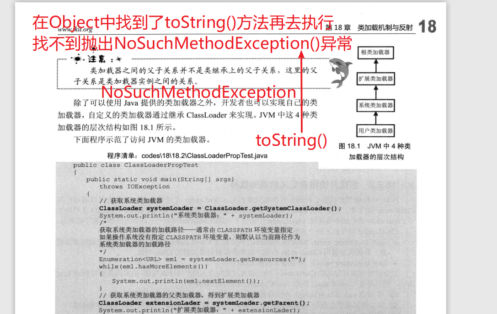

# JavaSe增强课

## 1. JDK1.8接口

> 在前面的学习中我们知道在接口中只能有 常量和抽象方法
>
> 抽象方法必须被接口的实现类重写。
>
> 在JDK1.8中重新定义了接口中的方法:
>
> 1. 抽象方法  抽象方法必须被实现类重写
> 2. 静态方法  static修饰
> 3. 默认方法  default修饰的方法  default修饰的方法 不用在实现类中重写   实现类的对象可以直接调用
> 4. 静态方法  抽象方法  默认的方法可以定义多个。

```java
package com.xdkj.javase.oop09;

public interface Eat {
	void eat();
	
	static void hello() {
		System.out.println("人都是要吃食物的!");
	};
	
	default void say() {
		System.out.println("人都是要说话的");
	}
}

class  Demo1 implements Eat{

	@Override
	public void eat() {
		System.out.println("eat  rice!");
	}
	
}

```

```java
package com.xdkj.javase.oop09;

import java.util.Comparator;

public class EatDemo {

	public static void main(String[] args) {
		Demo1  demo1  = new Demo1();
			demo1.eat();
			demo1.say();
			Eat.hello();
	}

}

```

## 2. 正则表达式

## 3. Comparator

## 4. Comparable

> 此接口强行对实现它的每个类的对象进行整体排序。这种排序被称为类的*自然排序*，类的 `compareTo`  方法被称为它的*自然比较方法*。
>
> ```
> int compareTo(T o)
> ```
>
> 比较此对象与指定对象的顺序。如果该对象小于、等于或大于指定对象，则分别返回负整数、零或正整数。

## 5. 可变参数

```java
package com.xdkj.javase.strong;

public class ChangeParam {
	public static void main(String[] args) {
		method(1);
		method(1,2);
		method(1,2,3);
		method1("HelloWorld",1,2,3);
	}
	//可变参数 参数的数据类型是一致
	//可变参数的本质是什么？数组  
	public static void method(int ... num) {
		//[I@7852e922
		System.out.println(num);
	}
	//其他的数据类型加可变参数
	//其他数据类型的参数和可变参数  可变参数必须放置在末尾
	public static void method1(String str,int ... num) {
		//[I@7852e922
		System.out.println(num);
	}
}

```

## 6. 枚举 enum修饰   枚举不是一个类

```java
package com.xdkj.javase.strong;
/**enum 是枚举
 * 
 * 
 * */
public enum Person {
	//枚举的属性直接可以使用
	RED,GREEN,BLUE,PINK
}
public class PersonDemo {

	public static void main(String[] args) {
		System.out.println(Person.PINK);
	}

}
```

## 7. 反射 :imp:

什么是反射?

我们目前去使用一个类的属性和方法我们怎么去使用?

1. 创建类的对象  通过对象调用属性的getset方法
2. 通过对象调用类的成员方法。

java程序先要编译后运行，我们一般只要编译后的.class文件就可以了。

反射是通过获取到类的字节码文件对象，在通过字节码文件对象去构建类的对象。

### 7.1 获取类的字节码文件对象

1. .class
2. getClass()
3. Class.from();

```java
package com.xdkj.javase.strong;
/** 三种方式获取类的二进制字节码文件对象
 * 
 * */
public class ReflectDemo {
	public static void main(String[] args) {
		//class com.xdkj.javase.strong.Person
		System.out.println(Person.class);
		Number person = 0;
		//class java.lang.Integer 
		System.out.println(person.getClass());
		//所需类的完全限定名  包名加类名
		try {
			Class<?> forName = Class.forName("com.xdkj.javase.strong.Student");
			//class com.xdkj.javase.strong.Student
			System.out.println(forName);
		} catch (ClassNotFoundException e) {
			e.printStackTrace();
		}
	}
}

```

### 7.2 通过字节码文件对象构建类的对象

```java
package com.xdkj.javase.strong;

public class Student {
	private int age;
	private String name;
	
	public Student() {
		super();
		// TODO Auto-generated constructor stub
	}
	
	public Student(Integer age, String name) {
		super();
		this.age = age;
		this.name = name;
	}
	
	public int getAge() {
		return age;
	}
	public void setAge(int age) {
		this.age = age;
	}
	public String getName() {
		return name;
	}
	public void setName(String name) {
		this.name = name;
	}
	@Override
	public String toString() {
		return "Student [age=" + age + ", name=" + name + "]";
	}
	
}

```

```java
package com.xdkj.javase.strong;

import java.lang.reflect.Constructor;

public class StudentReflectDemo {

	public static void main(String[] args) throws Exception {
		//获取字节码文件对象
		Class<?> student = Class.forName("com.xdkj.javase.strong.Student");
		//构建字节码文件类的对象
		//先获取类的构造器 没有参数就加null
		Constructor<?> constructor = 	student.getConstructor(null);
		//通过构造器构建类的实例化对象
		Student stu =	(Student) constructor.newInstance();
		System.out.println(stu);
		
		//获取构造器的参数也是Class类型
		Constructor<?> constructor1 = 	student.getConstructor(Integer.class,String.class);
		//通过构造器构建类的实例化对象 传入实际的参数值
		Student stu1 =	(Student) constructor1.newInstance(9,"Hello");
		System.out.println(stu1);
	}

}

```

### 7.3  反射获取类的属性

```java
package com.xdkj.javase.strong;

import java.lang.reflect.Constructor;
import java.lang.reflect.Field;

public class StudentReflectDemo2 {

	public static void main(String[] args) throws Exception {
		//获取字节码文件对象
		Class<?> student = Class.forName("com.xdkj.javase.strong.Student");
		//获取类中的字段
	Constructor<?> constructor = 	student.getConstructor(null);
		Student stu = (Student) constructor.newInstance(null);
		//java.lang.NoSuchFieldException: name
		//只能获取public 修饰 的字段
		//IllegalAccessExceptio
		Field address = student.getField("address");
		//对于private 修饰的字段我们要暴力获取
		Field name = student.getDeclaredField("name");
			name.setAccessible(true);
		Field age = student.getDeclaredField("age");
			age.setAccessible(true);
		//给字段设置值 obj给哪一个对象设置属性值  value属性值是什么?
		name.set(stu, "admin");
		age.set(stu, 888);
		address.set(stu, "西安市");
		
		System.out.println(stu);
		
		
	
	}

}

```

### 7.4反射获取类的方法

```java
package com.xdkj.javase.strong;

import java.lang.reflect.Constructor;
import java.lang.reflect.Field;
import java.lang.reflect.Method;

public class StudentReflectDemo3 {

	public static void main(String[] args) throws Exception {
		//获取字节码文件对象
		Class<?> student = Class.forName("com.xdkj.javase.strong.Student");
		//获取类中的字段
		Constructor<?> constructor = 	student.getConstructor(null);
		Student stu = (Student) constructor.newInstance(null);
		//通过获取字节码文件对象 获取类的方法 方法的名字和方法的参数类型
		Method method = student.getMethod("getName", null);
		//方法的执行   方法的调用者
		String names = (String) method.invoke(stu, null);
		System.out.println(names);
		//获取public修饰的方法
		Method method1 = student.getMethod("hello", String.class);
		method1.invoke(stu, "lucy");
		//获取私有方法
		Method method2 = student.getDeclaredMethod("say", String.class);
		//暴力访问
		method2.setAccessible(true);
		method2.invoke(stu, "leilei");
		
		Method method3 = student.getDeclaredMethod("hehe", null);
		//暴力访问
		method3.setAccessible(true);
		method3.invoke(stu,null);
		//获取到所有的方法
		Method[] declaredMethods = student.getDeclaredMethods();
		System.out.println(declaredMethods);
		System.out.println(declaredMethods.length);
		for(Method m : declaredMethods) {
			System.out.println(m);
		}
	}

}

```

**一、反射的适用场景是什么？**

**1）**.Java的反射机制在做基础框架的时候非常有用，有一句话这么说来着：**反射机制是很多Java框架的基石**。而一般应用层面很少用，不过这种东西，现在很多开源框架基本都已经给你封装好了，自己基本用不着写。典型的除了Hibernate之外，还有Spring也用到很多反射机制。经典的就是在xml文件或者properties里面写好了配置，然后在Java类里面解析xml或properties里面的内容，得到一个字符串，然后用反射机制，根据这个字符串获得某个类的Class实例，这样就可以动态配置一些东西，不用每一次都要在代码里面去new或者做其他的事情，以后要改的话直接改配置文件，代码维护起来就很方便了，同时有时候要适应某些需求，Java类里面不一定能直接调用另外的方法，这时候也可以通过反射机制来实现。
总的来说，自己写的很少，具体什么时候要用那要看需求，反射机制无非就是根据一个String来得到你要的实体对象，然后调用它原来的东西。**但是如果是要自己写框架的话，那就会用得比较多了。**

**2）**当你做一个软件可以安装插件的功能，你连插件的类型名称都不知道，你怎么实例化这个对象呢？因为程序是支持插件的（第三方的），在开发的时候并不知道 。所以无法在代码中 New出来 ，但反射可以，通过反射，动态加载程序集，然后读出类，检查标记之后再实例化对象，就可以获得正确的类实例。

**3）**在编码阶段不知道那个类名,要在运行期从配置文件读取类名, 这时候就没有办法硬编码new ClassName(),而必须用到反射才能创建这个对象.反射的目的就是为了扩展未知的应用。比如你写了一个程序，这个程序定义了一些接口，只要实现了这些接口的dll都可以作为插件来插入到这个程序中。那么怎么实现呢？就可以通过反射来实现。就是把dll加载进内存，然后通过反射的方式来调用dll中的方法。很多工厂模式就是使用的反射。 

**二、程序员在自己的业务开发中应该尽量的远离反射**

***\*反射：\****在流行的库如Spring和Hibernate中，反射自然有其用武之地。不过内省业务代码在很多时候都不是一件好事，**原因有很多，一般情况下我总是建议大家不要使用反射。**

## 8. 内省

## 9. 类的加载机制

我们java虚拟机在加载类的时候分为这么几步：

1. 加载程序员自己写的类
2. 加载第三方扩展类
3. 加载扩展类
4. 加载根类



## 9. 编码和解码

```java
import java.io.UnsupportedEncodingException;
import java.net.URLDecoder;
import java.net.URLEncoder;

public class ParseEncoding {

	public static void main(String[] args) throws UnsupportedEncodingException {
		//io流中出现字符乱码使用转换解决
		//编码
		String encode = URLEncoder.encode("你好啊中国","UTF-8");
		System.out.println(encode);
		
		//解码
		String decode = URLDecoder.decode(encode, "utf-8");
		System.out.println(decode);
	}

}
```


