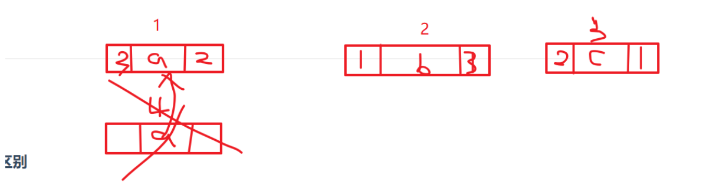
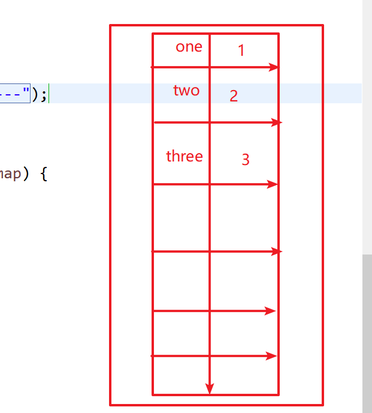
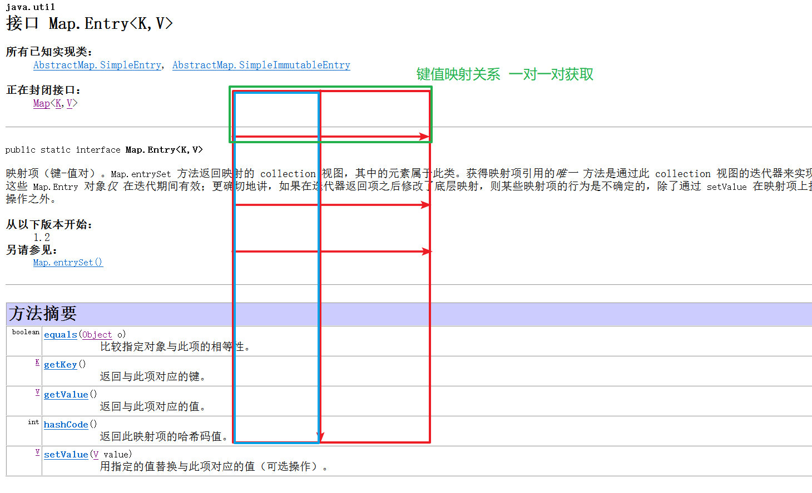
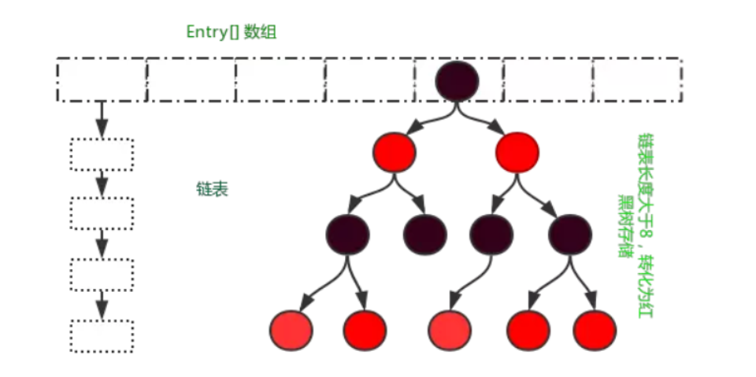
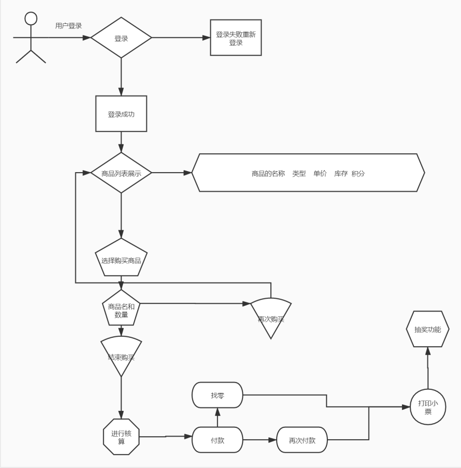

# Java中的集合 :imp:

## 1. 集合的简介 :airplane:

> 我们前面学习过数组， 数组是用一个变量来存多个元素的容器，存储基本数据类型的数据。数组的长度是不可变的。
> 在实际的开发中我们需要这样去做: 
>
> ​	我们在购物的时候我们把商品添加到购物车，商品的名称 ，信息，单价，数量。我们在存购物车中获取购买的商品计算总价，
>
> 根据商品的总价计算积分。
>
> 我们对于购物车中的数据怎么去存储和获取呢？
>
> 可以使用数组吗?
>
> 可以，只是在你的商品数量少的情况下我定义长度固定的数组去存储商品是可以的。
>
> 还可以从购物车进行商品的删除。数组怎么删除数据?商品的信息 商品的类  商品的对象。

```java
public class Goods {
	private String goodsName;
	private int goodsCount;
	private double goodsPrice;
    ......get set ...
}
```

```java
package com.xdkj.javase.collection;

public class GoodsDemo {
	public static void main(String[] args) {
		Goods goods1 = new Goods("瓜子",100,9.9);
		Goods goods2 = new Goods("花生",200,9.9);
		Goods goods3 = new Goods("啤酒",20000,12.99);
		Goods goods4 = new Goods("麻辣条",100,3);
		
		//使用容器去存储商品的对象
		Goods [] goods = new Goods[10];
			goods[0] = goods1;
			goods[1] = goods2;
			goods[2] = goods3;
			goods[3] = goods4;
		
		System.out.println(goods);
		for(Goods i : goods) {
			System.out.println(i);
		}
		
	}
}

```

> 使用数组存储商品的对象信息是可以的，但是就是定义数组的长度的时候不能精确的定义到底要多少长度，并且在数组移除商品的时候。我们如果从数组中将元素定义为Null说是将元素移除了，但是数组的内存大小依然是不变的。
>
> 1. 所以我们就想着说有没有更合适的容器去存放 对象的数据信息，
>
> 2. 在存放的时候如果数据增加或者移除 容器的大小是可变的。
> 3. 所以数组就不合适  而是要去使用集合。
> 4. 集合是一个长度动态可变的容器，一般集合中装的都是对象。也可以是基本数据类型。
> 5. 即使是基本数据类型 我们依然要使用基本数据类型的包装类去声明集合的类型。


## 2. Collection :rainbow_flag:

> *Collection 层次结构* 中的根接口。Collection 表示一组对象，这些对象也称为 collection 的*元素*。一些  collection 允许有重复的元素，而另一些则不允许。一些 collection 是有序的，而另一些则是无序的。JDK 不提供此接口的任何*直接*  实现：它提供更具体的子接口（如 `Set` 和 `List`）实现。此接口通常用来传递  collection，并在需要最大普遍性的地方操作这些 collection。 

### 2.1 Collection中的方法:

+ add
+ addAll
+ clear
+ contains
+ containsAll
+ equals
+ hashCode
+ isEmpty
+ remove
+ removeAll
+ toArry
+ size

```java
package com.xdkj.javase.collection;

import java.util.ArrayList;
import java.util.Collection;

public class CollectionDemmo {

	public static void main(String[] args) {
		
		Goods goods1 = new Goods("瓜子",100,9.9);
		Goods goods2 = new Goods("花生",200,9.9);
		Goods goods3 = new Goods("啤酒",20000,12.99);
		Goods goods4 = new Goods("麻辣条",100,3);
		
		// 使用多态的形式 Collection接口  List子接口的实现类 
		Collection  collection = new ArrayList();
		//集合是个容器 存储元素
		//基本数据类型和对象都可以进行存储
			collection.add("123");
			collection.add(123);
			collection.add('a');
			collection.add(99.99);
			collection.add(goods1);
			
			System.out.println(collection.size());
			System.out.println(collection);
			
			//集合的长度是可以扩增的
			collection.add(goods2);
			collection.add(goods3);
			System.out.println(collection.size());
			System.out.println(collection);
			
			//集合提供remove方法移除元素  集合的长度自动减少
			collection.remove(goods3);
			System.out.println(collection.size());
			System.out.println(collection);		
	}

}

```

```java
public static void method1() {
		Goods goods1 = new Goods("瓜子",100,9.9);
		Goods goods2 = new Goods("花生",200,9.9);
		Goods goods3 = new Goods("啤酒",20000,12.99);
		Goods goods4 = new Goods("麻辣条",100,3.0);
		
		// 使用多态的形式 Collection接口  List子接口的实现类 
		Collection  collection = new ArrayList();
		//集合是个容器 存储元素
		//基本数据类型和对象都可以进行存储
			collection.add("123");
			collection.add(123);
			collection.add('a');
			collection.add(99.99);
			collection.add(goods1);
			
			System.out.println(collection.size());
			System.out.println(collection);
			
			//集合的长度是可以扩增的
			collection.add(goods2);
			collection.add(goods3);
			System.out.println(collection.size());
			System.out.println(collection);
			
			//集合提供remove方法移除元素  集合的长度自动减少
			collection.remove(goods3);
			System.out.println(collection.size());
			System.out.println(collection);
	}
	//集合 的其他的方法
	public static void method2() {
		Collection collection1 = new ArrayList();
			collection1.add("123");
			collection1.add(123);
			collection1.add('a');
			collection1.add(99.99);
		Collection collection2 = new ArrayList();
			Goods goods1 = new Goods("瓜子",100,9.9);
			Goods goods2 = new Goods("花生",200,9.9);
			collection2.add(goods1);
			collection2.add(goods2);
			//集合合并
		collection1.addAll(collection2);
		System.out.println(collection1);
		//是否包含某一个元素
		System.out.println(collection2.contains(goods1));//true
		//判断集合中数据是否相等
		System.out.println(collection1.equals(collection2));//false
		//判断集合是否为空
		System.out.println(collection1.isEmpty());//false
		
		System.out.println(collection1.removeAll(collection2));//true
		System.out.println(collection1);
		
			Object [] obj = 	collection1.toArray();
			System.out.println(obj);
	}
```

### 2.2 Iterator 迭代器   :point_right:

> 提供集合的通用的遍历方式:
>
> 1. hasNext()  判断是否有下一个可迭代的元素
> 2. next()  获取下一个迭代的元素
> 3. remove() 移除下一个迭代的元素

```java
public static void method3() {
		//数组集合
		Collection collection2 = new ArrayList();
			Goods goods1 = new Goods("瓜子",100,9.9);
			Goods goods2 = new Goods("花生",200,9.9);
			collection2.add(goods1);
			collection2.add(goods2);
			System.out.println(collection2);
		//集合的遍历
		//hasNext()  next()
		Iterator  it = collection2.iterator();	
		while(it.hasNext()) {
			//数据的强制转换
			//铺垫泛型
			Goods  good = (Goods)it.next();
			System.out.println(good);
		}
	}
```

**不合法的状态异常:**

```java
public static void method4() {
		//数组集合
		Collection collection2 = new ArrayList();
			Goods goods1 = new Goods("瓜子",100,9.9);
			Goods goods2 = new Goods("花生",200,9.9);
			collection2.add(goods1);
			collection2.add(goods2);
			System.out.println(collection2);
		//集合的遍历
		//hasNext()  next()
		Iterator  it = collection2.iterator();	
		while(it.hasNext()) {
			//数据的强制转换
			//铺垫泛型
			//java.lang.IllegalStateException
			//先移除在获取发生不合法的状态异常
			//it.remove();
			Goods  good = (Goods)it.next();
			//it.remove();
			System.out.println(good);
		}
	}
```

**ConcurrentModificationException并发修改异常**

```java
public static void method5() {
		//数组集合
		Collection collection2 = new ArrayList();
			Goods goods1 = new Goods("瓜子",100,9.9);
			Goods goods2 = new Goods("花生",200,9.9);
			collection2.add(goods1);
			collection2.add(goods2);
			System.out.println(collection2);
		//集合的遍历
		//hasNext()  next()
		Iterator  it = collection2.iterator();	
		while(it.hasNext()) {
			//数据的强制转换
			//铺垫泛型
			//java.lang.IllegalStateException
			//先移除在获取发生不合法的状态异常
			//java.util.ConcurrentModificationException 并发修改异常
			collection2.add(new Goods("香烟",500,15));
			Goods  good = (Goods)it.next();
			System.out.println(good);
		}
	}
```

### 2.3 Iterator 和 Enumeration的区别

> 功能是重复的。
>
> Iterator 替换了Enumeration：
>
> 1. 添加了remove方法
> 2. 方法名称简写 得到改进

## 3. List

> List: 列表集合
> 	1. list接口  序列集合  列表集合
> 	2. list集合允许元素重复  相同的元素重复 可以有多个null元素 
> 	3. list集合元素可以通过下标进行访问
> 	4. list集合使用特有的迭代器ListIterator在Iterator的基础上 有元素的插入和替换的方法 
> 		指定开始位置的迭代器
> 	list集合特有的方法:
> 		get()  获取list集合中的元素
> 		indexOf()  
> 		lasIndexOf()  
> 		listIterator()  list集合的特有迭代器
> 		subList()  获取集合片段
> 		size()	   获取list集合的元素的个数
> 	a. ArrayList
> 		底层是数组的数据结构  是长度可变的数组
> 		存储元素是要有序的，运行元素重复 和 允许多个null值
> 		是线程不安全的  是不同步的  效率高
> 		读取的效率高 因为是数据我们直接通过下标就可以操作  
> 		删除/添加   的操作效率低了

### 3.1 ArrayList

```java
package com.xdkj.javase.list;

import java.util.ArrayList;
import java.util.Iterator;
import java.util.List;
import java.util.ListIterator;

public class ListDemo {

	public static void main(String[] args) {
		List list  = new ArrayList();
				list.add("Hello");
				list.add(123);
				list.add('d');
				list.add(new Object());
				list.add(99.99);
				//[Hello, 123, d, java.lang.Object@15db9742, 99.99]
			System.out.println(list);
			//通过下标获取集合中的元素
			System.out.println(list.get(0));
			//获取集合的元素个数
			System.out.println(list.size());
			//元素在集合中第一次出现的下标值
			System.out.println(list.indexOf('d'));
			//最后一次出现的下标值
			System.out.println(list.lastIndexOf(99.99));
			//截取集合片段  不包含结尾下标的集合元素
			System.out.println(list.subList(0, 3));
			System.out.println("------------集合的遍历-----------");
			//遍历
			/*
			 * for(int i=0;i<list.size();i++) { System.out.println(list.get(i)); }
			 */
			
			/*
			 * for(Object i:list) { System.out.println(i); }
			 */
			//通用迭代器
			/*
			 * Iterator it = list.iterator(); while(it.hasNext()) { Object obj = it.next();
			 * System.out.println(obj); }
			 */
			
			//特有的listIterator
			ListIterator iterator = list.listIterator();
			//java.util.NoSuchElementException
			//返回集合中上一个元素
				//System.out.println(iterator.previous());
				iterator.add("88888");
				while(iterator.hasNext()) {
					//iterator.add("88888");
					System.out.println(iterator.next());
					//iterator.set("Java");
				}
				System.out.println(list);
	}

}

```

### 3.2 Vector

> `Vector`  类可以实现可增长的对象数组。与数组一样，它包含可以使用整数索引进行访问的组件。但是，`Vector`  的大小可以根据需要增大或缩小，以适应创建 `Vector` 后进行添加或移除项的操作。
>
> Vector是线程安全的，线程同步的。
>
> Vector读取快 增删慢
>
> 从JDK1.2开始使用ArrayList替换了Vector

```java
package com.xdkj.javase.list;

import java.util.Iterator;
import java.util.Vector;

public class VectorDemo {
	public static void main(String[] args) {
		Vector   vector = new Vector();
			vector.add("123");
			vector.add(123);
			vector.add('d');
		System.out.println(vector);
		for(int i =0;i<vector.size();i++) {
			System.out.println(vector.get(i));
		}
		
		Iterator iterator = vector.iterator();
		while(iterator.hasNext()) {
			System.out.println(iterator.next());
		}
		//使用增强for循环迭代
		//使用listIterator迭代
	}
}

```

### 3.3 LinkedList

> `List` 接口的链接列表实现。实现所有可选的列表操作，并且允许所有元素（包括 `null`）。除了实现  `List` 接口外，`LinkedList` 类还为在列表的开头及结尾 `get`、`remove`  和 `insert` 元素提供了统一的命名方法。这些操作允许将链接列表用作堆栈、[队列](../../java/util/Queue.html)或[双端队列](../../java/util/Deque.html)。
>
> LinkedList是线程不安全的，线程不同步的。
>
> 链表结构:
>
> 读取慢，增删快
>
> 常用的方法:
>
> addFirst()
>
> addLast()
>
> getFirst()
>
> getLast()
>
> element()
>
> pop()
>
> push()
>
> peek()
>
> offer()
>
> offerFirst()
>
> removeFirst()
>
> removeLast();
>
> linkedlist是双向链表加列表的实现. 因为LinkedList实现了List和Quene接口。


```java
package com.xdkj.javase.list;

import java.util.LinkedList;
import java.util.Scanner;

public class LinkedListDemo {

	public static void main(String[] args) {
		//链表的结构
		LinkedList list = new LinkedList();
			list.add("Hello");
			list.add(99);
			list.add('c');
			list.add(99.99);
			list.add(new Object());
		System.out.println(list);
		System.out.println(list.size());
		
		System.out.println(list.pop());
		//获取第一个节点元素
		System.out.println(list.getFirst());
		//获取最后一个节点的值
		System.out.println(list.getLast());
		//第一个节点的值
		System.out.println(list.element());
		System.out.println(list);
		//添加到列表的末尾
		System.out.println(list.offer("00000"));
		System.out.println(list);
		System.out.println("---------------------");
		//获取列表的头
		System.out.println(list.peek());
		
		//压栈  元素插入列表的开头
		list.push(new Scanner(System.in));
		System.out.println(list);
		//弹栈 取出元素  集合中就没有了
		System.out.println(list.pop());
		
		//遍历
		System.out.println("-------------遍历-----------");
		for(Object i : list) {
			System.out.println(i);
		}
		//下标
		for(int i =0;i<list.size();i++) {
			System.out.println(list.get(i));
		}
	}

}

```

**LinkedList  add方法的源码:**

```java
 public boolean add(E e) {
        linkLast(e);
        return true;
    }

```

```java
 private static class Node<E> {
        E item;
        Node<E> next;
        Node<E> prev;

        Node(Node<E> prev, E element, Node<E> next) {
            this.item = element;
            this.next = next;
            this.prev = prev;
        }
    }
```

```java
 void linkLast(E e) {
        final Node<E> l = last;
        final Node<E> newNode = new Node<>(l, e, null);
        last = newNode;
        if (l == null)
            first = newNode;
        else
            l.next = newNode;
        size++;
        modCount++;
    }
```


## 4. 数据结构

### 4.1 数组

> 存储相同数据类型的数据。 数组的长度是不可以变化的，在集合的数据结构中，底层是数据数据结构的集合长度四可以变化的。
>
> 数组的数据结构通过数组 的下标进行元素的获取和赋值。

### 4.2 栈

> 栈一般保存的是我们的变量，在方法的栈内存中声明变量和赋值  如果是对象在栈中保存的是对象的声明的变量  引用 的堆内存中的地址值
>
> Stack是Vector的子类 :
>
> + push  压栈
>
> + pop 弹栈


### 4.3 队列

> 队列和我们站队一样 : 先进先出


### 4.4 链表

> 链表的特性:
>
> 1. 存储的元素值
> 2. 存储元素值的地址值
> 3. 链表在内存中是无序存储的

+ 单向链表
+ 双向链表(循环链表)


### 4.5 数

+ 红黑树
  + 二叉树


## 5. 泛型

1、概述：
		泛型，在C++中被称为模板，就是一种抽象的编程方式。当我们定义类和方法的时候，
		可以用一种通用的方式进行定义，而不必写出具体的类，这些未知的东西会在真正使
        	用的时候在确定。
		对于集合类来说，它们可以存放各种类型的元素。如果在存放之前，就能确定元素的
		类型，那么就可以更加直观，也让代码更加简洁。
	2、好处：
		a、类型安全。 泛型的主要目标是提高 Java 程序的类型安全。通过知道使用
		   泛型定义的变量的类型限制，编译器可以在一个高得多的程度上验证类型
		   假设。没有泛型，这些假设就只存在于程序员的头脑中（或者如果幸运的
                   话，还存在于代码注释中）。
		b、消除强制类型转换。 泛型的一个附带好处是，消除源代码中的许多强制
		   类型转换。这使得代码更加可读，并且减少了出错机会。
		c、潜在的性能收益。 泛型为较大的优化带来可能。在泛型的初始实现中，
		   编译器将强制类型转换（没有泛型的话，程序员会指定这些强制类型转换）
		   插入生成的字节码中。但是更多类型信息可用于编译器这一事实，为未来
                   版本的 JVM 的优化带来可能。由于泛型的实现方式，支持泛型（几乎）
                   不需要 JVM 或类文件更改。所有工作都在编译器中完成，编译器生成类
           	   似于没有泛型（和强制类型转换）时所写的代码，只是更能确保类型安全
		   而已。
	3、泛型在使用中还有一些规则和限制：
    		a、泛型的类型参数只能是类类型（包括自定义类），不能是简单类型。
    		b、同一种泛型可以对应多个版本（因为参数类型是不确定的），不同版本的
		   泛型类实例是不兼容的。
    		c、泛型的类型参数可以有多个。
    		d、泛型的参数类型可以使用extends语句，例如<T extends superclass>。
		  习惯上成为“有界类型”。
    		e、泛型的参数类型还可以是通配符类型。
			例如Class<?> classType = Class.forName(Java.lang.String);

> 为什么要有泛型机制?
>
> 就是在编程中很多时候需要数据类型的转换 ，很麻烦。所以在JDK1.5提出了泛型的机制。
>
> 泛型的分类?
>
> 1. 集合中的泛型  
> 2. 接口的泛型
>
> 泛型的好处:
>
> 1. 解决的java的类类型转换的安全的机制问题
> 2. 程序变的简单起来
> 3. 如果集合规定了泛型 泛型意外的数据就不会加进去 在编译就会出错。
> 4. 提高代码的可读性

```java
package com.xdkj.javase.list;

import java.util.ArrayList;
import java.util.Iterator;

public class ElementDemo {

	public static void main(String[] args) {
		//集合使用的时候 一般集合中存储的是对象  购物车的商品
		// 类的实例化  也就是说集合中存储的对象是用一个类类型的数据
		//如果我们在使用集合的时候里面存储的是相同的类类型的数据 ，我们在遍历的时候还需要强制转换
		//很麻烦
		ArrayList list = new ArrayList();
			list.add(new Student("小明",23));
			list.add(new Student("小红",89));
			list.add(new Student("小花",36));
			list.add(new Student("小李",18));
			list.add(new Student("小王",16));
			list.add(null);
			list.add(new Student("小王",16));
			list.add(null);
		
		System.out.println(list);
		//遍历
		Iterator iterator = list.iterator();
		while(iterator.hasNext()) {
			Student student = (Student)	iterator.next();
			System.out.println(student);
		}
		// 泛型的使用
		//泛型指的是 集合存储数据的类类型  如果是基本数据类型的数据  泛型使用包装类
		//jdk1.5的使用方式
		//ArrayList<Student> list1 = new ArrayList<Student>();
		//jdk1.8的使用方式
		ArrayList<Student> list1 = new ArrayList<>();
			list1.add(new Student("小明",23));
			list1.add(new Student("小红",89));
			list1.add(new Student("小花",36));
			list1.add(new Student("小李",18));
			list1.add(new Student("小王",16));
			list1.add(null);
			list1.add(new Student("小王",16));
			list1.add(null);
		for(Student stu : list1) {
			System.out.println(stu);
		}
        //集合元素是基本数据类型  泛型是基本数据类型的包装类
        ArrayList<Integer> list2 = new ArrayList<>();
			list2.add(23);
			list2.add(88);
			System.out.println(list2);
	}

}

```

### 5.2 泛型在接口中的使用

```java
//泛型
public interface BaseDao<T> {
	void add(T t);
}
```

```java
public interface StudentDao extends BaseDao<Student> {
	
}
```

```java
public interface GoodsDao  extends BaseDao<Goods>{
	
}
```

```java
package com.xdkj.javase.list;

public class BaseDaoDemo {

	public static void main(String[] args) {
		//匿名内部类
		StudentDao stuDao = new StudentDao() {
			@Override
			public void add(Student t) {
				
			}};
			//add 方法在进行重写的时候会自动进行参数类型的填充
			GoodsDao goodsDao = new GoodsDao() {

				@Override
				public void add(Goods t) {
					
				}};
	}

}

```

### 5.3  在方法参数 中使用

```java
//方法的参数类不确定就可以使用泛型的形式
	public static <T> void method(T t ) {
		System.out.println("Hello"+t );
	}
```

### 5.4 方法的参数是接口类型带泛型

> TreeSet(Comparator(? super E) comparator)  参数是接口的实现类类型  实现类又需要泛型。

## 6. Set 集合

> 一个不包含重复元素的 collection。更确切地讲，set 不包含满足 `e1.equals(e2)` 的元素对  `e1` 和 `e2`，并且最多包含一个 null 元素,可以有序也可以无序。

### 6.1 HashSet

> 此类实现 `Set` 接口，由哈希表（实际上是一个 `HashMap` 实例）支持。它不保证 set  的迭代顺序；特别是它不保证该顺序恒久不变。此类允许使用 `null` 元素
>
> + 数据结构是哈希表
> + 是无序的
> + 允许null元素
> + 不是线程同步   效率高

```java
package com.xdkj.javase.set;

import java.util.HashSet;
import java.util.Iterator;
/**HashSet: 
 * 底层是哈希表的结构:
 * 	
 * 
 * 
 * */
public class HashSetDemo {

	public static void main(String[] args) {
		// 所谓的无序是指  添加和获取的顺序不一致
		HashSet<String> set = new HashSet<>();
			set.add("Hello");
			set.add("Java");
			set.add("Java");
			set.add("123");
			set.add("World");
			set.add("World");
			set.add("Python");
			//[Java, Hello, World, Python]
		System.out.println(set);
			//5
		System.out.println(set.size());
			//怎么保证元素的唯一性?
			//底层使用hashMap  
			// HashMap的putVal()方法使用到了三种数据结构数组  链表 红黑树
			//遍历
		Iterator<String> iterator = set.iterator();
			while(iterator.hasNext()) {
				System.out.println(iterator.next());
			}
			
			
	}

}

```

**保证元素的唯一性:**

> 底层使用的是hashMap的put方法 ， add()方法说明，如果set集合中没有包含添加的元素 ， 添加进去返回true,如果 通过hashCode,equals方法比较已经包含了要添加的元素，那么集合不会改变，并且返回false.

```java
  /**
     * Adds the specified element to this set if it is not already present.
     * More formally, adds the specified element <tt>e</tt> to this set if
     * this set contains no element <tt>e2</tt> such that
     * <tt>(e==null&nbsp;?&nbsp;e2==null&nbsp;:&nbsp;e.equals(e2))</tt>.
     * If this set already contains the element, the call leaves the set
     * unchanged and returns <tt>false</tt>.
     *
     * @param e element to be added to this set
     * @return <tt>true</tt> if this set did not already contain the specified
     * element
     */
    public boolean add(E e) {
        return map.put(e, PRESENT)==null;
    }

```

**加载因子是0.75:**

> 初始的容量是16如果说是超过初始容量以后呢。他会生成新的哈希表，将原来的哈希表覆盖。
>
> 新的 哈希表的大小是多少?

```java
/**
     * Constructs a new set containing the elements in the specified
     * collection.  The <tt>HashMap</tt> is created with default load factor
     * (0.75) and an initial capacity sufficient to contain the elements in
     * the specified collection.
     *
     * @param c the collection whose elements are to be placed into this set
     * @throws NullPointerException if the specified collection is null
     */
    public HashSet(Collection<? extends E> c) {
        map = new HashMap<>(Math.max((int) (c.size()/.75f) + 1, 16));
        addAll(c);
    }
```

### 6.2 TreeSet

> 基于 [`TreeMap`](../../java/util/TreeMap.html) 的 [`NavigableSet`](../../java/util/NavigableSet.html)  实现。使用元素的[自然顺序](../../java/lang/Comparable.html)对元素进行排序，或者根据创建 set 时提供的 [`Comparator`](../../java/util/Comparator.html)  进行排序，具体取决于使用的构造方法
>
> + 不是同步的  效率高
> +  自然排序
> + 比较器排序  Comparable 

##### 6.2.1 **自然排序:**

```java
package com.xdkj.javase.test;

import java.util.TreeSet;

public class TreeSetDemo {

	public static void main(String[] args) {
		//自然排序  
		//String类型 实现了Comparable接口就实现了自然排序
		TreeSet <String> set = new TreeSet<>();
			set.add("Hello");
			set.add("Java");
			set.add("Java");
			set.add("123");
			set.add("World");
			set.add("World");
			set.add("Python");
		System.out.println(set);
		//java.lang.ClassCastException: 
		//com.xdkj.javase.test.Teacher cannot be cast to java.lang.Comparable
		//Teacher没有实现Comparable接口 不能自然排序
        //汉字的顺序根据Unicode 码表排序
		TreeSet <Teacher> tSet = new TreeSet<>();
			tSet.add(new Teacher("张三",33,"西安市"));
			tSet.add(new Teacher("王五",13,"汉中市"));
			tSet.add(new Teacher("翟柳",23,"宝鸡市"));
			tSet.add(new Teacher("张麻子",33,"西安市"));
			tSet.add(new Teacher("张麻子",33,"西安市"));
			System.out.println(tSet);
			//System.out.println("Hello".compareTo(null));
	}

}

```
**自然排序要实现Comparable接口   和重写 CompareTo()方法:**

```java
package com.xdkj.javase.test;

public class Teacher implements Comparable<Teacher> {
	private String teaName;
	private int teaAge;
	private String teaAddress;
	public Teacher() {
		super();
		// TODO Auto-generated constructor stub
	}
	public Teacher(String teaName, int teaAge, String teaAddress) {
		super();
		this.teaName = teaName;
		this.teaAge = teaAge;
		this.teaAddress = teaAddress;
	}
	......get  set ......
        
	@Override
	public String toString() {
		return "Teatcher [teaName=" + teaName + ", teaAge=" + teaAge + ", teaAddress=" + teaAddress + "]";
	}
	/*我们让 自定义类对象进行自然排序。
	 * 怎么排序?
	 * 1. 首先实现Comparable接口  重写CompareTo方法
	 * 2. 我们根据对象的哪一个属性进行比较?
	 * 3. 我们要定义排序主规则: 按年龄 ----> 名字 ----> 地址
	 * 
	 */
	
	@Override
	public int compareTo(Teacher teacher) {
		if(teacher == null) {
			throw new NullPointerException("输入的参数对象不能是null!!!");
		}
		if(this==teacher) {
			return 0;
		}
		
		int  ageResult = this.getTeaAge() - teacher.getTeaAge();
		int nameResult = this.getTeaName().compareTo(teacher.getTeaName()); 
		int addressResult = this.getTeaAddress().compareTo(teacher.getTeaAddress());
		int result  = ageResult == 0 ? (nameResult == 0?addressResult : nameResult):ageResult;
		return result;
	}
	
}

```

#### 6.2.2 比较器排序

> TreeSet(Comparator comparator)  比较器排序  如果comparator是null  那依然使用的是自然排序。
>
> Comparator 接口是比较器  :
>
> compare()方法实现两个参数的比较

**Comparator接口实现类的比较器排序**

```java
package com.xdkj.javase.set;

import java.util.Comparator;

public class StringComparator implements Comparator<String> {

	@Override
	public int compare(String o1, String o2) {
		//字符串  使用自然排序的比较
		return o1.compareTo(o2);
	}
	
}

```

```java
public static void method2() {
		//comparator ordering 比较器排序
		TreeSet<String> treeSet = new TreeSet(new StringComparator());
			treeSet.add("Hello");
			treeSet.add("小明");
			treeSet.add("张三");
			treeSet.add("World");
			//[Hello, World, 小明, 张三]
		System.out.println(treeSet);
	}
```

```java
package com.xdkj.javase.test;

public class Student {
	private String stuName;
	private int stuAge;
	private String stuNumber;
	private String stuAddress;
	public Student() {
		super();
		// TODO Auto-generated constructor stub
	}
	public Student(String stuName, int stuAge, String stuNumber, String stuAddress) {
		super();
		this.stuName = stuName;
		this.stuAge = stuAge;
		this.stuNumber = stuNumber;
		this.stuAddress = stuAddress;
	}
	.....get  set .....
        
	@Override
	public String toString() {
		return "Student [stuName=" + stuName + ", stuAge=" + stuAge + ", stuNumber=" + stuNumber + ", stuAddress="
				+ stuAddress + "]";
	}
	@Override
	public int hashCode() {
		final int prime = 31;
		int result = 1;
		result = prime * result + ((stuAddress == null) ? 0 : stuAddress.hashCode());
		result = prime * result + stuAge;
		result = prime * result + ((stuName == null) ? 0 : stuName.hashCode());
		result = prime * result + ((stuNumber == null) ? 0 : stuNumber.hashCode());
		return result;
	}
	@Override
	public boolean equals(Object obj) {
		if (this == obj)
			return true;
		if (obj == null)
			return false;
		if (getClass() != obj.getClass())
			return false;
		Student other = (Student) obj;
		if (stuAddress == null) {
			if (other.stuAddress != null)
				return false;
		} else if (!stuAddress.equals(other.stuAddress))
			return false;
		if (stuAge != other.stuAge)
			return false;
		if (stuName == null) {
			if (other.stuName != null)
				return false;
		} else if (!stuName.equals(other.stuName))
			return false;
		if (stuNumber == null) {
			if (other.stuNumber != null)
				return false;
		} else if (!stuNumber.equals(other.stuNumber))
			return false;
		return true;
	}
	
}

```

**匿名内部类实现比较器排序**

```java
//匿名内部类实现 比较器排序
	public static void method3() {
		//comparator ordering 比较器排序
		
		TreeSet<String> treeSet = new TreeSet(new Comparator<String>() {
			@Override
			public int compare(String o1, String o2) {
				return o1.compareTo(o2);
			}
		});
			treeSet.add("Hello");
			treeSet.add("小明");
			treeSet.add("张三");
			treeSet.add("World");
			//[Hello, World, 小明, 张三]
		System.out.println(treeSet);
	}
```

**自定义类的匿名内部类实现比较器排序:**

```java
//自定义类的比较器排序
	public static void method4() {
		//comparator ordering 比较器排序
		TreeSet<Student> treeSet = new TreeSet(new Comparator<Student>() {
			//定义主规则和次要的规则
			@Override
			public int compare(Student stu1, Student stu2) {
				int nameResult = stu1.getStuName().compareTo(stu2.getStuName());
				return  nameResult == 0 ? (stu1.getStuAge() - stu2.getStuAge() == 0 ? (stu1.getStuNumber().compareTo(stu2.getStuNumber())):stu1.getStuAge() - stu2.getStuAge()):nameResult;
			}
		});
			treeSet.add(new Student("小明",23,"java010","西安市"));
			treeSet.add(new Student("瓯网",66,"java011","西安市"));
			treeSet.add(new Student("小明",23,"java010","西安市"));
			
		System.out.println(treeSet);
	}
```

### 6.3 LinkedHashSet

> 底层是链表 + 哈希表的数据结构
>
> 具有可预知迭代顺序的 `Set` 接口的哈希表和链接列表实现。此实现与 `HashSet`  的不同之外在于，后者维护着一个运行于所有条目的双重链接列表。此链接列表定义了迭代顺序，即按照将元素插入到 set 中的顺序（*插入顺序*）进行迭代.
>
> + 线程不同步的:
>
> 为什么两种数据结构?
>
> 1. 使用链表保证元素有序
> 2. hashSet确定元素的唯一性



```java
package com.xdkj.javase.set;

import java.util.LinkedHashSet;

public class LinkedHashSetDemo {

	public static void main(String[] args) {
		LinkedHashSet <String> set = new LinkedHashSet<>();
			set.add("Hello");
			set.add("Hello");
			set.add("小明");
			set.add("张三");
			set.add("张三");
			set.add("world");
			//[Hello, 小明, 张三, world]
		System.out.println(set);
	}

}

```

## 7. Map

>  前边在做练习题的时候  计算"hddshfhjdsfjsdfhkdsjf" 字符串中每一个字符出现的次数 的是时候我们想用一个集合去保存字符对应的次数，发现使用数组不合适 list，不合适 set  不合适。map集合。
>
> map 是一个键值对映射关系的集合:
>
> 将键映射到值的对象。一个映射不能包含重复的键；每个键最多只能映射到一个值。
>
> map集合的遍历的两种方式: 
>
> 1. 获取key的set视图在通过遍历key的set集合  get()方法通过键获取值
> 2. 获取键值映射的Entry 视图 在通过遍历 Entry视图获取到 键值映射  在通过  getKey() getValue()分别获取键和值





### 7.1 Hashtable

> 1. 底层使用的是哈希表数据结构  还有数组的数据结构 
>
> + 数组保证迭代顺序一致
> + 哈希保证唯一性
>
> 2. 在jdk1.定义的时候 线程安全的。同步的  效率低
>
> 3. 不允许null值和null键
>
> 4. 命名错误 在JDK1.2以后使用HashMap替换了Hashtable.

```java
package com.xdkj.javase.map;

import java.util.Collection;
import java.util.Hashtable;
import java.util.Iterator;
import java.util.List;
import java.util.Map;
import java.util.Map.Entry;
import java.util.Set;
/**Hashtable:
 * 	键值映射关系
 * 	键不能重复 值可以重复
 * 	键是唯一的 所以在键相同值不同的情况下  新的值会替换旧的值 
 * 	
 * + put()  
 * + keySet() 键的集合
 * + values() 所有的值
 * 
 * */
public class HashtableDemo {

	public static void main(String[] args) {
		Map<String,Integer> map = new Hashtable<>();
				//存储值  put
				map.put("one", 1);
				map.put("one", 2);
				map.put("two", 2);
				map.put("three", 3);
				map.put("four", 4);
			System.out.println(map);
			//获取所有的键
			Set<String> set =	map.keySet();
			//不能for循环遍历set集合
			Iterator<String> iterator = set.iterator();
			while(iterator.hasNext()) {
				System.out.println(iterator.next());
			}
			//获取所有的值
			Collection<Integer> list = map.values();
			for(Integer i :list) {
				System.out.println(i);
			}
			System.out.println("-----------first-----------");
			//keySetMethod(map);
			entryMapMethod(map);
	}
	//遍历
	public static void keySetMethod(Map<String,Integer> map) {
		//遍历 第一种方式就是先获取keySet 在通过key获取值
		Set<String> set = map.keySet();
		Iterator<String> it = set.iterator(); 
		while(it.hasNext()) {
			String key = it.next();
			//通过键获取值
			int value = map.get(key);
			System.out.println(value);
		}
	}
	//第二种 遍历方式
	public static void entryMapMethod(Map<String,Integer> map) {
		//键值映射关系的集合
		Set<Map.Entry<String, Integer>> set = map.entrySet();
		
		Iterator<Entry<String, Integer>> iterator = set.iterator();
		
		while(iterator.hasNext()) {
			//获取键值映射
			Map.Entry<String, Integer> entry = iterator.next();
			//获取键
			String key = entry.getKey();
			//获取值
			int value = entry.getValue();
			System.out.println(key + "----"+ value);
		}
	}
}

```

**Hashtable保证键的唯一性和迭代顺序是有序的:**

```java
public synchronized V put(K key, V value) {
        // Make sure the value is not null
        if (value == null) {
            throw new NullPointerException();
        }

        // Makes sure the key is not already in the hashtable.
        Entry<?,?> tab[] = table;
   	 	//计算键的哈希值
        int hash = key.hashCode();
    	//根据键的哈希值计算出一个数组的下标值
        int index = (hash & 0x7FFFFFFF) % tab.length;
        @SuppressWarnings("unchecked")
        Entry<K,V> entry = (Entry<K,V>)tab[index];
        for(; entry != null ; entry = entry.next) {
            //如果键的值相同使用新的值覆盖原来的值 键只有一个
            if ((entry.hash == hash) && entry.key.equals(key)) {
                
                V old = entry.value;
                entry.value = value;
                return old;
            }
        }

        addEntry(hash, key, value, index);
        return null;
    }
```

```java
 private void addEntry(int hash, K key, V value, int index) {
        modCount++;

        Entry<?,?> tab[] = table;
     //如果集合的键的数量大于 容量值
        if (count >= threshold) {
            // Rehash the table if the threshold is exceeded
            //重新刷新一个哈希表
            rehash();
            tab = table;
            //在生成新的键的哈希值
            hash = key.hashCode();
            //新的数组的下标值
            index = (hash & 0x7FFFFFFF) % tab.length;
        }

        // Creates the new entry.
        @SuppressWarnings("unchecked")
        Entry<K,V> e = (Entry<K,V>) tab[index];
     	//创建键值映射关系 存储键和值  放入数组保证迭代顺序一致
        tab[index] = new Entry<>(hash, key, value, e);
        count++;
    }
```

### 7.1 Hashtable

### 7.2 HashMap

> 1. 基于哈希表的 `Map` 接口的实现。此实现提供所有可选的映射操作，
>
> 2. 并允许使用 `null` 值和 `null`  键。
>
> 3. 此类不保证映射的顺序，特别是它不保证该顺序恒久不变
> 4. 不是同步的  线程不安全的  效率高

```java
package com.xdkj.javase.map;

import java.util.HashMap;
import java.util.Map;

public class HashMapDemo {

	public static void main(String[] args) {
		Map<String,Integer> map = new HashMap<>();
			map.put("Hello", 99);
			map.put("World", 88);
			map.put("lucy", 5666);
			map.put("lilei", 123);
			map.put("hanmeiemi", 456);
			map.put("hanmeiemi", 66666);
			map.put(null, 66666);
			map.put(null, null);
			
			//{lilei=123, Hello=99, hanmeiemi=456, World=88, lucy=5666}
			//添加的顺序和迭代的顺序不一致
			//允许null值和null键
			System.out.println(map);
			//第一个 如何保证键的唯一
			//值新的覆盖旧的
			//自定义对象作为键 如何保证唯一
	}

}

```

**自定义类作为键:**

> 自定义类作为键 ，因为HashMap底层使用的是equals判断键是否相等，所以我们要进行equals和hashCode方法的重写.

```java
package com.xdkj.javase.map;

public class Person {
	private String pName;
	private int pAge;
	private String pEmail;
	public Person() {
		super();
		// TODO Auto-generated constructor stub
	}
	public Person(String pName, int pAge, String pEmail) {
		super();
		this.pName = pName;
		this.pAge = pAge;
		this.pEmail = pEmail;
	}
	...get set ....
	@Override
	public String toString() {
		return "Person [pName=" + pName + ", pAge=" + pAge + ", pEmail=" + pEmail + "]";
	}
	@Override
	public int hashCode() {
		final int prime = 31;
		int result = 1;
		result = prime * result + pAge;
		result = prime * result + ((pEmail == null) ? 0 : pEmail.hashCode());
		result = prime * result + ((pName == null) ? 0 : pName.hashCode());
		return result;
	}
	@Override
	public boolean equals(Object obj) {
		if (this == obj)
			return true;
		if (obj == null)
			return false;
		if (getClass() != obj.getClass())
			return false;
		Person other = (Person) obj;
		if (pAge != other.pAge)
			return false;
		if (pEmail == null) {
			if (other.pEmail != null)
				return false;
		} else if (!pEmail.equals(other.pEmail))
			return false;
		if (pName == null) {
			if (other.pName != null)
				return false;
		} else if (!pName.equals(other.pName))
			return false;
		return true;
	}
	
}

```

```java
public static void method2() {
		Map<Person,Integer> map = new HashMap<>();
		map.put(new Person("张三",25,"123@qq.com"),99);
		map.put(new Person("李四",25,"123@qq.com"),99);
		map.put(new Person("张三",25,"123@qq.com"),99);
		map.put(new Person("王麻子",26,"123@qq.com"),88);
		
		System.out.println(map);
	}
```

```properties
{Person [pName=张三, pAge=25, pEmail=123@qq.com]=99, Person [pName=王麻子, pAge=26, pEmail=123@qq.com]=88, Person [pName=李四, pAge=25, pEmail=123@qq.com]=99}

```

**HashMap源码解读:**

```java
 /**
     * Implements Map.put and related methods.
     *
     * @param hash hash for key
     * @param key the key
     * @param value the value to put
     * @param onlyIfAbsent if true, don't change existing value
     * @param evict if false, the table is in creation mode.
     * @return previous value, or null if none
     */
    final V putVal(int hash, K key, V value, boolean onlyIfAbsent,
                   boolean evict) {
        //初始的哈希表底层是数组的结构 数据保证的是在查询的时候速度快 节省空间
        Node<K,V>[] tab; Node<K,V> p; int n, i;
        if ((tab = table) == null || (n = tab.length) == 0)
            n = (tab = resize()).length;
        if ((p = tab[i = (n - 1) & hash]) == null)
            tab[i] = newNode(hash, key, value, null);
        else {
            Node<K,V> e; K k;
            if (p.hash == hash &&
                ((k = p.key) == key || (key != null && key.equals(k))))
                e = p;
            else if (p instanceof TreeNode)
                e = ((TreeNode<K,V>)p).putTreeVal(this, tab, hash, key, value);
            else {
                for (int binCount = 0; ; ++binCount) {
                    //加入键值映射的时候 在数量小于等于7的时候 使用的是链表的结构
                    if ((e = p.next) == null) {
                        p.next = newNode(hash, key, value, null);
                        if (binCount >= TREEIFY_THRESHOLD - 1) // -1 for 1st
                            //在数量大于7的时候底层转换为了二叉树的结构 对键的进行排序  
                            //HashMap迭代的书序不一致
                            treeifyBin(tab, hash);
                        break;
                    }
                    if (e.hash == hash &&
                        ((k = e.key) == key || (key != null && key.equals(k))))
                        break;
                    p = e;
                }
            }
            //保证同一个节点  新的值覆盖旧的值
            if (e != null) { // existing mapping for key
                V oldValue = e.value;
                if (!onlyIfAbsent || oldValue == null)
                    e.value = value;
                afterNodeAccess(e);
                return oldValue;
            }
        }
        ++modCount;
        //集合的数量超出 初始的容量 进行数据表的刷新 数据结构的重建
        if (++size > threshold)
            resize();
        afterNodeInsertion(evict);
        return null;
    }
```



#### Hashtable和HashMap的区别

> 1. Hashtbale 也是哈希表的数据结构  
> 2. HashMap是 数据加链表加红黑树(二叉树)
> 3. HashMap是线程不安全的，不同步的效率高
> 4. Hashtable是线程安全的，同步的效率低
> 5. Hashtable命名错误 被HashMap替换
> 6. HashMap运行null键和Null值
> 7. Hashtable不允许null键和Null值
> 8. HashMap 和Hashtable都允许值重复 键唯一

### 7.3 TreeMap

> 基于红黑树（Red-Black tree）的 [`NavigableMap`](../../java/util/NavigableMap.html)  实现。该映射根据其键的[自然顺序](../../java/lang/Comparable.html)进行排序，或者根据创建映射时提供的 [`Comparator`](../../java/util/Comparator.html)  进行排序，具体取决于使用的构造方法。 

```java
package com.xdkj.javase.map;

import java.util.Comparator;
import java.util.TreeMap;

public class TreeMapDemo {

	public static void main(String[] args) {
		//会自然排序和比较器排序
		TreeMap<Integer,String> map = new TreeMap<>();
			map.put(1,"one");
			map.put(3,"three");
			map.put(4,"four");
			map.put(2,"two");
		System.out.println(map);
		//比较器排序
		TreeMap<Person,String> map1 = new TreeMap<>(new Comparator<Person>() {
			@Override
			public int compare(Person o1, Person o2) {
				return o1.getpName().compareTo(o2.getpName())==0?o1.getpAge()-o2.getpAge():o1.getpName().compareTo(o2.getpName());
			}
		});
			map1.put(new Person("小明",25,"123@qq.com"),"Hello");
			map1.put(new Person("小红",22,"123@qq.com"),"Hello");
			map1.put(new Person("小刚",18,"123@qq.com"),"Hello");
		System.out.println(map1);
	}

}

```

**TreeMap源码分析:**

```java
 public V put(K key, V value) {
     //创建根节点
        Entry<K,V> t = root;
        if (t == null) {
            //检查根节点的键是否为null
            compare(key, key); // type (and possibly null) check
			//挂载根节点
            root = new Entry<>(key, value, null);
            size = 1;
            modCount++;
            return null;
        }
        int cmp;
        Entry<K,V> parent;
        // split comparator and comparable paths
        Comparator<? super K> cpr = comparator;
    //比较器排序
        if (cpr != null) {
            do {
                parent = t;
                //传入的key和根节点的key比较
                cmp = cpr.compare(key, t.key);
                if (cmp < 0)
                    //将当前节点的左边变为比较的根节点
                    t = t.left;
                else if (cmp > 0)
                    //将当前节点的右边变为比较的根节点
                    t = t.right;
                else
                    //键相同 新的值覆盖旧的值
                    return t.setValue(value);
            } while (t != null);
        }
        else {
            //自然排序
            if (key == null)
                throw new NullPointerException();
            @SuppressWarnings("unchecked")
                Comparable<? super K> k = (Comparable<? super K>) key;
            do {
                parent = t;
                //自然排序比较
                cmp = k.compareTo(t.key);
                if (cmp < 0)
                    t = t.left;
                else if (cmp > 0)
                    t = t.right;
                else
                    return t.setValue(value);
            } while (t != null);
        }
     //不是自然排序也不是比较器排序 和父节点进行比较  按照大小进行左右挂载
        Entry<K,V> e = new Entry<>(key, value, parent);
        if (cmp < 0)
            parent.left = e;
        else
            parent.right = e;
        fixAfterInsertion(e);
        size++;
        modCount++;
        return null;
    }
```

### 7.4 LinkedHashMap

> `Map` 接口的哈希表和链接列表实现，具有可预知的迭代顺序。此实现与 `HashMap`  的不同之处在于，后者维护着一个运行于所有条目的双重链接列表。此链接列表定义了迭代顺序，该迭代顺序通常就是将键插入到映射中的顺序（*插入顺序*）。
>
> 数据结构是: 双向链表+ 列表+ 哈希表
>
> 插入顺序和迭代顺序是一致的。
>
> 不同步  线程不安全
>
> 允许null值和Null键

```java
package com.xdkj.javase.map;

import java.util.LinkedHashMap;

public class LinkedHashMapDemo {

	public static void main(String[] args) {
		LinkedHashMap<String,Integer> map = new LinkedHashMap<>();
				map.put("Hello",123);
				map.put("World",123);
				map.put("Java",123);
				map.put("c++",123);
			//插入顺序和迭代顺序是一致的
			System.out.println(map);
		
	}

}

```

### 7.5 Properties

> `Properties` 类表示了一个持久的属性集。`Properties`  可保存在流中或从流中加载。属性列表中每个键及其对应值都是一个字符串。

```properties
userName=admin
password=123
```

```java
package com.xdkj.javase.map;

import java.io.IOException;
import java.io.InputStream;
import java.util.Properties;

public class PropertiesDemo {

	public static void main(String[] args) throws IOException {
		//获取一个资源作为流
		InputStream resourceAsStream = PropertiesDemo.class.getClassLoader().getResourceAsStream("db.properties");
		
		Properties properties = new Properties();
		//从流中加载数据
		properties.load(resourceAsStream);
		//从properties中 通过键获取值
		System.out.println(properties.getProperty("userName"));
		System.out.println(properties.getProperty("password"));
		
	}

}

```

## 8. OOP加集合的阶段小项目



```java
package com.xdkj.javase.market;

public class Custormer {
	private String customerNo;//编号
	private String customerName;//会员名字
	private String customerPassword;//密码
	private int customerScore;//积分
	public Custormer() {
		super();
		// TODO Auto-generated constructor stub
	}
	public Custormer(String customerNo, String customerName, String customerPassword, int customerScore) {
		super();
		this.customerNo = customerNo;
		this.customerName = customerName;
		this.customerPassword = customerPassword;
		this.customerScore = customerScore;
	}
	public String getCustomerNo() {
		return customerNo;
	}
	public void setCustomerNo(String customerNo) {
		this.customerNo = customerNo;
	}
	public String getCustomerName() {
		return customerName;
	}
	public void setCustomerName(String customerName) {
		this.customerName = customerName;
	}
	public String getCustomerPassword() {
		return customerPassword;
	}
	public void setCustomerPassword(String customerPassword) {
		this.customerPassword = customerPassword;
	}
	public int getCustomerScore() {
		return customerScore;
	}
	public void setCustomerScore(int customerScore) {
		this.customerScore = customerScore;
	}
	@Override
	public String toString() {
		return "Custormer [customerNo=" + customerNo + ", customerName=" + customerName + ", customerPassword="
				+ customerPassword + ", customerScore=" + customerScore + "]";
	}
	@Override
	public int hashCode() {
		final int prime = 31;
		int result = 1;
		result = prime * result + ((customerName == null) ? 0 : customerName.hashCode());
		result = prime * result + ((customerPassword == null) ? 0 : customerPassword.hashCode());
		return result;
	}
	@Override
	public boolean equals(Object obj) {
		if (this == obj)
			return true;
		if (obj == null)
			return false;
		if (getClass() != obj.getClass())
			return false;
		Custormer other = (Custormer) obj;
		if (customerName == null) {
			if (other.customerName != null)
				return false;
		} else if (!customerName.equals(other.customerName))
			return false;
		if (customerPassword == null) {
			if (other.customerPassword != null)
				return false;
		} else if (!customerPassword.equals(other.customerPassword))
			return false;
		return true;
	}
	
}

```

```java
package com.xdkj.javase.market;

public class Goods {
	private String goodsName;//名称
	private String goodsType;//类型
	private double goodsPrice;//单价
	private int  goodsCount;//库存
	private int goodsScore;//商品积分
	public Goods() {
		super();
		// TODO Auto-generated constructor stub
	}
	public Goods(String goodsName, String goodsType, double goodsPrice, int goodsCount, int goodsScore) {
		super();
		this.goodsName = goodsName;
		this.goodsType = goodsType;
		this.goodsPrice = goodsPrice;
		this.goodsCount = goodsCount;
		this.goodsScore = goodsScore;
	}
	public String getGoodsName() {
		return goodsName;
	}
	public void setGoodsName(String goodsName) {
		this.goodsName = goodsName;
	}
	public String getGoodsType() {
		return goodsType;
	}
	public void setGoodsType(String goodsType) {
		this.goodsType = goodsType;
	}
	public double getGoodsPrice() {
		return goodsPrice;
	}
	public void setGoodsPrice(double goodsPrice) {
		this.goodsPrice = goodsPrice;
	}
	public int getGoodsCount() {
		return goodsCount;
	}
	public void setGoodsCount(int goodsCount) {
		this.goodsCount = goodsCount;
	}
	public int getGoodsScore() {
		return goodsScore;
	}
	public void setGoodsScore(int goodsScore) {
		this.goodsScore = goodsScore;
	}
	@Override
	public String toString() {
		return "Goods [goodsName=" + goodsName + ", goodsType=" + goodsType + ", goodsPrice=" + goodsPrice
				+ ", goodsCount=" + goodsCount + ", goodsScore=" + goodsScore + "]";
	}
	
}

```

```java
package com.xdkj.javase.market;

import java.util.ArrayList;
import java.util.List;
import java.util.Scanner;

public class SuperMarket {
	//准备数据库
	private static List<Custormer> clist = new ArrayList<>();
	private static List<Goods> glist = new ArrayList<>();
	//购物车
	private static List<Goods> carList = new ArrayList<>();
	private static Scanner s = new Scanner(System.in);
	public static void main(String[] args) {
		//数据加入数据
		initDatabase();
		//登录
		login();
		//商品展示
		
	}
	//初始化数据库
	public static void initDatabase() {
		//用户的数据库
		Custormer c1 = new Custormer("xd001","admin","123456",0);
		Custormer c2 = new Custormer("xd002","lucy","123456",0);
		Custormer c3= new Custormer("xd003","刘德华","123456",0);
		Custormer c4 = new Custormer("xd004","马德华","123456",0);
		Custormer c5 = new Custormer("xd005","爱德华","123456",0);
		Custormer c6 = new Custormer("xd006","刘能","123456",0);
		
		clist.add(c1);
		clist.add(c2);
		clist.add(c3);
		clist.add(c4);
		clist.add(c5);
		clist.add(c6);
		
		Goods  g1 = new Goods("瓜子","食品",6.0,200,6);
		Goods  g2 = new Goods("花生","食品",7.0,500,7);
		Goods  g3 = new Goods("啤酒","4",10,500,10);
		Goods  g4 = new Goods("凤爪","食品",5.0,300,5);
		Goods  g5 = new Goods("牙膏","生活用品",12,200,12);
		Goods  g6 = new Goods("香皂","生活用品",3.0,300,3);
		Goods  g7= new Goods("铅笔","学习用品",1.5,200,1);
		Goods  g8 = new Goods("篮球","体育用品",120.0,100,120);
		Goods  g9 = new Goods("水杯","生活用品",45.0,50,45);
		glist.add(g1);
		glist.add(g2);
		glist.add(g3);
		glist.add(g4);
		glist.add(g5);
		glist.add(g6);
		glist.add(g7);
		glist.add(g8);
		glist.add(g9);
		
	}
	//登录
	public static void login() {
		System.out.println("-----欢迎登陆西点超市------");
		System.out.println("-------请输入用户名------");
			String name = s.next();
		System.out.println("-------请输入用密码------");
			String password = s.next();
		Custormer c = new Custormer();
			c.setCustomerName(name);
			c.setCustomerPassword(password);
		//进行登录操作	
		//获取用户数据的数据
		if(clist.contains(c)) {
			System.out.println("--------登录成功---------");
		}else {
			System.out.println("--------登录失败重新登录-------");
			//重新登录
			login();
		}
		//对比
	}
	//商品展示
	//购物
	//支付
	//打印小票
	//抽奖

}

```

