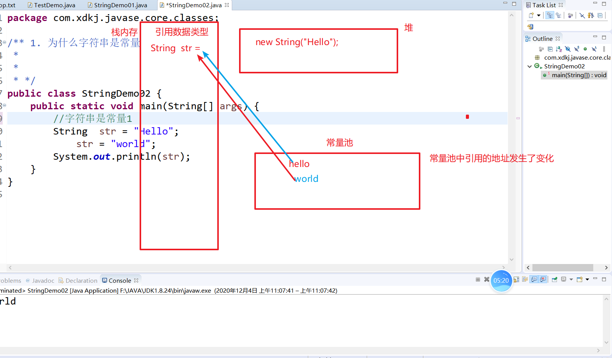
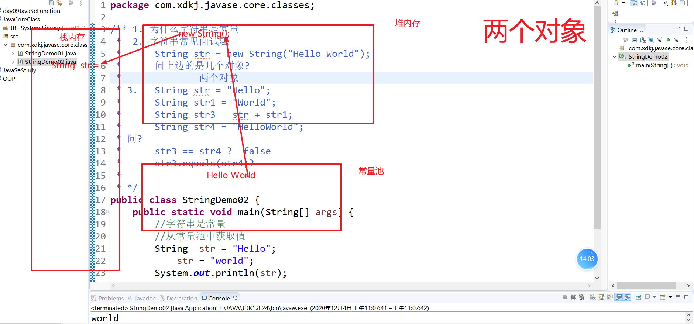
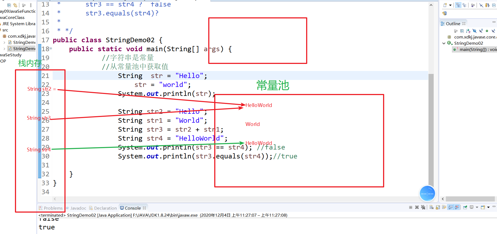

# Java常用的类

> 已经学习完了面向对象，我们自己学习了类的创建和使用，我们Java的封装好的c的一些东西和java自己定义了很多的类。接下来学习java常用的类：
>
> java的核心的包: 
>
> 	1. lang   java的核心的类   核心包的类不需要导入就直接可以使用
>  	2. util  工具包  这里定义的是java的工具类  Date  Scanner....
>  	3. IO 包  流 javaio流 文件的拷贝 网络底层就是io的数据传输
>  	4. net 网络编程包   
>  	5. nio  新的io包 异步数据传输
>  	6. awt 图形界面 + swing 
>  	7. util.stream  集合流
>  	8. time jdk1.8新的日期api
>
> 

## 1.JavaAPI的使用

> java帮助手册 就是使用javadoc根据java的类和接口自动生成的类和接口的说明书。
>
> 帮助手册 分为三个部分:
>
> 1. 包
> 2. 接口/类
> 3. 接口和类的说明
>
> 每一个程序员手动都应该有很多的手册，随时可以使用。

##  2. Object类

> Object是java类层次结构的根类 ，所有java中的类包括数额组都直接继承该类的方法。
>
> + toString()
> + equasl()
> + hashCode()

##  3. String字符串

> 1. String 是字符串  ""包裹的都是字符串
>
> 2. 字符串是常量  值不可以被改变

### 3.1 创建字符串对象

```java
package com.xdkj.javase.core.classes;

import java.io.UnsupportedEncodingException;

/**
 * String 字符串类
 * 	String() 
 * 	String(byte[])
 * 	String(byte[] ,charset)
 * 	String(String)
 * 	String(byte[] bytes, int offset, int length)  offset 偏移量  length 长度
 * 	String(byte[] bytes, int offset, int length, String charsetName) 
*	String(char[] value, int offset, int count) 
 *
 * */
public class StringDemo01 {

	public static void main(String[] args) throws UnsupportedEncodingException {
		//无参构造器实例化对象  但是字符串没有值
			String str = new String();
			
			System.out.println(str);
			//字符串作为参数
			String str1 = new String("Hello");
			System.out.println(str1);
			
			//字节数组作为参数
			//根据默认的编码 utf-8
			byte [] by = {127,23,45,65,4,97};
			String str2 = new String(by);
			System.out.println(str2);
			//通过指定的编码解析字节数组  创建字符串对象
			//重点知识
			String str3 = new String(by,"gb2312");
			System.out.println(str3);
			//解决乱码
			String str4 = "浣嗘槸瀛楃涓叉病鏈夊€?";
			System.out.println(new String(str4.getBytes("GBK"),"UTF-8"));
			
			//获取字节数组的指定长度 在创建字符串
			String str5 = new String(by,3,1);
			System.out.println(str5);
			//拼接字符 形成新的字符串
			String str6 = new String(new char[] {'a','b','c'});
			System.out.println(str6);
			//获取字符数组的片段 生成新的字符串
			String str7 = new String(new char[] {'a','b','c','d'},0,3);
			System.out.println(str7);
       	 // 简写方式创建字符串对象
        String str8 = "Hello world";
			System.out.println(str8);
	}

}

```

### 3.2 为什么字符串是常量

```java
package com.xdkj.javase.core.classes;

/** 1. 为什么字符串是常量
 *  2. 字符串常见面试题
 * 		String str = new String("Hello World");
 * 		问上边的是几个对象?
 * 				两个对象
 * 3. 	String str = "Hello";
 * 		String str1 = "World";
 * 		String str3 = str + str1;
 * 		String str4 = "HelloWorld";
 * 问?
 * 		str3 == str4 ?  false
 * 		str3.equals(str4)?
 * 
 * */
public class StringDemo02 {
	public static void main(String[] args) {
			//字符串是常量
			//从常量池中获取值
				String  str = "Hello";
					str = "world";
				System.out.println(str);
		
				String str2 = "Hello";
		 		String str1 = "World";
				String str3 = str2 + str1;
		  		String str4 = "HelloWorld";
		  		System.out.println(str3 == str4); //false	
		  		System.out.println(str3.equals(str4));//true
		
	}
}

```



### 3.3 字符串面试题

```java
package com.xdkj.javase.core.classes;

/** 1. 为什么字符串是常量
 *  2. 字符串常见面试题
 * 		String str = new String("Hello World");
 * 		问上边的是几个对象?
 * 				两个对象
 * 3. 	String str = "Hello";
 * 		String str1 = "World";
 * 		String str3 = str + str1;
 * 		String str4 = "HelloWorld";
 * 问?
 * 		str3 == str4 ?  false
 * 		str3.equals(str4)?
 * 
 * */
public class StringDemo02 {
	public static void main(String[] args) {
			//字符串是常量
			//从常量池中获取值
				String  str = "Hello";
					str = "world";
				System.out.println(str);
		
				String str2 = "Hello";
		 		String str1 = "World";
				String str3 = str2 + str1;
		  		String str4 = "HelloWorld";
		  		System.out.println(str3 == str4); //false	
		  		System.out.println(str3.equals(str4));//true
		
	}
}

```





### 3.4 String 类常用方法

```java
package com.xdkj.javase.core.classes;

import java.util.Scanner;

/**String 类的常用方法:
 * 	charAt() 返回下标位置的字符值
 * 	codePointAt(0)返回下标位置字符的unicode编码
 * 	compareTo()比较两个字符串的大小 按照字典顺序比较
 * 	compareToIgnoreCase(String str) 忽略大小写比较 
 * 	concat()  拼字符串  + 
 * 	contains(CharSequence s)   是否包含指定的字符序列
 * 	endWith()  以什么字符序列结尾
 * 	startWith()  以什么字符序列开头
 * 	indexOf()  检索字符串中的字符串第一次出现的下标值
 * 	lastIndexOf()检索字符串中的字符串最后一次出现的下标值
 * 	trim()  去除字符串前后空格
 * 	subString(start,end)  截取字符串片段  不包含末尾的字符
 * 	split()   按照正则表达式将字符串切割为字符串数组
 * 	getBytes()  字符串转为  字节数组
 * 	toLowerCase()  转小写
 * 	toUpperCase()转大写
 * 	toCharArray()  转为字符数组
 * 	isEmpty()  是否为空
 * 	replace()  替换
 * 	matches() 正则表达式匹配
 * 	length() 字符串长度
 * 
 * */
public class StringDemo03 {
	public static void main(String[] args) {
		//检索
		System.out.println("HelloWorld".charAt(0));//H
		System.out.println("HelloWorld".codePointAt(0));//72
		System.out.println("Hello".compareTo("Hahaha"));//4
		System.out.println("Hahaha".compareTo("Hello"));//-4
		System.out.println("HELLO".compareTo("HAHAHA"));//4
		
		System.out.println("Hello".concat("World"));//HelloWorld
		System.out.println("HelloWorld".contains("llo"));//true
		
		System.out.println("HelloWorld".contentEquals("Wolrd"));//false
		
		System.out.println("HelloWorld".copyValueOf(new char[] {'l','l'}));
		
		
		System.out.println("Hello".endsWith("hhjh"));//false
		System.out.println("Hello".startsWith("He"));//true
		//返回
		System.out.println("HelloWorld".indexOf('l'));//2
		System.out.println("HelloWorld".lastIndexOf('l'));//8
		
		System.out.println("    Hello  World   ".trim());
		
		System.out.println("HelloWorld".substring(2,6));//llow
		
		System.out.println("HelloWoorld".split("o"));//
		
		for(String str: "HelloWoorld".split("o")) {
			System.out.println(str);
		}
		
		System.out.println("HelloWorld".getBytes());
		
		for(byte by :"HelloWorld".getBytes() ) {
			System.out.println(by);
		}
		System.out.println("------------");
		char [] ch = "HelloWorld".toCharArray();
		System.out.println("HelloWorld".toCharArray());
		
		System.out.println("Hello".toLowerCase());//
		System.out.println("HelloWorld".toUpperCase());
		
		System.out.println("Hello".isEmpty());//fasle
		
		Scanner s = new Scanner(System.in);
		//String sss = s.next();
		//字符串是否为空
			//if(sss != "" && sss != null) {}
			System.out.println();
			
			System.out.println("Hello".length());//
			
			System.out.println("Hello".replace('l', 'w'));
			//正则表达式
			String  regexp  ="[a-zA-Z]"; 
			System.out.println("a".matches(regexp));//true
	}
}

```

### 4. StringBuffer 和 StringBuilder

```java
/**StringBuffer: 
 *  在String类的API中说明在使用+ 进行字符串拼接的时候，其实底层是进行使用StringBuffer或者
 * StringBuilder类的append方法进行字符串的拼接。
 * 
 * 	字符串缓冲区, 就是在内存中开辟一个初始容量为16个字符的空间，在使用append和insert
 * 方法向这个字符串缓冲区中的末尾或者指定的地方添加字符串(拼接字符串)，缓冲区会根据实际内容的
 * 大小进行扩增 超过初始的容量值会多一倍+2.  capacity() 进行容量的查看。
 * 
 * 主要使用的是的重载的方法: append  insert  delete ;
 * 
 * 特点: 线程安全的  同步的  效率低
 * 	让我们优先使用StringBuffer的替代类 StringBuilder 兼容的只是特性不一样
 * 	StringBuilder是线程不安全的  不同步的 效率高  单线程中使用。
 * 
 * 在使用方面。我们在大量的数据汇总，字符串拼接的时候使用StringBuffer和StringBuilder
 * */
```

```java

```

##  6.Scanner

```java
package com.xdkj.javase.core.classes.utils;

import java.util.Scanner;

/**Scanner: 文本扫描器
 * 	System.in 系统标准的输入流  控制台输入
 * 	next方法去转换 不同数据类型 的值
 * 	next() 获取控制台连续的字符串  
 * 	nextLine() 获取一行的数据
 *  nextInt()
 *  nextFloat()
 *  nextDouble()
 *  nextLong()
 * */
public class ScannerDemo {

	public static void main(String[] args) {
		Scanner scanner = new Scanner(System.in);
		//String str = scanner.next();
		//获取一行输入的内容  \r\n 知道到达行末尾输入结束 
		String str = scanner.nextLine();
		System.out.println(str);
		int num =  scanner.nextInt();
		System.out.println(num);
		
		//关闭扫描器
		scanner.close();
		//java.lang.IllegalStateException 非法的状态异常
		float f = 	scanner.nextFloat();
		System.out.println(f);
	}
}

```

## 7.Math

```java
package com.xdkj.javase.core.classes.utils;

/**Math:
 * 	数学函数的工具类  Math 类包含用于执行基本数学运算的方法，如初等指数、对数、平方根和三角函数。
 * 	PI 圆周率	
 * 	E 自然数的底数
 * 	Math中的属性和方法都是静态的  直接通过类名调用就可以了
 * 		abs  absulote  绝对值
 * 		max
 * 		min
 * 		pow 幂次方
 * 		sqrt 开平方
 * 		random 随机数 0-1之间 取不到1
 * 		sin
 * 		cos
 * 		tan 正切
 * 		
 * 	
 * */
public class MathDemo {

	public static void main(String[] args) {
		//圆周率
		System.out.println(Math.PI);
		//半径为4的圆面积
		System.out.println(Math.PI*4*4);
		System.out.println(Math.E);
		
		System.out.println(Math.abs(-123));//123
		System.out.println(Math.max(123, 99));
		System.out.println(Math.min(123.99, 123.88));
		
		System.out.println(Math.sqrt(16));
		
		System.out.println(Math.pow(3, 4));
		//随机数  0-1之间  取不到1
		System.out.println(Math.random());
		//天花板 向上取整
		System.out.println(Math.ceil(12.01));//13.0
		//地板 向下取整
		System.out.println(Math.floor(12.99));//12.0
		//求和
		System.out.println(Math.addExact(88, 99));
		//求 1-10之间的随机数
		System.out.println(Math.random()*10);
	}
}

```

## 8. Random

> 随机数的类

```java
package com.xdkj.javase.core.classes.utils;

import java.util.Random;

public class RandomDemo {

	public static void main(String[] args) {
		Random random = new Random();
		//获取整数的随机数
		//int 的范围内生成整数的随机数
		//int num = random.nextInt();
		//0-100之间的整数值 0-100取不到100
		int num = random.nextInt(100)+1;
		System.out.println(num);
		System.out.println(random.nextDouble());
		System.out.println(random.nextLong());
	}

}

```

## 9.基本数据类型和包装类

> 基本数据类型 是以变量的形式直接赋值
>
> 包装类和基本数据类型之间的区别:
>
> 1. 基本数据类型只能声明变量并赋值  直接进行运算
> 2. 包装类是一个类 可以调用方法。

```java
package com.xdkj.javase.core.classes.utils;

public class PackageClassDemo {
	public static void main(String[] args) {
		int num = 999;
		System.out.println(num);
		
		Integer age = 999;
		System.out.println(age);
		System.out.println(age.toString());
		//int 2^31-1
		System.out.println(Integer.MAX_VALUE);
		long mx = Integer.MAX_VALUE*Integer.MAX_VALUE;
		System.out.println((long)(Integer.MAX_VALUE + Integer.MAX_VALUE));
		System.out.println(mx);
		//字符串和int类型的转换
		String str = "123456";
		//数组类型的字符串转为  整数类型
		System.out.println(Integer.parseInt(str));
		System.out.println(123+"");
		
		Integer in = new Integer(999);
		System.out.println(in);
		//布尔类型的包装类
		Boolean.compare(true, false);
		System.out.println("------------------------");
		System.out.println(Character.charCount(9798));
		System.out.println(Character.MAX_VALUE + "lllll");
		System.out.println(Character.MIN_VALUE + "llll");
		System.out.println("++++++++++++++");
		
		Byte  by = 123;
		System.out.println(by);
		//数字类的字符串转  字节类型
		System.out.println(Byte.parseByte("122"));
		
		System.out.println(Double.parseDouble("99.88"));
	}
}

```

## 10. 自动装箱和拆箱

> 自动装箱 就是将基本数据类型的值 赋给 包装类声明的变量
>
> 自动拆箱  就是将包装类类型的 变量赋值给基本数据类型
>
> JDK1.5加的特性

```java
public class AutoPackageDemo {
	public static void main(String[] args) {
		//自动装箱
		Integer num = 999;
		//自动拆箱
		int age = num ;
		System.out.println(age);
	}
}
```

## 11.System

```java
package com.xdkj.javase.core.classes.utils;

public class SystemDemo {

	public static void main(String[] args) {
	long startTime = 	System.currentTimeMillis();	
	
		for(int i = 0;i<=10000;i++) {
			System.out.println(i);
		}
		long endTime = 	System.currentTimeMillis();
	System.out.println(endTime - startTime);//103毫秒
	//强制调用gc不一定会立马进行垃圾回收，等待空闲的时间进行回收。
		System.gc();
		//程序终止  java虚拟机终止运行
		System.exit(1);
		System.out.println("Hello");
	}

}

```

## 12.Date和日期转换

### 12.1 Date

```java
package com.xdkj.javase.core.classes.utils;

import java.util.Date;

/**
 * Date: 日期类 util包中的日期
 * 	时间的偏移量 1970 1.1 
 * */
public class DateDemo {

	public static void main(String[] args) {
		//系统当前的时间对象
		Date date = new Date();
		//Tue Dec 08 12:00:20 CST 2020
		System.out.println(date);
		//year + 1900
		Date date1 = new Date(2020,12,8);
		System.out.println(date1);
		
		System.out.println(new Date(2020,10,8,12,16,30));
		//
		System.out.println(new Date(5645892534545454545L));
		
		System.out.println(date.getDate());
		System.out.println(date.getDay());
		System.out.println(date.getHours());
		System.out.println(date.getMonth());
		//毫秒值
		System.out.println(date.getTime());
		System.out.println(date.toString());
		//2020-12-8 12:19:24
		System.out.println(date.toLocaleString());
		
		//System.out.println(Date.parse("1995 13:30:00"));
	}

}

```

### 12.2 日期格式化

```java
package com.xdkj.javase.core.classes.utils;

import java.text.ParseException;
import java.text.SimpleDateFormat;
import java.util.Date;

/**日期格式化 :
 * 	在实际的应用中我们需要 将日期转为 字符串或者 字符串转日期
 * SimpleDateFormat 日期格式化和解析
 * 	new SimpleDateFormat("yyyy-MM-dd HH:mm:ss");
 * 	format 格式化
 *  parse  解析
 * 
 * 
 * */
public class DateFormatDemo {

	public static void main(String[] args) throws ParseException {
		//日期转字符串
		//SimpleDateFormat simple = new SimpleDateFormat("yyyy-MM-dd HH:mm:ss");
		//SimpleDateFormat simple = new SimpleDateFormat("yyyy-MM-dd");
		SimpleDateFormat simple = new SimpleDateFormat("yyyy/MM/dd z HH:mm:ss");
		String str = simple.format(new Date());
		System.out.println(str);
		//字符串转日期
		//Sun Dec 06 14:20:30 CST 2020
		Date  date = simple.parse("2020/12/06 GMT 14:20:30");
		//2020-12-6 14:20:30
		//Sun Dec 06 22:20:30 CST 2020 加时区了东八时区加8小时
		System.out.println(date);
		System.out.println(date.toLocaleString());
		//必须熟练使用
		
		SimpleDateFormat simple1 = new SimpleDateFormat();
			String d1 = simple1.format(new Date());
			//20-12-8 下午2:33
			System.out.println(d1);
	}

}

```

## 13. Calendar新的日期类

> 因为Date类当初定义的没有没有定义好，所以在JDK1.1以后里面的方法基本都废弃了。
>
> 推荐使用Calendar新的的日期API.
>
> `Calendar` 类是一个抽象类,有构造器不能实例化对象。
>
> `Calendar` 提供了一个类方法 `getInstance`，以获得此类型的一个通用的对象

```java
package com.xdkj.javase.core.classes.calendar;

import java.util.Calendar;
import java.util.Date;
import java.util.TimeZone;

public class CalendarDemo {
	public static void main(String[] args) {
		//method2();
		method3();
	}
	
	public static void method() {

		Calendar  calendar = Calendar.getInstance();
		System.out.println(calendar);
		//字段锁封装的数字值
		System.out.println(calendar.DATE);//5
		//日期
		System.out.println(calendar.get(5));
		//年
		System.out.println(calendar.get(1));
		//月
		System.out.println(calendar.get(2));
		//50 一年中的第几周
		System.out.println(calendar.get(3)); //50
		//2
		System.out.println(calendar.get(4));
		//通过静态字端获取日期的信息值
		System.out.println(calendar.get(Calendar.DATE));
		System.out.println(calendar.get(Calendar.YEAR));
		System.out.println(calendar.get(Calendar.DAY_OF_MONTH));
		System.out.println(calendar.get(Calendar.MONTH));
		System.out.println(calendar.get(Calendar.HOUR));
	}
	
	public static void method2() {
		Calendar calendar = Calendar.getInstance();
		//date对象作为参数传入
		calendar.setTime(new Date());
		System.out.println(calendar);
		
		calendar.set(Calendar.YEAR, 1990);
		System.out.println(calendar);
		
		calendar.set(1990, 10, 12, 14, 20, 35);
		System.out.println(calendar);
		
	}
	//计算一周后是星期几  一个月的第几天  一年的第几天  一年的第几周
	public static void method3() {
		Calendar calendar = Calendar.getInstance();
		//添加  给字段增加 或者减少  到达最小值  相关数值会自定变化
		//calendar.add(Calendar.DATE, 30);
		//不更改更大的字段
		calendar.roll(Calendar.DATE, 30);
		System.out.println(calendar);
		//Tue Dec 08 10:40:41 CST 2020
		System.out.println(calendar.getTime());
		//2020-12-8 10:41:29
		System.out.println(calendar.getTime().toLocaleString());
		//1607395241108
		System.out.println(calendar.getTimeInMillis());
		
		//设置时区
		calendar.setTimeZone(TimeZone.getDefault());
		System.out.println(calendar);
	}
}

```

## 14. Arrays

> 此类包含用来操作数组（比如排序和搜索）的各种方法。此类还包含一个允许将数组作为列表来查看的静态工厂

```java
package com.xdkj.javase.core.classes.arrays;

import java.util.Arrays;
import java.util.List;

public class ArraysDemo {
	public static void main(String[] args) {
		int [] arr = {12,34,56,67,89};
		//底层使用的快速排序
		Arrays.sort(arr);
		System.out.println(arr);
		for(int i : arr) {
			System.out.println(i);
		}
		//获取数组中元素的下标
		//使用二分法去查找数据  先排序在去重 在调用该此方法
		System.out.println(Arrays.binarySearch(arr, 67));
		//如果Key的值大于数组中的元素值 返回的是 -a.length-1
		System.out.println(Arrays.binarySearch(arr, 90));
		
		List<String> list = Arrays.asList("Helo","world");
		System.out.println(list);
	}
}

```

## 15. BigDecimal BigInt

> 高精度和位数的数学运算以及大数据的操作。

```java
package com.xdkj.javase.core.classes.arrays;

import java.math.BigDecimal;
import java.math.BigInteger;
import java.math.MathContext;

public class BigDecimalDemo {
	public static void main(String[] args) {
		double result = 1/3;
		System.out.println(result);
		
		BigDecimal  bigDecimal = new BigDecimal(99.9999999999999999999999999999999999999);
		System.out.println(0.9888888888888888);
		System.out.println(bigDecimal);
		
		//我们可以使用Bigdecimal进行数学运算
		BigDecimal  b1 = new BigDecimal("5454545648223644454589521245454");
		BigDecimal  b2 = new BigDecimal(777777777777777L);
		System.out.println(b1.add(b2));
		System.out.println(b1.subtract(b2));
		System.out.println(b1.multiply(b2));
		//0.5以下舍去
		//System.out.println(b1.divide(b2));
		System.out.println(b1.divide(b2,BigDecimal.ROUND_HALF_DOWN));
		System.out.println(b1.divide(b2,5,BigDecimal.ROUND_HALF_UP));
		BigInteger  in = new BigInteger("45645489554545645");
		BigDecimal  b4 = new BigDecimal(in);
	}
}

```


