# Java简介和发展史

## 1. JAVA发展历史

计算机硬件发展的同时，软件始终伴随其步伐迅猛发展，就计算机的编程语言而言，也划分为三代。
　  第一代：**机器语言**。每条指令用二进制编码，效率很低。
　　第二代：**汇编语言**。用符号编程，和具体机器指令有关，效率不高。
　　第三代：**高级语言**：如FORTRAN、COBOL、BASIC、PASCAL等都属于高级语言。

 Java语言的诞生具有一定的戏剧性，它并不是经过精心的策划、制作，最后产生的划时代产品，从某种角度来看，java语言的诞生完全是一种误会。这又是怎么说呢？

  1990年年末，Sun公司预料嵌入式系统将在未来家用电器领域大显身手。于是Sun公司成立了一个由James Gosling领导的“Green计划 ”，准备为下一代智能家电（电视机、微波炉、电话）编写一个通用控制系统。

  该团队最初考虑使用C++语言，但是很多成员包括Sun的首席科学家Bill Joy,发现C++和可用的API在某些方面存在很大的问题。而且工作小组使用的是嵌入式平台，可用的系统资源极其有限。并且很多成员都发现C++太复杂，以致很多开发者经常错误使用。而且C++缺少垃圾回收系统、可移植性、分布式和多线程等功能。

   根据可用的资金，Bill Joy 决定开发一种新语言，他提议在C++的基础上，开发一种面向对象的环境。于是，Gosling试图通过修改和扩展C++的功能来满足这个要求，但是后来他放弃了。他决定创造一种全新的语言：Oak.（他们都具有不将就的精神、在开发某一项科技的时候得具有资金的支持以及各种创新精神）

​    到了1992年的夏天，Green计划已经完成了新平台的部分功能，包括Green操作系统。Oak的程序设计语言、类库等。同年11月，Green计划被转化成“FirstPerson有限公司”，一个Sun公司的全资子公司。

​    FirstPerson团队致力于创建一种高度互动的设备。当时代华纳公司发布了一个关于电视机顶盒的征求提议书时，FirstPerson团队改变了他们的目标，作为对征求提议书的响应，提出了一个机顶盒平台的提议。但是有线电视业界觉得FirstPerson的平台给予用户过多的控制权，因此FirstPerson的投标败给了SGI。同时，3DO公司另外一笔关于机顶盒的交易没有成功。此时，可怜的Green项目几乎接近夭折，甚至Green项目的一半成员也被调到了其他的项目组。

​    正如中国古代的寓言所言：塞翁失马，焉知非福？如果Green项目在机顶盒平台投标成功，也许就不会诞生Java这门伟大的语言了。

   1994年夏天，互联网和浏览器的出现不仅给广大互联网的用户带来了福音，也给Oak语言带来了新的生机。Gosling立即意识到，这是一个机会，于是对Oak进行了小规模的改造，到了1994年秋，小组中的Naughton和Jonathan Payne完成了第一个Java语言的网页浏览器：WebRunner.Sun公司实验室主任Bert Sutherland 和技术总监Eric Schmict 观看了该浏览器的演示，对该浏览器的效果给予了高度评价。当时的Oak这个商品已经被注册，于是只得将Oak更名为Java.

​    Sun公司在1995年年初发布了Java语言，Sun公司直接把Java放到互联网上，免费给大家使用，甚至连源代码也不保密，也放到互联网上向所有人公开。

​    几个月后，让所有人都吃惊的事情发生了：Java成了互联网上最热门的宝贝。竟然有10万多人次访问了Sun公司的网页，下载了Java语言。然后，互联网上立即就有了数不清的Java小程序（也就Applet）,演示着各种小动画、小游戏等。

​    Java 语言终于眼眉吐气了 ，成为了一种广为人知的编程语言。

​    在Java语言出现之前，互联网的网页实质上就像一张纸，不会有任何动态的内容。有了Java语言之后，浏览器的功能被扩大了，Java程序可以直接在浏览器里运行，可以直接与远程服务器交互：用Java语言编程，可以在互联网上像传送电子邮件一样方便地传送程序文件！

​    1995年，Sun虽然推出了Java，但这只是一种语言，如果想开发复杂的应用程序，必须要有一个强大的开发类库。因此，Sun在1996年年初 发布了JDK1.0.这个版本包括两部分：运行环境（即JRE）和开发环境（即JDK）.运行环境包括核心API、集成API、用户界面API、发布技术、Java虚拟机（JVM）5个部分;开发环境包括编译Java程序的编译器（即Javac命令）。

   接着，Sun在1997年2月18日发布了JDK1.1。JDK1.1增加了JIT（即时编译）编译器。JIT和传统的编译器不同，传统的编译器是编译一条，运行完成后将其扔掉；而JIT会将经常用到的指令保存在内存中，当下调用时就不需要重新编译了，通过这种方式让JDK在效率上有了较大提升。

   但一直以来，Java主要的应用就是网页上的Applet以及一些移动设备。到了1996年年底，Flash面世了，这是一种更加简单的动画设计软件：使用Flash几乎无须任何编程语言知识，就可以做出丰富多彩的动画。随后Flash增加了ActionScript编程脚本，Flash逐渐蚕食了Java在网页上有了较大提升。

  从1995年Java诞生到1998年年底，Java语言虽然成为了互联网上广泛使用的编程语言，但它并没有找到一个准确的定位，也没有找到它必须存在的理由：Java语言可以编写Applet,而Flash一样可以做到，而且更快，开发成本更低。

   直到1998年12月，Sun发布了Java历史上最重要的JDK版本：JDK1.2，伴随着JDK1.2一同发布的还有JSP/Servlet、EJB等规范，并将Java分成J2EE、J2SE和J2ME三个版本。

J2ME：主要用于控制移动设备和信息家电等有限存储的设备。

J2SE：整个Java技术的核心和基础，它是J2ME、J2EE编程的基础，

J2EE：Java技术中应用最广泛的部分，J2EE提供了企业应用开发相关的完整解决方案。这标志着Java已经吹响了向企业、桌面和移动三个领域进军的号角，标志着Java已经进入Java2时代，这个时期也是Java飞速发展的时期。

   在Java2中，Java发生了很多革命性的变化，而这些革命性的变化一直沿用到现在，对于Java的发展形成了深远的影响。知道今天还经常看到J2EE、J2ME等名称。

不仅如此，JDK1.2还把它的API分成了三类。

核心API：由Sun公司制定的基本的API，所有的Java平台都应该提供。这就是平常所说的Java核心类库。

可选API：这是Sun为JDK提供的扩充API，这些API因平台的不同而不同。

特殊API：用于满足特殊要求的API。如用于JCA和JCE等第三方加密类库。

2002年，Sun发布了JDK历史上最成熟的版本：JDK1.4成为发展最快的一个JDK版本。JDK1.4已经可以使用Java实现大多数的应用了。

   在此期间，Java语言在企业应用领域大放异彩，涌现出大量基于java语言的开源框架 ：Struts、WebWork、Hibernate、Spring等；大量企业应用服务器也开始涌现：WebLogic、WebSphere、JBoss等，这些都标志着Java语言进入了飞速发展时期。

​    2004年10月，Sun发布了万众期待的JDK1.5,同时，Sun将JDK1.5改名为Java SE5.0，J2EE、J2ME也相应地改名为Java EE和Java ME。JDK1.5增加了诸如泛型、增强的for语句、可变数量的形参、注释、自动拆箱和装箱等功能；同时，也发布了新的企业级平台规范，如通过注释等新特性来简化EJB的复杂性，并推出了自己的MVC框架规范：JSF,JSF规范类似于ASP.NET的服务器端控件，通过它可以快速地构建复杂的JSP界面。

   2006年12月，Sun公司发布了JDK1.6(也被称为Java EE 6)。一直以来，Sun公司维持着大约2年发布一次JDK新版本的习惯。

   但在2009年4月20日，Oracle宣布将收购Sun公司。Sun倒下了，不过Java的大旗依然猎猎作响。2011年7月28日，Oracle公司终于"如约" 发布了 Java SE 7——这次版本的升级经过了将近5年时间。Java SE 7也是Oracle发布的第一个Java版本，引入了二进制整数、支持字符串的switch语句、棱形语法、多异常捕抓、自动关闭资源的try语言等新特性。

   2014年3月18日，Oracle公司发不了Java SE8,这次版本升级为Java带来了全新的Lambda表达式、流式编程等大量新特性，这些新特性使得Java变得更加强大。

​    2017年9月22日，Oracle公司发布了Java SE 9，这次版本升级强化了Java的模块化系统，让庞大的Java语言更轻量化，而且采用了更高效、更智能的GI 垃圾回收器，并在核心类库上进行了大量更新，可以进一步简化编程；但对语法本身更新并不多（毕竟Java语言已经足够成熟）

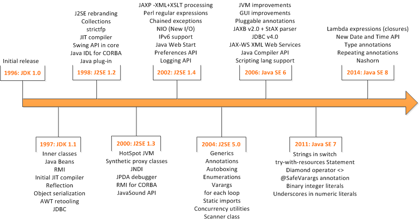

## 2. JDK各个版本的特性

### JDK1.5

1：自动装箱与拆箱
2：枚举
3：静态导入
4：可变参数（Varargs）
5：内省（Introspector）
6：泛型(Generic)
7.For-Each循环

###J DK 1.6

1：Desktop类和SystemTray类
2：使用JAXB2来实现对象与XML之间的映射
3：理解StAX
4.使用Compiler API
5：轻量级Http Server API
6：插入式注解处理API(Pluggable Annotation Processing API)
7：用Console开发控制台程序
8：对脚本语言的支持如: ruby, groovy, javascript
9：Common Annotations

###JDK 1.7

1：switch中可以使用字串
2："<>“这个玩意儿的运用List tempList = new ArrayList<>(); 即泛型实例化类型自动推断
3：自定义自动关闭类
4：新增一些取环境信息的工具方法
5：Boolean类型反转，空指针安全，参与位运算
6：两个char间的equals
7：安全的加减乘除
8：对Java集合（Collections）的增强支持
9：数值可加下划线
10：支持二进制文字
11：简化了可变参数方法的调用
12：在try catch异常扑捉中，一个catch可以写多个异常类型，用”|"隔开
13：jdk7之前，你必须用try{}finally{}在try内使用资源，在finally中关闭资源，不管try中的代码是否正常退出或者异常退出。jdk7之后，你可以不必要写finally语句来关闭资源，只要你在try()的括号内部定义要使用的资源

### JDK 1.8

1：接口的默认方法
2：Lambda 表达式
3：函数式接口
4：方法与构造函数引用
5：Lambda 作用域
6：访问局部变量
7：访问对象字段与静态变量
8：访问接口的默认方法
9：Date API
10：Annotation 注解

### JDK1.9

1. Java平台级模块系统
2. 响应式编程模型Reactive
3. Linking
4. JShell：交互式Java REPL
5. 改进的Javadoc
6. 集合工厂方法
7. 改进的Stream API
8. 私有接口方法
9. HTTP/2
10. 多版本兼容JAR

### JDK10

1. 局部变量类型推断
2. 应用类数据共享(CDS)
3. 额外的 Unicode 语言标签扩展
4. 基于时间的版本控制
5. 根证书
6. 并行全垃圾回收器 G1
7. 移除 Native-Header 自动生成工具
8. 垃圾回收器接口
9. 线程-局部变量管控
10. 在备用存储装置上的堆分配
11. 试验性的基于 Java 的 JIT 编译器
12. 合并 JDK 多个代码仓库到一个单独的储存库中

### JDK11

1、本地变量类型推断
2、字符串加强
3、集合加强
4、Stream 加强
5、Optional 加强
6、InputStream 加强
7、HTTP Client API
8、化繁为简，一个命令编译运行源代码

## 3. java语言平台

> J2SE(Java 2 Platform Standard Edition)标准版
> 		是为开发普通桌面和商务应用程序提供的解决方案
> 		该技术体系是其他两者的基础，可以完成一些桌面应用程序的开发
> J2ME(Java 2 Platform Micro Edition)小型版
> 		是为开发电子消费产品和嵌入式设备提供的解决方案
> J2EE(Java 2 Platform Enterprise Edition)企业版
> 		是为开发企业环境下的应用程序提供的一套解决方案
> 		该技术体系中包含的技术如 Servlet、Jsp等，主要针对于Web应用程序开发
>
> Java5.0版本后，更名为 JAVAEE    JAVASE    JAVAME

## 4. Java语言的特点

+ 简单性		
+ 解释性
+ 面向对象		
+ 高性能
+ 分布式处理	
+ 多线程
+ 健壮性		
+ 动态
+ 结构中立	
+ 安全性
+ 开源
+ 跨平台

> 什么是跨平台性？
> 	通过Java语言编写的应用程序在不同的系统平台上都可以运行。
> 原理是什么？
> 	只要在需要运行java应用程序的操作系统上，
> 	先安装一个Java虚拟机(JVM Java Virtual Machine)即可。
> 	由JVM来负责Java程序在该系统中的运行

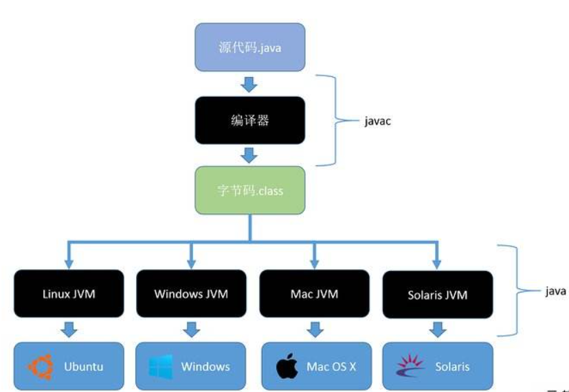

## 5. JAVA的三个核心工具

### 5.1 JDK(Java Development Kit  Java开发工具包)

> JDK是提供给Java开发人员使用的，其中包含了java的开发工具，也包括了JRE。所以安装了JDK，就不用在单独安装JRE了。 其中的开发工具：编译工具(javac.exe) 打包工具(jar.exe)等
>
> 为什么JDK中包含一个JRE呢？
> 其一，开发完的程序，总需要运行一下看看效果。
> 其二，也是最重要的，JDK中的开发工具其实都是java语言编写的应用程序，为了方便使用才打包成exe文件，
> 如果没有JRE，那么这些工具是运行不了的。

### 5.2 JRE(Java Runtime Environment    Java运行环境)

> 包括Java虚拟机(JVM Java Virtual Machine)和Java程序所需的核心类库等，如果想要运行一个开发好的Java程序，计算机中只需要安装JRE即可。

### 5.3 JVM（java virtual machine）

> JVM就是我们常说的java虚拟机，它是整个java实现跨平台的最核心的部分，所有的java程序会首先被编译为.class的类文件，这种类文件可以在虚拟机上执行。
>
> 也就是说class并不直接与机器的操作系统相对应，而是经过虚拟机间接与操作系统交互，由虚拟机将程序解释给本地系统执行。
>
> 只有JVM还不能成class的执行，因为在解释class的时候JVM需要调用解释所需要的类库lib，而jre包含lib类库。
>
> JVM屏蔽了与具体操作系统平台相关的信息，使得Java程序只需生成在Java虚拟机上运行的目标代码（字节码），就可以在多种平台上不加修改地运行。

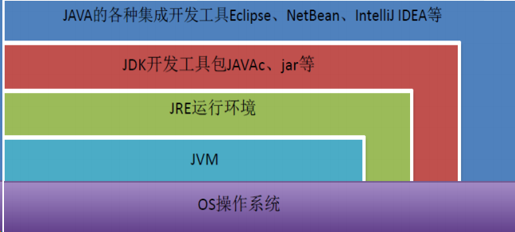

## 6. JDK下载和安装

### 6.1 JDK下载

[Oracle官网](https://www.oracle.com/index.html)

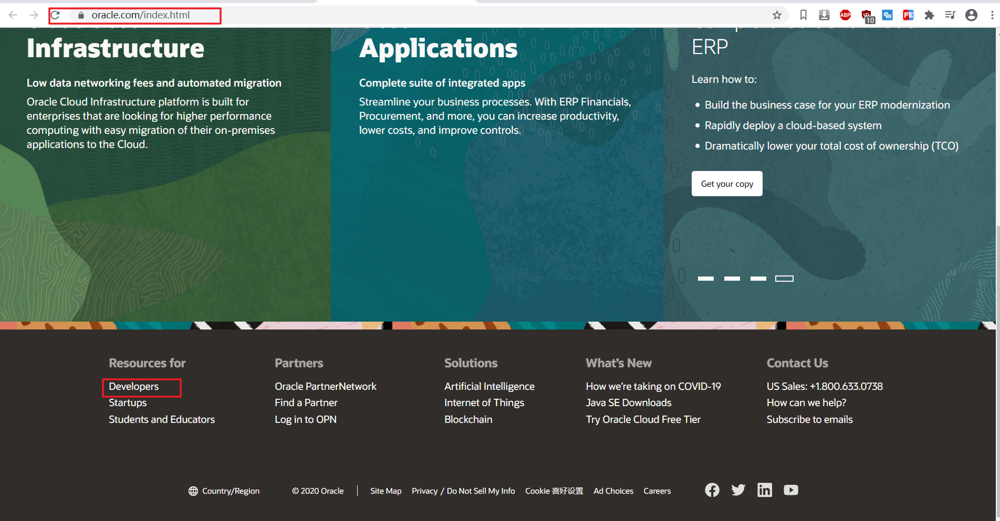

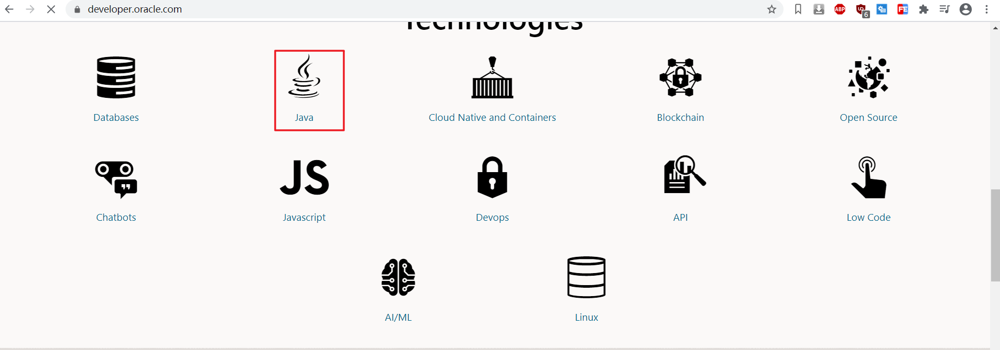

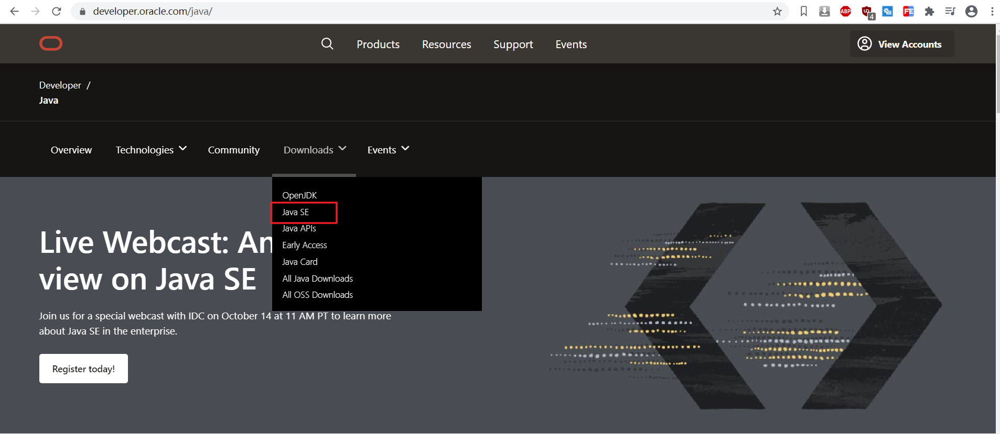


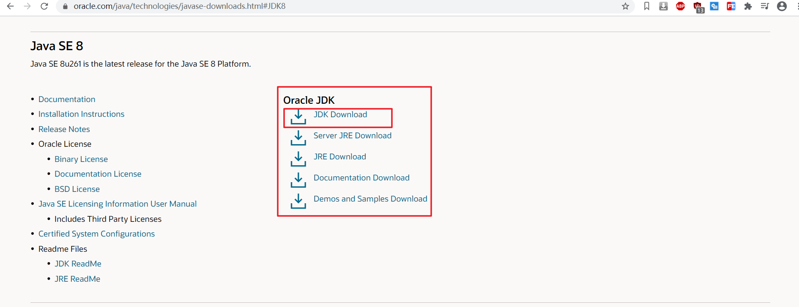

[最后的下载页面](https://www.oracle.com/java/technologies/javase/javase-jdk8-downloads.html)

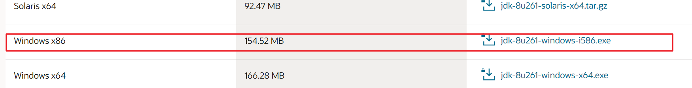

### 6.2 JDK安装

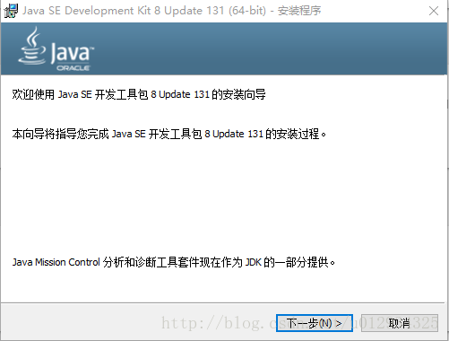

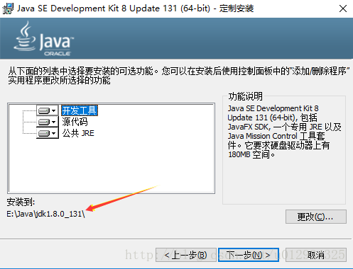

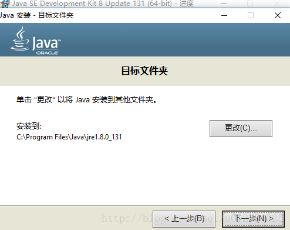

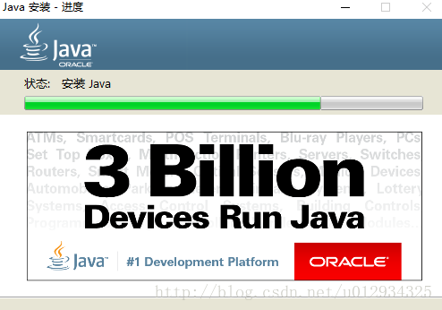

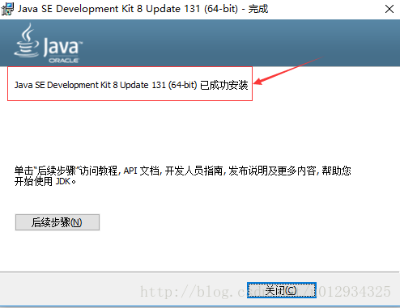

### 6.3  JAVA-HelloWorld

在安装的java/bin目录中新建Demo.java

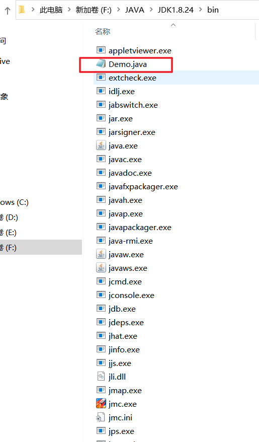

```java
class Demo{
    public static void main(String [] args){
        System.out.println("Hello World");
    }
}


```

在当前目录中打开DOS窗口

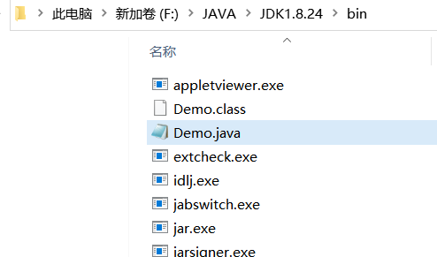

```shell
F:\JAVA\JDK1.8.24\bin
λ javac Demo.java

F:\JAVA\JDK1.8.24\bin
λ java Demo
Hello World
```

java代码需要先进行编译为.class的字节码文件，在通过java运行字节码文件

### 6.4 配置java环境变量

> 程序的执行需要使用外部指令javac，但是javac指令仅仅能在JDK安装目录下的bin目录下时候，因此程序只能写入bin目录
> 程序开发过程中，不能将源代码写入JDK的安装目录，因此需要将源程序保存到任意位置的指定目录(英文目录)，所以需要使javac指令在任意目录下可以运行

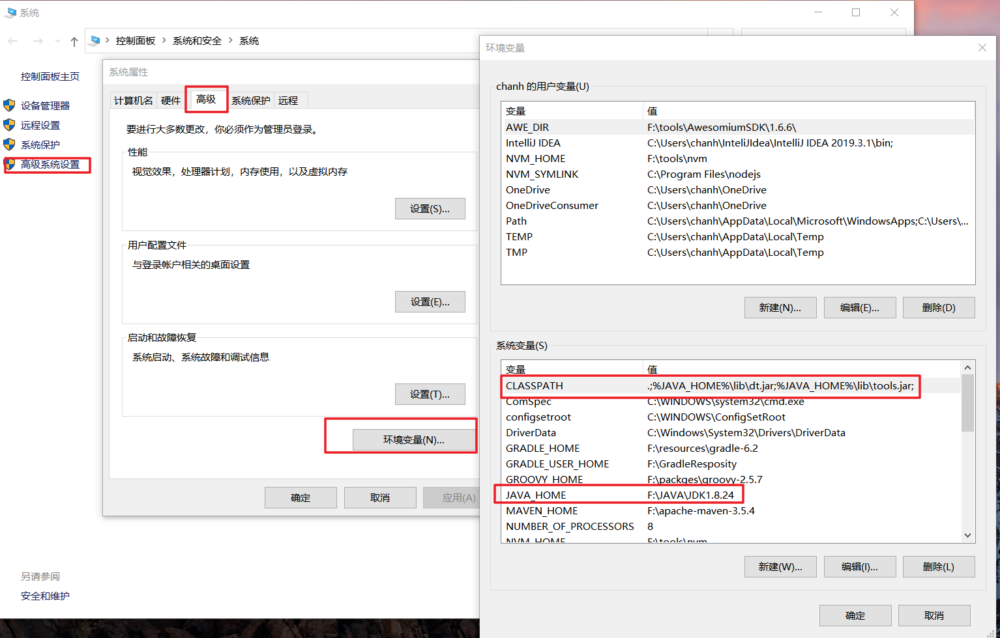

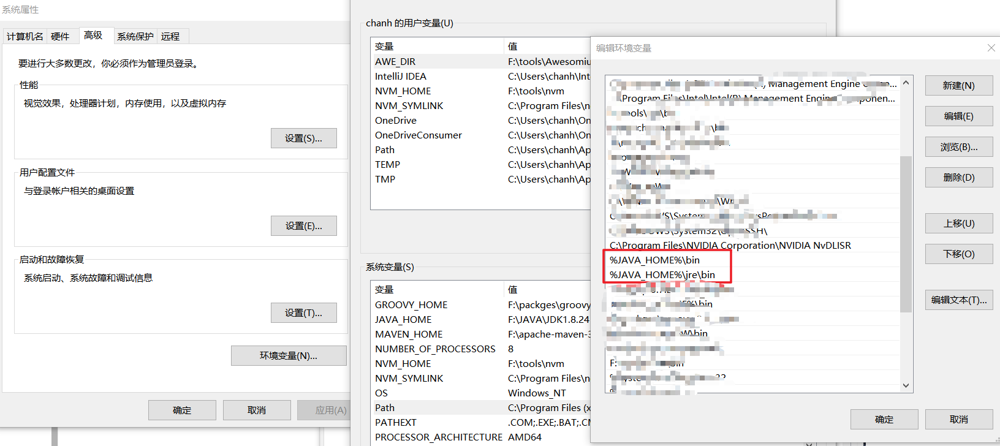

> **配置JAVA_HOME**。
>
> ​	新建，变量名JAVA_HOME，变量值，jdk路径，我的路径是C:\Program Files\Java\jdk1.8.0_121，保存
>
> **配置CLASSPATH**。
>
> ​	新建，变量名CLASSPATH，变量值，.;%JAVA_HOME%\lib;%JAVA_HOME%\lib\tools.jar（第一个分号前前面有一个点）。
>
> **配置Path**。
>
> ​	打开Path变量，在变量值最前加入%JAVA_HOME%\bin;%JAVA_HOME%\jre\bin;
>
> ​	win10系统需要分开来添加 ，末尾不需要分号

```shell
F:\JAVA\JDK1.8.24\bin
λ javac
用法: javac <options> <source files>
其中, 可能的选项包括:
  -g                         生成所有调试信息
  -g:none                    不生成任何调试信息
  -g:{lines,vars,source}     只生成某些调试信息
  -nowarn                    不生成任何警告
  -verbose                   输出有关编译器正在执行的操作的消息
  -deprecation               输出使用已过时的 API 的源位置
  -classpath <路径>            指定查找用户类文件和注释处理程序的位置
  -cp <路径>                   指定查找用户类文件和注释处理程序的位置
  -sourcepath <路径>           指定查找输入源文件的位置
  -bootclasspath <路径>        覆盖引导类文件的位置
  -extdirs <目录>              覆盖所安装扩展的位置
  -endorseddirs <目录>         覆盖签名的标准路径的位置
  -proc:{none,only}          控制是否执行注释处理和/或编译。
  -processor <class1>[,<class2>,<class3>...] 要运行的注释处理程序的名称; 绕过默认的搜索进程
  -processorpath <路径>        指定查找注释处理程序的位置
  -parameters                生成元数据以用于方法参数的反射
  -d <目录>                    指定放置生成的类文件的位置
  -s <目录>                    指定放置生成的源文件的位置
  -h <目录>                    指定放置生成的本机标头文件的位置
  -implicit:{none,class}     指定是否为隐式引用文件生成类文件
  -encoding <编码>             指定源文件使用的字符编码
  -source <发行版>              提供与指定发行版的源兼容性
  -target <发行版>              生成特定 VM 版本的类文件
  -profile <配置文件>            请确保使用的 API 在指定的配置文件中可用
  -version                   版本信息
  -help                      输出标准选项的提要
  -A关键字[=值]                  传递给注释处理程序的选项
  -X                         输出非标准选项的提要
  -J<标记>                     直接将 <标记> 传递给运行时系统
  -Werror                    出现警告时终止编译
  @<文件名>                     从文件读取选项和文件名


F:\JAVA\JDK1.8.24\bin
λ java
用法: java [-options] class [args...]
           (执行类)
   或  java [-options] -jar jarfile [args...]
           (执行 jar 文件)
其中选项包括:
    -d32          使用 32 位数据模型 (如果可用)
    -d64          使用 64 位数据模型 (如果可用)
    -server       选择 "server" VM
                  默认 VM 是 server.

    -cp <目录和 zip/jar 文件的类搜索路径>
    -classpath <目录和 zip/jar 文件的类搜索路径>
                  用 ; 分隔的目录, JAR 档案
                  和 ZIP 档案列表, 用于搜索类文件。
    -D<名称>=<值>
                  设置系统属性
    -verbose:[class|gc|jni]
                  启用详细输出
    -version      输出产品版本并退出
    -version:<值>
                  警告: 此功能已过时, 将在
                  未来发行版中删除。
                  需要指定的版本才能运行
    -showversion  输出产品版本并继续
    -jre-restrict-search | -no-jre-restrict-search
                  警告: 此功能已过时, 将在
                  未来发行版中删除。
                  在版本搜索中包括/排除用户专用 JRE
    -? -help      输出此帮助消息
    -X            输出非标准选项的帮助
    -ea[:<packagename>...|:<classname>]
    -enableassertions[:<packagename>...|:<classname>]
                  按指定的粒度启用断言
    -da[:<packagename>...|:<classname>]
    -disableassertions[:<packagename>...|:<classname>]
                  禁用具有指定粒度的断言
    -esa | -enablesystemassertions
                  启用系统断言
    -dsa | -disablesystemassertions
                  禁用系统断言
    -agentlib:<libname>[=<选项>]
                  加载本机代理库 <libname>, 例如 -agentlib:hprof
                  另请参阅 -agentlib:jdwp=help 和 -agentlib:hprof=help
    -agentpath:<pathname>[=<选项>]
                  按完整路径名加载本机代理库
    -javaagent:<jarpath>[=<选项>]
                  加载 Java 编程语言代理, 请参阅 java.lang.instrument
    -splash:<imagepath>
                  使用指定的图像显示启动屏幕
有关详细信息, 请参阅 http://www.oracle.com/technetwork/java/javase/documentation/index.html。

F:\JAVA\JDK1.8.24\bin
λ java -version
java version "1.8.0_241"
Java(TM) SE Runtime Environment (build 1.8.0_241-b07)
Java HotSpot(TM) 64-Bit Server VM (build 25.241-b07, mixed mode)
```

在dos命令窗口测试完成，代表环境变量配置完成!

## 7. JAVA 开发集成工具

### 7.1 [notpad++](https://notepad-plus.en.softonic.com/?ex=BB-1459.1)


### 7.2 [EditPlus](https://www.editplus.com/)


### 7.3 [ Eclipse](https://www.eclipse.org/downloads/)


### 7.4 [MyEclipse](https://www.myeclipsecn.com/)


### 7.5 [InteliJ IDEA](https://www.jetbrains.com/idea/)


## 8. InteliJ IDEA的安装和基本配置

