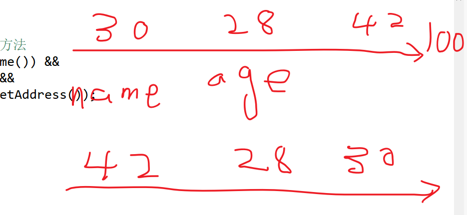

# Java面向对象 :imp:

## 1. 面向对象和面向过程的比较

### 1.1  面向过程

做一碗西红柿鸡蛋面: (自己做)

​		买菜----->洗菜---->切菜----->炒菜------>和面---->擀面----->切面------>煮面----->放调料-----吃

上面的这些步骤我们都要自己去参与。

每一个步骤都要去自己实现。

### 1.2 面向对象

​	吃一碗西红柿鸡蛋面:

​	手机---->app--->点外卖---->取餐--->吃

面怎么做的我们不必要知道我们只要结果就可以了。

手机:  

app:

商家:  做面 对于我没呢来说商家将做饭的这些步骤进行自己的封装。我们不要知道做饭的过程和步骤。

商家就是一个对象。对象就是对过程的一个封装。

面向对象就是对面向过程的一个封装。

面向对象是什么?

​	面向对象是一种思想，不是一种技术。

生活中我们面对的一切都是对象。

java底层封装的很多东西就是c语言的东西。

## 2. 什么是类和对象

在代码中我们怎么来体现面向对象呢?

### 2.1 类

	>  交通工具是一个抽象的概念。包含的东西特别多。交通工具他是一个类。
	>
	>  人类: 抽象的概念。
	>
	>  类: 类是具有相同属性和行为的同一种事务的描述，抽象的概念。
	>
	>  人类的描述。
	>
	>  ​	属性: 肤色  体重 身高  语言 
	>
	>  ​	行为: 跑 跳  走  睡...
	>
	>  在代码中怎么去体现呢?
	>
	>  class 文件叫  类  public  class 类名{
	>
	>  }
	>
	>  在java中类文件使我们编程的最小的单位。类文件的名称  类名是对我们代码的一个属性和行为的总称。
	>
	>  怎么使用代码表现人的属性和行为呢?
	>
	>  ​		属性:  我们使用变量来描述类的属性
	>
	>  ​		行为:  使用方法来体现行为
	>
	>  对象: 对象是类的现实存在的事务的体现。
	>
	>  ​	我们通过new 关键字来对类进行实例化；所谓的实例化就是在堆内存中开辟属于类对象的独有的内存空间
	>
	>  ​	类可以实例化多个对象。每一个对象new的空间的地址值是不一样的。
	>
	>  ​	通过.(的的意思)来进行对象的属性的调用  并且可以对属性进行赋值 或者获取属性的值
	>
	>  ​		调用对象的行为  我们在类中定义的方法。

```java
/**
 *  人的类  class Person 就代表人类的描述的类
 * 
 * */
public class Person {
	//类属性
	//名字
	String  name ;
	//年龄
	int age;
	//身高
	double height;
	//体重
	double weight;
	//类的行为
	public void say() {
		System.out.println(" say hello!");
	}
}
```

```java
public class PersonDemo {

	public static void main(String[] args) {
		//对类的实例化
		//对类类型的对象的创建
		Person zhangsan = new Person();
		//com.xdkj.javase.oop.Person@15db9742
		System.out.println(zhangsan);
		//.意思就是的的意思
		//new 在堆内存开辟空间 属性是变量 有数据类型 保存的是默认值
		System.out.println(zhangsan.name);//null
		System.out.println(zhangsan.age);//0
		System.out.println(zhangsan.height);//0.0
		System.out.println(zhangsan.weight);//0.0
		//对象调用方法
		zhangsan.say();
		//类可以实例化多个对象
		Person  lisi = new Person();
		//com.xdkj.javase.oop.Person@6d06d69c
		System.out.println(lisi);
		
		//属性进行赋值
		lisi.name = "李四";
		lisi.age = 28;
		lisi.height = 175.0;
		lisi.weight = 150.0;
		
		System.out.println(lisi.name);
		System.out.println(lisi.age);
		System.out.println(lisi.height);
		System.out.println(lisi.weight);
		//对象.方法名();
		lisi.say();
	}

}
```

## 3. JAVA的面向对象

### 3.1 封装

> 在java中我们的封装:
>
> 1. 项目的封装  对一个项目的业务功能的封装
>
> 2. 包的封装 相同描述或者类型的代码的封装
>
> 3. 类的封装 把一个类的属性和行为进行封装
>
> 4. 类的属性我们要进行私有化  对外提供公开的访问方式  get set方法
>
>    a. 代码功能的完整性
>
>    b. 减少代码的耦合 (高内聚 低耦合)
>
> 5. 对行为功能的封装  方法

```java
public class Person2 {
	//进行属性的私有化
	private String name;
	private int age;
	private double height;
	
	//提供属性的公开的访问方式
	//获取属性的值
	public String getName() {
		return this.name;
	}
	//设置属性的值
	public void setName(String name) {
		this.name = name;
	}
	public int getAge() {
		return this.age;
	}
	public void setAge(int age) {
		this.age = age;
	}
	
	public double getHeight() {
		return this.height;
	}
	public void setHeight(double height) {
		this.height = height;
	}
	
	public void say() {
		System.out.println("say Hello  World");
	}
}

```

```java
public class Person2Demo {

	public static void main(String[] args) {
		//类的实例化
		Person2 p = new Person2();
			p.setName("李四");
		System.out.println(p.getName());
			p.say();
		
		Person2 person = new Person2();
			person.setName("王五");
			person.setAge(88);
			person.setHeight(180.0);
		System.out.println(person.getName() + " " +person.getAge()+ "  "+ person.getHeight());	
		
		person.say();
	}
}
```

#### 3.1.1 构造器

> 构造器就是我们常见类的实例化对象时候的模板(模具)。
>
> 在Java中每一个类都有一个默认的无参构造器，隐式的构造器。看不见，但是是默认提供的。
>
> 1. 构造器不是方法   没有返回值类型  和修饰符  
> 2. 构造器的名称必须和类名一致 (都是大驼峰命名法)
> 3. 构造器是可以重载的
> 4. 如果使用了带参数的构造器 无参数的构造器必须手动写出来。不然带参数的构造器会覆盖无参数的构造器
> 5. 虽然无参数的构造器是默认的并且是隐式的 ， 但是我们要去在编程中必须手动写出无参数的构造器
> 6. 在使用带参数的构造器的时候，实际传入的参数的数据类型和构造器中属性顺序值必须一致。

```java
package com.xdkj.javase.oop01;

public class Dog {
	private String dogName;
	private int dogAge;
	private String dogColor;
	
	//默认的无参构造器
	/*
	 * public Dog() {
	 * 
	 * }
	 */
	//从超级类继承的构造器
	public Dog() {
	}
	
	//构造器的重载
	public Dog(String dogName) {
		this.dogName = dogName;
	}
	

	public Dog(String dogName, String dogColor) {
		this.dogName = dogName;
		this.dogColor = dogColor;
	}

	public Dog(String dogName, int dogAge, String dogColor) {
		this.dogName = dogName;
		this.dogAge = dogAge;
		this.dogColor = dogColor;
	}


	public String getDogName() {
		return dogName;
	}
	public void setDogName(String dogName) {
		this.dogName = dogName;
	}
	public int getDogAge() {
		return dogAge;
	}
	public void setDogAge(int dogAge) {
		this.dogAge = dogAge;
	}
	public String getDogColor() {
		return dogColor;
	}
	public void setDogColor(String dogColor) {
		this.dogColor = dogColor;
	}
	
}

```

```java
package com.xdkj.javase.oop01;

public class DogDemo {

	public static void main(String[] args) {
		//我们使用的是无参数的构造器实例化对象
		Dog dog = new Dog();
			System.out.println(dog);
			//null
			System.out.println(dog.getDogName());
			
		Dog dog1 = new Dog("阿黄");
		
		System.out.println(dog1.getDogName());//阿黄
		
		Dog dog2 = new Dog("黄色","汤姆");
		System.out.println(dog2);
		System.out.println(dog2.getDogName() + "  "+ dog2.getDogAge()+ " " + dog2.getDogColor());
	}

}

```

**Eclipse自动生成get set方法和 构造器**

> 快捷键: shift + alt + s


#### 3.1.2 this关键字

> this关键字 叫做当前类的实例化对象引用   谁用就代表谁。

```java
		//类类型的变量
		Student stu = new Student();
			System.out.println(stu);
			stu.setStuAge(18);
			stu.setStuName("小明");
		System.out.println(stu.getStuName() + "今年"+ stu.getStuAge()+"岁");
		
		Student stu1 = new Student();
			System.out.println(stu1);
			stu1.setStuAge(16);
			stu1.setStuName("小红");
		System.out.println(stu1.getStuName()
```


#### 3.1.3 JavaBean

> javaBean我们也叫作一个普通的java对象(Plain Old Java Object)。对对象所在的类有这么几个要求:
>
> 1. 必须有私有 的成员变量(成员属性)
> 2. 必须给私有的成员变量提供公开的访问方式  get  set 方法
> 3. 必须有无参数的构造器。带参数的构造器看实际的需要 ，需要的时候在添加。

#### 3.1.4 static关键字

> static  静态  
>
> 静态的东西属于当前的类(在谁里面声明就属于谁)。
>
> ​	可以修饰 属性: 
>
> ​	可以修饰方法:
>
> static修饰的属性或者方法:
>
> 1. 在类被编译的时候就放置到了内存的静态区中  只有一份
> 2. 静态的内容可以直接使用类名进行访问(要求必须使用类名进行访问  )
> 3. 静态的东西属于类 (类的二进制字节码文件对象)
> 4. 静态的属性 代表对象共有的属性 并且 静态的属性在声明的时候要给初始值
> 5. 静态的属性名要求所有字母大写多个单词使用下划线隔开。 


```java
package com.xdkj.javase.oop01;

public class Cat {
	
	private String catName;
	private int catAge;
	private String catColor;
	//静态的成员变量代表所有对象共有的属性
	
	static String  ADDRESS_EARTH = "中国";
	
	public Cat() {
		super();
	}
	public Cat(String catName, int catAge, String catColor) {
		super();
		this.catName = catName;
		this.catAge = catAge;
		this.catColor = catColor;
	}
	public String getCatName() {
		return catName;
	}
	public void setCatName(String catName) {
		this.catName = catName;
	}
	public int getCatAge() {
		return catAge;
	}
	public void setCatAge(int catAge) {
		this.catAge = catAge;
	}
	public String getCatColor() {
		return catColor;
	}
	public void setCatColor(String catColor) {
		this.catColor = catColor;
	}
	
	//声明 了一个静态的成员方法
	public static void eatFish() {
		System.out.println("cat eat fish!");
	}
	//普通的成员方法
	public void miao() {
		System.out.println("Miao  miao");
	}
	
}

```

```java
package com.xdkj.javase.oop01;

import java.util.Calendar;

public class CatDemo {
	public static void main(String[] args) {
		Cat  cat = new Cat();
			cat.setCatName("汤姆");
			cat.setCatAge(100);
			cat.setCatColor("蓝色");
			System.out.println(cat);
			System.out.println(cat.getCatName() + " " + cat.getCatAge() + " " + cat.getCatColor());
			//警告  静态的方法应该使用静态的访问方式
			cat.eatFish();
			cat.miao();
			
			Cat  cat1 = new Cat();
			cat1.setCatName("柯基");
			cat1.setCatAge(20);
			cat1.setCatColor("白色");
			System.out.println(cat1);
			System.out.println(cat1.getCatName() + " " + cat1.getCatAge() + " " + cat1.getCatColor());
			//警告  静态的方法应该使用静态的访问方式
			cat1.eatFish();
			cat1.miao();
			//正确访问静态方法的方式
			Cat.eatFish();
			//class com.xdkj.javase.oop01.Cat
			System.out.println(Cat.class);
			//调用类的静态属性
			System.out.println(Cat.ADDRESS_EARTH);
	}
}

```

#### 3.1.5 final关键字

> final 关键字 是最终的意思
>
> 1. final修饰变量 值不可以被改变  就是常量
> 2. final修饰方法  方法不能被重写
> 3. final修饰类 类不可以被继承

#### 3.1.6 匿名对象

> 没有名字的对象就是匿名对象，new Object() 匿名对象只能使用一次在使用完成以后就从内存中释放掉了

```java
public class Teacher {
	private String teaName;
	private int teaAge;
	
	public Teacher() {
		super();
		// TODO Auto-generated constructor stub
	}
	
	public Teacher(String teaName, int teaAge) {
		super();
		this.teaName = teaName;
		this.teaAge = teaAge;
	}
    ...get set...
}
```


```java'
package com.xdkj.javase.opp02;

public class TeacherDemo {

	public static void main(String[] args) {
		
			Teacher  teacher = new Teacher();
				System.out.println(teacher);
				teacher.setTeaName("马丁路德金");
				teacher.setTeaAge(88);
			System.out.println(teacher.getTeaName() +  "  " +  teacher.getTeaAge());
			//匿名对象  就是没有名字的对象  也就是不用变量去接收他
			//com.xdkj.javase.opp02.Teacher@6d06d69c
			System.out.println(new Teacher());
			//是不是匿名对象的使用?
			//匿名对象只在调用的当前行有效  匿名对象是一次性的
			// 就是
			String str = 	new Teacher("张无忌",888).getTeaName();
			
			int    age =    new Teacher("张无忌",888).getTeaAge();
			System.out.println(str);
			System.out.println(age);
			//对象的生命周期
			//匿名对更多是用在方法的参数
			
			method(teacher);
			method(new Teacher());
			method(new Teacher("张三丰",999));
	}
	//类类型的参数
	public static void method(Teacher teacher) {
		System.out.println(teacher.getTeaName());
	}

}

```

#### 3.1.7 变量的作用域

+ 全局变量

+ 局部变量

+ 成员变量和成员方法

+ 静态成员方法和静态成员属性

  ```java
  package com.xdkj.javase.opp02;
  
  import java.util.Calendar;
  
  /**
   * 变量: 
   * 	a. 全局变量
   * 		声明在类的属性的位置  全局变量可以被类中的所有方法使用
   * 		全局变量的生命周期是什么?
   * 			当声明的全局变量的类不在被引用的时候我们就确定类不在被使用了，但是GC也不会立即回收
   * 				
   * 	b. 局部变量
   * 		局部变量的生命周期就是方法执行完成以后从内存中释放。
   * 	c. 局部变量和全局变量同名的时候  使用就近原则
   * 
   *  d.  .java文件中的静态内容在编译时候就放置到静态区内存中  .class文件中的静态的常量在类被调用或者
   *  	导入的时候放置到静态的内存区中
   * */
  public class VariableDemo {
  	//全局变量
  	static int num = 100;
  	public static void main(String[] args) {
  		int num = 200;
  		System.out.println(num);
  		method();
  		VariableDemo vd = new VariableDemo();
  		System.out.println(vd);
  		//空
  		vd = null;
  		//就近原则
  		System.out.println(num);
  		
  		System.out.println(Calendar.DATE);
  		
  	}
  	public static void method() {
  		System.out.println(num);
  	}
  }
  
  ```

#### 3.1.8 代码块

```java
package com.xdkj.javase.opp02;

/**
 * 代码块: {} 包裹起来的就是代码块 
 * 		全局的代码块: 在类的对象被调用的时候被执行 全局的代码块是最先被执行的
 * 		局部代码块: 就是写在方法内部的代码块 
 * 			其实实际的作用就是代码的隔离。
 * 		静态代码块: static 修饰的代码块。
 * 				静态代码块优先执行  在类被编译的时候就执行了
 * 				static修饰的东西只有一份 静态代码块中只能使用static修饰的内容。
 * 				设计模式:
 * 					单例设计模式 
 */
public class BlockDemo {

	private String name;
	
	int age ;

	public BlockDemo() {
		super();
	}

	public String getName() {
		return name;
	}

	public void setName(String name) {
		this.name = name;
	}

	// 全局代码块
	{
		System.out.println("Hello World");
		age = 100;
		System.out.println(age);
	}
	static {
		//System.out.println("Hello static block" + age);
	}
	public void hello() {
		int num = 999;
		System.out.println("Hello ---------------" );
		//局部代码块
		{
			int m = 888;
			System.out.println(num);
			System.out.println("Hello ++++++++++++++" + age);
		}
		System.out.println("Hello ==================");
	}

}

```

### 3.2 继承

> 继承：
>
> ​	在我们的生活中，见到的汽车，人，动物....都有继续的特性。
>
> ​	遗传的特性。 子承父业。
>
> ​	如果我们当前 的类定义了属性和行为， 动物Animal定义了动物的属性和行为。
>
> ​		属性:  重量   颜色   
>
> ​		行为:  吃 喝  睡 
>
> ​	那么对于动物的子类:  哺乳动物  脊椎动物 卵生动物 无脊椎动物....他们就默认从动物的类去继承这些特性和行为就可以了。
>
> 在java中我们，如果我们在一个类中定义了属性和行为  那么他的子类就直接继承就可以了，不要在自己去定义了。
>
> ​		extends 关键字就是继承的意思:
>
> 1. 子类继承自父类  那么子类就具有类父类的属性和行为
> 2. 子类继承父类 那么子类也可以对自己的属性和行为进行扩增
> 3. java中只能单继承 一个类只能继承一个类。
> 4. Java我们可以实现多层继承  a> b  b > c
> 5. super关键字 

```java
package com.xdkj.javase.oop3extends;

public class Animals {
	
	private String name;
	private double weight;
	private String color;
	.....get set ...
	public void eat() {
		System.out.println("eat foods!");
	}
	public void sleep() {
		System.out.println("sleep letter!");
	}
}

```

```java
package com.xdkj.javase.oop3extends;

public class Dog extends Animals {
	//我们虽然继承了一个类但是我们可以对当前类的属性进行扩增
	private int footer;

	public int getFooter() {
		return footer;
	}

	public void setFooter(int footer) {
		this.footer = footer;
	}
	
	public void lookDoor() {
		System.out.println("看门");
	}
}

```

```java
package com.xdkj.javase.oop3extends;

public class Fish  extends Animals{
	private String fin;//鳍

	public String getFin() {
		return fin;
	}

	public void setFin(String fin) {
		this.fin = fin;
	}
	
	public void swimming() {
		System.out.println("fish can swimming");
	}
}

```

```java
package com.xdkj.javase.oop3extends;

public class Keji  extends Dog{
	
}

```

```java
package com.xdkj.javase.oop3extends;

public class AnimalsDemo {
	public static void main(String[] args) {
		Animals animals = new Animals();
		System.out.println(animals);
			animals.setName("小狗");
			animals.setWeight(15.00);
			animals.setColor("黄色");
		System.out.println(animals.getName() +" "+ animals.getWeight() + " "+ animals.getColor());	
			animals.eat();
			animals.sleep();
		Dog  dog = new Dog();
		
		System.out.println(dog);
			dog.setName("旺财");
			dog.setWeight(35.00);
			dog.setColor("黑白色");
		System.out.println(dog.getName() + "--"+ dog.getWeight() + "---"+ dog.getColor());
			dog.eat();
			dog.sleep();
			
			dog.setFooter(4);
			dog.lookDoor();
			
			Fish  fish = new Fish();
				fish.setName("金龙鱼");
				fish.setWeight(3.0);
				fish.setColor("红加金色");
				fish.setFin("三个");
				fish.eat();
				fish.sleep();
				fish.swimming();
		System.out.println(fish.getName() + "--"+ fish.getWeight()+"--"+fish.getColor()+"--"+fish.getFin());		
				
	}
}

```

####  3.2.1 **Super关键字:**

> super: 代表父类的引用
>
> super 关键字必须在构造器的第一行
>
> super是隐式的。默认就是在构造的一行样  隐藏的  手动写出会覆盖默认的
>
> super()代表父类的无参数的构造器调用


```java
package com.xdkj.javase.oop04;

public class Person {
	
	private String name;
	private int age;
	private double height;
	private String address;
	
	
	  public Person() {
		  //Object()
		  super();
	  }
	 
	public Person(String name, int age, double height, String address) {
		super();
		this.name = name;
		this.age = age;
		this.height = height;
		this.address = address;
	}
	public String getName() {
		return name;
	}
	public void setName(String name) {
		this.name = name;
	}
	public int getAge() {
		return age;
	}
	public void setAge(int age) {
		this.age = age;
	}
	public double getHeight() {
		return height;
	}
	public void setHeight(double height) {
		this.height = height;
	}
	public String getAddress() {
		return address;
	}
	public void setAddress(String address) {
		this.address = address;
	}
	
	public void eat() {
		System.out.println("eat foods!!!");
	}
	
}

```

```java
package com.xdkj.javase.oop04;

public class PersonDemo {
	public static void main(String[] args) {
		//可以使用父类的无参数的构造器
		System.out.println(new Person());
		//使用父类带参数的构造器
		Person person = new Person("张三",25,150.0,"陕西省西安市");
			System.out.println(person);
			System.out.println(person.getName() + " " + person.getAge() + " " + person.getAddress() );
			person.eat();
			
		//子类的无参数的构造器	
		Man man = new Man();
			man.setName("李四");
			man.setAge(24);
			man.setHeight(120.0);
			man.setAddress("宝鸡市");
		System.out.println(man);
		System.out.println(man.getName() + " "+ man.getAge() + " "+ man.getAddress());
			man.eat();	
			
			Man m = new Man("赵六",88,150.0,"咸阳市");
				System.out.println(m);
				System.out.println(m.getName() + "  " + m.getAge() + " " + m.getHeight() + " "+ m.getAddress());
				
			Man m1 = new Man("小六子",18,120.0,"咸阳市");
				System.out.println(m1);
				System.out.println(m1.getName() + "  " + m1.getAge() + " " + m1.getHeight() + " "+ m1.getAddress());
				
	}
}

```

#### 3.2.3 方法的重写

> 方法的重写: 
>
> 1. 必须要有继承关系
> 2. 子类对父类的方法进行重写  方法的声明一样  但是方法的实现不一样

**方法的重载和方法的重写的区别(overload  @Override):**

1. 方法的重载必须是在同一个类中 方法名称相同 参数列表不同(类型，个数,顺序) 与返回值无关
2. 方法的重写 必须有继承关系  子类对对类的方法进行重写  重写的方法声明一致 方法的实现不同。

#####  3.2.1.1**Super关键字和this的区别**

> 1. this代表当前类的实例化对象  谁用就代表谁
>
> 2. super代表父类的引用  
>
>    a. 在没有继承关系的无参数的构造器的第一行  super()代表  Object超类的无参数的构造器
>
>    b. 在继承关系的无参数或者带参数的构造器的第一行 super()代表父类的无参数的构造器 
>
>    c. super永远都在第一行  一般super是隐式的，可以手动写出。

#### 3.2.3 Object

> 类 `Object` 是类层次结构的根类。每个类都使用 `Object`  作为超类。所有对象（包括数组）都实现这个类的方法。
>
> Object只有一个无参数的构造器 ，默认被所有的类继承。

+ toString()  输出对象本质就是在使用对象调用toString() 

  + getClass().getName() + '@' + Integer.toHexString(hashCode())

  + Object中建议所有子类重写toString()方法是为了方便查看对象的属性值。

```java
@Override
	public String toString() {
		return "Person [name=" + name + ", age=" + age + ", height=" + height + ", address=" + address + "]";
	}
```

#### 3.2.4 equals和 == 的区别

1. equals 比较的对象必须是同一种类 类型的对象
2. 类的equals方法必须进行重写 比较对象之间的属性值是否相等
3. Object 类中的equals的本质是==比较对象的堆内存的地址值
4. instanceof 关键字    obj  instanceOf  类类型  判断obj是否是 类类型的实例化对象或者类类型的子类的实例化对象
5. 当此方法被重写时，通常有必要重写 hashCode 方法，以维护 hashCode 方法的常规协定，该协定声明相等对象必须具有相等的哈希码
6.  hashCode 方法的常规协定: 如果根据 equals(Object) 方法，两个对象是相等的，那么对这两个对象中的每个对象调用 hashCode 方法都必须生成相同的整数结果。




```java
@Override
	public boolean equals(Object  obj) {
		// 传入的是Student  方法原生的参数类型是Object
		// 先去判断类型是否一致 再比较
        if (this == obj)
			return true;
		if (obj == null)
			return false;
		if(! (obj instanceof Student) ) {
			return false;
		}
		//类型相同在比较其他的
		Student  stu =(Student) obj;
		//这里的equals是被String类重写过的equals方法
		return this.getName().equals(stu.getName()) && 
				this.getAge() == stu.getAge() &&
				this.getAddress().equals(stu.getAddress());
	}
	
	
	@Override
	public int hashCode() {
		//String 类中重写了hashCode方法
		//按道理来说这样写是没有问题的
		return this.name.hashCode()*12+188 + this.age + this.address.hashCode()*31+99;
	}
```

**自动生成equals和hashcode方法:**

```java
@Override
	public int hashCode() {
		final int prime = 31;
		int result = 1;
		result = prime * result + ((address == null) ? 0 : address.hashCode());
		result = prime * result + age;
		result = prime * result + ((name == null) ? 0 : name.hashCode());
		return result;
	}

	@Override
	public boolean equals(Object obj) {
		if (this == obj)
			return true;
		if (obj == null)
			return false;
		if (getClass() != obj.getClass())
			return false;
		Student other = (Student) obj;
		if (address == null) {
			if (other.address != null)
				return false;
		} else if (!address.equals(other.address))
			return false;
		if (age != other.age)
			return false;
		if (name == null) {
			if (other.name != null)
				return false;
		} else if (!name.equals(other.name))
			return false;
		return true;
	}
```

### 3.3 访问修饰符

> 在一个源码文件中只能有一个public class 类

```java
public class Student extends Person {
	
}
class Person{
	
}

class Teacher {
	
}
```


### 3.4 多态

> 多态: 同一种事务在不同形态的状态:
>
> 水 :  固态  冰
>
> ​		液态  水
>
> ​		气态  水蒸气
>
> java中如何描述多态呢?
>
> ​	父类的引用指向子类的实例化对象。
>
> 多态的使用:
>
> 1. 必须有继承关系
> 2. 父类引用指向子类的实例化对象
> 3. 必须有方法的重写

```java
package com.xdkj.javase.oop05;

public class Animals {
	private String name;
	private int age;
	private String color;
	//静态的成员属性
	static int COUNT = 1000;
	
	public Animals() {
		super();
		// TODO Auto-generated constructor stub
	}
	
	public Animals(String name, int age, String color) {
		super();
		this.name = name;
		this.age = age;
		this.color = color;
	}

	public String getName() {
		return name;
	}
	public void setName(String name) {
		this.name = name;
	}
	public int getAge() {
		return age;
	}
	public void setAge(int age) {
		this.age = age;
	}
	public String getColor() {
		return color;
	}
	public void setColor(String color) {
		this.color = color;
	}

	@Override
	public String toString() {
		return "Animals [name=" + name + ", age=" + age + ", color=" + color + "]";
	}
	
}

```

```java
package com.xdkj.javase.oop05;

public class Cat extends Animals {
	
	private String eyes;

	public String getEyes() {
		return eyes;
	}

	public void setEyes(String eyes) {
		this.eyes = eyes;
	}
	
}

```

```java
package com.xdkj.javase.oop05;

public class Dog extends Animals {

}

```

```java
package com.xdkj.javase.oop05;

public class AnimalsDemo {

	public static void main(String[] args) {
		Cat cat = new Cat();
			cat.setName("小黑");
			cat.setEyes("黑色");
			//不建议这样用
			System.out.println(cat.COUNT);
		System.out.println(cat);
		//多态
		//向上转型  
		//向下转型
			//Object obj = new Animals();
			
			Animals animals = new Cat();
				animals.setName("杰瑞");
				animals.setAge(88);
			
			System.out.println(animals);
			
			Animals dog = new Dog();
				dog.setName("小黄");
				dog.setAge(88);
				dog.setColor("黄色");
				//多态调用父类的静态属性
				System.out.println(dog.COUNT);
				System.out.println(Animals.COUNT);			
				System.out.println(dog);
				
				
		/**
		 * 	java是要先编译在运行 多态存在
		 * 		编译看右边  运行看左边
		 * 	多态使用的时候是右边的属性和方法 
		 * 		也就是子类的对象只能使用父类的属性和行为
		 * 那如果要使用自己的属性和行为就不能使用多态了
		 * 
		 * 	接口
		 * 	
		 * 
		 * 
		 * */
		
	}

}

```

**多态的使用:**

```java
package com.xdkj.javase.oop06;

public class Animals {
	private String name;
	private int age;
	private String color;
	
	public Animals() {
		super();
	}
	public Animals(String name, int age, String color) {
		super();
		this.name = name;
		this.age = age;
		this.color = color;
	}
	public String getName() {
		return name;
	}
	public void setName(String name) {
		this.name = name;
	}
	public int getAge() {
		return age;
	}
	public void setAge(int age) {
		this.age = age;
	}
	public String getColor() {
		return color;
	}
	public void setColor(String color) {
		this.color = color;
	}

	@Override
	public String toString() {
		return "Ani	mals [name=" + name + ", age=" + age + ", color=" + color + "]";
	}

	
	public void eat() {
		System.out.println("eat foods");
	}

}

```

```java
package com.xdkj.javase.oop06;

public class Cat  extends Animals{

	@Override
	public String toString() {
		return "Cat [哈哈哈哈哈哈哈啊哈]";
	}

	@Override
	public void eat() {
		System.out.println("eat mouse!!!!");
	}
	
	
	public void sleep() {
		System.out.println("白天睡觉");
	}
	
}

```

```java
package com.xdkj.javase.oop06;

public class Dog extends Animals {

	@Override
	public void eat() {
		System.out.println("eat gone!!!!!");
	}
	
}

```

```java
package com.xdkj.javase.oop06;

public class AnimalsDemo {
		public static void main(String[] args) {
			Animals  animals = new Animals();
				System.out.println(animals);
			Dog dog = new Dog();
				System.out.println(dog);
			Cat cat = new Cat();
				System.out.println(cat);
				cat.sleep();
			/*在java 中 必须要有继承关系
			 * 编译时期的错误了
			 * 父类的引用指向子类的实例化对象
			 * 继承关系中我们一般类要对父类的方法进行重写，以便自己实现自己的功能
			 * (****)如果我们重写了父类的方法我们发现  在实际调用的时候，多态调用的是子类重写以后的方法
			 * 只能调用重写父类以后的方法。
			 * 
			 * 	主要是为了实现代码的之间的解耦 
			 * 	提高代码的使用效率
			 * 
			 * */
			Animals cat1 = new Cat();
				cat1.setName("小猫");
				cat1.setAge(18);
				cat1.setColor("黑色");
			System.out.println(cat1);
				cat1.eat();
				//cat1.sleep();
				
				
			Animals  dog1 = new Dog();
				dog1.setName("小黄");
				dog1.setColor("土黄色");
				dog1.setAge(18);
				dog1.eat();
				
			//类型的强制转换
			//ClassCatException 类转换异常
				if(!(dog1 instanceof Cat)) {
					System.out.println("dog 不是  Cat");
				}else {
					Cat  cat2 = (Cat)dog1;	
					System.out.println(cat2);
				}
			System.out.println("--------多态的使用-----------");
			Person person = new Person();
				person.feed(cat1);
				person.feed(dog1);
		}
}

```

### 3.5 抽象类和抽象方法

```java
package com.xdkj.javase.oop06;


/**1. abstract 抽象 
 * 2. 抽象的方法就是只有方法的声明  没有方法体(方法的实现)
 * 3. 有抽象方法的类必须是抽象类
 * 4. 抽象类中不一定有抽象方法 也可以有普通的方法
 * 5. 抽象类中的抽象方法在子类中必须进行重写 普通也可以进行重写
 * 6. 抽象类不能实例化对象
 * 7. 抽象类有构造器 并且是为了子类实例化对象来使用的，自己不能实例化对象
 * 8. 抽象类有属性可以是变量 也可以是常量 
 * 9. 抽象类可以有静态的 成员属性和行为  通过类名调用(通过静态的访问方式访问)
 * */
public abstract class Car {
	//私有的成员属性 变量
	private int age;
	//成员属性 常量
	final int  count = 2000;
	//静态常量
	static final String FACTORY = "华晨";
	
	
	public Car() {
		super();
	}
	
	
	public Car(int age) {
		super();
		this.age = age;
	}


	public int getAge() {
		return age;
	}
	public void setAge(int age) {
		this.age = age;
	}
	public abstract void run() ;
	
	public void eat() {}
	
}

```

```java
package com.xdkj.javase.oop06;

public class Bwm extends Car {

	
	public Bwm() {
		super();
	}
	
	public Bwm(int age) {
		super(age);
	}
	
	@Override
	public void run() {
			System.out.println("宝马车行驶!!!");
	}
	@Override
	public void eat() {
		System.out.println("bwm eat oil!!!");
	}
}

```

### 3.6 接口

> 接口是一个很特殊的存在:
>
> 1. 接口不是一个类  interface 修饰
> 2. 接口只能被类实现  implements 关机字  实现接口的类称之为接口的实现类
> 3. 一个类实现一个接口  必须重写接口中的抽象方法
> 4. 接口中只能有抽象方法 抽象方法默认就是abstract 修饰的
> 5. 接口中只使用抽象方法声明功能 
> 6. Java中一个类可以实现多个接口 必须对实现的所有的接口的方法进行重写
> 7. 接口就是一个对功能的扩增 谁想对自己的业务功能进行扩增谁就实现这个接口
> 8. 一个类可以继承一个类的也同时也可以实现多个接口
> 9. 接口可以继承接口，并且可以继承多个接口  接口不能继承类
> 10. 接口中的变量只能是静态常量  默认被static  final 修饰

```java
public interface Play {
	 void  palyGame();
	 public void eat() ;
}
```

```java
package com.xdkj.javase.oop06;

public interface Swimming {
	void swimming();
}

```

```java
package com.xdkj.javase.oop06;

public class PlayImpl implements Play,Swimming {

	@Override
	public void palyGame() {
			System.out.println("play LOL");
	}
	
	@Override
	public void eat() {
		System.out.println("Eat foods");
	}

	@Override
	public void swimming() {
		System.out.println("swimming 100 km /h");
	}
}

```

```java
package com.xdkj.javase.oop06;

public class DogPlay implements Play {

	@Override
	public void palyGame() {
		System.out.println("dog play goone!!!!");
	}

	@Override
	public void eat() {
			System.out.println("dog eat goone!!!");
	}
	
	public void lookDoor() {
		System.out.println("dog look door!!!");
	}

}

```

```java
package com.xdkj.javase.oop06;

public class PlayDemo {
	public static void main(String[] args) {
		//错误的接口没有构造器  不能初始化
		//Play play = new Play();
		PlayImpl playimpl = new PlayImpl();
		playimpl.eat();
		playimpl.palyGame();
		
		
		DogPlay dogplay = new DogPlay();
			dogplay.eat();
			dogplay.palyGame();
			dogplay.lookDoor();
			/** 多态: 
			 * 1. 必须有继承关系/接口的实现关系
			 * 2. 继承父类/实现接口 必须对父类/接口的方法进行重写
			 * 3. 多态调用的时候调用的是子类/接口实现类中重写后的方法
			 * 4. 接口多态在调用的时候只能调用接口实现类重写当前接口的方法
			 * 
			 * */
			Play  play = new PlayImpl();
				play.eat();
				play.palyGame();
			Swimming  sm = new PlayImpl();
				sm.swimming();	
	}
}

```

**接口可以继承接口**

```java
public interface Join extends Play,Swimming {
    // 静态常量
	public static final int age = 10;
	void say();
}
```

```java
class  JoinImpl implements Join{

	@Override
	public void palyGame() {
		System.out.println("玩游戏");
	}

	@Override
	public void eat() {
		System.out.println("吃蛋挞");
	}

	@Override
	public void swimming() {
		System.out.println("泡温泉");
	}

	@Override
	public void say() {
		System.out.println("say very good!!!");
	}
}
```

```java
public class JoinDemo {
	public static void main(String[] args) {
		Join join = new JoinImpl();
		join.eat();
		join.say();
		join.swimming();
		join.palyGame();
		// System.out.println(join.age);
		System.out.println(Join.age);
		
		/* Join.age= 200; System.out.println(Join.age); */
		 
	}
}
```

## 3.7 内部类

+ 全局内部类
+ 局部内部类
+ 静态内部类
+ 匿名内部类(lambda表达式)

#### 3.4.1 全局内部类

```java
package com.xdkj.javase.oop07;

/**
 * 内部类: 定义在一个类内部的类称之为内部类
 * 	1. 成员内部类 写在成员属性位置的内部类
 * 		public protected default private static final
 * 	2. 局部内部类
 * 	3. 匿名内部类
 * 
 * */
public class Outer {
	private  String name ;
	int count = 20;
	
	//内部类
	class Inner{
		private int age;

		public int getAge() {
			return age;
		}

		public void setAge(int age) {
			this.age = age;
		}
	}
	
	public String getName() {
		return name;
	}
	public void setName(String name) {
		this.name = name;
	}
	
	
	
}

```

#### 3.7.2 局部内部类

```java
package com.xdkj.javase.oop07;

public class Outer4 {
	int   num = 100;
	
	
	public void method() {
		System.out.println(num);
		//局部内部类  几乎不用
		class Inner5{
			public void hello() {
				num = 200;
				System.out.println("Hello World "+ num);
			}
		}
		new Inner5().hello();
	}
	
	public static void main(String[] args) {
		Outer4 outer4 = new Outer4();
		outer4.method();
	}
}

```

#### 3.7.3 静态内部类

```java
package com.xdkj.javase.oop07;

public class Outer2 {
	//静态内部类
	static class Inner2{
		public void hello() {
			System.out.println("Hello World");
		}
	}
	
	public static void main(String[] args) {
		//静态内部类的访问方式
		Outer2.Inner2  inner2 = new Outer2.Inner2();
		System.out.println(inner2);
		inner2.hello();
	}
}

```

#### 3.7.4  final修饰的内部类

```java
package com.xdkj.javase.oop07;

public class Outer3 {
	//final 修饰内部类
	final class Inner3{
		public void hello() {
			System.out.println("Hello Inner3");
		}
	}
	//final修饰的内部类不能被继承
	/* 
	 * class Inner4 extends Inner3{
	 * 
	 * }
	 */
	
	public static void main(String[] args) {
		Outer3.Inner3  inner3 =  new Outer3().new  Inner3();
	}
}

```

#### 3.7.5 内部类访问外部的类的成员

**静态内部类访问外部类的成员:**

```java
package com.xdkj.javase.oop07;
/**
 * 静态内部类只能访问外部类的静态成员属性和静态的成员方法
 * 静态的东西属于类 不属于类的对象
 * 
 * */
public class Outer6 {
	static int age = 100;
	static class Inner7{
		int count = 200;
		public void method() {
			//谁在调用age
			System.out.println("Inner7 "+ Outer6.age);
			System.out.println("Inner7 "+ age);
			//谁在调用hello
			hello();
		}
		
		public int count() {
			return count;
		}
	}
	
	public static  void hello() {
		System.out.println(Outer6.class);
		System.out.println("Hello Outer5");
		System.out.println(new Inner7().count());
	}
	
	public static void main(String[] args) {
		//静态内部类实例化对象
		Outer6.Inner7  inner7 = new Outer6.Inner7();
		inner7.method();
	}
}

```

**全局内部类访问外部类的成员:**

```java
package com.xdkj.javase.oop07;

/**
 * 成员内部类可以访问外部类的成员属性
 * 
 * */
public class Outer5 {
	int count = 100;
	public class Inner6{
		public void method() {
			//外部类的对象
			Outer5.this.count = 400;
			System.out.println(count);
			//方法只有被调用才能被执行 
			//Outer5.this.hello();
			hello();
		}
	}
	
	public void hello() {
		System.out.println("Hello Outer5");
	}
	public static void main(String[] args) {
		Outer5.Inner6  inner6 = new Outer5().new Inner6();
		inner6.method();
	}
}

```

#### 3.7.6 匿名内部类

> 匿名内部类: 没有名字的内部类 
>
>  1.  接口中只有一个方法我们在使用的时候还要去构建接口的是实现类
>
>  2.  实现接口对接口的方法进行重写
>
>  3.  构建接口的实现类对象在多态调用接口重写以后的方法
>
>  4.  很麻烦  所以提出了匿名内部类来解决这个问题
>
>  5.  ```java
>      new 接口(){
>          接口中的方法进行重写;
>      }.接口方法();
>      接口类型  变量 = new 接口(){
>          接口中的方法进行重写;
>      };
>      变量.接口方法();
>      ```
>
>  6.  new的是内部类，内部类又实现了接口，并重写了接口的方法
>
>  7.  末尾的分号不能省略
>
>  8.  匿名内部类让接口作为参数在使用和调用的时候更简便和快速。

```java
public interface Play {
	void playGame();
}
```

```java
public class PlayImpl implements Play {

	@Override
	public void playGame() {
		System.out.println("Hello World");
	}

}
```

```java
package com.xdkj.javase.oop08;

/**
 * 使用接口的时候 先去写实现类重写接口的方法 在使用多态进行接口的调用 调用的是接口实现类重写接口方法后的方法实现。
 * 
 * 接口中只有一个方法， 我们只想在程序中使用一次。 匿名内部类: 没有名字的内部类 最终的目的就是为了实现对接口的方法进行重写和调用
 */
public class PlayDemo {

	public static void main(String[] args) {

		Play play = new PlayImpl();
		play.playGame();

		PlayDemo.Inner9 inner9 = new PlayDemo().new Inner9();
		inner9.playGame();

		// 匿名内部类
		/*
		 * Play paly = new Play() { public void playGame() {
		 * System.out.println("Paly 王者农药"); } }; paly.playGame();
		 */
		Play play1 = new Play() {
			@Override
			public void playGame() {
				System.out.println("play  Cs");
			}
		};
		play1.playGame();
	}

	/**
	 * 我们实现这个接口的目的就是为了重写接口的方法
	 */

	class Inner9 implements Play {
		@Override
		public void playGame() {
			System.out.println("play lol");
		}
	}

}

```

**匿名内部类的使用:**

```java
public interface Song {
	void songEnglish();
}
```

```java
public class People {
	public void song(Song  song) {
		song.songEnglish();
	}
}
```

```java
package com.xdkj.javase.oop08;

import java.util.Comparator;
import java.util.TreeSet;

public class PeopleDemo {
	public static void main(String[] args) {
		People people = new People();
		//传入接口的实现类
		/*
		 * people.song(new Song() {
		 * 
		 * @Override public void songEnglish() { System.out.println("唱的是嘻哈英文歌曲!"); } });
		 */
		Song song = new Song() {

			@Override
			public void songEnglish() {
				 System.out.println("唱的是嘻哈英文歌曲!");
			}
		};
		
		people.song(song);
		people.song(song);
		people.song(song);
		//TreeSet构造器 匿名内部类的使用
		new TreeSet(new Comparator<String>() {
			@Override
			public int compare(String o1, String o2) {
				return o1.compareTo(o2);
			}
		});
		
		Runnable  rable = new Runnable() {
			@Override
			public void run() {
				System.out.println("Hello ------");
			}
		};
		//lambda表达式  函数是编程
		Runnable  runnable = ()->{
			System.out.println("run method");
		};
		runnable.run();
		
	}
}

```

#### 3.7.7 匿名内部类分析

> 1. 匿名内部类没有构造器 但是可以实例化对象。
> 2. 匿名内部类不能定义静态的属性
> 3. 匿名内部类可以定义常量
> 4. 匿名内部类可以扩增方法  但是调用的时候 直接调用会失去接口重写方法  多态调用就会失去扩增方法
> 5. 所以一般在匿名内部类中不要去扩增方法 不然就失去了匿名内部类原生的作用了
> 6. 匿名内部类不能定义静态的成员方法
> 7. 外部类的方法中的局部匿名内部类可以访问外部类的成员属性和方法··

```java
package com.xdkj.javase.oop08;

public class InnerAnalyze {
	
	public static void main(String[] args) {
		//匿名内部类
		
		new Play() {
			int age = 88;
			//static int PRICE = 100;
			final int cou = 9999;
			@Override
			public void playGame() {
				System.out.println("play LOL!!!  "+ age + "  "+ cou);
			}
			/*
			 * public void say() { System.out.println("Say inner clsss"); } public static
			 * void hh() {}
			 */
			
		}.playGame();;;
		
		/*
		 * Play pl = new Play() { int age = 88; //static int PRICE = 100; final int cou
		 * = 9999;
		 * 
		 * @Override public void playGame() { System.out.println("play LOL!!!  "+ age +
		 * "  "+ cou); } public void say() { System.out.println("Say inner clsss"); }
		 * 
		 * }; pl.playGame();
		 */
		//pl.say();
		
	}
}

```

```java
package com.xdkj.javase.oop08;

public class InnerAnalyze2 {
	public void say(Play play) {
		play.playGame();
	}
	
	public static void main(String[] args) {
		int age = 100;
		 final String CITY = "西安市";
		 
		InnerAnalyze2  innerAnalyze2 = new InnerAnalyze2();
		
		innerAnalyze2.say(new Play() {
			@Override
			public void playGame() {
				System.out.println(age + "---"+ CITY);
				method();
			}
		});
	}
	
	public static void method() {
		System.out.println("method");
	}
}

```

```java
package com.xdkj.javase.oop08;

public class InnerAnalyze3 {
	int age = 99;
	static String CITY= "西安市";
	final int count = 999;
	
	public void say() {
		new Play() {
			public void playGame() {
				System.out.println(age + CITY + "---" + count);
				hello();
			};
			
		}.playGame();
	}
	
	public void hello() {
		System.out.println("Hello");
	}
	public static void main(String[] args) {
		new InnerAnalyze3().say();
	}
}

```

