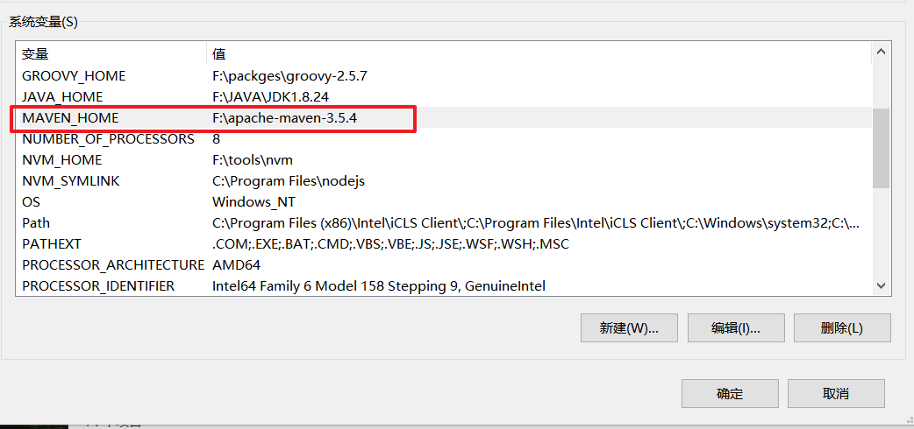

# Maven

> Apache Maven is a software project management and comprehension tool. Based on the concept of a project object model (POM), Maven can manage a project's build, reporting and documentation from a central piece of information.

## 1. Maven使用简介

+ 解决项目jar包的使用问题
+ 项目分模块开发
+ 项目合并
+ 代码仓库提交
+ 仓库管理

Maven的主要目标是使开发人员能够在最短的时间内理解开发工作的完整状态。为了实现此目标，Maven处理了几个令人关注的领域：

- 简化构建过程
- 提供统一的构建系统
- 提供优质的项目信息
- 鼓励更好的开发实践

### 1.1 下载maven


**不要使用最新版本**


### 1.2 配置环境变量




## 2.Maven的初体验

MavenDemo

+ src
  + main
    + java
    + resources

​	|test

​	|pom.xml


**pom.xml**

```xml
<project xmlns="http://maven.apache.org/POM/4.0.0" xmlns:xsi="http://www.w3.org/2001/XMLSchema-instance"
  xsi:schemaLocation="http://maven.apache.org/POM/4.0.0 https://maven.apache.org/xsd/maven-4.0.0.xsd">
  <modelVersion>4.0.0</modelVersion>
	
  <groupId>com.xdkj</groupId>
  <artifactId>Maven-Demo</artifactId>
  <version>1.0</version>
</project>
```

### 3. Maven的生命周期

+ compile 编译
+ test  测试
+ packge  打包
+ deploy 部署
+ run 运行
+ install 所有命令的集合


## 3. 仓库地址变更


