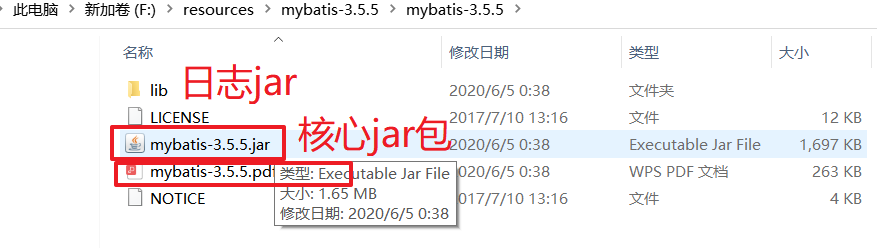
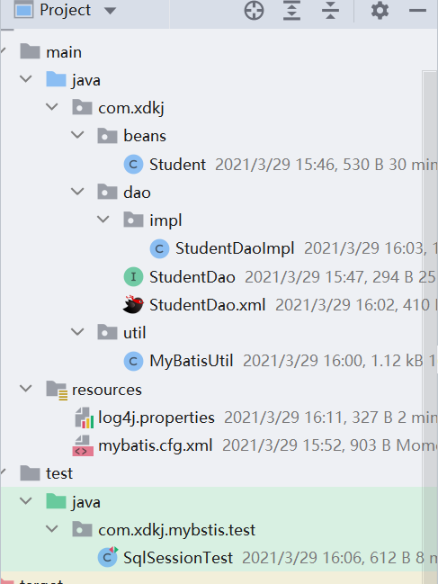
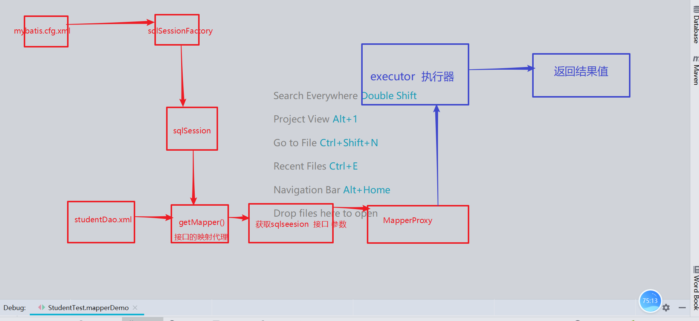
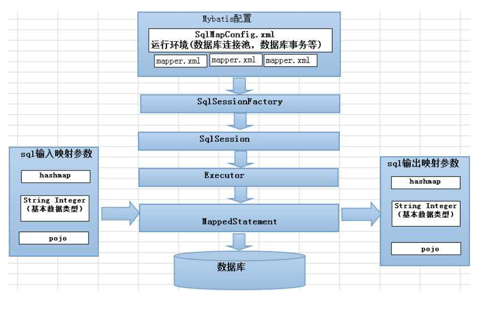
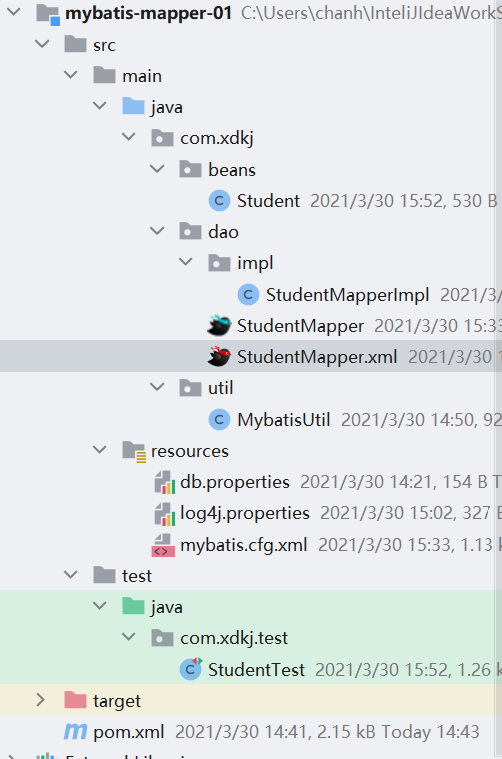
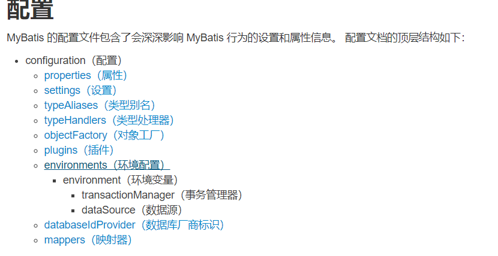
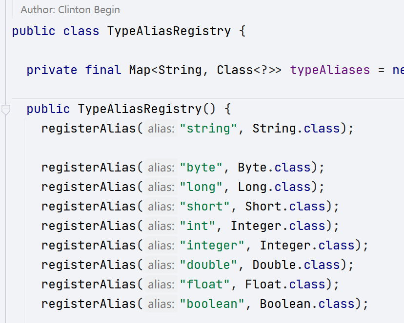

# Mybatis

## 1.Mybatis简介

> MyBatis 是一款优秀的持久层框架，它支持自定义 SQL、存储过程以及高级映射。MyBatis 免除了几乎所有的 JDBC 代码以及设置参数和获取结果集的工作。MyBatis 可以通过简单的 XML 或注解来配置和映射原始类型、接口和 Java POJO（Plain Old Java Objects，普通老式 Java 对象）为数据库中的记录。
>
> Mybatis是一款持久层的ORM(Object relation mapping 对象关系映射)框架, 对数据做CRUD操作就是使用java的pojo做CRUD操作。
>
> 对象就是使用java的pojo封装数据库的table ,关系 只要对pojo做CRUD操作就去改变数据库的表，映射  pojo---表 pojo的属性对应表的字段。
>
> ORM: Mybatis 是一款半自动的ORM框架  sql语句自己写
>
> ​	 Hibernate 是一款全自动的ORM框架  不用自己写sql语句

## 1.1 Mybatis下载和使用



### 1.1.2 Mybatis-helloWold



**mybatis.cfg.xml**

```xml
<?xml version="1.0" encoding="UTF-8" ?>
<!DOCTYPE configuration
        PUBLIC "-//mybatis.org//DTD Config 3.0//EN"
        "http://mybatis.org/dtd/mybatis-3-config.dtd">
<configuration>
    <!--数据源环境-->
    <environments default="development">
        <environment id="development">
            <transactionManager type="JDBC"/>
            <dataSource type="POOLED">
                <property name="driver" value="com.mysql.jdbc.Driver"/>
                <property name="url" value="jdbc:mysql://localhost:3306/hehe"/>
                <property name="username" value="root"/>
                <property name="password" value="root"/>
            </dataSource>
        </environment>
    </environments>
    <!--接口 的 映射文件  -->
    <mappers>
        <!--资源加载-->
        <mapper resource="com/xdkj/dao/StudentDao.xml"/>
    </mappers>
</configuration>
```

**pom.xml**

```xml
<?xml version="1.0" encoding="UTF-8"?>
<project xmlns="http://maven.apache.org/POM/4.0.0"
         xmlns:xsi="http://www.w3.org/2001/XMLSchema-instance"
         xsi:schemaLocation="http://maven.apache.org/POM/4.0.0 http://maven.apache.org/xsd/maven-4.0.0.xsd">
    <modelVersion>4.0.0</modelVersion>

    <groupId>com.xdkj</groupId>
    <artifactId>mybatis-01</artifactId>
    <version>1.0-SNAPSHOT</version>

    <properties>
        <maven.compiler.source>8</maven.compiler.source>
        <maven.compiler.target>8</maven.compiler.target>
    </properties>
    <dependencies>
        <dependency>
            <groupId>junit</groupId>
            <artifactId>junit</artifactId>
            <version>4.12</version>
            <scope>test</scope>
        </dependency>
        <dependency>
            <groupId>mysql</groupId>
            <artifactId>mysql-connector-java</artifactId>
            <version>5.1.49</version>
        </dependency>
        <!--导入mybatis核心jar-->
        <dependency>
            <groupId>org.mybatis</groupId>
            <artifactId>mybatis</artifactId>
            <version>3.5.5</version>
        </dependency>
        <dependency>
            <groupId>org.projectlombok</groupId>
            <artifactId>lombok</artifactId>
            <version>1.18.10</version>
        </dependency>
        <!--加入日志jar-->
        <dependency>
            <groupId>org.slf4j</groupId>
            <artifactId>slf4j-api</artifactId>
            <version>1.7.27</version>
        </dependency>
        <dependency>
            <groupId>log4j</groupId>
            <artifactId>log4j</artifactId>
            <version>1.2.17</version>
        </dependency>
        <dependency>
            <groupId>org.slf4j</groupId>
            <artifactId>slf4j-log4j12</artifactId>
            <version>1.7.27</version>
        </dependency>
    </dependencies>
    <!--配置maven 的资源加载路径-->
        <build>
            <resources>
                <resource>
                    <directory>src/main/java</directory>
                    <includes>
                        <include>**/*.xml</include>
                    </includes>
                </resource>
            </resources>
        </build>
</project>
```

**Student.java**

```java
package com.xdkj.beans;

import lombok.*;

/**
 * ClassName Student
 * Description:
 *
 * @Author:一尘
 * @Version:1.0
 * @Date:2021-03-29-15:45
 */
@Data
@AllArgsConstructor
@NoArgsConstructor
@RequiredArgsConstructor
public class Student {
    private int id;
    @NonNull
    private String name;
    @NonNull
    private String sex;
    @NonNull
    private int age;
    @NonNull
    private String birth;
    @NonNull
    private String department;
    @NonNull
    private String address;
}

```

**StudentDao.java**

```java
package com.xdkj.dao;

import com.xdkj.beans.Student;

import java.util.List;

public interface StudentDao {
    List<Student> queryALl();
    Student  queryById(int id);
    int addStudent(Student student);
    int updateStudent(Student student);
    int deleteStudent(int id);
}

```

**StudentDao.xml**

```xml
<?xml version="1.0" encoding="UTF-8" ?>
<!DOCTYPE mapper
  PUBLIC "-//mybatis.org//DTD Mapper 3.0//EN"
  "http://mybatis.org/dtd/mybatis-3-mapper.dtd">
  <!--命名空间-->
<mapper namespace="studentDao">
<!--查询语句 resultType是查询出一行的结果封装的类型-->
    <select id="selectAll" resultType="com.xdkj.beans.Student">
            select * from student
    </select>
    <!--参数类型-->
    <select id="queryById" parameterType="int" resultType="com.xdkj.beans.Student">
    <!--mybais中从上下文中获取参数值的方式-->
        select * from student where id = #{id}
    </select>
    <!--添加 传入的参数是对象  #{获取对象的属性值} 返回值类型是基本数据类型  默认接受 不需要指定resultType-->
    <insert id="addStudent" parameterType="com.xdkj.beans.Student">
    insert into student values(null,#{name},#{sex},#{birth},#{department},#{address},#{age});
</insert>
<!--修改-->
    <update id="updateStudent" parameterType="com.xdkj.beans.Student">
        update student set name = #{name},age = #{age},sex = #{sex} where id = #{id}
    </update>
    <delete id="deleteStudent" parameterType="int">
        delete from student where id = #{id}
    </delete>
</mapper>
```

**StudentDaoImpl.java**

```java
package com.xdkj.dao.impl;

import com.xdkj.beans.Student;
import com.xdkj.dao.StudentDao;
import com.xdkj.util.MyBatisUtil;
import org.apache.ibatis.session.SqlSession;

import java.util.List;

/**
 * ClassName StudentDaoImpl
 * Description:
 *
 * @Author:一尘
 * @Version:1.0
 * @Date:2021-03-29-15:48
 */
public class StudentDaoImpl  implements StudentDao {
    //获取Mybatis的核心工具类
private SqlSession  session = MyBatisUtil.getSqlSession();
    @Override
    public List<Student> queryALl() {
        //去找哪一个命名空间中的sql语句来执行
        List<Student> list = session.selectList("studentDao.selectAll", Student.class);
        return list;
    }

    @Override
    public Student queryById(int id) {
        return session.selectOne("studentDao.queryById",id);
    }

    @Override
    public int addStudent(Student student) {
        int result = session.insert("studentDao.addStudent", student);
        //事务提交
        session.commit();
        return result;
    }

    @Override
    public int updateStudent(Student student) {
        int result = session.update("studentDao.updateStudent",student);
        session.commit();
        return result;
    }

    @Override
    public int deleteStudent(int id) {
        int result = session.delete("studentDao.deleteStudent",id);
        session.commit();
        return result;
    }
}

```

**MybstisUtil.java**

```java
package com.xdkj.util;

import org.apache.ibatis.io.Resources;
import org.apache.ibatis.session.SqlSession;
import org.apache.ibatis.session.SqlSessionFactory;
import org.apache.ibatis.session.SqlSessionFactoryBuilder;

import java.io.IOException;
import java.io.InputStream;

/**
 * ClassName MyBatisUtil
 * Description:
 *
 * @Author:一尘
 * @Version:1.0
 * @Date:2021-03-29-15:53
 */
public class MyBatisUtil {
    //SqlSession工厂
    private static SqlSessionFactory  sqlSessionFactory;
    //加载配置文件 获取数据源和映射文件
    //单例的模式
    static{
        //SqlSessionFactoryBuilder 工厂构建器
        //加载配置文件获取输入流
        try {
            InputStream  in = Resources.getResourceAsStream("mybatis.cfg.xml");
            sqlSessionFactory = new SqlSessionFactoryBuilder().build(in);
        } catch (IOException e) {
            e.printStackTrace();
        }

    }
    //返回Mybatis的核心工具对象
    public  static  SqlSession  getSqlSession(){
        return  sqlSessionFactory.openSession();
    }
}

```

**SqlSessionTest.java**

```java
package com.xdkj.mybstis.test;

import com.xdkj.beans.Student;
import com.xdkj.dao.StudentDao;
import com.xdkj.dao.impl.StudentDaoImpl;
import org.junit.Test;

import java.util.List;

/**
 * ClassName SqlSessionTest
 * Description:
 *
 * @Author:一尘
 * @Version:1.0
 * @Date:2021-03-29-16:05
 */
public class SqlSessionTest {
    private StudentDao studentDao = new StudentDaoImpl();
    @Test
    public void queryAll(){
        List<Student> students = studentDao.queryALl();
        for (Student student : students) {
            System.out.println(student);

        }
    }

    @Test
    public  void queryById(){
        System.out.println(studentDao.queryById(906));
    }

    @Test
    public  void addStudent(){
      Student stu =   new Student("李四","男",55,"2001","交通部","上海市");
        int i = studentDao.addStudent(stu);
        System.out.println(i);
    }

    @Test
    public  void updateStudent(){
        Student stu =   new Student(92912,"王五","女",44,"2001","交通部","上海市");
        int i = studentDao.updateStudent(stu);
        System.out.println(i);
    }

    @Test
    public  void deleteStudent(){
        int i = studentDao.deleteStudent(92913);
        System.out.println(i);
    }
}

```

**log4j.properties**

```properties
# 全局日志配置
log4j.rootLogger=DEBUG, stdout
# MyBatis 日志配置
log4j.logger.org.mybatis.example.BlogMapper=TRACE
# 控制台输出
log4j.appender.stdout=org.apache.log4j.ConsoleAppender
log4j.appender.stdout.layout=org.apache.log4j.PatternLayout
log4j.appender.stdout.layout.ConversionPattern=%5p [%t] - %m%n
```


## 2. MybatisMapper代理

### 2.1 使用mapper的几个规则

1. 映射文件的命名空间必须是 接口的全限定性名称
2. mapper映射文件中 sql语句的id值必须是接口中方法的方法名
3. 在核心配置文件中使用package映射接口的映射文件所在位置








**Student.java**

```java
package com.xdkj.beans;

import lombok.*;

/**
 * ClassName Student
 * Description:
 *
 * @Author:一尘
 * @Version:1.0
 * @Date:2021-03-30-14:14
 */
@Data
@AllArgsConstructor
@NoArgsConstructor
@RequiredArgsConstructor
public class Student {
    private int id;
    @NonNull
    private String name;
    @NonNull
    private String sex;
    @NonNull
    private int age;
    @NonNull
    private String address;
    @NonNull
    private String department;
    @NonNull
    private String birth;
}

```

**StudentMapper.java**

```java
package com.xdkj.dao;

import com.xdkj.beans.Student;

import java.util.List;

public interface StudentMapper {
    List<Student> selectAll();
    Student selectById(int id);
    List<Student> selectLikeName(String name);
    int addStudent(Student student);
    int updateStudent(Student student);
    int deleteStudent(Student student);
}
`
```

**StudentMapperImpl.java**

```java
package com.xdkj.dao.impl;

import com.xdkj.beans.Student;
import com.xdkj.dao.StudentMapper;
import com.xdkj.util.MybatisUtil;
import org.apache.ibatis.session.SqlSession;

import java.util.List;

/**
 * ClassName StudentMapperImpl
 * Description:
 *
 * @Author:一尘
 * @Version:1.0
 * @Date:2021-03-30-15:45
 */
public class StudentMapperImpl  implements StudentMapper {
    private SqlSession  session = MybatisUtil.getSqlSession();
    //通用的mapper方法
    public  StudentMapper  getStudentMapper(){
        return session.getMapper(StudentMapper.class);
    }
    @Override
    public List<Student> selectAll() {
        return getStudentMapper().selectAll();
    }

    @Override
    public Student selectById(int id) {
        return getStudentMapper().selectById(id);
    }

    @Override
    public List<Student> selectLikeName(String name) {
        return getStudentMapper().selectLikeName(name);
    }

    @Override
    public int addStudent(Student student) {
       int result = getStudentMapper().addStudent(student);
       session.commit();
        return result;
    }

    @Override
    public int updateStudent(Student student) {
        return getStudentMapper().updateStudent(student);
    }

    @Override
    public int deleteStudent(Student student) {
        return getStudentMapper().deleteStudent(student);
    }
}

```

**Mybatis.cfg.xml**

```xml
<?xml version="1.0" encoding="UTF-8" ?>
<!DOCTYPE configuration
        PUBLIC "-//mybatis.org//DTD Config 3.0//EN"
        "http://mybatis.org/dtd/mybatis-3-config.dtd">
<configuration>
    <!--引入外部的资源-->
    <properties resource="db.properties"></properties>
    <!--配置别名-->
    <typeAliases>
        <typeAlias type="com.xdkj.beans.Student" alias="Student"></typeAlias>
    </typeAliases>
    <environments default="development">
        <environment id="development">
            <transactionManager type="JDBC"/>
            <dataSource type="POOLED">
                <property name="driver" value="${jdbc.Driver}"/>
                <property name="url" value="${jdbc.Url}"/>
                <property name="username" value="${jdbc.UserName}"/>
                <property name="password" value="${jdbc.Password}"/>
            </dataSource>
        </environment>
    </environments>
    <mappers>
      <!--  <mapper resource="com/xdkj/dao/StudentMapper.xml"/>-->
        <!--包中的所有的映射文件-->
        <package name="com.xdkj.dao"/>
    </mappers>
</configuration>
```

**StudentMapper.xml**

```xml
<?xml version="1.0" encoding="UTF-8" ?>
<!DOCTYPE mapper
  PUBLIC "-//mybatis.org//DTD Mapper 3.0//EN"
  "http://mybatis.org/dtd/mybatis-3-mapper.dtd">
<mapper namespace="com.xdkj.dao.StudentMapper">
  <select id="selectAll" resultType="Student">
    select * from student
  </select>

  <select id="selectById" resultType="Student" >
  select * from student where id = #{id}
</select>
<select id="selectLikeName" resultType="com.xdkj.beans.Student"> </select>
<insert id="addStudent" parameterType="Student">
    insert into student values(null,#{name},#{sex},#{age},#{address},#{department},#{birth})
</insert>
</mapper>
```

## 3. Mybatis的核心配置文件讲解



> 在mybatis的核心配置文件中 标签的书写顺序是严格的。

### 3.1 properties

> 引入外部的数据源资源

### 3.2 settings

### 3.3 类型别名



### 3.4 plugins 

分页插件 : pagehelper

## 4. Mybatis的映射文件配置

### 4.1 resultType 

> sql语句执行的结果的类型,如果是基本数据类型可以不用写  如果是集合或者查出的是一个对象 只需要写成 集合中对象/单个对象的类的全限定性名称就可以

```xml
<select id="selectById" parameterType="string"  resultType="Student" >
  select * from student where id = #{id}
</select>
```

### 4.2 parameterType

> 参数的类型  如果是基本数据类型可以不写  引用数据类型使用类的全限定性名称（自定义类）

### 4.3 resultMap :imp:

> 如果数据库中的字段和实体类的属性名不一致那么mybatis就不能自动做rowmapper数据封装。需要字段的映射

```xml
<?xml version="1.0" encoding="UTF-8" ?>
<!DOCTYPE mapper
  PUBLIC "-//mybatis.org//DTD Mapper 3.0//EN"
  "http://mybatis.org/dtd/mybatis-3-mapper.dtd">
<mapper namespace="com.xdkj.dao.StudentMapper">
    <!--结果集合的映射  type实体类的全新定性名称或者别名-->
    <resultMap id="basicMapper" type="Student">
    <!--主键映射-->
        <id property="id" column="id" ></id>
        <result column="stuname" property="name"/>
        <result column="stusex" property="sex"/>
        <result column="stubirth" property="birth"/>
    </resultMap>

<select id="selectAll" resultMap="basicMapper">
    select * from student
  </select>
  <!--<select id="selectAll" resultType="Student">
    select * from student
  </select>-->

  <select id="selectById" parameterType="string"  resultType="Student" >
  select * from student where id = #{id}
</select>
<select id="selectLikeName" resultType="com.xdkj.beans.Student"> </select>
<insert id="addStudent" parameterType="Student">
    insert into student values(null,#{name},#{sex},#{age},#{address},#{department},#{birth})
</insert>
</mapper>
```

### 4.4 \$和#的区别

> \#是获取值进行填充,在模糊查询中我们使用 \$进行值的获取和字符串的拼接。

```xml
<!--模糊查询-->
<select id="selectLikeName" resultMap="basicMapper">
    select * from student where stuname like '%${name}%'
 </select>
```

```xml
<!--模糊查询-->
<select id="selectLikeName" resultMap="basicMapper">
    <!--select * from student where stuname like '%${name}%'-->
    select * from student where stuname like concat('%',#{name},'%')
 </select>
```

## 5. 表的关联映射

```xml
<?xml version="1.0" encoding="UTF-8" ?>
<!DOCTYPE configuration
        PUBLIC "-//mybatis.org//DTD Config 3.0//EN"
        "http://mybatis.org/dtd/mybatis-3-config.dtd">
<configuration>
    <!--外部的数据源文件-->
    <properties resource="db.properties"></properties>
    <!--设置-->
    <settings>
        <!--不写日志也可以自动适配-->
        <setting name="logImpl" value="log4j"/>
    </settings>
    <!--别名-->
    <typeAliases>
       <!-- <typeAlias type="com.xdkj.Student" alias="Student"/>-->
        <!--默认使用类名作为别名-->
        <package name="com.xdkj.beans"/>
    </typeAliases>
    
    <environments default="development">
        <environment id="development">
            <transactionManager type="JDBC"/>
            <dataSource type="POOLED">
                <property name="driver" value="${jdbc.Driver}"/>
                <property name="url" value="${jdbc.Url}"/>
                <property name="username" value="${jdbc.UserName}"/>
                <property name="password" value="${jdbc.Password}"/>
            </dataSource>
        </environment>
    </environments>
    <mappers>
        <package name="com.xdkj.beans.dao"/>
    </mappers>
</configuration>
```

### 5.1 一对一

**Husband.java**

```java
package com.xdkj.beans.entity;

import lombok.*;

import java.io.Serializable;

/**
 * (Husband)实体类
 *
 * @author makejava
 * @since 2021-03-31 14:52:29
 */
@Data
@AllArgsConstructor
@NoArgsConstructor
@RequiredArgsConstructor
public class Husband implements Serializable {
    private static final long serialVersionUID = -73479789192220417L;

    private Integer hid;
    @NonNull
    private String hname;
    @NonNull
    private Integer hage;
    @NonNull
    private Integer wid;
    @NonNull
    private  Wife wife;
}

```

**Wife.java**

```java
package com.xdkj.beans.entity;

import java.io.Serializable;

/**
 * (Wife)实体类
 *
 * @author makejava
 * @since 2021-03-31 14:52:30
 */
public class Wife implements Serializable {
    private static final long serialVersionUID = -12424177485150880L;

    private Integer wid;

    private String wname;

    private Integer wage;


    public Integer getWid() {
        return wid;
    }

    public void setWid(Integer wid) {
        this.wid = wid;
    }

    public String getWname() {
        return wname;
    }

    public void setWname(String wname) {
        this.wname = wname;
    }

    public Integer getWage() {
        return wage;
    }

    public void setWage(Integer wage) {
        this.wage = wage;
    }

    @Override
    public String toString() {
        return "Wife{" +
                "wid=" + wid +
                ", wname='" + wname + '\'' +
                ", wage=" + wage +
                '}';
    }
}

```

**HusbandDao.java**

```java
package com.xdkj.beans.dao;

import com.xdkj.beans.entity.Husband;

import java.util.List;

/**
 * (Husband)表数据库访问层
 *
 * @author makejava
 * @since 2021-03-31 14:52:29
 */
public interface HusbandDao {
    List<Husband> selectAll();
}


```

**HusbandDaoImpl.java**

```java
package com.xdkj.beans.dao.impl;

import com.xdkj.beans.dao.HusbandDao;
import com.xdkj.beans.entity.Husband;
import com.xdkj.beans.util.MybatisUtil;
import org.apache.ibatis.session.SqlSession;

import java.util.List;

/**
 * ClassName HusbandDaoImpl
 * Description:
 *
 * @Author:一尘
 * @Version:1.0
 * @Date:2021-03-31-15:03
 */
public class HusbandDaoImpl  implements HusbandDao {
    private SqlSession  session = MybatisUtil.getSession();

        private HusbandDao getHusbandDao(){
            return  session.getMapper(HusbandDao.class);
        }
    @Override
    public List<Husband> selectAll() {
        return getHusbandDao().selectAll();
    }
}

```

**HusbandDao.xml**

```xml
<?xml version="1.0" encoding="UTF-8"?>
<!DOCTYPE mapper PUBLIC "-//mybatis.org//DTD Mapper 3.0//EN" "http://mybatis.org/dtd/mybatis-3-mapper.dtd">
<mapper namespace="com.xdkj.beans.dao.HusbandDao">

    <!--<resultMap type="Husband" id="HusbandMap">
       <id column="hid" property="hid"></id>
        <result property="hname" column="hname" jdbcType="VARCHAR"/>
        <result property="hage" column="hage" jdbcType="INTEGER"/>
        <result property="wid" column="wid" jdbcType="INTEGER"/>
        &lt;!&ndash;一对一是在resultmap中进行配置&ndash;&gt;
        <association property="wife" column="wid" javaType="Wife">
            &lt;!&ndash;这里面也是表的列和实体类的属性关联映射&ndash;&gt;
            <id property="wid" column="wid"></id>
            <result column="wname" property="wname"></result>
            <result column="wage" property="wage"></result>
         </association>
    </resultMap>-->
    <!--引用其他表的resultMap-->
    <resultMap type="Husband" id="HusbandMap">
       <id column="hid" property="hid"></id>
        <result property="hname" column="hname" jdbcType="VARCHAR"/>
        <result property="hage" column="hage" jdbcType="INTEGER"/>
        <result property="wid" column="wid" jdbcType="INTEGER"/>
        <!--一对一是在resultmap中进行配置-->
        <association property="wife" column="wid" javaType="Wife" resultMap="com.xdkj.beans.dao.WifeDao.WifeMap"></association>
    </resultMap>

    <select id="selectAll" resultMap="HusbandMap">
        select
            husband.hid,husband.hname,husband.hage,wife.wid,wife.wname,wife.wage
        from
            husband join wife
        on
            husband.wid = wife.wid
    </select>


</mapper>


```

**WifeDao.xml**

```xml
<?xml version="1.0" encoding="UTF-8"?>
<!DOCTYPE mapper PUBLIC "-//mybatis.org//DTD Mapper 3.0//EN" "http://mybatis.org/dtd/mybatis-3-mapper.dtd">
<mapper namespace="com.xdkj.beans.dao.WifeDao">
    <!--wife 的实体类和表的字段映射关系-->
    <resultMap type="com.xdkj.beans.entity.Wife" id="WifeMap">
        <id property="wid" column="wid"></id>
        <result property="wname" column="wname" jdbcType="VARCHAR"/>
        <result property="wage" column="wage" jdbcType="INTEGER"/>
    </resultMap>
</mapper>
```

**HusbandTest.java**

```java
package com.xdkj.test;

import com.xdkj.beans.dao.HusbandDao;
import com.xdkj.beans.dao.impl.HusbandDaoImpl;
import com.xdkj.beans.entity.Husband;
import org.junit.Test;

import java.util.List;

/**
 * ClassName HusbandTest
 * Description:
 *
 * @Author:一尘
 * @Version:1.0
 * @Date:2021-03-31-15:05
 */
public class HusbandTest {
    private HusbandDao  husbandDao = new HusbandDaoImpl();

    @Test
    public  void selectAll(){
        List<Husband> husbands = husbandDao.selectAll();
        for (Husband husband : husbands) {
            System.out.println(husband);

        }
    }
}

```

### 5.2 一对多

**Department.java**

```java
package com.xdkj.beans.entity;

import lombok.AllArgsConstructor;
import lombok.Data;
import lombok.NoArgsConstructor;

import java.util.ArrayList;
import java.util.List;

@Data
@AllArgsConstructor
@NoArgsConstructor
public class Department {
    private Integer deptid;

    private String deptname;

    private String deptdesc;
    //获取多的一方的数据
    private List<Employee> employees = new ArrayList<>();
}
```

**Employee.java**

```java
package com.xdkj.beans.entity;

import lombok.AllArgsConstructor;
import lombok.Data;
import lombok.NoArgsConstructor;

@Data
@AllArgsConstructor
@NoArgsConstructor
public class Employee {
    private Integer empid;

    private String empname;

    private Integer empage;

}
```

**DepartmentMapper.java**

```java
package com.xdkj.beans.dao;

import com.xdkj.beans.entity.Department;

import java.util.List;

public interface DepartmentMapper {
    List<Department> selectAll();
}
```

**DepartmentMapperImpl.java**

```java
package com.xdkj.beans.dao.impl;

import com.xdkj.beans.dao.DepartmentMapper;
import com.xdkj.beans.entity.Department;
import com.xdkj.beans.util.MybatisUtil;
import org.apache.ibatis.session.SqlSession;

import java.util.List;

/**
 * ClassName DepartmentMapperImpl
 * Description:
 *
 * @Author:一尘
 * @Version:1.0
 * @Date:2021-03-31-15:56
 */
public class DepartmentMapperImpl  implements DepartmentMapper {

    private SqlSession session = MybatisUtil.getSession();

    private DepartmentMapper getDepartmentMapper(){
        return  session.getMapper(DepartmentMapper.class);
    }
    @Override
    public List<Department> selectAll() {
        return getDepartmentMapper().selectAll();
    }
}

```


**DepartmentMapper.xml**

```xml
<?xml version="1.0" encoding="UTF-8"?>
<!DOCTYPE mapper PUBLIC "-//mybatis.org//DTD Mapper 3.0//EN" "http://mybatis.org/dtd/mybatis-3-mapper.dtd">
<mapper namespace="com.xdkj.beans.dao.DepartmentMapper">
  <resultMap id="BaseResultMap" type="Department">
    <!--@mbg.generated-->
    <!--@Table department-->
    <id column="deptid" jdbcType="INTEGER" property="deptid" />
    <result column="deptname" jdbcType="VARCHAR" property="deptname" />
    <result column="deptdesc" jdbcType="VARCHAR" property="deptdesc" />
    <!--对应多的一方的数据-->
    <collection property="employees"   javaType="Employee">
     <id column="empid" property="empid"></id>
     <result property="empname" column="empname"/>
     <result property="empage" column="empage"/>
    </collection>
  </resultMap>
  <select id="selectAll" resultMap="BaseResultMap">
        select
            dept.deptid,dept.deptname,dept.deptdesc,emp.empid,emp.empname,emp.empage
            from  department as dept join employee as  emp
            on
             dept.deptid = emp.deptid
  </select>

</mapper>
```

```properties
Department(deptid=1, deptname=教育部, deptdesc=教育学生的, employees=[Employee(empid=1, empname=张三, empage=25), Employee(empid=3, empname=王五, empage=30)])
Department(deptid=2, deptname=交通部, deptdesc=交通管理, employees=[Employee(empid=2, empname=李四, empage=24), Employee(empid=4, empname=赵六, empage=40)])
```

### 5.3 多对多(太复杂)


## 6. Mybatis反向生成器

[http://mybatis.org/generator/](http://mybatis.org/generator/)

**generatorconfig.xml**

```xml
<?xml version="1.0" encoding="UTF-8"?>
<!DOCTYPE generatorConfiguration
        PUBLIC "-//mybatis.org//DTD MyBatis Generator Configuration 1.0//EN"
        "http://mybatis.org/dtd/mybatis-generator-config_1_0.dtd">

<generatorConfiguration>
    <!--上下文环境-->
    <!--数据源信息-->
    <context id="DB2Tables" targetRuntime="MyBatis3Simple">
        <jdbcConnection driverClass="com.mysql.jdbc.Driver"
                        connectionURL="jdbc:mysql://localhost:3306/hehe?useSSL=true"
                        userId="root"
                        password="root">
        </jdbcConnection>
        <!--高精度数据转换-->
        <javaTypeResolver >
            <property name="forceBigDecimals" value="false" />
        </javaTypeResolver>
        <!--model 实体类生成-->
        <javaModelGenerator targetPackage="com.xdkj.beans" targetProject="src/main/java">
            <property name="enableSubPackages" value="true" />
            <property name="trimStrings" value="true" />
        </javaModelGenerator>
        <!--映射文件保存的位置-->
        <sqlMapGenerator targetPackage="com.xdkj.mapper"  targetProject="src/main/java">
            <property name="enableSubPackages" value="true" />
        </sqlMapGenerator>
        <!--接口 -->
        <javaClientGenerator type="XMLMAPPER" targetPackage="com.xdkj.mapper"  targetProject="src/main/java">
            <property name="enableSubPackages" value="true" />
        </javaClientGenerator>
        <!--表关联-->
        <table schema="hehe" tableName="student" domainObjectName="Student" >
            <property name="useActualColumnNames" value="true"/>
            <!--主键-->
            <generatedKey column="id" sqlStatement="mysql" identity="true" />
        </table>

    </context>
</generatorConfiguration>
```

**MbgDemo.java**

```java
package com.xdkj.mbg;

import org.mybatis.generator.api.MyBatisGenerator;
import org.mybatis.generator.config.Configuration;
import org.mybatis.generator.config.xml.ConfigurationParser;
import org.mybatis.generator.exception.InvalidConfigurationException;
import org.mybatis.generator.exception.XMLParserException;
import org.mybatis.generator.internal.DefaultShellCallback;

import java.io.File;
import java.io.IOException;
import java.sql.SQLException;
import java.util.ArrayList;
import java.util.List;

/**
 * ClassName MbgDemo
 * Description:
 *
 * @Author:一尘
 * @Version:1.0
 * @Date:2021-03-31-17:19
 */
public class MbgDemo {
    public static void main(String[] args)  {
        try {
            List<String> warnings = new ArrayList<String>();
            boolean overwrite = true;
            File configFile = new File("C:\\Users\\chanh\\InteliJIdeaWorkSpace\\xdkj\\mybatis-MBG\\src\\main\\resources\\genaratorConfig.xml");
            ConfigurationParser cp = new ConfigurationParser(warnings);
            Configuration config = cp.parseConfiguration(configFile);
            DefaultShellCallback callback = new DefaultShellCallback(overwrite);
            MyBatisGenerator myBatisGenerator = new MyBatisGenerator(config, callback, warnings);
            myBatisGenerator.generate(null);
        } catch (IOException e) {
            e.printStackTrace();
        } catch (XMLParserException e) {
            e.printStackTrace();
        } catch (InvalidConfigurationException e) {
            e.printStackTrace();
        } catch (SQLException throwables) {
            throwables.printStackTrace();
        } catch (InterruptedException e) {
            e.printStackTrace();
        }
    }
}

```

