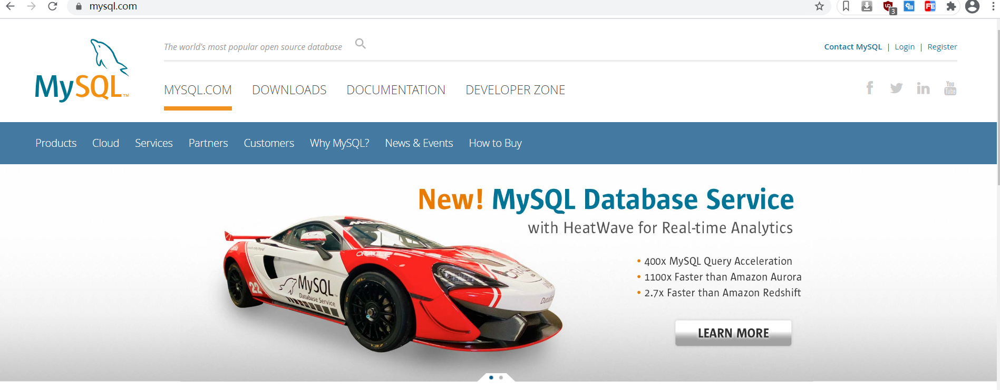
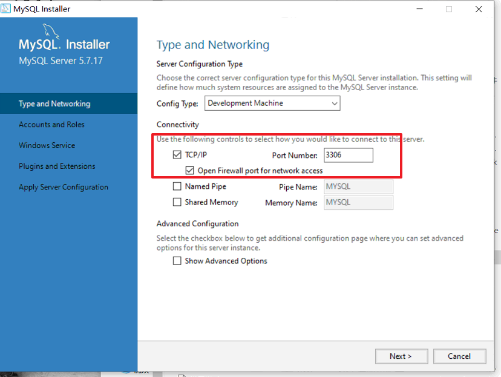
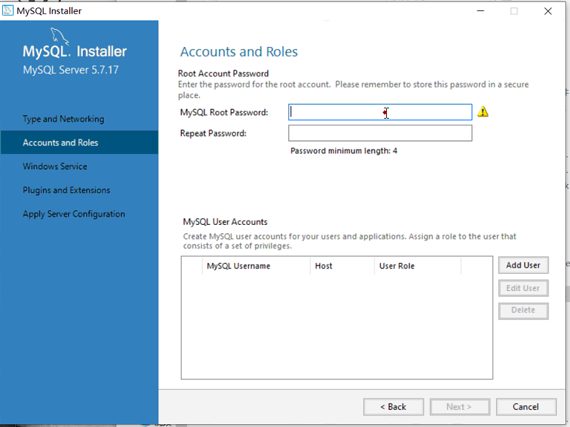
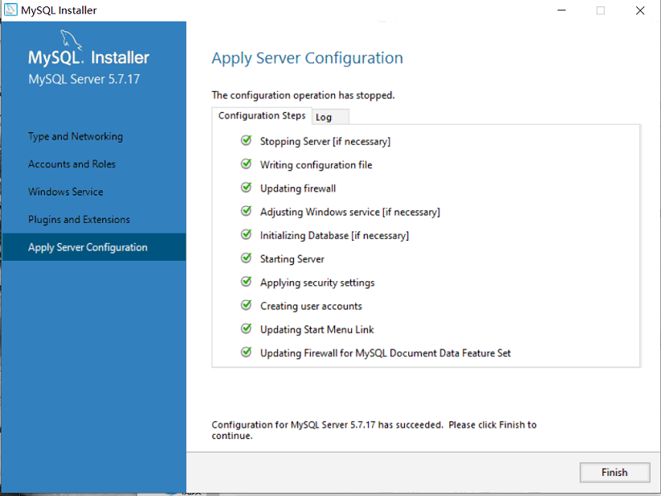

# Mysql基础

## 1. 数据库

> 数据库是“按照数据结构来组织、存储和管理数据的仓库”。是一个长期存储在[计算机](https://baike.baidu.com/item/计算机/140338)内的、有组织的、可共享的、统一管理的大量数据的集合
>
> 数据长久存储的集合。
>
> 在数据库的发展历史上，数据库先后经历了层次数据库、网状数据库和关系数据库等各个阶段的发展，数据库技术在各个方面的快速的发展

## 2. 数据库的分类

### 2.1 关系型数据库

+ Oracle  全球最大的商业使用的收费数据库厂商。
+ MySql  是免费的数据库  已经被oracle收购了
+ mariadb  永久免费的mysql替代品
+ 阿里巴巴mysql 
+ h2 内存数据库  jar
+ sqlServer 微软的数据库 

### 2.2 非关系型数据库(NoSql数据库)

+ redis
+ mogodb
+ HBase

## 3.Mysql的简介

> MySQL是一个**[关系型数据库管理系统](https://baike.baidu.com/item/关系型数据库管理系统/696511)****，**由瑞典MySQL AB 公司开发，属于 [Oracle](https://baike.baidu.com/item/Oracle) 旗下产品。MySQL 是最流行的[关系型数据库管理系统](https://baike.baidu.com/item/关系型数据库管理系统/696511)之一，在 WEB 应用方面，MySQL是最好的 [RDBMS](https://baike.baidu.com/item/RDBMS/1048260) (Relational Database Management System，关系数据库管理系统) 应用软件之一。
>
> MySQL是一种关系型数据库管理系统，关系数据库将数据保存在不同的表中，而不是将所有数据放在一个大仓库内，这样就增加了速度并提高了灵活性。
>
> MySQL所使用的 SQL 语言是用于访问[数据库](https://baike.baidu.com/item/数据库/103728)的最常用标准化语言。MySQL 软件采用了双授权政策，分为社区版和商业版，由于其体积小、速度快、总体拥有成本低，尤其是[开放源码](https://baike.baidu.com/item/开放源码/7176422)这一特点，一般中小型网站的开发都选择 MySQL 作为网站数据库。

### 3.1 Mysql的下载




### 3.2 Mysql的安装










### 3.3 Mysql的卸载

传统的控制面板卸载可以卸载软件不会清除注册表，不会卸载MYSQL57服务

使用一些专用的卸载工具去卸载可以清除注册表再次安装的时候就没有问题。

## 4. Mysql的初体验

### 4.1 连接到Mysql数据库

+ mysql -uroot -hlocalhost -p  在输入数据库的密码
+ exit退出mysql命令客户端


```sql
 mysql -uroot -p
Enter password: ****
```

### 4.2  查看Mysql 默认的数据库

> show databases;

```sql
mysql> show databases;     
+--------------------+     
| Database           |     
+--------------------+     
| information_schema |     
| atcrowdfunding     |     
| atcrowdfunding01   |     
| cloud              |     
| clouddb01          |     
| clouddb02          |     
| clouddb03          |     
| liuyishou          |     
| manager            |     
| mybookshop         |     
| mysql              |     
| performance_schema |     
| project            |     
| sys                |     
| xdcrm              |     
| xdkjexam           |     
+--------------------+     
16 rows in set (0.01 sec)  
```


> 可以袭击配置Data和编码等

### 4.3 选择使用数据库和查看数据库中的表

```sql
mysql> use mysql;
Database changed
mysql> show tables;
+---------------------------+
| Tables_in_mysql           |
+---------------------------+
| columns_priv              |
| db                        |
| engine_cost               |
| event                     |
| func                      |
| general_log               |
| gtid_executed             |
| help_category             |
| help_keyword              |
| help_relation             |
| help_topic                |
| innodb_index_stats        |
| innodb_table_stats        |
| ndb_binlog_index          |
| plugin                    |
| proc                      |
| procs_priv                |
| proxies_priv              |
| server_cost               |
| servers                   |
| slave_master_info         |
| slave_relay_log_info      |
| slave_worker_info         |
| slow_log                  |
| tables_priv               |
| time_zone                 |
| time_zone_leap_second     |
| time_zone_name            |
| time_zone_transition      |
| time_zone_transition_type |
| user                      |
+---------------------------+
31 rows in set (0.00 sec)
```

### 4.4 数据库的创建

```sql
mysql> create database haha;
Query OK, 1 row affected (0.00 sec)

mysql> show databases;
+--------------------+
| Database           |
+--------------------+
| information_schema |
| atcrowdfunding     |
| atcrowdfunding01   |
| cloud              |
| clouddb01          |
| clouddb02          |
| clouddb03          |
| haha               |
| liuyishou          |
| manager            |
| mybookshop         |
| mysql              |
| performance_schema |
| project            |
| sys                |
| xdcrm              |
| xdkjexam           |
+--------------------+
17 rows in set (0.00 sec)
```

### 4.5 表的创建和表的查看

```sql
mysql> create table student(
    -> name varchar(20),
    -> age int(11)
    -> );
Query OK, 0 rows affected (0.02 sec) 
                          
mysql> show tables;       
+----------------+        
| Tables_in_haha |        
+----------------+        
| student        |        
+----------------+        
1 row in set (0.00 sec)   
```

### 4.6 查看表的物理结构

```sql
mysql> desc student;
+-------+-------------+------+-----+---------+-------+
| Field | Type        | Null | Key | Default | Extra |
+-------+-------------+------+-----+---------+-------+
| name  | varchar(20) | YES  |     | NULL    |       |
| age   | int(11)     | YES  |     | NULL    |       |
+-------+-------------+------+-----+---------+-------+
2 rows in set (0.01 sec)
```

### 4.7 查看表的创建时的语句

```sql
mysql> show create table student;
+---------+-------------------------------------------------------------------------------------------------------------------------------+
| Table   | Create Table                                                                                                                  |
+---------+-------------------------------------------------------------------------------------------------------------------------------+
| student | CREATE TABLE `student` (
  `name` varchar(20) DEFAULT NULL,
  `age` int(11) DEFAULT NULL
) ENGINE=InnoDB DEFAULT CHARSET=utf8 |
+---------+-------------------------------------------------------------------------------------------------------------------------------+
1 row in set (0.00 sec)
```

### 4.8 查看表的数据

```sql
mysql> select * from student;
Empty set (0.00 sec)
```

### 4.9 表中插入数据

```sql
mysql> insert into student values("admin",18),("joke",88);
Query OK, 2 rows affected (0.00 sec)
Records: 2  Duplicates: 0  Warnings: 0

mysql> select * from student;
+-------+------+
| name  | age  |
+-------+------+
| admin |   18 |
| joke  |   88 |
+-------+------+
2 rows in set (0.00 sec)
```

### 4.10 MySql注意的地方:

1. Mysql的sql语句末尾加分号;
2. 一般情况下Mysql中的所有单词小写
3. 有的时候我们在添加的时候 表名，字段名 数据库名 使用驼峰命名法
4. 表名字段名多个单词组成使用_隔开
5. 因为Mysql学习中命令很多建议写个记事本
6. 语句先在记事本中写完，检查没问题再在mysql命令端复制粘贴运行。

## 5. SQL

> 结构化查询语言(Structured Query Language)简称SQL，是一种特殊目的的编程语言，是一种数据库查询和[程序设计语言](https://baike.baidu.com/item/程序设计语言/2317999)，用于存取数据以及查询、更新和管理[关系数据库系统](https://baike.baidu.com/item/关系数据库系统)。
>
> 结构化查询语言是高级的非过程化[编程语言](https://baike.baidu.com/item/编程语言/9845131)，允许用户在高层[数据结构](https://baike.baidu.com/item/数据结构/1450)上工作。它不要求用户指定对数据的存放方法，也不需要用户了解具体的数据存放方式，所以具有完全不同底层结构的不同[数据库系统](https://baike.baidu.com/item/数据库系统/215176), 可以使用相同的结构化查询语言作为数据输入与管理的接口。结构化查询语言语句可以嵌套，这使它具有极大的灵活性和强大的功能。

### 5.1 Sql语句的分类

结构化查询语言包含6个部分：

1、数据查询语言（[DQL](https://baike.baidu.com/item/DQL):Data Query Language）：其语句，也称为“数据检索[语句](https://baike.baidu.com/item/语句)”，用以从表中获得数据，确定数据怎样在应用程序给出。保留字[SELECT](https://baike.baidu.com/item/SELECT/10735068)是DQL（也是所有SQL）用得最多的动词，其他DQL常用的保留字有WHERE，ORDER BY，GROUP BY和HAVING。这些DQL保留字常与其它类型的SQL语句一起使用。 [4] 

2、[数据操作语言](https://baike.baidu.com/item/数据操作语言)（DML：Data Manipulation Language）：其语句包括动词[INSERT](https://baike.baidu.com/item/INSERT)、[UPDATE](https://baike.baidu.com/item/UPDATE)和[DELETE](https://baike.baidu.com/item/DELETE)。它们分别用于添加、修改和删除。 [4] 

3、事务控制语言（TCL transaction control language）：它的语句能确保被DML语句影响的表的所有行及时得以更新。包括COMMIT（提交）命令、SAVEPOINT（保存点）命令、ROLLBACK（回滚）命令。

4、[数据控制语言](https://baike.baidu.com/item/数据控制语言)（DCL: data control language）：它的语句通过GRANT或REVOKE实现权限控制，确定单个用户和用户组对[数据库对象](https://baike.baidu.com/item/数据库对象)的访问。某些RDBMS可用GRANT或REVOKE控制对[表单](https://baike.baidu.com/item/表单)个列的访问。 [4] 

5、数据定义语言（[DDL](https://baike.baidu.com/item/DDL/21997)）：其语句包括动词CREATE,ALTER和DROP。在数据库中创建新表或修改、删除表（CREATE TABLE 或 DROP TABLE）；为表加入索引等。 [4] 

6、指针控制语言（CCL）：它的语句，像DECLARE CURSOR，FETCH INTO和UPDATE WHERE CURRENT用于对一个或多个表单独行的操作。

## 6. 数据库的操作

### 6.0 常见的mysql系统操作

**查看当前的Mysql版本**

```sql
mysql> select version();
+------------+
| version()  |
+------------+
| 5.7.17-log |
+------------+
1 row in set (0.00 sec)
```

**查看当前的mysql登录用户**

```sql
mysql> select user();
+----------------+
| user()         |
+----------------+
| root@localhost |
+----------------+
1 row in set (0.00 sec)
```

**Mysql系统登录**

```sql
C:\Users\chanh\Desktop
λ mysql -uroot -hlocalhost -P3306 -p
Enter password: ****
Welcome to the MySQL monitor.  Commands end with ; or \g.
Your MySQL connection id is 7
Server version: 5.7.17-log MySQL Community Server (GPL)

Copyright (c) 2000, 2018, Oracle and/or its affiliates. All rights reserved.

Oracle is a registered trademark of Oracle Corporation and/or its
affiliates. Other names may be trademarks of their respective
owners.

Type 'help;' or '\h' for help. Type '\c' to clear the current input statement.

mysql> quit
Bye

C:\Users\chanh\Desktop
λ mysql -uroot  -p
Enter password: ****
Welcome to the MySQL monitor.  Commands end with ; or \g.
Your MySQL connection id is 8
Server version: 5.7.17-log MySQL Community Server (GPL)

Copyright (c) 2000, 2018, Oracle and/or its affiliates. All rights reserved.

Oracle is a registered trademark of Oracle Corporation and/or its
affiliates. Other names may be trademarks of their respective
owners.

Type 'help;' or '\h' for help. Type '\c' to clear the current input statement.

mysql>
```

**查看当前的系统的时间**

```sql
mysql> select now();
+---------------------+
| now()               |
+---------------------+
| 2021-01-06 14:15:27 |
+---------------------+
1 row in set (0.00 sec)
```

**查看当前正在使用的数据库名称**

```sql
mysql> select database();
+------------+
| database() |
+------------+
| haha       |
+------------+
1 row in set (0.00 sec)
```

### 6.1 数据库的创建

```sql
mysql> create database hehe;
Query OK, 1 row affected (0.00 sec)

mysql> show databases;
+--------------------+
| Database           |
+--------------------+
| information_schema |
| atcrowdfunding     |
| atcrowdfunding01   |
| cloud              |
| clouddb01          |
| clouddb02          |
| clouddb03          |
| haha               |
| hehe               |
```

### 6.2 数据库的删除

```sql
mysql> drop database hehe;
Query OK, 0 rows affected (0.00 sec)
```

### 6.3 修改默认的字符编码

```sql
mysql> create database hehe charset  ='gbk';
Query OK, 1 row affected (0.00 sec)
```

**查看Mysql默认的字符编码**

```sql
mysql> SHOW VARIABLES LIKE 'character%';
+--------------------------+---------------------------------------------------------+
| Variable_name            | Value                                                   |
+--------------------------+---------------------------------------------------------+
| character_set_client     | utf8                                                    |
| character_set_connection | utf8                                                    |
| character_set_database   | gbk                                                     |
| character_set_filesystem | binary                                                  |
| character_set_results    | utf8                                                    |
| character_set_server     | utf8                                                    |
| character_set_system     | utf8                                                    |
| character_sets_dir       | C:\Program Files\MySQL\MySQL Server 5.7\share\charsets\ |
+--------------------------+---------------------------------------------------------+
8 rows in set, 1 warning (0.00 sec)
```

**修改Mysql数据库默认的字符编码**

```sql
mysql> set character_set_database=utf8;
Query OK, 0 rows affected, 1 warning (0.00 sec)
```

**修改数据库的字符编码**

```sql
mysql> alter database haha character set gbk;
Query OK, 1 row affected (0.00 sec)
```


**通过Mysql安装目录的my.ini文件进行修改**

### 6.4 忘记密码重新设置密码

**忘记密码 密码错误**

```sql
C:\Users\chanh\Desktop
λ mysql -uroot -hlocalhost -P3306 -p
Enter password: ***
ERROR 1045 (28000): Access denied for user 'root'@'localhost' (using password: YES)

```

**进行密码的修改**

[Mysql忘记密码操作](https://blog.csdn.net/weixin_30332705/article/details/95553795?utm_medium=distribute.pc_relevant_t0.none-task-blog-BlogCommendFromBaidu-1.control&depth_1-utm_source=distribute.pc_relevant_t0.none-task-blog-BlogCommendFromBaidu-1.control)

## 7.表结构的操作

### 7.0 数据库的数据类型

## 数值类型

MySQL支持所有标准SQL数值数据类型。

这些类型包括严格数值数据类型(INTEGER、SMALLINT、DECIMAL和NUMERIC)，以及近似数值数据类型(FLOAT、REAL和DOUBLE PRECISION)。

关键字INT是INTEGER的同义词，关键字DEC是DECIMAL的同义词。

BIT数据类型保存位字段值，并且支持MyISAM、MEMORY、InnoDB和BDB表。

作为SQL标准的扩展，MySQL也支持整数类型TINYINT、MEDIUMINT和BIGINT。下面的表显示了需要的每个整数类型的存储和范围。

| 类型         | 大小                                     | 范围（有符号）                                               | 范围（无符号）                                               | 用途            |
| :----------- | :--------------------------------------- | :----------------------------------------------------------- | :----------------------------------------------------------- | :-------------- |
| TINYINT      | 1 byte                                   | (-128，127)                                                  | (0，255)                                                     | 小整数值        |
| SMALLINT     | 2 bytes                                  | (-32 768，32 767)                                            | (0，65 535)                                                  | 大整数值        |
| MEDIUMINT    | 3 bytes                                  | (-8 388 608，8 388 607)                                      | (0，16 777 215)                                              | 大整数值        |
| INT或INTEGER | 4 bytes                                  | (-2 147 483 648，2 147 483 647)                              | (0，4 294 967 295)                                           | 大整数值        |
| BIGINT       | 8 bytes                                  | (-9,223,372,036,854,775,808，9 223 372 036 854 775 807)      | (0，18 446 744 073 709 551 615)                              | 极大整数值      |
| FLOAT        | 4 bytes                                  | (-3.402 823 466 E+38，-1.175 494 351 E-38)，0，(1.175 494 351 E-38，3.402 823 466 351 E+38) | 0，(1.175 494 351 E-38，3.402 823 466 E+38)                  | 单精度 浮点数值 |
| DOUBLE       | 8 bytes                                  | (-1.797 693 134 862 315 7 E+308，-2.225 073 858 507 201 4 E-308)，0，(2.225 073 858 507 201 4 E-308，1.797 693 134 862 315 7 E+308) | 0，(2.225 073 858 507 201 4 E-308，1.797 693 134 862 315 7 E+308) | 双精度 浮点数值 |
| DECIMAL      | 对DECIMAL(M,D) ，如果M>D，为M+2否则为D+2 | 依赖于M和D的值                                               | 依赖于M和D的值                                               | 小数值          |

> 在实际开发的项目中如果牵扯到金额方面的时候不要使用flolat double , decimal数据类型进行存储。

## 日期和时间类型

表示时间值的日期和时间类型为DATETIME、DATE、TIMESTAMP、TIME和YEAR。

每个时间类型有一个有效值范围和一个"零"值，当指定不合法的MySQL不能表示的值时使用"零"值。

TIMESTAMP类型有专有的自动更新特性，将在后面描述。

| 类型      | 大小 ( bytes) | 范围                                                         | 格式                | 用途                     |
| :-------- | :------------ | :----------------------------------------------------------- | :------------------ | :----------------------- |
| DATE      | 3             | 1000-01-01/9999-12-31                                        | YYYY-MM-DD          | 日期值                   |
| TIME      | 3             | '-838:59:59'/'838:59:59'                                     | HH:MM:SS            | 时间值或持续时间         |
| YEAR      | 1             | 1901/2155                                                    | YYYY                | 年份值                   |
| DATETIME  | 8             | 1000-01-01 00:00:00/9999-12-31 23:59:59                      | YYYY-MM-DD HH:MM:SS | 混合日期和时间值         |
| TIMESTAMP | 4             | 1970-01-01 00:00:00/2038结束时间是第 **2147483647** 秒，北京时间 **2038-1-19 11:14:07**，格林尼治时间 2038年1月19日 凌晨 03:14:07 | YYYYMMDD HHMMSS     | 混合日期和时间值，时间戳 |

## 字符串类型

字符串类型指CHAR、VARCHAR、BINARY、VARBINARY、BLOB、TEXT、ENUM和SET。该节描述了这些类型如何工作以及如何在查询中使用这些类型。

| 类型       | 大小                  | 用途                            |
| :--------- | :-------------------- | :------------------------------ |
| CHAR       | 0-255 bytes           | 定长字符串                      |
| VARCHAR    | 0-65535 bytes         | 变长字符串                      |
| TINYBLOB   | 0-255 bytes           | 不超过 255 个字符的二进制字符串 |
| TINYTEXT   | 0-255 bytes           | 短文本字符串                    |
| BLOB       | 0-65 535 bytes        | 二进制形式的长文本数据          |
| TEXT       | 0-65 535 bytes        | 长文本数据                      |
| MEDIUMBLOB | 0-16 777 215 bytes    | 二进制形式的中等长度文本数据    |
| MEDIUMTEXT | 0-16 777 215 bytes    | 中等长度文本数据                |
| LONGBLOB   | 0-4 294 967 295 bytes | 二进制形式的极大文本数据        |
| LONGTEXT   | 0-4 294 967 295 bytes | 极大文本数据                    |

### 7.1 表的创建

```sql
mysql> create table student(
    -> id int (11),
    -> name varchar(25),
    -> age int(11),
    -> score float,
    -> mark text,
    -> birth datetime
    -> );
Query OK, 0 rows affected (0.02 sec)

mysql> desc student;
+-------+-------------+------+-----+---------+-------+
| Field | Type        | Null | Key | Default | Extra |
+-------+-------------+------+-----+---------+-------+
| id    | int(11)     | YES  |     | NULL    |       |
| name  | varchar(25) | YES  |     | NULL    |       |
| age   | int(11)     | YES  |     | NULL    |       |
| score | float       | YES  |     | NULL    |       |
| mark  | text        | YES  |     | NULL    |       |
| birth | datetime    | YES  |     | NULL    |       |
+-------+-------------+------+-----+---------+-------+
6 rows in set (0.00 sec)

mysql> insert into student values(1,"admin",25,85.5,"admin是一个的好学生，学习成绩还不错，很好很好和好","2020-12-12 14:05:30");
Query OK, 1 row affected (0.00 sec)

mysql> select * from student;
+------+-------+------+-------+-------------------------------------------------------------------------+---------------------+
| id   | name  | age  | score | mark                                                                    | birth               |
+------+-------+------+-------+-------------------------------------------------------------------------+---------------------+
|    1 | admin |   25 |  85.5 | admin是一个的好学生，学习成绩还不错，很好很好和好                       | 2020-12-12 14:05:30 |
+------+-------+------+-------+-------------------------------------------------------------------------+---------------------+
1 row in set (0.00 sec)
```

### 7.2 表名的修改

### 7.3 表的删除

### 7.4 表的字段添加

### 7.5 字段的修改

### 7.6 字段的删除

### 7.7 字段的排序

## 7. 表数据的操作

### 7.1 数据的查询

### 7.2 数据的插入

### 7.3 数据的修改

### 7.4 数据的删除

## 9. 数据库引擎介绍

## 10. 表的查询操作

### 10.1 部分查询

### 10.2 条件查询

### 10.3 分组查询

### 10.4 排序查询

### 10.5 模糊查询

### 10.6 去重复查询

## 11. 高级查询

### 11.1 内连接

### 11.2 外连接

### 11.3 子查询

### 11.4 左连接和右连接查询

### 11.5 笛卡尔积查询

## 12. 聚合函数查询

## 13 事务

### 13.1 事务的简介

### 13.2 事务的开启和提交

### 13.3 事务的回滚

## 13.4 事务的隔离级别

## 14 视图

## 15 触发器

## 16 索引

## 17 存储过程

## 18. 数据库的备份和恢复

