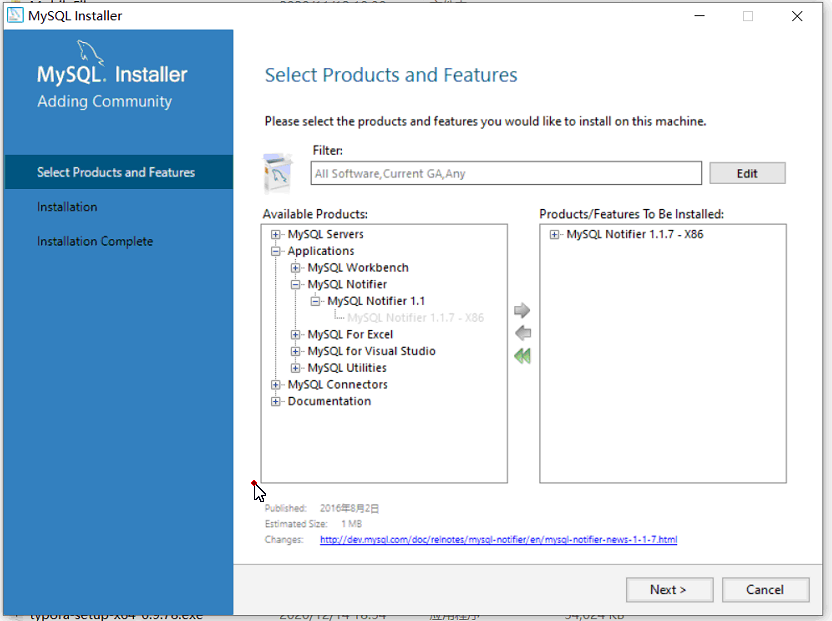

[TOC]

# Mysql基础

## 1. 数据库

> 数据库是“按照数据结构来组织、存储和管理数据的仓库”。是一个长期存储在[计算机](https://baike.baidu.com/item/计算机/140338)内的、有组织的、可共享的、统一管理的大量数据的集合
>
> 数据长久存储的集合。
>
> 在数据库的发展历史上，数据库先后经历了层次数据库、网状数据库和关系数据库等各个阶段的发展，数据库技术在各个方面的快速的发展

## 2. 数据库的分类

### 2.1 关系型数据库

+ Oracle  全球最大的商业使用的收费数据库厂商。
+ MySql  是免费的数据库  已经被oracle收购了
+ mariadb  永久免费的mysql替代品
+ 阿里巴巴mysql 
+ h2 内存数据库  jar
+ sqlServer 微软的数据库 

### 2.2 非关系型数据库(NoSql数据库)

+ redis
+ mogodb
+ HBase

## 3.Mysql的简介

> MySQL是一个**[关系型数据库管理系统](https://baike.baidu.com/item/关系型数据库管理系统/696511)****，**由瑞典MySQL AB 公司开发，属于 [Oracle](https://baike.baidu.com/item/Oracle) 旗下产品。MySQL 是最流行的[关系型数据库管理系统](https://baike.baidu.com/item/关系型数据库管理系统/696511)之一，在 WEB 应用方面，MySQL是最好的 [RDBMS](https://baike.baidu.com/item/RDBMS/1048260) (Relational Database Management System，关系数据库管理系统) 应用软件之一。
>
> MySQL是一种关系型数据库管理系统，关系数据库将数据保存在不同的表中，而不是将所有数据放在一个大仓库内，这样就增加了速度并提高了灵活性。
>
> MySQL所使用的 SQL 语言是用于访问[数据库](https://baike.baidu.com/item/数据库/103728)的最常用标准化语言。MySQL 软件采用了双授权政策，分为社区版和商业版，由于其体积小、速度快、总体拥有成本低，尤其是[开放源码](https://baike.baidu.com/item/开放源码/7176422)这一特点，一般中小型网站的开发都选择 MySQL 作为网站数据库。

### 3.1 Mysql的下载


### 3.2 Mysql的安装





### 3.3 Mysql的卸载

传统的控制面板卸载可以卸载软件不会清除注册表，不会卸载MYSQL57服务

使用一些专用的卸载工具去卸载可以清除注册表再次安装的时候就没有问题。

## 4. Mysql的初体验

### 4.1 连接到Mysql数据库

+ mysql -uroot -hlocalhost -p  在输入数据库的密码
+ exit退出mysql命令客户端


```sql
 mysql -uroot -p
Enter password: ****
```

### 4.2  查看Mysql 默认的数据库

> show databases;

```sql
mysql> show databases;     
+--------------------+     
| Database           |     
+--------------------+     
| information_schema |     
| atcrowdfunding     |     
| atcrowdfunding01   |     
| cloud              |     
| clouddb01          |     
| clouddb02          |     
| clouddb03          |     
| liuyishou          |     
| manager            |     
| mybookshop         |     
| mysql              |     
| performance_schema |     
| project            |     
| sys                |     
| xdcrm              |     
| xdkjexam           |     
+--------------------+     
16 rows in set (0.01 sec)  
```


> 可以袭击配置Data和编码等

### 4.3 选择使用数据库和查看数据库中的表

```sql
mysql> use mysql;
Database changed
mysql> show tables;
+---------------------------+
| Tables_in_mysql           |
+---------------------------+
| columns_priv              |
| db                        |
| engine_cost               |
| event                     |
| func                      |
| general_log               |
| gtid_executed             |
| help_category             |
| help_keyword              |
| help_relation             |
| help_topic                |
| innodb_index_stats        |
| innodb_table_stats        |
| ndb_binlog_index          |
| plugin                    |
| proc                      |
| procs_priv                |
| proxies_priv              |
| server_cost               |
| servers                   |
| slave_master_info         |
| slave_relay_log_info      |
| slave_worker_info         |
| slow_log                  |
| tables_priv               |
| time_zone                 |
| time_zone_leap_second     |
| time_zone_name            |
| time_zone_transition      |
| time_zone_transition_type |
| user                      |
+---------------------------+
31 rows in set (0.00 sec)
```

### 4.4 数据库的创建

```sql
mysql> create database haha;
Query OK, 1 row affected (0.00 sec)

mysql> show databases;
+--------------------+
| Database           |
+--------------------+
| information_schema |
| atcrowdfunding     |
| atcrowdfunding01   |
| cloud              |
| clouddb01          |
| clouddb02          |
| clouddb03          |
| haha               |
| liuyishou          |
| manager            |
| mybookshop         |
| mysql              |
| performance_schema |
| project            |
| sys                |
| xdcrm              |
| xdkjexam           |
+--------------------+
17 rows in set (0.00 sec)
```

### 4.5 表的创建和表的查看

```sql
mysql> create table student(
    -> name varchar(20),
    -> age int(11)
    -> );
Query OK, 0 rows affected (0.02 sec) 
                          
mysql> show tables;       
+----------------+        
| Tables_in_haha |        
+----------------+        
| student        |        
+----------------+        
1 row in set (0.00 sec)   
```

### 4.6 查看表的物理结构

```sql
mysql> desc student;
+-------+-------------+------+-----+---------+-------+
| Field | Type        | Null | Key | Default | Extra |
+-------+-------------+------+-----+---------+-------+
| name  | varchar(20) | YES  |     | NULL    |       |
| age   | int(11)     | YES  |     | NULL    |       |
+-------+-------------+------+-----+---------+-------+
2 rows in set (0.01 sec)
```

### 4.7 查看表的创建时的语句

```sql
mysql> show create table student;
+---------+-------------------------------------------------------------------------------------------------------------------------------+
| Table   | Create Table                                                                                                                  |
+---------+-------------------------------------------------------------------------------------------------------------------------------+
| student | CREATE TABLE `student` (
  `name` varchar(20) DEFAULT NULL,
  `age` int(11) DEFAULT NULL
) ENGINE=InnoDB DEFAULT CHARSET=utf8 |
+---------+-------------------------------------------------------------------------------------------------------------------------------+
1 row in set (0.00 sec)
```

### 4.8 查看表的数据

```sql
mysql> select * from student;
Empty set (0.00 sec)
```

### 4.9 表中插入数据

```sql
mysql> insert into student values("admin",18),("joke",88);
Query OK, 2 rows affected (0.00 sec)
Records: 2  Duplicates: 0  Warnings: 0

mysql> select * from student;
+-------+------+
| name  | age  |
+-------+------+
| admin |   18 |
| joke  |   88 |
+-------+------+
2 rows in set (0.00 sec)
```

### 4.10 MySql注意的地方:

1. Mysql的sql语句末尾加分号;
2. 一般情况下Mysql中的所有单词小写
3. 有的时候我们在添加的时候 表名，字段名 数据库名 使用驼峰命名法
4. 表名字段名多个单词组成使用_隔开
5. 因为Mysql学习中命令很多建议写个记事本
6. 语句先在记事本中写完，检查没问题再在mysql命令端复制粘贴运行。

## 5. SQL

> 结构化查询语言(Structured Query Language)简称SQL，是一种特殊目的的编程语言，是一种数据库查询和[程序设计语言](https://baike.baidu.com/item/程序设计语言/2317999)，用于存取数据以及查询、更新和管理[关系数据库系统](https://baike.baidu.com/item/关系数据库系统)。
>
> 结构化查询语言是高级的非过程化[编程语言](https://baike.baidu.com/item/编程语言/9845131)，允许用户在高层[数据结构](https://baike.baidu.com/item/数据结构/1450)上工作。它不要求用户指定对数据的存放方法，也不需要用户了解具体的数据存放方式，所以具有完全不同底层结构的不同[数据库系统](https://baike.baidu.com/item/数据库系统/215176), 可以使用相同的结构化查询语言作为数据输入与管理的接口。结构化查询语言语句可以嵌套，这使它具有极大的灵活性和强大的功能。

### 5.1 Sql语句的分类

结构化查询语言包含6个部分：

1、数据查询语言（[DQL](https://baike.baidu.com/item/DQL):Data Query Language）：其语句，也称为“数据检索[语句](https://baike.baidu.com/item/语句)”，用以从表中获得数据，确定数据怎样在应用程序给出。保留字[SELECT](https://baike.baidu.com/item/SELECT/10735068)是DQL（也是所有SQL）用得最多的动词，其他DQL常用的保留字有WHERE，ORDER BY，GROUP BY和HAVING。这些DQL保留字常与其它类型的SQL语句一起使用。 [4] 

2、[数据操作语言](https://baike.baidu.com/item/数据操作语言)（DML：Data Manipulation Language）：其语句包括动词[INSERT](https://baike.baidu.com/item/INSERT)、[UPDATE](https://baike.baidu.com/item/UPDATE)和[DELETE](https://baike.baidu.com/item/DELETE)。它们分别用于添加、修改和删除。 [4] 

3、事务控制语言（TCL transaction control language）：它的语句能确保被DML语句影响的表的所有行及时得以更新。包括COMMIT（提交）命令、SAVEPOINT（保存点）命令、ROLLBACK（回滚）命令。

4、[数据控制语言](https://baike.baidu.com/item/数据控制语言)（DCL: data control language）：它的语句通过GRANT或REVOKE实现权限控制，确定单个用户和用户组对[数据库对象](https://baike.baidu.com/item/数据库对象)的访问。某些RDBMS可用GRANT或REVOKE控制对[表单](https://baike.baidu.com/item/表单)个列的访问。 [4] 

5、数据定义语言（[DDL](https://baike.baidu.com/item/DDL/21997)）：其语句包括动词CREATE,ALTER和DROP。在数据库中创建新表或修改、删除表（CREATE TABLE 或 DROP TABLE）；为表加入索引等。 [4] 

6、指针控制语言（CCL）：它的语句，像DECLARE CURSOR，FETCH INTO和UPDATE WHERE CURRENT用于对一个或多个表单独行的操作。

## 6. 数据库的操作

### 6.0 常见的mysql系统操作

**查看当前的Mysql版本**

```sql
mysql> select version();
+------------+
| version()  |
+------------+
| 5.7.17-log |
+------------+
1 row in set (0.00 sec)
```

**查看当前的mysql登录用户**

```sql
mysql> select user();
+----------------+
| user()         |
+----------------+
| root@localhost |
+----------------+
1 row in set (0.00 sec)
```

**Mysql系统登录**

```sql
C:\Users\chanh\Desktop
λ mysql -uroot -hlocalhost -P3306 -p
Enter password: ****
Welcome to the MySQL monitor.  Commands end with ; or \g.
Your MySQL connection id is 7
Server version: 5.7.17-log MySQL Community Server (GPL)

Copyright (c) 2000, 2018, Oracle and/or its affiliates. All rights reserved.

Oracle is a registered trademark of Oracle Corporation and/or its
affiliates. Other names may be trademarks of their respective
owners.

Type 'help;' or '\h' for help. Type '\c' to clear the current input statement.

mysql> quit
Bye

C:\Users\chanh\Desktop
λ mysql -uroot  -p
Enter password: ****
Welcome to the MySQL monitor.  Commands end with ; or \g.
Your MySQL connection id is 8
Server version: 5.7.17-log MySQL Community Server (GPL)

Copyright (c) 2000, 2018, Oracle and/or its affiliates. All rights reserved.

Oracle is a registered trademark of Oracle Corporation and/or its
affiliates. Other names may be trademarks of their respective
owners.

Type 'help;' or '\h' for help. Type '\c' to clear the current input statement.

mysql>
```

**查看当前的系统的时间**

```sql
mysql> select now();
+---------------------+
| now()               |
+---------------------+
| 2021-01-06 14:15:27 |
+---------------------+
1 row in set (0.00 sec)
```

**查看当前正在使用的数据库名称**

```sql
mysql> select database();
+------------+
| database() |
+------------+
| haha       |
+------------+
1 row in set (0.00 sec)
```

### 6.1 数据库的创建

**直接创建数据库**

```sql
mysql> create database hehe;
Query OK, 1 row affected (0.00 sec)

mysql> show databases;
+--------------------+
| Database           |
+--------------------+
| information_schema |
| atcrowdfunding     |
| atcrowdfunding01   |
| cloud              |
| clouddb01          |
| clouddb02          |
| clouddb03          |
| haha               |
| hehe               |
```

**创建数据库如果数据库不存在**

```sql
mysql> create database  if not exists hehe;
Query OK, 1 row affected (0.00 sec)
```

**查看当前的数据创建信息**

```SQL
mysql> show create database hehe;
+----------+---------------------------------------------------------------+
| Database | Create Database                                               |
+----------+---------------------------------------------------------------+
| hehe     | CREATE DATABASE `hehe` /*!40100 DEFAULT CHARACTER SET utf8 */ |
+----------+---------------------------------------------------------------+
1 row in set (0.00 sec)
```

**创建数据库的时候设置字符编码**

```sql
mysql> create database java55  character set ="GBK";
Query OK, 1 row affected (0.00 sec)
```

### 6.2 数据库的删除

```sql
mysql> drop database hehe;
Query OK, 0 rows affected (0.00 sec)
```

### 6.3 修改默认的字符编码

```sql
mysql> create database hehe charset  ='gbk';
Query OK, 1 row affected (0.00 sec)
```

**查看Mysql默认的字符编码**

```sql
mysql> SHOW VARIABLES LIKE 'character%';
+--------------------------+---------------------------------------------------------+
| Variable_name            | Value                                                   |
+--------------------------+---------------------------------------------------------+
| character_set_client     | utf8                                                    |
| character_set_connection | utf8                                                    |
| character_set_database   | gbk                                                     |
| character_set_filesystem | binary                                                  |
| character_set_results    | utf8                                                    |
| character_set_server     | utf8                                                    |
| character_set_system     | utf8                                                    |
| character_sets_dir       | C:\Program Files\MySQL\MySQL Server 5.7\share\charsets\ |
+--------------------------+---------------------------------------------------------+
8 rows in set, 1 warning (0.00 sec)
```

**修改Mysql数据库默认的字符编码**

```sql
mysql> set character_set_database=utf8;
Query OK, 0 rows affected, 1 warning (0.00 sec)
```

**修改数据库的字符编码**

```sql
mysql> alter database haha character set gbk;
Query OK, 1 row affected (0.00 sec)

mysql> SHOW VARIABLES LIKE 'character%';
+--------------------------+---------------------------------------------------------+
| Variable_name            | Value                                                   |
+--------------------------+---------------------------------------------------------+
| character_set_client     | utf8                                                    |
| character_set_connection | utf8                                                    |
| character_set_database   | gbk                                                     |
| character_set_filesystem | binary                                                  |
| character_set_results    | utf8                                                    |
| character_set_server     | utf8                                                    |
| character_set_system     | utf8                                                    |
| character_sets_dir       | C:\Program Files\MySQL\MySQL Server 5.7\share\charsets\ |
+--------------------------+---------------------------------------------------------+
8 rows in set, 1 warning (0.00 sec)
```

**通过Mysql安装目录的my.ini文件进行修改**

### 6.4 忘记密码重新设置密码

**忘记密码 密码错误**

```sql
C:\Users\chanh\Desktop
λ mysql -uroot -hlocalhost -P3306 -p
Enter password: ***
ERROR 1045 (28000): Access denied for user 'root'@'localhost' (using password: YES)

```

**进行密码的修改**

[Mysql忘记密码操作](https://blog.csdn.net/weixin_30332705/article/details/95553795?utm_medium=distribute.pc_relevant_t0.none-task-blog-BlogCommendFromBaidu-1.control&depth_1-utm_source=distribute.pc_relevant_t0.none-task-blog-BlogCommendFromBaidu-1.control)

## 7.表结构的操作

### 7.0 数据库的数据类型

==数值类型==

MySQL支持所有标准SQL数值数据类型。

这些类型包括严格数值数据类型(INTEGER、SMALLINT、DECIMAL和NUMERIC)，以及近似数值数据类型(FLOAT、REAL和DOUBLE PRECISION)。

关键字INT是INTEGER的同义词，关键字DEC是DECIMAL的同义词。

BIT数据类型保存位字段值，并且支持MyISAM、MEMORY、InnoDB和BDB表。

作为SQL标准的扩展，MySQL也支持整数类型TINYINT、MEDIUMINT和BIGINT。下面的表显示了需要的每个整数类型的存储和范围。

| 类型         | 大小                                     | 范围（有符号）                                               | 范围（无符号）                                               | 用途            |
| :----------- | :--------------------------------------- | :----------------------------------------------------------- | :----------------------------------------------------------- | :-------------- |
| TINYINT      | 1 byte                                   | (-128，127)                                                  | (0，255)                                                     | 小整数值        |
| SMALLINT     | 2 bytes                                  | (-32 768，32 767)                                            | (0，65 535)                                                  | 大整数值        |
| MEDIUMINT    | 3 bytes                                  | (-8 388 608，8 388 607)                                      | (0，16 777 215)                                              | 大整数值        |
| INT或INTEGER | 4 bytes                                  | (-2 147 483 648，2 147 483 647)                              | (0，4 294 967 295)                                           | 大整数值        |
| BIGINT       | 8 bytes                                  | (-9,223,372,036,854,775,808，9 223 372 036 854 775 807)      | (0，18 446 744 073 709 551 615)                              | 极大整数值      |
| FLOAT        | 4 bytes                                  | (-3.402 823 466 E+38，-1.175 494 351 E-38)，0，(1.175 494 351 E-38，3.402 823 466 351 E+38) | 0，(1.175 494 351 E-38，3.402 823 466 E+38)                  | 单精度 浮点数值 |
| DOUBLE       | 8 bytes                                  | (-1.797 693 134 862 315 7 E+308，-2.225 073 858 507 201 4 E-308)，0，(2.225 073 858 507 201 4 E-308，1.797 693 134 862 315 7 E+308) | 0，(2.225 073 858 507 201 4 E-308，1.797 693 134 862 315 7 E+308) | 双精度 浮点数值 |
| DECIMAL      | 对DECIMAL(M,D) ，如果M>D，为M+2否则为D+2 | 依赖于M和D的值                                               | 依赖于M和D的值                                               | 小数值          |

> 在实际开发的项目中如果牵扯到金额方面的时候不要使用flolat double , decimal数据类型进行存储。

**日期和时间类型****

表示时间值的日期和时间类型为DATETIME、DATE、TIMESTAMP、TIME和YEAR。

每个时间类型有一个有效值范围和一个"零"值，当指定不合法的MySQL不能表示的值时使用"零"值。

TIMESTAMP类型有专有的自动更新特性，将在后面描述。

| 类型      | 大小 ( bytes) | 范围                                                         | 格式                | 用途                     |
| :-------- | :------------ | :----------------------------------------------------------- | :------------------ | :----------------------- |
| DATE      | 3             | 1000-01-01/9999-12-31                                        | YYYY-MM-DD          | 日期值                   |
| TIME      | 3             | '-838:59:59'/'838:59:59'                                     | HH:MM:SS            | 时间值或持续时间         |
| YEAR      | 1             | 1901/2155                                                    | YYYY                | 年份值                   |
| DATETIME  | 8             | 1000-01-01 00:00:00/9999-12-31 23:59:59                      | YYYY-MM-DD HH:MM:SS | 混合日期和时间值         |
| TIMESTAMP | 4             | 1970-01-01 00:00:00/2038结束时间是第 **2147483647** 秒，北京时间 **2038-1-19 11:14:07**，格林尼治时间 2038年1月19日 凌晨 03:14:07 | YYYYMMDD HHMMSS     | 混合日期和时间值，时间戳 |

**字符串类型**

字符串类型指CHAR、VARCHAR、BINARY、VARBINARY、BLOB、TEXT、ENUM和SET。该节描述了这些类型如何工作以及如何在查询中使用这些类型。

| 类型       | 大小                  | 用途                            |
| :--------- | :-------------------- | :------------------------------ |
| CHAR       | 0-255 bytes           | 定长字符串                      |
| VARCHAR    | 0-65535 bytes         | 变长字符串                      |
| TINYBLOB   | 0-255 bytes           | 不超过 255 个字符的二进制字符串 |
| TINYTEXT   | 0-255 bytes           | 短文本字符串                    |
| BLOB       | 0-65 535 bytes        | 二进制形式的长文本数据          |
| TEXT       | 0-65 535 bytes        | 长文本数据                      |
| MEDIUMBLOB | 0-16 777 215 bytes    | 二进制形式的中等长度文本数据    |
| MEDIUMTEXT | 0-16 777 215 bytes    | 中等长度文本数据                |
| LONGBLOB   | 0-4 294 967 295 bytes | 二进制形式的极大文本数据        |
| LONGTEXT   | 0-4 294 967 295 bytes | 极大文本数据                    |

### 7.1 表的创建

> create table 表名(
>
> 字段名称  字段数据类型(数据类型的长度)  字段的约束,
>
> 字段名称  字段数据类型(数据类型的长度)   字段的约束,
>
> 字段名称  字段数据类型(数据类型的长度)   字段的约束
>
> );

```sql
mysql> create table student(
    -> id int (11),
    -> name varchar(25),
    -> age int(11),
    -> score float,
    -> mark text,
    -> birth datetime
    -> );
Query OK, 0 rows affected (0.02 sec)

mysql> desc student;
+-------+-------------+------+-----+---------+-------+
| Field | Type        | Null | Key | Default | Extra |
+-------+-------------+------+-----+---------+-------+
| id    | int(11)     | YES  |     | NULL    |       |
| name  | varchar(25) | YES  |     | NULL    |       |
| age   | int(11)     | YES  |     | NULL    |       |
| score | float       | YES  |     | NULL    |       |
| mark  | text        | YES  |     | NULL    |       |
| birth | datetime    | YES  |     | NULL    |       |
+-------+-------------+------+-----+---------+-------+
6 rows in set (0.00 sec)

mysql> insert into student values(1,"admin",25,85.5,"admin是一个的好学生，学习成绩还不错，很好很好和好","2020-12-12 14:05:30");
Query OK, 1 row affected (0.00 sec)

mysql> select * from student;
+------+-------+------+-------+-------------------------------------------------------------------------+---------------------+
| id   | name  | age  | score | mark                                                                    | birth               |
+------+-------+------+-------+-------------------------------------------------------------------------+---------------------+
|    1 | admin |   25 |  85.5 | admin是一个的好学生，学习成绩还不错，很好很好和好                       | 2020-12-12 14:05:30 |
+------+-------+------+-------+-------------------------------------------------------------------------+---------------------+
1 row in set (0.00 sec)
```

### 7.2 表的字段的约束

#### 7.2.1 主键 primary key

> 为什么要有主键: 用来标记数据的唯一性 主键是不能重复的。
>
> 在数据设计的时候主键是int值，可以是uuid.现在数据库设计的时候很少uuid了。
>
> 主键使用id作为标记。stu_id   来作为主键的字段。

```sql
mysql> create table student(
    -> stu_id int (11) primary key,
    -> name varchar(25)
    -> );
Query OK, 0 rows affected (0.02 sec)

mysql> desc student;
+--------+-------------+------+-----+---------+-------+
| Field  | Type        | Null | Key | Default | Extra |
+--------+-------------+------+-----+---------+-------+
| stu_id | int(11)     | NO   | PRI | NULL    |       |
| name   | varchar(25) | YES  |     | NULL    |       |
+--------+-------------+------+-----+---------+-------+
2 rows in set (0.00 sec)

mysql> insert into student values(1,"admin");
Query OK, 1 row affected (0.00 sec)

mysql> insert into student values(1,"joke");
ERROR 1062 (23000): Duplicate entry '1' for key 'PRIMARY'
```

#### 7.2.2 主键自增

```sql
mysql> create table student(
    -> stu_id int primary key auto_increment,
    -> name varchar(25)
    -> );
Query OK, 0 rows affected (0.02 sec)

mysql> insert into student(name) values("admin");
Query OK, 1 row affected (0.01 sec)

mysql> select * from student;
+--------+-------+
| stu_id | name  |
+--------+-------+
|      1 | admin |
+--------+-------+
1 row in set (0.00 sec)
```

#### 7.2.3 不能为空 notnull

#### 7.2.4 默认值 defualt

#### 7.2.5 唯一 unique

#### 7.2.6 注释 comment

```sql
mysql> create table student(
    -> stu_id int primary key auto_increment,
    -> stu_name varchar(25) not null,
    -> stu_num varchar(18) unique,
    -> stu_address varchar(150) comment "地址"
    -> );
Query OK, 0 rows affected (0.02 sec)

mysql> inert into student values(null,"","610327199512130105","西安市");
ERROR 1064 (42000): You have an error in your SQL syntax; check the manual that corresponds to your MySQL server version for the right syntax to use near 'inert into student values(null,"","610327199512130105","西安市")' at line 1
mysql> insert into student values(null,"","610327199512130105","西安市");
Query OK, 1 row affected (0.01 sec)

mysql> insert into student values(null,null,"610327199512130105","西安市");
ERROR 1048 (23000): Column 'stu_name' cannot be null
mysql> insert into student values(null,"admin","610327199512130105","西安市");
ERROR 1062 (23000): Duplicate entry '610327199512130105' for key 'stu_num'

mysql> desc student;
+-------------+--------------+------+-----+---------+----------------+
| Field       | Type         | Null | Key | Default | Extra          |
+-------------+--------------+------+-----+---------+----------------+
| stu_id      | int(11)      | NO   | PRI | NULL    | auto_increment |
| stu_name    | varchar(25)  | NO   |     | NULL    |                |
| stu_num     | varchar(18)  | YES  | UNI | NULL    |                |
| stu_address | varchar(150) | YES  |     | NULL    |                |
+-------------+--------------+------+-----+---------+----------------+
4 rows in set (0.00 sec)

mysql> show create table student;
+---------+------------------------------------------------------------------------------------------------------------------------------------------------------------------------------------------------------------------------------------------------------------------------------------------------------------------------------+
| Table   | Create Table

             |
+---------+------------------------------------------------------------------------------------------------------------------------------------------------------------------------------------------------------------------------------------------------------------------------------------------------------------------------------+
| student | CREATE TABLE `student` (
  `stu_id` int(11) NOT NULL AUTO_INCREMENT,
  `stu_name` varchar(25) NOT NULL,
  `stu_num` varchar(18) DEFAULT NULL,
  `stu_address` varchar(150) DEFAULT NULL COMMENT '地址',
  PRIMARY KEY (`stu_id`),
  UNIQUE KEY `stu_num` (`stu_num`)
) ENGINE=InnoDB AUTO_INCREMENT=3 DEFAULT CHARSET=utf8   |
+---------+------------------------------------------------------------------------------------------------------------------------------------------------------------------------------------------------------------------------------------------------------------------------------------------------------------------------------+
1 row in set (0.00 sec)
```


### 7.3 表名的修改

> alter table student rename stu;

```sql
mysql> alter table student rename stu;
Query OK, 0 rows affected (0.01 sec)

mysql> show tables;
+----------------+
| Tables_in_haha |
+----------------+
| stu            |
+----------------+
1 row in set (0.00 sec)
```

### 7.4 表的删除

```sql
mysql> drop table student;
Query OK, 0 rows affected (0.01 sec)
```

### 7.5 表的字段添加

> 默认新加的字段会在表字段列表的末尾；
>
> alter table stu add column  score float;

```sql
mysql> alter table stu add column  score float;
Query OK, 0 rows affected (0.08 sec)
Records: 0  Duplicates: 0  Warnings: 0
mysql> desc stu;
+-------------+--------------+------+-----+---------+----------------+
| Field       | Type         | Null | Key | Default | Extra          |
+-------------+--------------+------+-----+---------+----------------+
| stu_id      | int(11)      | NO   | PRI | NULL    | auto_increment |
| stu_name    | varchar(25)  | NO   |     | NULL    |                |
| stu_num     | varchar(18)  | YES  | UNI | NULL    |                |
| stu_address | varchar(150) | YES  |     | NULL    |                |
| score       | float        | YES  |     | NULL    |                |
+-------------+--------------+------+-----+---------+----------------+
5 rows in set (0.00 sec)
```

**新加的字段在原来原有表字段的前边或者后边**

> alter table stu add column  phone varchar(35) after stu_address;

```sql
mysql> alter table stu add column  phone varchar(35) after stu_address;
Query OK, 0 rows affected (0.08 sec)
Records: 0  Duplicates: 0  Warnings: 0

mysql> desc stu;
+-------------+--------------+------+-----+---------+----------------+
| Field       | Type         | Null | Key | Default | Extra          |
+-------------+--------------+------+-----+---------+----------------+
| stu_id      | int(11)      | NO   | PRI | NULL    | auto_increment |
| stu_name    | varchar(25)  | NO   |     | NULL    |                |
| stu_num     | varchar(18)  | YES  | UNI | NULL    |                |
| stu_address | varchar(150) | YES  |     | NULL    |                |
| phone       | varchar(35)  | YES  |     | NULL    |                |
| score       | float        | YES  |     | NULL    |                |
+-------------+--------------+------+-----+---------+----------------+
6 rows in set (0.00 sec)
```

**新加的字段在第一个**

> alter table stu add column  stu_age varchar(35) first ;

```sql
mysql> alter table stu add column  stu_age varchar(35) first ;
Query OK, 0 rows affected (0.08 sec)
Records: 0  Duplicates: 0  Warnings: 0

mysql> desc stu;
+-------------+--------------+------+-----+---------+----------------+
| Field       | Type         | Null | Key | Default | Extra          |
+-------------+--------------+------+-----+---------+----------------+
| stu_age     | varchar(35)  | YES  |     | NULL    |                |
| stu_id      | int(11)      | NO   | PRI | NULL    | auto_increment |
| stu_name    | varchar(25)  | NO   |     | NULL    |                |
| stu_num     | varchar(18)  | YES  | UNI | NULL    |                |
| stu_address | varchar(150) | YES  |     | NULL    |                |
| phone       | varchar(35)  | YES  |     | NULL    |                |
| score       | float        | YES  |     | NULL    |                |
+-------------+--------------+------+-----+---------+----------------+
7 rows in set (0.00 sec)
```

### 7.6 字段的修改

**修改字段的名称**

> alter table stu   change phone stu_phone int ;

```sql
mysql> alter table stu   change phone stu_phone int ;
Query OK, 1 row affected (0.07 sec)
Records: 1  Duplicates: 0  Warnings: 0

mysql> desc stu;
+-------------+--------------+------+-----+---------+----------------+
| Field       | Type         | Null | Key | Default | Extra          |
+-------------+--------------+------+-----+---------+----------------+
| stu_age     | varchar(35)  | YES  |     | NULL    |                |
| stu_id      | int(11)      | NO   | PRI | NULL    | auto_increment |
| stu_name    | varchar(25)  | NO   |     | NULL    |                |
| stu_num     | varchar(18)  | YES  | UNI | NULL    |                |
| stu_address | varchar(150) | YES  |     | NULL    |                |
| stu_phone   | int(11)      | YES  |     | NULL    |                |
| score       | float        | YES  |     | NULL    |                |
+-------------+--------------+------+-----+---------+----------------+
7 rows in set (0.00 sec)
```

**修改字段的数据类型**

> alter table stu modify column stu_phone varchar(25);

```sql
mysql> alter table stu modify column stu_phone varchar(25);
Query OK, 1 row affected (0.07 sec)
Records: 1  Duplicates: 0  Warnings: 0

mysql> desc stu;
+-------------+--------------+------+-----+---------+----------------+
| Field       | Type         | Null | Key | Default | Extra          |
+-------------+--------------+------+-----+---------+----------------+
| stu_age     | varchar(35)  | YES  |     | NULL    |                |
| stu_id      | int(11)      | NO   | PRI | NULL    | auto_increment |
| stu_name    | varchar(25)  | NO   |     | NULL    |                |
| stu_num     | varchar(18)  | YES  | UNI | NULL    |                |
| stu_address | varchar(150) | YES  |     | NULL    |                |
| stu_phone   | varchar(25)  | YES  |     | NULL    |                |
| score       | float        | YES  |     | NULL    |                |
+-------------+--------------+------+-----+---------+----------------+
7 rows in set (0.00 sec)
```

**修改表的约束**

> alter table stu modify column stu_phone varchar(25) unique;

```sql
mysql> alter table stu modify column stu_phone varchar(25) unique;
Query OK, 0 rows affected (0.03 sec)
Records: 0  Duplicates: 0  Warnings: 0

mysql> desc stu;
+-------------+--------------+------+-----+---------+----------------+
| Field       | Type         | Null | Key | Default | Extra          |
+-------------+--------------+------+-----+---------+----------------+
| stu_age     | varchar(35)  | YES  |     | NULL    |                |
| stu_id      | int(11)      | NO   | PRI | NULL    | auto_increment |
| stu_name    | varchar(25)  | NO   |     | NULL    |                |
| stu_num     | varchar(18)  | YES  | UNI | NULL    |                |
| stu_address | varchar(150) | YES  |     | NULL    |                |
| stu_phone   | varchar(25)  | YES  | UNI | NULL    |                |
+-------------+--------------+------+-----+---------+----------------+
6 rows in set (0.00 sec)
```

**修改表的字符编码**

> alter table stu character set gbk;

```sql
mysql> alter table stu character set gbk;
Query OK, 0 rows affected (0.01 sec)
Records: 0  Duplicates: 0  Warnings: 0

mysql> show create table stu;
+-------+----------------------------------------------------------------------------------------------------------------------------------------------------------------------------------------------------------------------------------------------------------------------------------------------------------------------------------------------------------------------------------------------------------------------------------------------------------------------------------------------------------------------------------------------+
| Table | Create Table


                                                             |
+-------+----------------------------------------------------------------------------------------------------------------------------------------------------------------------------------------------------------------------------------------------------------------------------------------------------------------------------------------------------------------------------------------------------------------------------------------------------------------------------------------------------------------------------------------------+
| stu   | CREATE TABLE `stu` (
  `stu_age` varchar(35) CHARACTER SET utf8 DEFAULT NULL,
  `stu_id` int(11) NOT NULL AUTO_INCREMENT,
  `stu_name` varchar(25) CHARACTER SET utf8 NOT NULL,
  `stu_num` varchar(18) CHARACTER SET utf8 DEFAULT NULL,
  `stu_address` varchar(150) CHARACTER SET utf8 DEFAULT NULL COMMENT '地址',
  `stu_phone` varchar(25) CHARACTER SET utf8 DEFAULT NULL,
  PRIMARY KEY (`stu_id`),
  UNIQUE KEY `stu_num` (`stu_num`),
  UNIQUE KEY `stu_phone` (`stu_phone`)
) ENGINE=InnoDB AUTO_INCREMENT=3 DEFAULT CHARSET=gbk   |
+-------+----------------------------------------------------------------------------------------------------------------------------------------------------------------------------------------------------------------------------------------------------------------------------------------------------------------------------------------------------------------------------------------------------------------------------------------------------------------------------------------------------------------------------------------------+
```

### 7.7 字段的删除

> alter table stu drop column score;

```sql
mysql> alter table stu drop column score;
Query OK, 0 rows affected (0.08 sec)
Records: 0  Duplicates: 0  Warnings: 0

mysql> desc stu;
+-------------+--------------+------+-----+---------+----------------+
| Field       | Type         | Null | Key | Default | Extra          |
+-------------+--------------+------+-----+---------+----------------+
| stu_age     | varchar(35)  | YES  |     | NULL    |                |
| stu_id      | int(11)      | NO   | PRI | NULL    | auto_increment |
| stu_name    | varchar(25)  | NO   |     | NULL    |                |
| stu_num     | varchar(18)  | YES  | UNI | NULL    |                |
| stu_address | varchar(150) | YES  |     | NULL    |                |
| stu_phone   | varchar(25)  | YES  |     | NULL    |                |
+-------------+--------------+------+-----+---------+----------------+
6 rows in set (0.00 sec)
```

## 8. 表数据的操作(CRUD)

+ c  create  插入数据
+ r  read  查询数据
+ u  update  修改数据
+ d  delete 删除数据

### 8.1 数据的查询(单表的简单查询)

```sql
mysql> select stu_id,stu_name,stu_phone from stu;
+--------+----------+-------------+
| stu_id | stu_name | stu_phone   |
+--------+----------+-------------+
|      1 | admin    | 13596321584 |
|      4 | admin    | 13596321588 |
|      5 | joke     | 13256963215 |
+--------+----------+-------------+
3 rows in set (0.00 sec)

mysql> select stu_id,stu_name,stu_phone ,stu_address from stu;
+--------+----------+-------------+-------------+
| stu_id | stu_name | stu_phone   | stu_address |
+--------+----------+-------------+-------------+
|      1 | admin    | 13596321584 | NULL        |
|      4 | admin    | 13596321588 | NULL        |
|      5 | joke     | 13256963215 | NULL        |
+--------+----------+-------------+-------------+
3 rows in set (0.00 sec)

mysql> select * from stu;
+--------+----------+-------------+-------------+
| stu_id | stu_name | stu_phone   | stu_address |
+--------+----------+-------------+-------------+
|      1 | admin    | 13596321584 | NULL        |
|      4 | admin    | 13596321588 | NULL        |
|      5 | joke     | 13256963215 | NULL        |
+--------+----------+-------------+-------------+
3 rows in set (0.00 sec)
```

### 8.2 数据的插入

**插入所有字段的数据**

```sql
mysql> insert into stu (stu_id,stu_name,stu_phone,stu_address) values(null,"lucy","15623154879","西安市");
Query OK, 1 row affected (0.00 sec)
```

**插入多条数据**

```sql
mysql> insert into stu (stu_id,stu_name,stu_phone,stu_address) values(null,"lucy","15623154879","西安市");
Query OK, 1 row affected (0.00 sec)

```

**插入指定字段的数据值**

```sql
mysql> insert into stu (stu_id,stu_name,stu_phone) values(null,"lucy","15623157777"),(null,"hanmeiemi","13532459888");
Query OK, 2 rows affected (0.00 sec)
Records: 2  Duplicates: 0  Warnings: 0
```

**插入所有字段数据的简写**

```sql
mysql> insert into stu values(null,"张三","13322556688","烟台市");
Query OK, 1 row affected (0.00 sec)
mysql> insert into stu values(null,"张三","13322555588","烟台市"),(null,"李四","15566993321","深圳市");
Query OK, 2 rows affected (0.00 sec)
Records: 2  Duplicates: 0  Warnings: 0
```

### 8.3 数据的修改

**修改表中同一个字段的所有值**

```sql
mysql> update  stu set stu_address = "西安市";
Query OK, 9 rows affected (0.00 sec)
Rows matched: 11  Changed: 9  Warnings: 0

mysql> select * from stu;
+--------+-----------+-------------+-------------+
| stu_id | stu_name  | stu_phone   | stu_address |
+--------+-----------+-------------+-------------+
|      1 | admin     | 13596321584 | 西安市      |
|      4 | admin     | 13596321588 | 西安市      |
|      5 | joke      | 13256963215 | 西安市      |
|      6 | lucy      | 15623154879 | 西安市      |
|      9 | lucy      | 15623154877 | 西安市      |
|     10 | hanmeiemi | 13532459863 | 西安市      |
|     13 | lucy      | 15623157777 | 西安市      |
|     14 | hanmeiemi | 13532459888 | 西安市      |
|     15 | 张三      | 13322556688 | 西安市      |
|     18 | 张三      | 13322555588 | 西安市      |
|     19 | 李四      | 15566993321 | 西安市      |
+--------+-----------+-------------+-------------+
11 rows in set (0.00 sec)
```

**修改某一条数据的字段值**

```sql
mysql> update stu set stu_name = "王五",stu_address= "宝鸡市" where stu_id = 10;
Query OK, 1 row affected (0.01 sec)
Rows matched: 1  Changed: 1  Warnings: 0

mysql> select * from stu;
+--------+-----------+-------------+-------------+
| stu_id | stu_name  | stu_phone   | stu_address |
+--------+-----------+-------------+-------------+
|      1 | admin     | 13596321584 | 西安市      |
|      4 | admin     | 13596321588 | 西安市      |
|      5 | joke      | 13256963215 | 西安市      |
|      6 | lucy      | 15623154879 | 西安市      |
|      9 | lucy      | 15623154877 | 西安市      |
|     10 | 王五      | 13532459863 | 宝鸡市      |
|     13 | lucy      | 15623157777 | 西安市      |
|     14 | hanmeiemi | 13532459888 | 西安市      |
|     15 | 张三      | 13322556688 | 西安市      |
|     18 | 张三      | 13322555588 | 西安市      |
|     19 | 李四      | 15566993321 | 西安市      |
+--------+-----------+-------------+-------------+
11 rows in set (0.00 sec)
```

**修改多条数据的字段值**

```sql
mysql> update stu set stu_name = "韩梅梅",stu_address= "安康市" where stu_id in (1,3,5,7,22,33);
Query OK, 2 rows affected (0.00 sec)
Rows matched: 2  Changed: 2  Warnings: 0
mysql> select * from stu;
+--------+-----------+-------------+-------------+
| stu_id | stu_name  | stu_phone   | stu_address |
+--------+-----------+-------------+-------------+
|      1 | 韩梅梅    | 13596321584 | 安康市      |
|      4 | admin     | 13596321588 | 西安市      |
|      5 | 韩梅梅    | 13256963215 | 安康市      |
|      6 | lucy      | 15623154879 | 西安市      |
|      9 | lucy      | 15623154877 | 西安市      |
|     10 | 王五      | 13532459863 | 宝鸡市      |
|     13 | lucy      | 15623157777 | 西安市      |
|     14 | hanmeiemi | 13532459888 | 西安市      |
|     15 | 张三      | 13322556688 | 西安市      |
|     18 | 张三      | 13322555588 | 西安市      |
|     19 | 李四      | 15566993321 | 西安市      |
+--------+-----------+-------------+-------------+
11 rows in set (0.00 sec)
```

### 8.4 数据的删除 delete 删除

**删除一条数据**

```sql
mysql> delete from stu where stu_id = 19;
Query OK, 1 row affected (0.00 sec)

mysql> select * from stu;
+--------+-----------+-------------+-------------+
| stu_id | stu_name  | stu_phone   | stu_address |
+--------+-----------+-------------+-------------+
|      1 | 韩梅梅    | 13596321584 | 安康市      |
|      4 | admin     | 13596321588 | 西安市      |
|      5 | 韩梅梅    | 13256963215 | 安康市      |
|      6 | lucy      | 15623154879 | 西安市      |
|      9 | lucy      | 15623154877 | 西安市      |
|     10 | 王五      | 13532459863 | 宝鸡市      |
|     13 | lucy      | 15623157777 | 西安市      |
|     14 | hanmeiemi | 13532459888 | 西安市      |
|     15 | 张三      | 13322556688 | 西安市      |
|     18 | 张三      | 13322555588 | 西安市      |
+--------+-----------+-------------+-------------+
10 rows in set (0.00 sec)
```

**删除多条数据**

```sql
mysql> delete from stu where stu_id in(1,5,2,20,30);   
Query OK, 2 rows affected (0.01 sec)                   
                                                       
mysql> select * from stu;                              
+--------+-----------+-------------+-------------+     
| stu_id | stu_name  | stu_phone   | stu_address |     
+--------+-----------+-------------+-------------+     
|      4 | admin     | 13596321588 | 西安市      |        
|      6 | lucy      | 15623154879 | 西安市      |        
|      9 | lucy      | 15623154877 | 西安市      |        
|     10 | 王五      | 13532459863 | 宝鸡市      |          
|     13 | lucy      | 15623157777 | 西安市      |        
|     14 | hanmeiemi | 13532459888 | 西安市      |        
|     15 | 张三      | 13322556688 | 西安市      |          
|     18 | 张三      | 13322555588 | 西安市      |          
+--------+-----------+-------------+-------------+     
8 rows in set (0.00 sec)                               
```

**删除所有数据**

```sql
mysql> delete from stu;
Query OK, 8 rows affected (0.01 sec)
```

> 一般不要进行删除所有数据的操作！！慎重!慎重!慎重!慎重!慎重!慎重!慎重!慎重!

```sql
mysql> insert into stu (stu_id,stu_name,stu_phone,stu_address) values(null,"lucy","15623154879","西安市");
Query OK, 1 row affected (0.00 sec)

mysql> select * from stu;
+--------+----------+-------------+-------------+
| stu_id | stu_name | stu_phone   | stu_address |
+--------+----------+-------------+-------------+
|     20 | lucy     | 15623154879 | 西安市      |
+--------+----------+-------------+-------------+
1 row in set (0.00 sec)
```

> 如果数据库来维护主键的自增，数据清空完成以后 ，在添加新的数据进来，主键是在原有的数据的最后一条数据的id基础之上进制再次递增，不会从1重新开始

### 8.5 truncate 删除数据

```sql
mysql> truncate table  stu;
Query OK, 0 rows affected (0.01 sec)

mysql> show tables;
+----------------+
| Tables_in_haha |
+----------------+
| stu            |
+----------------+
1 row in set (0.00 sec)

mysql> select * from stu;
Empty set (0.00 sec)

mysql> insert into stu values(null,"admin","13653268695","西安市");
Query OK, 1 row affected (0.01 sec)

mysql> select * from stu;
+--------+----------+-------------+-------------+
| stu_id | stu_name | stu_phone   | stu_address |
+--------+----------+-------------+-------------+
|      1 | admin    | 13653268695 | 西安市      |
+--------+----------+-------------+-------------+
1 row in set (0.00 sec)

```

> truncate 删除标的数据 删除表在创建一张新的表，truncate 删除数据的速度比detele快。

## 9. 表的查询操作（单表操作）

> select 字段,字段,字段,字段 from 表名 [where  ,group by  ,order by ,like, limit ,having ]
>
> 数据的查询是查处的数据生成的一张虚拟的表。对原有的数据的表没有任何的影响。

### 9.1 部分查询

```sql
mysql> select stu_id,stu_name from stu;
+--------+-----------+
| stu_id | stu_name  |
+--------+-----------+
|      1 | admin     |
|      2 | joke      |
|      3 | lucy      |
|      4 | hanmeiemi |
+--------+-----------+
4 rows in set (0.00 sec)
```

### 9.2 条件查询 where

> where 是条件查询  后边的表达式可以跟  = > < >= <= != null like  or and between  not in 

**基本的条件查询**

```sql
mysql> select * from stu where stu_id =2;
+--------+----------+-------------+-------------+
| stu_id | stu_name | stu_phone   | stu_address |
+--------+----------+-------------+-------------+
|      2 | joke     | 13653268694 | 西安市      |
+--------+----------+-------------+-------------+
1 row in set (0.00 sec)
mysql> select * from stu where stu_id < 5;
+--------+-----------+-------------+-------------+
| stu_id | stu_name  | stu_phone   | stu_address |
+--------+-----------+-------------+-------------+
|      1 | admin     | 13653268695 | 西安市      |
|      2 | joke      | 13653268694 | 西安市      |
|      3 | lucy      | 13653268693 | 西安市      |
|      4 | hanmeiemi | 13653268692 | 西安市      |
+--------+-----------+-------------+-------------+
4 rows in set (0.00 sec)

mysql> select * from stu where stu_id >= 3;
+--------+-----------+-------------+-------------+
| stu_id | stu_name  | stu_phone   | stu_address |
+--------+-----------+-------------+-------------+
|      3 | lucy      | 13653268693 | 西安市      |
|      4 | hanmeiemi | 13653268692 | 西安市      |
+--------+-----------+-------------+-------------+
2 rows in set (0.00 sec)

mysql> select * from stu where stu_id != 3;
+--------+-----------+-------------+-------------+
| stu_id | stu_name  | stu_phone   | stu_address |
+--------+-----------+-------------+-------------+
|      1 | admin     | 13653268695 | 西安市      |
|      2 | joke      | 13653268694 | 西安市      |
|      4 | hanmeiemi | 13653268692 | 西安市      |
+--------+-----------+-------------+-------------+
3 rows in set (0.00 sec)

```

**数据是否为NULL**

```sql
mysql> select * from stu where stu_address is not NULL;
+--------+-----------+-------------+-------------+
| stu_id | stu_name  | stu_phone   | stu_address |
+--------+-----------+-------------+-------------+
|      1 | admin     | 13653268695 | 西安市      |
|      2 | joke      | 13653268694 | 西安市      |
|      3 | lucy      | 13653268693 | 西安市      |
|      4 | hanmeiemi | 13653268692 | 西安市      |
|      5 | hanmeiemi | 13653268622 | null        |
+--------+-----------+-------------+-------------+
5 rows in set (0.00 sec)

mysql> select * from stu where stu_address is NULL;
+--------+-----------+------------+-------------+
| stu_id | stu_name  | stu_phone  | stu_address |
+--------+-----------+------------+-------------+
|      7 | hanmeiemi | 1365326882 | NULL        |
+--------+-----------+------------+-------------+
1 row in set (0.00 sec)
```

**or and && ||**

```sql
mysql> select * from stu where stu_id > 2 && stu_id < 6;
+--------+-----------+-------------+-------------+
| stu_id | stu_name  | stu_phone   | stu_address |
+--------+-----------+-------------+-------------+
|      3 | lucy      | 13653268693 | 西安市      |
|      4 | hanmeiemi | 13653268692 | 西安市      |
|      5 | hanmeiemi | 13653268622 | null        |
+--------+-----------+-------------+-------------+
3 rows in set (0.00 sec)

mysql> select * from stu where stu_id > 2 and stu_id < 6;
+--------+-----------+-------------+-------------+
| stu_id | stu_name  | stu_phone   | stu_address |
+--------+-----------+-------------+-------------+
|      3 | lucy      | 13653268693 | 西安市      |
|      4 | hanmeiemi | 13653268692 | 西安市      |
|      5 | hanmeiemi | 13653268622 | null        |
+--------+-----------+-------------+-------------+
3 rows in set (0.00 sec)

mysql> select * from stu where stu_id > 2 || stu_id < 6;
+--------+-----------+-------------+-------------+
| stu_id | stu_name  | stu_phone   | stu_address |
+--------+-----------+-------------+-------------+
|      1 | admin     | 13653268695 | 西安市      |
|      2 | joke      | 13653268694 | 西安市      |
|      3 | lucy      | 13653268693 | 西安市      |
|      4 | hanmeiemi | 13653268692 | 西安市      |
|      5 | hanmeiemi | 13653268622 | null        |
|      7 | hanmeiemi | 1365326882  | NULL        |
+--------+-----------+-------------+-------------+
6 rows in set (0.00 sec)

mysql> select * from stu where stu_id > 2 or stu_id < 6;
+--------+-----------+-------------+-------------+
| stu_id | stu_name  | stu_phone   | stu_address |
+--------+-----------+-------------+-------------+
|      1 | admin     | 13653268695 | 西安市      |
|      2 | joke      | 13653268694 | 西安市      |
|      3 | lucy      | 13653268693 | 西安市      |
|      4 | hanmeiemi | 13653268692 | 西安市      |
|      5 | hanmeiemi | 13653268622 | null        |
|      7 | hanmeiemi | 1365326882  | NULL        |
+--------+-----------+-------------+-------------+
6 rows in set (0.00 sec)
```

**between**

```sql
mysql> select * from stu where stu_id between 3 and 9;
+--------+-----------+-------------+-------------+
| stu_id | stu_name  | stu_phone   | stu_address |
+--------+-----------+-------------+-------------+
|      3 | lucy      | 13653268693 | 西安市      |
|      4 | hanmeiemi | 13653268692 | 西安市      |
|      5 | hanmeiemi | 13653268622 | null        |
|      7 | hanmeiemi | 1365326882  | NULL        |
+--------+-----------+-------------+-------------+
4 rows in set (0.00 sec)
```

**in 查询符合数组中存在的值的数据**

```sql
mysql> select * from stu where stu_id  in (1,2,3,5,9,20,11,15);
+--------+-----------+-------------+-------------+
| stu_id | stu_name  | stu_phone   | stu_address |
+--------+-----------+-------------+-------------+
|      1 | admin     | 13653268695 | 西安市      |
|      2 | joke      | 13653268694 | 西安市      |
|      3 | lucy      | 13653268693 | 西安市      |
|      5 | hanmeiemi | 13653268622 | null        |
+--------+-----------+-------------+-------------+
4 rows in set (0.00 sec)
```

**not**

```sql
mysql> select * from stu where stu_id not in(1,2,3);
+--------+-----------+-------------+-------------+
| stu_id | stu_name  | stu_phone   | stu_address |
+--------+-----------+-------------+-------------+
|      4 | hanmeiemi | 13653268692 | 西安市      |
|      5 | hanmeiemi | 13653268622 | null        |
|      7 | hanmeiemi | 1365326882  | NULL        |
+--------+-----------+-------------+-------------+
3 rows in set (0.00 sec)
```

### 9.3 分组查询 group by

```sql
mysql> select * from stu group by stu_name;
+--------+-----------+-------------+-------------+
| stu_id | stu_name  | stu_phone   | stu_address |
+--------+-----------+-------------+-------------+
|      1 | admin     | 13653268695 | 西安市      |
|      4 | hanmeiemi | 13653268692 | 西安市      |
|      2 | joke      | 13653268694 | 西安市      |
|      3 | lucy      | 13653268693 | 西安市      |
+--------+-----------+-------------+-------------+
4 rows in set (0.00 sec)

mysql> select * from stu group by stu_address;
+--------+-----------+-------------+-------------+
| stu_id | stu_name  | stu_phone   | stu_address |
+--------+-----------+-------------+-------------+
|      7 | hanmeiemi | 1365326882  | NULL        |
|      5 | hanmeiemi | 13653268622 | null        |
|      1 | admin     | 13653268695 | 西安市      |
+--------+-----------+-------------+-------------+
3 rows in set (0.00 sec)
```

### 9.4 排序查询 order by

**升序 (asc)** 

```sql
mysql> select * from stu order by stu_age;
+--------+----------+-------------+-------------+---------+
| stu_id | stu_name | stu_phone   | stu_address | stu_age |
+--------+----------+-------------+-------------+---------+
|      3 | 张三     | 13258894525 | 安康市      |      10 |
|      2 | joke     | 13596258741 | 宝鸡市      |      11 |
|      1 | admin    | 13256894525 | 西安市      |      12 |
|      5 | 王五     | 17258894525 | 安康市      |      30 |
|      6 | 赵六     | 14596258741 | 宝鸡市      |      88 |
|      4 | 李四     | 18596258741 | 宝鸡市      |     125 |
+--------+----------+-------------+-------------+---------+
6 rows in set (0.00 sec)
mysql> select * from stu order by stu_age asc;
+--------+----------+-------------+-------------+---------+
| stu_id | stu_name | stu_phone   | stu_address | stu_age |
+--------+----------+-------------+-------------+---------+
|      3 | 张三     | 13258894525 | 安康市      |      10 |
|      2 | joke     | 13596258741 | 宝鸡市      |      11 |
|      1 | admin    | 13256894525 | 西安市      |      12 |
|      5 | 王五     | 17258894525 | 安康市      |      30 |
|      6 | 赵六     | 14596258741 | 宝鸡市      |      88 |
|      4 | 李四     | 18596258741 | 宝鸡市      |     125 |
+--------+----------+-------------+-------------+---------+
6 rows in set (0.00 sec)
```

**降序 (desc)**

```sql
mysql> select * from stu order by stu_age desc;
+--------+----------+-------------+-------------+---------+
| stu_id | stu_name | stu_phone   | stu_address | stu_age |
+--------+----------+-------------+-------------+---------+
|      4 | 李四     | 18596258741 | 宝鸡市      |     125 |
|      6 | 赵六     | 14596258741 | 宝鸡市      |      88 |
|      5 | 王五     | 17258894525 | 安康市      |      30 |
|      1 | admin    | 13256894525 | 西安市      |      12 |
|      2 | joke     | 13596258741 | 宝鸡市      |      11 |
|      3 | 张三     | 13258894525 | 安康市      |      10 |
+--------+----------+-------------+-------------+---------+
6 rows in set (0.00 sec)
```

**条件加排序**

```sql
mysql> select * from stu where stu_id >=3 order by stu_age;
+--------+----------+-------------+-------------+---------+
| stu_id | stu_name | stu_phone   | stu_address | stu_age |
+--------+----------+-------------+-------------+---------+
|      3 | 张三     | 13258894525 | 安康市      |      10 |
|      5 | 王五     | 17258894525 | 安康市      |      30 |
|      6 | 赵六     | 14596258741 | 宝鸡市      |      88 |
|      4 | 李四     | 18596258741 | 宝鸡市      |     125 |
+--------+----------+-------------+-------------+---------+
4 rows in set (0.00 sec)
```

**添加  分组 排序 **

```sql
mysql> select * from stu where stu_id >=3  group by stu_address  order by stu_age ;
+--------+----------+-------------+-------------+---------+
| stu_id | stu_name | stu_phone   | stu_address | stu_age |
+--------+----------+-------------+-------------+---------+
|      3 | 张三     | 13258894525 | 安康市      |      10 |
|      4 | 李四     | 18596258741 | 宝鸡市      |     125 |
+--------+----------+-------------+-------------+---------+
2 rows in set (0.00 sec)
```

### 9.5 模糊查询 like

> 模糊查询在实际开发中很重要。
>
> + 使用字符的占位符_ _占位的时候 字段是由几个字符组成  要进行严格匹配。
> + % 任意字符匹配

**_进行占位**

```sql
mysql> select * from stu where stu_name like '_四';
+--------+----------+-------------+-------------+---------+
| stu_id | stu_name | stu_phone   | stu_address | stu_age |
+--------+----------+-------------+-------------+---------+
|      4 | 李四     | 18596258741 | 宝鸡市      |     125 |
+--------+----------+-------------+-------------+---------+
1 row in set (0.00 sec)

mysql> select * from stu where stu_name like '__k_';
+--------+----------+-------------+-------------+---------+
| stu_id | stu_name | stu_phone   | stu_address | stu_age |
+--------+----------+-------------+-------------+---------+
|      2 | joke     | 13596258741 | 宝鸡市      |      11 |
+--------+----------+-------------+-------------+---------+
1 row in set (0.00 sec)
```

**% 任意字符匹配**

```sql
mysql> select *from stu where stu_name like '%张%';
+--------+----------+-------------+-------------+---------+
| stu_id | stu_name | stu_phone   | stu_address | stu_age |
+--------+----------+-------------+-------------+---------+
|      3 | 张三     | 13258894525 | 安康市      |      10 |
+--------+----------+-------------+-------------+---------+
1 row in set (0.00 sec)

mysql> select *from stu where stu_name like '%a%';
+--------+----------+-------------+-------------+---------+
| stu_id | stu_name | stu_phone   | stu_address | stu_age |
+--------+----------+-------------+-------------+---------+
|      1 | admin    | 13256894525 | 西安市      |      12 |
+--------+----------+-------------+-------------+---------+
1 row in set (0.00 sec)

mysql> select *from stu where stu_name like '%e%';
+--------+----------+-------------+-------------+---------+
| stu_id | stu_name | stu_phone   | stu_address | stu_age |
+--------+----------+-------------+-------------+---------+
|      2 | joke     | 13596258741 | 宝鸡市      |      11 |
+--------+----------+-------------+-------------+---------+
1 row in set (0.00 sec)
```

### 9.6 去重复查询 distinct

```sql
mysql> select stu_address from stu;
+-------------+
| stu_address |
+-------------+
| 西安市      |
| 宝鸡市      |
| 安康市      |
| 宝鸡市      |
| 安康市      |
| 宝鸡市      |
| 西安市      |
+-------------+
7 rows in set (0.00 sec)

mysql> select distinct stu_address from stu;
+-------------+
| stu_address |
+-------------+
| 西安市      |
| 宝鸡市      |
| 安康市      |
+-------------+
3 rows in set (0.00 sec)
```

### 9.7 分页 limit

> limit是分页查询的关键字  limit startindex,pagenumber;  startindex 开始查询的数据 ,pagenumber 每页显示多少条记录。

```sql
mysql> select * from stu limit 0,2;
+--------+----------+-------------+-------------+---------+
| stu_id | stu_name | stu_phone   | stu_address | stu_age |
+--------+----------+-------------+-------------+---------+
|      1 | admin    | 13256894525 | 西安市      |      12 |
|      2 | joke     | 13596258741 | 宝鸡市      |      11 |
+--------+----------+-------------+-------------+---------+
2 rows in set (0.00 sec)

mysql> select * from stu limit 2,2;
+--------+----------+-------------+-------------+---------+
| stu_id | stu_name | stu_phone   | stu_address | stu_age |
+--------+----------+-------------+-------------+---------+
|      3 | 张三     | 13258894525 | 安康市      |      10 |
|      4 | 李四     | 18596258741 | 宝鸡市      |     125 |
+--------+----------+-------------+-------------+---------+
2 rows in set (0.00 sec)
```

### 9.8 having 查询

> having 是在分组以后对数据进行过滤
>
> where 是分组前对数据进行过滤

```sql
mysql> select * from stu where stu_id > 2 group by stu_address;
+--------+----------+-------------+-------------+---------+
| stu_id | stu_name | stu_phone   | stu_address | stu_age |
+--------+----------+-------------+-------------+---------+
|      3 | 张三     | 13258894525 | 安康市      |      10 |
|      4 | 李四     | 18596258741 | 宝鸡市      |     125 |
|      7 | java     | 13685963248 | 西安市      |      45 |
+--------+----------+-------------+-------------+---------+
3 rows in set (0.00 sec)

mysql> select * from stu where stu_id > 2 group by stu_address having stu_age > 50;
+--------+----------+-------------+-------------+---------+
| stu_id | stu_name | stu_phone   | stu_address | stu_age |
+--------+----------+-------------+-------------+---------+
|      4 | 李四     | 18596258741 | 宝鸡市      |     125 |
+--------+----------+-------------+-------------+---------+
1 row in set (0.00 sec)
```

## 10. 高级查询(多表查询)

### 10.0 数据库引擎介绍

> 数据库引擎是用于存储、处理和保护数据的核心服务。利用数据库引擎可控制访问权限并快速处理事务，从而满足企业内大多数需要处理大量数据的应用程序的要求。 使用数据库引擎创建用于[联机事务处理](https://baike.baidu.com/item/联机事务处理/218843)或联机分析处理数据的关系数据库。这包括创建用于存储数据的表和用于查看、管理和保护数据安全的[数据库对象](https://baike.baidu.com/item/数据库对象/927632)（如索引、视图和[存储过程](https://baike.baidu.com/item/存储过程/1240317)）。可以使用 SQL Server Management Studio 管理数据库对象，使用 SQL Server Profiler 捕获服务器事件。
>
> ISAM
>
> ISAM是一个定义明确且历经时间考验的数据表格管理方法，它在设计之时就考虑到数据库被查询的次数要远大于更新的次数。因此，ISAM执行读取操作的速度很快，而且不占用大量的内存和存储资源。ISAM的两个主要不足之处在于，它不支持事务处理，也不能够容错：如果你的硬盘崩溃了，那么数据文件就无法恢复了。如果你正在把ISAM用在关键任务应用程序里，那就必须经常备份你所有的实时数据，通过其复制特性，MYSQL能够支持这样的备份应用程序。
>
> MYISAM
>
> MYISAM是MYSQL的ISAM扩展格式和缺省的数据库引擎。除了提供ISAM里所没有的索引和字段管理的大量功能，MYISAM还使用一种表格锁定的机制，来优化多个并发的读写操作。其代价是你需要经常运行OPTIMIZE TABLE命令，来恢复被更新机制所浪费的空间。MYISAM还有一些有用的扩展，例如用来修复[数据库文件](https://baike.baidu.com/item/数据库文件)的MYISAMCHK工具和用来恢复浪费空间的MYISAMPACK工具。
>
> MYISAM强调了快速读取操作，这可能就是为什么MYSQL受到了WEB开发如此青睐的主要原因：在WEB开发中你所进行的大量数据操作都是读取操作。所以，大多数[虚拟主机](https://baike.baidu.com/item/虚拟主机)提供商和INTERNET平台提供商只允许使用MYISAM格式。
>
> HEAP
>
> HEAP允许只驻留在内存里的临时表格。驻留在内存里让HEAP要比ISAM和MYISAM都快，但是它所管理的数据是不稳定的，而且如果在关机之前没有进行保存，那么所有的数据都会丢失。在数据行被删除的时候，HEAP也不会浪费大量的空间。HEAP表格在你需要使用SELECT[表达式](https://baike.baidu.com/item/表达式)来选择和操控数据的时候非常有用。要记住，在用完表格之后就删除表格。
>
> INNODB和BERKLEYDB
>
> INNODB和BERKLEYDB（BDB）数据库引擎都是造就MYSQL灵活性的技术的直接产品，这项技术就是MYSQL++ API。在使用MYSQL的时候，你所面对的每一个挑战几乎都源于ISAM和MYISAM数据库引擎不支持事务处理也不支持外来键。尽管要比ISAM和MYISAM引擎慢很多，但是INNODB和BDB包括了对[事务处理](https://baike.baidu.com/item/事务处理)和外来键的支持，这两点都是前两个引擎所没有的。如前所述，如果你的设计需要这些特性中的一者或者两者，那你就要被迫使用后两个引擎中的一个了。

**InnoDB**

> InnoDB，是MySQL的数据库引擎之一，现为MySQL的默认存储引擎，为[MySQL AB](https://baike.baidu.com/item/MySQL AB)发布binary的标准之一。InnoDB由Innobase Oy公司所开发，2006年五月时由[甲骨文公司](https://baike.baidu.com/item/甲骨文公司/430115)并购。与传统的[ISAM](https://baike.baidu.com/item/ISAM)与[MyISAM](https://baike.baidu.com/item/MyISAM)相比，InnoDB的最大特色就是支持了[ACID](https://baike.baidu.com/item/ACID/10738)兼容的[事务](https://baike.baidu.com/item/事务/5945882)（Transaction）功能，类似于[PostgreSQL](https://baike.baidu.com/item/PostgreSQL)。
>
> + 支持事务
> + 行级别的锁
> + 外键
> + 外键的自增

**查看数据库的引擎**

```sql
mysql> show engines;
+--------------------+---------+----------------------------------------------------------------+--------------+------+------------+
| Engine             | Support | Comment                                                        | Transactions | XA   | Savepoints |
+--------------------+---------+----------------------------------------------------------------+--------------+------+------------+
| InnoDB             | DEFAULT | Supports transactions, row-level locking, and foreign keys     | YES          | YES  | YES        |
| MRG_MYISAM         | YES     | Collection of identical MyISAM tables                          | NO           | NO   | NO         |
| MEMORY             | YES     | Hash based, stored in memory, useful for temporary tables      | NO           | NO   | NO         |
| BLACKHOLE          | YES     | /dev/null storage engine (anything you write to it disappears) | NO           | NO   | NO         |
| MyISAM             | YES     | MyISAM storage engine                                          | NO           | NO   | NO         |
| CSV                | YES     | CSV storage engine                                             | NO           | NO   | NO         |
| ARCHIVE            | YES     | Archive storage engine                                         | NO           | NO   | NO         |
| PERFORMANCE_SCHEMA | YES     | Performance Schema                                             | NO           | NO   | NO         |
| FEDERATED          | NO      | Federated MySQL storage engine                                 | NULL         | NULL | NULL       |
+--------------------+---------+----------------------------------------------------------------+--------------+------+------------+
9 rows in set (0.00 sec)
```

**查看数据库引擎的详细信息**

```sql
mysql> show engines \G;
*************************** 1. row ***************************
      Engine: InnoDB
     Support: DEFAULT
     Comment: Supports transactions, row-level locking, and foreign keys
Transactions: YES
          XA: YES
  Savepoints: YES
*************************** 2. row ***************************
      Engine: MRG_MYISAM
     Support: YES
     Comment: Collection of identical MyISAM tables
Transactions: NO
          XA: NO
  Savepoints: NO
*************************** 3. row ***************************
      Engine: MEMORY
     Support: YES
     Comment: Hash based, stored in memory, useful for temporary tables
Transactions: NO
          XA: NO
  Savepoints: NO
*************************** 4. row ***************************
      Engine: BLACKHOLE
     Support: YES
     Comment: /dev/null storage engine (anything you write to it disappears)
Transactions: NO
          XA: NO
  Savepoints: NO
*************************** 5. row ***************************
      Engine: MyISAM
     Support: YES
     Comment: MyISAM storage engine
Transactions: NO
          XA: NO
  Savepoints: NO
*************************** 6. row ***************************
      Engine: CSV
     Support: YES
     Comment: CSV storage engine
Transactions: NO
          XA: NO
  Savepoints: NO
*************************** 7. row ***************************
      Engine: ARCHIVE
     Support: YES
     Comment: Archive storage engine
Transactions: NO
          XA: NO
  Savepoints: NO
*************************** 8. row ***************************
      Engine: PERFORMANCE_SCHEMA
     Support: YES
     Comment: Performance Schema
Transactions: NO
          XA: NO
  Savepoints: NO
*************************** 9. row ***************************
      Engine: FEDERATED
     Support: NO
     Comment: Federated MySQL storage engine
Transactions: NULL
          XA: NULL
  Savepoints: NULL
9 rows in set (0.00 sec)
```

**查看默认的存储引擎**

```sql
mysql>  show variables like '%storage_engine%';
+----------------------------------+--------+
| Variable_name                    | Value  |
+----------------------------------+--------+
| default_storage_engine           | InnoDB |
| default_tmp_storage_engine       | InnoDB |
| disabled_storage_engines         |        |
| internal_tmp_disk_storage_engine | InnoDB |
+----------------------------------+--------+
4 rows in set, 1 warning (0.00 sec)
```

### 10.1 外键

> 如果[公共关键字](https://baike.baidu.com/item/公共关键字/1239575)在一个关系中是[主关键字](https://baike.baidu.com/item/主关键字/1239455)，那么这个公共关键字被称为另一个关系的外键。由此可见，外键表示了两个关系之间的[相关](https://baike.baidu.com/item/相关/9882881)联系。以另一个关系的外键作主关键字的表被称为主表，具有此外键的表被称为主表的从表。外键又称作[外关键字](https://baike.baidu.com/item/外关键字)。

**修改表的字段是外键**

>  alter table stu add foreign key (tea_id) references  teacher (tea_id);

```sql
mysql> alter table stu add foreign key (tea_id) references  teacher (tea_id);
Query OK, 7 rows affected (0.05 sec)
Records: 7  Duplicates: 0  Warnings: 0

mysql> show create table stu;
+-------+-----------------------------------------------------------------------------------------------------------------------------------------------------------------------------------------------------------------------------------------------------------------------------------------------------------------------------------------------------------------------------------------------------------------------------------------------------------------------------------------------------------------------------------+
| Table | Create Table


                                                  |
+-------+-----------------------------------------------------------------------------------------------------------------------------------------------------------------------------------------------------------------------------------------------------------------------------------------------------------------------------------------------------------------------------------------------------------------------------------------------------------------------------------------------------------------------------------+
| stu   | CREATE TABLE `stu` (
  `stu_id` int(11) NOT NULL AUTO_INCREMENT,
  `stu_name` varchar(25) NOT NULL DEFAULT 'admin',
  `stu_phone` varchar(11) DEFAULT NULL,
  `stu_address` text,
  `stu_age` int(11) DEFAULT NULL,
  `tea_id` int(11) DEFAULT NULL,
  PRIMARY KEY (`stu_id`),
  UNIQUE KEY `stu_number` (`stu_phone`),
  UNIQUE KEY `stu_phone` (`stu_phone`),
  KEY `tea_id` (`tea_id`),
  CONSTRAINT `stu_ibfk_1` FOREIGN KEY (`tea_id`) REFERENCES `teacher` (`tea_id`)
) ENGINE=InnoDB AUTO_INCREMENT=8 DEFAULT CHARSET=utf8 |
+-------+-----------------------------------------------------------------------------------------------------------------------------------------------------------------------------------------------------------------------------------------------------------------------------------------------------------------------------------------------------------------------------------------------------------------------------------------------------------------------------------------------------------------------------------+
1 row in set (0.00 sec)
```

**关联外键的数据**

> 外键的字段的值是主表中主键字段的值。

```sql
mysql> update stu set tea_id = 2 where stu_id=3;
Query OK, 1 row affected (0.00 sec)
Rows matched: 1  Changed: 1  Warnings: 0

mysql> update stu set tea_id = 3 where stu_id=2;
Query OK, 1 row affected (0.00 sec)
Rows matched: 1  Changed: 1  Warnings: 0

mysql> select * from stu;
+--------+----------+-------------+-------------+---------+--------+
| stu_id | stu_name | stu_phone   | stu_address | stu_age | tea_id |
+--------+----------+-------------+-------------+---------+--------+
|      1 | admin    | 13256894525 | 西安市      |      12 |   NULL |
|      2 | joke     | 13596258741 | 宝鸡市      |      11 |      3 |
|      3 | 张三     | 13258894525 | 安康市      |      10 |      2 |
|      4 | 李四     | 18596258741 | 宝鸡市      |     125 |   NULL |
|      5 | 王五     | 17258894525 | 安康市      |      30 |   NULL |
|      6 | 赵六     | 14596258741 | 宝鸡市      |      88 |   NULL |
|      7 | java     | 13685963248 | 西安市      |      45 |   NULL |
+--------+----------+-------------+-------------+---------+--------+
7 rows in set (0.00 sec)
```

**创建表的时候添加外键**

```sql
mysql> create table classes(
    -> cls_id int primary key auto_increment,
    -> cls_name varchar(25),
    -> cls_stus int
    -> ,
    -> tea_id int ,
    -> constraint cls_tea foreign key (tea_id) references teacher (tea_id)
    -> );
Query OK, 0 rows affected (0.02 sec)

mysql> show create table classes;
+---------+----------------------------------------------------------------------------------------------------------------------------------------------------------------------------------------------------------------------------------------------------------------------------------------------------------------------------------------------------------+
| Table   | Create Table

                                         |
+---------+----------------------------------------------------------------------------------------------------------------------------------------------------------------------------------------------------------------------------------------------------------------------------------------------------------------------------------------------------------+
| classes | CREATE TABLE `classes` (
  `cls_id` int(11) NOT NULL AUTO_INCREMENT,
  `cls_name` varchar(25) DEFAULT NULL,
  `cls_stus` int(11) DEFAULT NULL,
  `tea_id` int(11) DEFAULT NULL,
  PRIMARY KEY (`cls_id`),
  KEY `cls_tea` (`tea_id`),
  CONSTRAINT `cls_tea` FOREIGN KEY (`tea_id`) REFERENCES `teacher` (`tea_id`)
) ENGINE=InnoDB DEFAULT CHARSET=utf8 |
+---------+----------------------------------------------------------------------------------------------------------------------------------------------------------------------------------------------------------------------------------------------------------------------------------------------------------------------------------------------------------+
1 row in set (0.00 sec)
```

**删除外键**

> alter table 表名  drop foreign key 外键约束名 
>
>  外键约束名是constraint后边的名字

### 10.2  笛卡尔积查询(实际没什么意义)

> 两张表的数据数量的乘积

```sql
mysql> select * from stu ,teacher;
+--------+----------+-------------+-------------+---------+--------+--------+-----------+---------+-------------+
| stu_id | stu_name | stu_phone   | stu_address | stu_age | tea_id | tea_id | tea_name  | tea_age | tea_program |
+--------+----------+-------------+-------------+---------+--------+--------+-----------+---------+-------------+
|      1 | admin    | 13256894525 | 西安市      |      12 |   NULL |      1 | 葛老师    |      30 | java        |
|      1 | admin    | 13256894525 | 西安市      |      12 |   NULL |      2 | 王老师    |      35 | web         |
|      1 | admin    | 13256894525 | 西安市      |      12 |   NULL |      3 | 范老师    |      35 | ui          |
|      2 | joke     | 13596258741 | 宝鸡市      |      11 |      3 |      1 | 葛老师    |      30 | java        |
|      2 | joke     | 13596258741 | 宝鸡市      |      11 |      3 |      2 | 王老师    |      35 | web         |
|      2 | joke     | 13596258741 | 宝鸡市      |      11 |      3 |      3 | 范老师    |      35 | ui          |
|      3 | 张三     | 13258894525 | 安康市      |      10 |      2 |      1 | 葛老师    |      30 | java        |
|      3 | 张三     | 13258894525 | 安康市      |      10 |      2 |      2 | 王老师    |      35 | web         |
|      3 | 张三     | 13258894525 | 安康市      |      10 |      2 |      3 | 范老师    |      35 | ui          |
|      4 | 李四     | 18596258741 | 宝鸡市      |     125 |   NULL |      1 | 葛老师    |      30 | java        |
|      4 | 李四     | 18596258741 | 宝鸡市      |     125 |   NULL |      2 | 王老师    |      35 | web         |
|      4 | 李四     | 18596258741 | 宝鸡市      |     125 |   NULL |      3 | 范老师    |      35 | ui          |
|      5 | 王五     | 17258894525 | 安康市      |      30 |   NULL |      1 | 葛老师    |      30 | java        |
|      5 | 王五     | 17258894525 | 安康市      |      30 |   NULL |      2 | 王老师    |      35 | web         |
|      5 | 王五     | 17258894525 | 安康市      |      30 |   NULL |      3 | 范老师    |      35 | ui          |
|      6 | 赵六     | 14596258741 | 宝鸡市      |      88 |   NULL |      1 | 葛老师    |      30 | java        |
|      6 | 赵六     | 14596258741 | 宝鸡市      |      88 |   NULL |      2 | 王老师    |      35 | web         |
|      6 | 赵六     | 14596258741 | 宝鸡市      |      88 |   NULL |      3 | 范老师    |      35 | ui          |
|      7 | java     | 13685963248 | 西安市      |      45 |   NULL |      1 | 葛老师    |      30 | java        |
|      7 | java     | 13685963248 | 西安市      |      45 |   NULL |      2 | 王老师    |      35 | web         |
|      7 | java     | 13685963248 | 西安市      |      45 |   NULL |      3 | 范老师    |      35 | ui          |
+--------+----------+-------------+-------------+---------+--------+--------+-----------+---------+-------------+
21 rows in set (0.00 sec)
```

### 10.3 内连接 inner join

```sql
mysql> select stu.stu_id,stu.stu_name,stu.stu_address , teacher.tea_id ,teacher.tea_name ,teacher.tea_age from stu inner join teacher on stu.tea_id = teacher.tea_id;
+--------+----------+-------------+--------+-----------+---------+
| stu_id | stu_name | stu_address | tea_id | tea_name  | tea_age |
+--------+----------+-------------+--------+-----------+---------+
|      2 | joke     | 宝鸡市      |      3 | 范老师    |      35 |
|      3 | 张三     | 安康市      |      2 | 王老师    |      35 |
+--------+----------+-------------+--------+-----------+---------+
2 rows in set (0.00 sec)

mysql> select * from stu inner join teacher on stu.tea_id = teacher.tea_id;
+--------+----------+-------------+-------------+---------+--------+--------+-----------+---------+-------------+
| stu_id | stu_name | stu_phone   | stu_address | stu_age | tea_id | tea_id | tea_name  | tea_age | tea_program |
+--------+----------+-------------+-------------+---------+--------+--------+-----------+---------+-------------+
|      2 | joke     | 13596258741 | 宝鸡市      |      11 |      3 |      3 | 范老师    |      35 | ui          |
|      3 | 张三     | 13258894525 | 安康市      |      10 |      2 |      2 | 王老师    |      35 | web         |
+--------+----------+-------------+-------------+---------+--------+--------+-----------+---------+-------------+
2 rows in set (0.00 sec)
```


### 10.4 外连接

+ 左连接  left  join 
+ 右连接 right join 
+ 全连接查询  full join 

**左连接查询**

> 以左边的表为主表 查询左边表中的所有数据 查询右边表中符合条件的数据

```sql
mysql> select * from stu left join teacher on stu.tea_id = teacher.tea_id;
+--------+----------+-------------+-------------+---------+--------+--------+-----------+---------+-------------+
| stu_id | stu_name | stu_phone   | stu_address | stu_age | tea_id | tea_id | tea_name  | tea_age | tea_program |
+--------+----------+-------------+-------------+---------+--------+--------+-----------+---------+-------------+
|      3 | 张三     | 13258894525 | 安康市      |      10 |      2 |      2 | 王老师    |      35 | web         |
|      2 | joke     | 13596258741 | 宝鸡市      |      11 |      3 |      3 | 范老师    |      35 | ui          |
|      1 | admin    | 13256894525 | 西安市      |      12 |   NULL |   NULL | NULL      |    NULL | NULL        |
|      4 | 李四     | 18596258741 | 宝鸡市      |     125 |   NULL |   NULL | NULL      |    NULL | NULL        |
|      5 | 王五     | 17258894525 | 安康市      |      30 |   NULL |   NULL | NULL      |    NULL | NULL        |
|      6 | 赵六     | 14596258741 | 宝鸡市      |      88 |   NULL |   NULL | NULL      |    NULL | NULL        |
|      7 | java     | 13685963248 | 西安市      |      45 |   NULL |   NULL | NULL      |    NULL | NULL        |
+--------+----------+-------------+-------------+---------+--------+--------+-----------+---------+-------------+
7 rows in set (0.00 sec)
```

**右连接查询**

> 以右边的表为主表 查询右边表中的所有数据 查询左边表中符合条件的数据

```sql
mysql> select * from stu right join teacher on stu.tea_id = teacher.tea_id;
+--------+----------+-------------+-------------+---------+--------+--------+-----------+---------+-------------+
| stu_id | stu_name | stu_phone   | stu_address | stu_age | tea_id | tea_id | tea_name  | tea_age | tea_program |
+--------+----------+-------------+-------------+---------+--------+--------+-----------+---------+-------------+
|      2 | joke     | 13596258741 | 宝鸡市      |      11 |      3 |      3 | 范老师    |      35 | ui          |
|      3 | 张三     | 13258894525 | 安康市      |      10 |      2 |      2 | 王老师    |      35 | web         |
|   NULL | NULL     | NULL        | NULL        |    NULL |   NULL |      1 | 葛老师    |      30 | java        |
+--------+----------+-------------+-------------+---------+--------+--------+-----------+---------+-------------+
3 rows in set (0.00 sec)
```

**full outer join 全连接查询**

```sql
mysql 不支持
```


### 10.5 表起别名 as 关键字

```sql
mysql> select s.stu_id ,s.stu_name ,s.stu_address ,t.tea_id,t.tea_name,t.tea_age from stu as s inner join teacher as  t on s.tea_id = t.tea_id;
+--------+----------+-------------+--------+-----------+---------+
| stu_id | stu_name | stu_address | tea_id | tea_name  | tea_age |
+--------+----------+-------------+--------+-----------+---------+
|      2 | joke     | 宝鸡市      |      3 | 范老师    |      35 |
|      3 | 张三     | 安康市      |      2 | 王老师    |      35 |
+--------+----------+-------------+--------+-----------+---------+
2 rows in set (0.00 sec)
```

**as 可以省略**

```sql
mysql> select s.stu_id ,s.stu_name ,s.stu_address ,t.tea_id,t.tea_name,t.tea_age from stu  s inner join teacher  t on s.tea_id = t.tea_id;
+--------+----------+-------------+--------+-----------+---------+
| stu_id | stu_name | stu_address | tea_id | tea_name  | tea_age |
+--------+----------+-------------+--------+-----------+---------+
|      2 | joke     | 宝鸡市      |      3 | 范老师    |      35 |
|      3 | 张三     | 安康市      |      2 | 王老师    |      35 |
+--------+----------+-------------+--------+-----------+---------+
2 rows in set (0.00 sec)
```

### 10.6 子查询

> 自己查自己

```sql
mysql> select * from (select * from stu where stu_age > 15) where stu_address = "宝鸡市";
ERROR 1248 (42000): Every derived table must have its own alias
```

**给虚拟的表起别名**

```sql
mysql> select * from (select * from stu where stu_age > 15) as stus where stus.stu_address = "宝鸡市";
+--------+----------+-------------+-------------+---------+--------+
| stu_id | stu_name | stu_phone   | stu_address | stu_age | tea_id |
+--------+----------+-------------+-------------+---------+--------+
|      4 | 李四     | 18596258741 | 宝鸡市      |     125 |   NULL |
|      6 | 赵六     | 14596258741 | 宝鸡市      |      88 |   NULL |
+--------+----------+-------------+-------------+---------+--------+
2 rows in set (0.00 sec)
```

### 10.7 union 查询

> MySQL UNION 操作符用于连接两个以上的 SELECT 语句的结果组合到一个结果集合中。多个 SELECT 语句会删除重复的数据。

```sql
mysql> select * from stu where stu_id >5 union  select * from stu where stu_age = 10;
+--------+----------+-------------+-------------+---------+--------+
| stu_id | stu_name | stu_phone   | stu_address | stu_age | tea_id |
+--------+----------+-------------+-------------+---------+--------+
|      6 | 赵六     | 14596258741 | 宝鸡市      |      88 |   NULL |
|      7 | java     | 13685963248 | 西安市      |      45 |   NULL |
|      3 | 张三     | 13258894525 | 安康市      |      10 |      2 |
+--------+----------+-------------+-------------+---------+--------+
3 rows in set (0.00 sec)
```

### 10.8 多表之间的复杂查询(表关系查询)

#### 10.8.1 一对一 一夫一妻

> 一对一 所以这个外键可以放置在任何一张表

```sql
mysql> create table wife(
    -> w_id int primary key auto_increment,
    -> w_name varchar(25),
    -> w_age int,
    -> h_id int,
    -> w_mark varchar(50)
    -> );
Query OK, 0 rows affected (0.02 sec)

mysql> create table husband(
    -> h_id int primary key auto_increment,
    -> h_name varchar(25),
    -> h_age int ,
    -> h_mark varchar(50)
    -> );
Query OK, 0 rows affected (0.01 sec)

```

```sql
mysql> insert into husband values(null,"吴奇隆",50,"小虎队"),(null,"冯小刚",60,"甲方乙方"),(null,"邓超",45,"幸福像花儿一样");
Query OK, 3 rows affected (0.00 sec)
Records: 3  Duplicates: 0  Warnings: 0
mysql> insert into wife values(null,"刘诗诗",30,1,"仙剑奇侠传"),(null,"徐帆",50,2,"青衣"),(null,"孙俪",42,3,"玉观音");
Query OK, 3 rows affected (0.00 sec)
Records: 3  Duplicates: 0  Warnings: 0
mysql> select * from wife;
+------+-----------+-------+------+-----------------+
| w_id | w_name    | w_age | h_id | w_mark          |
+------+-----------+-------+------+-----------------+
|    1 | 刘诗诗    |    30 |    1 | 仙剑奇侠传      |
|    2 | 徐帆      |    50 |    2 | 青衣            |
|    3 | 孙俪      |    42 |    3 | 玉观音          |
+------+-----------+-------+------+-----------------+
3 rows in set (0.00 sec)

mysql> select * from husband;
+------+-----------+-------+-----------------------+
| h_id | h_name    | h_age | h_mark                |
+------+-----------+-------+-----------------------+
|    1 | 吴奇隆    |    50 | 小虎队                |
|    2 | 冯小刚    |    60 | 甲方乙方              |
|    3 | 邓超      |    45 | 幸福像花儿一样        |
+------+-----------+-------+-----------------------+
3 rows in set (0.00 sec)
mysql> select * from wife join husband on wife.w_id = husband.h_id;
+------+-----------+-------+------+-----------------+------+-----------+-------+-----------------------+
| w_id | w_name    | w_age | h_id | w_mark          | h_id | h_name    | h_age | h_mark                |
+------+-----------+-------+------+-----------------+------+-----------+-------+-----------------------+
|    1 | 刘诗诗    |    30 |    1 | 仙剑奇侠传      |    1 | 吴奇隆    |    50 | 小虎队                |
|    2 | 徐帆      |    50 |    2 | 青衣            |    2 | 冯小刚    |    60 | 甲方乙方              |
|    3 | 孙俪      |    42 |    3 | 玉观音          |    3 | 邓超      |    45 | 幸福像花儿一样        |
+------+-----------+-------+------+-----------------+------+-----------+-------+-----------------------+
3 rows in set (0.00 sec)

```

```sql
mysql> select * from wife inner join husband on wife.h_id = husband.h_id;
+------+-----------+-------+------+-----------------+------+-----------+-------+-----------------------+
| w_id | w_name    | w_age | h_id | w_mark          | h_id | h_name    | h_age | h_mark                |
+------+-----------+-------+------+-----------------+------+-----------+-------+-----------------------+
|    1 | 刘诗诗    |    30 |    1 | 仙剑奇侠传      |    1 | 吴奇隆    |    50 | 小虎队                |
|    2 | 徐帆      |    50 |    2 | 青衣            |    2 | 冯小刚    |    60 | 甲方乙方              |
|    3 | 孙俪      |    42 |    3 | 玉观音          |    3 | 邓超      |    45 | 幸福像花儿一样        |
+------+-----------+-------+------+-----------------+------+-----------+-------+-----------------------+
3 rows in set (0.00 sec)

mysql> select * from wife inner join husband on wife.h_id = husband.h_id where w_name = "刘诗诗";
+------+-----------+-------+------+-----------------+------+-----------+-------+-----------+
| w_id | w_name    | w_age | h_id | w_mark          | h_id | h_name    | h_age | h_mark    |
+------+-----------+-------+------+-----------------+------+-----------+-------+-----------+
|    1 | 刘诗诗    |    30 |    1 | 仙剑奇侠传      |    1 | 吴奇隆    |    50 | 小虎队    |
+------+-----------+-------+------+-----------------+------+-----------+-------+-----------+
1 row in set (0.00 sec)
mysql> select * from husband inner join wife  on husband.h_id = wife.h_id where h_name = "邓超";
+------+--------+-------+-----------------------+------+--------+-------+------+-----------+
| h_id | h_name | h_age | h_mark                | w_id | w_name | w_age | h_id | w_mark    |
+------+--------+-------+-----------------------+------+--------+-------+------+-----------+
|    3 | 邓超   |    45 | 幸福像花儿一样        |    3 | 孙俪   |    42 |    3 | 玉观音    |
+------+--------+-------+-----------------------+------+--------+-------+------+-----------+
1 row in set (0.00 sec)
```

#### 10.8.2 一对多 部门和员工

```sql
mysql> create table department(      
    ->  dept_id int primary key auto_
    ->  dept_name varchar(25),       
    ->  dept_mark varchar(25)        
    -> );                            
Query OK, 0 rows affected (0.02 sec) 
                                     
mysql> create table employee(        
    ->  emp_id int primary key auto_i
    ->  emp_name varchar(25),        
    ->  emp_age int,                 
    ->  emp_address varchar(25),     
    ->  dept_id int                  
    -> );                            
Query OK, 0 rows affected (0.02 sec) 
                                     mysql> alter table employee add foreign key(dept_id) references department(dept_id);
Query OK, 0 rows affected (0.04 sec)
Records: 0  Duplicates: 0  Warnings: 0

mysql> insert into department values(null,"教学部","教学工作"),(null,"财务部","工资核算"),(null,"技术部","技术支持"),(null,"后勤部","后勤保障");
Query OK, 4 rows affected (0.00 sec)
Records: 4  Duplicates: 0  Warnings: 0

mysql> insert into employee values(null,"张三",20,"长安区",1);
Query OK, 1 row affected (0.01 sec)

mysql> insert into employee values(null,"李四",22,"长安区",1);
Query OK, 1 row affected (0.00 sec)

mysql> insert into employee values(null,"王五",23,"雁塔区",2),(null,"赵六",23,"未央区",2),(null,"小明",30,"高新区",3);
Query OK, 3 rows affected (0.00 sec)
Records: 3  Duplicates: 0  Warnings: 0

mysql> select * from department;
+---------+-----------+--------------+
| dept_id | dept_name | dept_mark    |
+---------+-----------+--------------+
|       1 | 教学部    | 教学工作     |
|       2 | 财务部    | 工资核算     |
|       3 | 技术部    | 技术支持     |
|       4 | 后勤部    | 后勤保障     |
+---------+-----------+--------------+
4 rows in set (0.00 sec)

mysql> select * from employee;
+--------+----------+---------+-------------+---------+
| emp_id | emp_name | emp_age | emp_address | dept_id |
+--------+----------+---------+-------------+---------+
|      1 | 张三     |      20 | 长安区      |       1 |
|      2 | 李四     |      22 | 长安区      |       1 |
|      3 | 王五     |      23 | 雁塔区      |       2 |
|      4 | 赵六     |      23 | 未央区      |       2 |
|      5 | 小明     |      30 | 高新区      |       3 |
+--------+----------+---------+-------------+---------+
5 rows in set (0.00 sec)
```

```sql
mysql> select * from employee em inner join department dept on em.dept_id = dept.dept_id where dept.dept_name ="教学部";
+--------+----------+---------+-------------+---------+---------+-----------+--------------+
| emp_id | emp_name | emp_age | emp_address | dept_id | dept_id | dept_name | dept_mark    |
+--------+----------+---------+-------------+---------+---------+-----------+--------------+
|      1 | 张三     |      20 | 长安区      |       1 |       1 | 教学部    | 教学工作     |
|      2 | 李四     |      22 | 长安区      |       1 |       1 | 教学部    | 教学工作     |
+--------+----------+---------+-------------+---------+---------+-----------+--------------+
2 rows in set (0.00 sec)
mysql> select * from employee em inner join department dept on em.dept_id = dept.dept_id where em.emp_age < 50;
+--------+----------+---------+-------------+---------+---------+-----------+--------------+
| emp_id | emp_name | emp_age | emp_address | dept_id | dept_id | dept_name | dept_mark    |
+--------+----------+---------+-------------+---------+---------+-----------+--------------+
|      1 | 张三     |      20 | 长安区      |       1 |       1 | 教学部    | 教学工作     |
|      2 | 李四     |      22 | 长安区      |       1 |       1 | 教学部    | 教学工作     |
|      3 | 王五     |      23 | 雁塔区      |       2 |       2 | 财务部    | 工资核算     |
|      4 | 赵六     |      23 | 未央区      |       2 |       2 | 财务部    | 工资核算     |
|      5 | 小明     |      30 | 高新区      |       3 |       3 | 技术部    | 技术支持     |
+--------+----------+---------+-------------+---------+---------+-----------+--------------+
5 rows in set (0.00 sec)
```

#### 10.8.3 多对多 老师和学生

> 多对多在使用的时候一定要引入第三方的表来保存主键和外键

```sql
mysql> create table student(
    ->  stu_id int primary key auto_increment,
    ->  stu_name varchar(25),
    ->  stu_age int ,
    ->  stu_gender char,
    ->  stu_address varchar(25)
    -> );
Query OK, 0 rows affected (0.01 sec)

mysql> create table teahcer(
    ->  tea_id int primary key auto_increment,
    ->  tea_name varchar(25),
    ->  tea_age int,
    ->  tea_salary decimal,
    ->  tea_birth date
    ->  );
Query OK, 0 rows affected (0.01 sec)

mysql>
mysql> create table stu_tea(
    ->  stu_id int,
    ->  tea_id int
    -> );
Query OK, 0 rows affected (0.02 sec)
```

```sql
mysql> select * from student;
+--------+-----------+---------+------------+-------------+
| stu_id | stu_name  | stu_age | stu_gender | stu_address |
+--------+-----------+---------+------------+-------------+
|      1 | 阮小二    |      23 | 男         | 梁山泊      |
|      2 | 阮小七    |      23 | 男         | 梁山泊      |
|      3 | 武松      |      56 | 男         | 景阳冈      |
|      4 | 孙二娘    |      24 | 女         | 景阳冈      |
|      5 | 林冲      |      30 | 男         | 山神庙      |
|      6 | 鲁智深    |      35 | 男         | 相国寺      |
|      7 | 燕青      |      30 | 男         | 东京        |
+--------+-----------+---------+------------+-------------+
7 rows in set (0.00 sec)

mysql> select * from teahcer;
+--------+-----------+---------+------------+------------+
| tea_id | tea_name  | tea_age | tea_salary | tea_birth  |
+--------+-----------+---------+------------+------------+
|      1 | 宋江      |      40 |       3500 | 2021-01-08 |
|      2 | 吴用      |      35 |       4000 | 2021-01-16 |
|      3 | 李逵      |      32 |       5000 | 2021-01-22 |
|      4 | 卢俊义    |      40 |       4500 | 2021-01-22 |
+--------+-----------+---------+------------+------------+
4 rows in set (0.00 sec)

mysql> select * from stu_tea;
+--------+--------+
| stu_id | tea_id |
+--------+--------+
|      1 |      1 |
|      2 |      1 |
|      3 |      1 |
|      4 |      1 |
|      1 |      2 |
|      2 |      3 |
|      3 |      2 |
|      1 |      3 |
|      2 |      3 |
|      3 |      3 |
|      3 |      4 |
|      2 |      4 |
+--------+--------+
12 rows in set (0.00 sec)
```

```sql
mysql> select * from student  stu inner join stu_tea st on stu.stu_id = st.stu_id inner join teahcer tea on tea.tea_id = st.tea_id;
+--------+-----------+---------+------------+-------------+--------+--------+--------+-----------+---------+------------+------------+
| stu_id | stu_name  | stu_age | stu_gender | stu_address | stu_id | tea_id | tea_id | tea_name  | tea_age | tea_salary | tea_birth  |
+--------+-----------+---------+------------+-------------+--------+--------+--------+-----------+---------+------------+------------+
|      1 | 阮小二    |      23 | 男         | 梁山泊      |      1 |      1 |      1 | 宋江      |      40 |       3500 | 2021-01-08 |
|      2 | 阮小七    |      23 | 男         | 梁山泊      |      2 |      1 |      1 | 宋江      |      40 |       3500 | 2021-01-08 |
|      3 | 武松      |      56 | 男         | 景阳冈      |      3 |      1 |      1 | 宋江      |      40 |       3500 | 2021-01-08 |
|      4 | 孙二娘    |      24 | 女         | 景阳冈      |      4 |      1 |      1 | 宋江      |      40 |       3500 | 2021-01-08 |
|      1 | 阮小二    |      23 | 男         | 梁山泊      |      1 |      2 |      2 | 吴用      |      35 |       4000 | 2021-01-16 |
|      2 | 阮小七    |      23 | 男         | 梁山泊      |      2 |      3 |      3 | 李逵      |      32 |       5000 | 2021-01-22 |
|      3 | 武松      |      56 | 男         | 景阳冈      |      3 |      2 |      2 | 吴用      |      35 |       4000 | 2021-01-16 |
|      1 | 阮小二    |      23 | 男         | 梁山泊      |      1 |      3 |      3 | 李逵      |      32 |       5000 | 2021-01-22 |
|      2 | 阮小七    |      23 | 男         | 梁山泊      |      2 |      3 |      3 | 李逵      |      32 |       5000 | 2021-01-22 |
|      3 | 武松      |      56 | 男         | 景阳冈      |      3 |      3 |      3 | 李逵      |      32 |       5000 | 2021-01-22 |
|      3 | 武松      |      56 | 男         | 景阳冈      |      3 |      4 |      4 | 卢俊义    |      40 |       4500 | 2021-01-22 |
|      2 | 阮小七    |      23 | 男         | 梁山泊      |      2 |      4 |      4 | 卢俊义    |      40 |       4500 | 2021-01-22 |
+--------+-----------+---------+------------+-------------+--------+--------+--------+-----------+---------+------------+------------+
12 rows in set (0.00 sec)
mysql> select * from student  stu inner join stu_tea st on stu.stu_id = st.stu_id inner join teahcer tea on tea.tea_id = st.tea_id where tea.tea_name = "宋江"
;
+--------+-----------+---------+------------+-------------+--------+--------+--------+----------+---------+------------+------------+
| stu_id | stu_name  | stu_age | stu_gender | stu_address | stu_id | tea_id | tea_id | tea_name | tea_age | tea_salary | tea_birth  |
+--------+-----------+---------+------------+-------------+--------+--------+--------+----------+---------+------------+------------+
|      1 | 阮小二    |      23 | 男         | 梁山泊      |      1 |      1 |      1 | 宋江     |      40 |       3500 | 2021-01-08 |
|      2 | 阮小七    |      23 | 男         | 梁山泊      |      2 |      1 |      1 | 宋江     |      40 |       3500 | 2021-01-08 |
|      3 | 武松      |      56 | 男         | 景阳冈      |      3 |      1 |      1 | 宋江     |      40 |       3500 | 2021-01-08 |
|      4 | 孙二娘    |      24 | 女         | 景阳冈      |      4 |      1 |      1 | 宋江     |      40 |       3500 | 2021-01-08 |
+--------+-----------+---------+------------+-------------+--------+--------+--------+----------+---------+------------+------------+
4 rows in set (0.00 sec)
mysql> select * from student  stu inner join stu_tea st on stu.stu_id = st.stu_id inner join teahcer tea on tea.tea_id = st.tea_id where stu.stu_name = "阮小
二";
+--------+-----------+---------+------------+-------------+--------+--------+--------+----------+---------+------------+------------+
| stu_id | stu_name  | stu_age | stu_gender | stu_address | stu_id | tea_id | tea_id | tea_name | tea_age | tea_salary | tea_birth  |
+--------+-----------+---------+------------+-------------+--------+--------+--------+----------+---------+------------+------------+
|      1 | 阮小二    |      23 | 男         | 梁山泊      |      1 |      1 |      1 | 宋江     |      40 |       3500 | 2021-01-08 |
|      1 | 阮小二    |      23 | 男         | 梁山泊      |      1 |      2 |      2 | 吴用     |      35 |       4000 | 2021-01-16 |
|      1 | 阮小二    |      23 | 男         | 梁山泊      |      1 |      3 |      3 | 李逵     |      32 |       5000 | 2021-01-22 |
+--------+-----------+---------+------------+-------------+--------+--------+--------+----------+---------+------------+------------+
3 rows in set (0.00 sec)
```

**查询阮小二的老师工资大于4000的**

```sql
mysql> select
    ->  mark.stu_id,mark.stu_name,mark.tea_id,mark.tea_name,mark.tea_salary
    ->  from
    ->  (select stu.stu_id ,stu.stu_name,stu.stu_gender, tea.tea_id,tea.tea_name ,tea.tea_salary ,tea.tea_age from student  stu inner join stu_tea st on stu.stu_id = st.stu_id inner join teahcer tea on tea.tea_id = st.tea_id where stu.stu_name = "阮小二")
    ->  as mark
    -> where
    ->  mark.tea_salary > 4000;
+--------+-----------+--------+----------+------------+
| stu_id | stu_name  | tea_id | tea_name | tea_salary |
+--------+-----------+--------+----------+------------+
|      1 | 阮小二    |      3 | 李逵     |       5000 |
+--------+-----------+--------+----------+------------+
1 row in se0  t (0.00 sec)
```

```sql
mysql> select * from student join teahcer on student.stu_age = teahcer.tea_age;
+--------+-----------+---------+------------+-------------+--------+----------+---------+------------+------------+
| stu_id | stu_name  | stu_age | stu_gender | stu_address | tea_id | tea_name | tea_age | tea_salary | tea_birth  |
+--------+-----------+---------+------------+-------------+--------+----------+---------+------------+------------+
|      6 | 鲁智深    |      35 | 男         | 相国寺      |      2 | 吴用     |      35 |       4000 | 2021-01-16 |
+--------+-----------+---------+------------+-------------+--------+----------+---------+------------+------------+
1 row in set (0.00 sec)
```

## 11. 聚合函数查询

> mysql中定义了很多的函数提供我们查询使用

**count 总数**

```sql
mysql> select count(tea_id) from teahcer;
+---------------+
| count(tea_id) |
+---------------+
|             4 |
+---------------+
1 row in set (0.00 sec)

mysql> select count(*) from student;
+----------+
| count(*) |
+----------+
|        7 |
+----------+
1 row in set (0.00 sec)
mysql> select count(*) from (select * from teahcer where tea_salary > 4000) as tea;
+----------+
| count(*) |
+----------+
|        2 |
+----------+
1 row in set (0.00 sec)
```

**avg 平均数**

```sql
mysql> select avg(tea_salary) from teahcer;
+-----------------+
| avg(tea_salary) |
+-----------------+
|       4250.0000 |
+-----------------+
1 row in set (0.00 sec)
mysql> select avg(tea_age) from teahcer;
+--------------+
| avg(tea_age) |
+--------------+
|      36.7500 |
+--------------+
1 row in set (0.00 sec)
```

**sum 求和**

```sql
mysql> select sum(tea_age) from teahcer;
+--------------+
| sum(tea_age) |
+--------------+
|          147 |
+--------------+
1 row in set (0.00 sec)

mysql> select sum(tea_salary) from teahcer;
+-----------------+
| sum(tea_salary) |
+-----------------+
|           17000 |
+-----------------+
1 row in set (0.00 sec)
```

**max 最大值**

```sql
mysql> select max(tea_age) from teahcer;
+--------------+
| max(tea_age) |
+--------------+
|           40 |
+--------------+
1 row in set (0.00 sec)
```

**min 最小值**

```sql
mysql> select min(tea_age) from teahcer;
+--------------+
| min(tea_age) |
+--------------+
|           32 |
+--------------+
1 row in set (0.00 sec)
```

**阮小二老师的工资最高的老师名字**

```sql
mysql> select mark.tea_name ,max(mark.tea_salary) from (select stu.stu_id ,stu.stu_name,stu.stu_gender, tea.tea_id,tea.tea_name ,tea.tea_salary ,tea.tea_age from student stu  join stu_tea  st on  stu.stu_id = st.stu_id join teahcer tea  on st.tea_id = tea.tea_id where stu.stu_name = "阮小二") as mark  ;
+----------+----------------------+
| tea_name | max(mark.tea_salary) |
+----------+----------------------+
| 宋江     |                 5000 |
+----------+----------------------+
1 row in set (0.00 sec)
```

**MD5加密**

```sql
mysql> select md5("admin");
+----------------------------------+
| md5("admin")                     |
+----------------------------------+
| 21232f297a57a5a743894a0e4a801fc3 |
+----------------------------------+
1 row in set (0.00 sec)
```

****

**curdate 系统当前的日期**

```sql
mysql> select curdate();
+------------+
| curdate()  |
+------------+
| 2021-01-08 |
+------------+
1 row in set (0.00 sec)
```

**current_timestmp**

````sql
mysql> select current_timestamp();
+---------------------+
| current_timestamp() |
+---------------------+
| 2021-01-08 12:18:50 |
+---------------------+
1 row in set (0.00 sec)
````

```sql
mysql> SELECT DATE_FORMAT('2011-11-11 11:11:11','%Y-%m-%d %r');
+--------------------------------------------------+
| DATE_FORMAT('2011-11-11 11:11:11','%Y-%m-%d %r') |
+--------------------------------------------------+
| 2011-11-11 11:11:11 AM                           |
+--------------------------------------------------+
1 row in set (0.00 sec)
```

## 12 事务

### 12.1 事务的简介

> Innodb支持事务行级别的锁 外键。
>
> 事务（Transaction），一般是指要做的或所做的事情。在计算机[术语](https://baike.baidu.com/item/术语)中是指访问并可能更新数据库中各种[数据项](https://baike.baidu.com/item/数据项/3227309)的一个程序[执行单元](https://baike.baidu.com/item/执行单元/22689638)(unit)。事务通常由[高级数据库](https://baike.baidu.com/item/高级数据库/1439366)操纵语言或编程语言（如SQL，C++或Java）书写的[用户程序](https://baike.baidu.com/item/用户程序/7450916)的执行所引起，并用形如**begin transaction**和**end transaction**语句（或[函数调用](https://baike.baidu.com/item/函数调用/4127405)）来界定。事务由事务开始(**begin transaction**)和事务结束(**end transaction**)之间执行的全体操作组成

MySQL 事务主要用于处理操作量大，复杂度高的数据。比如说，在人员管理系统中，你删除一个人员，你既需要删除人员的基本资料，也要删除和该人员相关的信息，如信箱，文章等等，这样，这些数据库操作语句就构成一个事务！

- 在 MySQL 中只有使用了 Innodb 数据库引擎的数据库或表才支持事务。
- 事务处理可以用来维护数据库的完整性，保证成批的 SQL 语句要么全部执行，要么全部不执行。
- 事务用来管理 insert,update,delete 语句

一般来说，事务是必须满足4个条件（ACID）：：原子性（**A**tomicity，或称不可分割性）、一致性（**C**onsistency）、隔离性（**I**solation，又称独立性）、持久性（**D**urability）。

- **原子性：**一个事务（transaction）中的所有操作，要么全部完成，要么全部不完成，不会结束在中间某个环节。事务在执行过程中发生错误，会被回滚（Rollback）到事务开始前的状态，就像这个事务从来没有执行过一样。
- **一致性：**在事务开始之前和事务结束以后，数据库的完整性没有被破坏。这表示写入的资料必须完全符合所有的预设规则，这包含资料的精确度、串联性以及后续数据库可以自发性地完成预定的工作。
- **隔离性：**数据库允许多个并发事务同时对其数据进行读写和修改的能力，隔离性可以防止多个事务并发执行时由于交叉执行而导致数据的不一致。事务隔离分为不同级别，包括读未提交（Read uncommitted）、读提交（read committed）、可重复读（repeatable read）和串行化（Serializable）。
- **持久性：**事务处理结束后，对数据的修改就是永久的，即便系统故障也不会丢失。

> 在 MySQL 命令行的默认设置下，事务都是自动提交的，即执行 SQL 语句后就会马上执行 COMMIT 操作。因此要显式地开启一个事务务须使用命令 BEGIN 或 START TRANSACTION，或者执行命令 SET AUTOCOMMIT=0，用来禁止使用当前会话的自动提交。

### 12.2 事务自动提交开启和关闭

```sql
#查看事务是否自动提交
mysql> show variables like 'autocommit';  
+---------------+-------+
| Variable_name | Value |
+---------------+-------+
| autocommit    | OFF   |
+---------------+-------+
1 row in set, 1 warning (0.01 sec)
# 关闭mysql事务的自动提交
mysql> set autocommit = 0;
Query OK, 0 rows affected (0.00 sec)

```

### 12.3 事务的开启/回滚/提交

```sql
mysql> begin;
Query OK, 0 rows affected (0.00 sec)

mysql> insert into student values(907,"李小龙","男",1980,"计算机系","香港",40);
ERROR 1062 (23000): Duplicate entry '907' for key 'PRIMARY'
mysql> insert into student values(909,"李小龙","男",1980,"计算机系","香港",40);
Query OK, 1 row affected (0.00 sec)

mysql> select * from student;
+-----+-----------+------+-------+--------------+--------------------+------+
| id  | name      | sex  | birth | department   | address            | age  |
+-----+-----------+------+-------+--------------+--------------------+------+
| 901 | 张老大    | 男   |  1985 | 计算机系     | 北京市海淀区       |   25 |
| 902 | 张老二    | 男   |  1986 | 中文系       | 北京市昌平区       | 2588 |
| 903 | 张三      | 女   |  1990 | 中文系       | 湖南省永州市       |   32 |
| 904 | 李四      | 男   |  1990 | 英语系       | 辽宁省阜新市       |   30 |
| 905 | 王五      | 女   |  1991 | 英语系       | 福建省厦门市       |   24 |
| 906 | 王六      | 男   |  1988 | 计算机系     | 湖南省衡阳市       |   35 |
| 907 | 李小龙    | 男   |  1980 | 计算机系     | 香港               |   40 |
| 908 | 马保国    | 男   |  1960 | 英语系       | 山东曲阜           |   50 |
| 909 | 李小龙    | 男   |  1980 | 计算机系     | 香港               |   40 |
+-----+-----------+------+-------+--------------+--------------------+------+
9 rows in set (0.00 sec)

mysql> rollback;
Query OK, 0 rows affected (0.00 sec)

mysql> select * from student;
+-----+-----------+------+-------+--------------+--------------------+------+
| id  | name      | sex  | birth | department   | address            | age  |
+-----+-----------+------+-------+--------------+--------------------+------+
| 901 | 张老大    | 男   |  1985 | 计算机系     | 北京市海淀区       |   25 |
| 902 | 张老二    | 男   |  1986 | 中文系       | 北京市昌平区       | 2588 |
| 903 | 张三      | 女   |  1990 | 中文系       | 湖南省永州市       |   32 |
| 904 | 李四      | 男   |  1990 | 英语系       | 辽宁省阜新市       |   30 |
| 905 | 王五      | 女   |  1991 | 英语系       | 福建省厦门市       |   24 |
| 906 | 王六      | 男   |  1988 | 计算机系     | 湖南省衡阳市       |   35 |
| 907 | 李小龙    | 男   |  1980 | 计算机系     | 香港               |   40 |
| 908 | 马保国    | 男   |  1960 | 英语系       | 山东曲阜           |   50 |
+-----+-----------+------+-------+--------------+--------------------+------+
8 rows in set (0.00 sec)

mysql> insert into student values(909,"李小龙","男",1980,"计算机系","香港",40);
Query OK, 1 row affected (0.00 sec)

mysql> commit;
Query OK, 0 rows affected (0.00 sec)

mysql> select * from student;
+-----+-----------+------+-------+--------------+--------------------+------+
| id  | name      | sex  | birth | department   | address            | age  |
+-----+-----------+------+-------+--------------+--------------------+------+
| 901 | 张老大    | 男   |  1985 | 计算机系     | 北京市海淀区       |   25 |
| 902 | 张老二    | 男   |  1986 | 中文系       | 北京市昌平区       | 2588 |
| 903 | 张三      | 女   |  1990 | 中文系       | 湖南省永州市       |   32 |
| 904 | 李四      | 男   |  1990 | 英语系       | 辽宁省阜新市       |   30 |
| 905 | 王五      | 女   |  1991 | 英语系       | 福建省厦门市       |   24 |
| 906 | 王六      | 男   |  1988 | 计算机系     | 湖南省衡阳市       |   35 |
| 907 | 李小龙    | 男   |  1980 | 计算机系     | 香港               |   40 |
| 908 | 马保国    | 男   |  1960 | 英语系       | 山东曲阜           |   50 |
| 909 | 李小龙    | 男   |  1980 | 计算机系     | 香港               |   40 |
+-----+-----------+------+-------+--------------+--------------------+------+
9 rows in set (0.00 sec)
```

### 12.4 事务的隔离级别

**默认的事务隔离级别**

```sql
mysql> select @@tx_isolation;
+-----------------+
| @@tx_isolation  |
+-----------------+
| REPEATABLE-READ |
+-----------------+
1 row in set (0.00 sec)
```

**设置事务的隔离机制级别**

```sql
mysql> set session transaction isolation level read uncommitted;
Query OK, 0 rows affected (0.00 sec)
```

+ read uncommitted; 读未提交
+ repeatable read 可重复的读;
+ READ COMMITTED;
+ SERIALIZABLE  课串行话;

###  12.5 乐观锁和悲观锁

悲观锁与乐观锁是人们定义出来的概念，你可以理解为一种思想，是处理并发资源的常用手段。

不要把他们与mysql中提供的锁机制(表锁，行锁，排他锁，共享锁)混为一谈。

一、悲观锁

顾名思义，就是对于数据的处理持悲观态度，总认为会发生并发冲突，获取和修改数据时，别人会修改数据。所以在整个数据处理过程中，需要将数据锁定。

悲观锁的实现，通常依靠数据库提供的锁机制实现，比如mysql的排他锁，select .... for update来实现悲观锁

二、乐观锁

顾名思义，就是对数据的处理持乐观态度，乐观的认为数据一般情况下不会发生冲突，只有提交数据更新时，才会对数据是否冲突进行检测。

如果发现冲突了，则返回错误信息给用户，让用户自已决定如何操作。

乐观锁的实现不依靠数据库提供的锁机制，需要我们自已实现，实现方式一般是记录数据版本，一种是通过版本号，一种是通过时间戳。

给表加一个版本号或时间戳的字段，读取数据时，将版本号一同读出，数据更新时，将版本号加1。

当我们提交数据更新时，判断当前的版本号与第一次读取出来的版本号是否相等。如果相等，则予以更新，否则认为数据过期，拒绝更新，让用户重新操作

## 13 视图(view)

> 我们在复杂的查询的时候 先查出一部分的数据，是在一张虚拟的表中，在根据这张虚拟的表再次查询，我们将查询的结果虚拟的表可以进行存储起来，用作下次查询。

### 13.1 创建视图

```sql
mysql> create view some_stu as select id,name,sex,address from student;
Query OK, 0 rows affected (0.01 sec)

mysql> select * from some_stu;
+-----+-----------+------+--------------------+
| id  | name      | sex  | address            |
+-----+-----------+------+--------------------+
| 901 | 张老大    | 男   | 北京市海淀区       |
| 902 | 张老二    | 男   | 北京市昌平区       |
| 903 | 张三      | 女   | 湖南省永州市       |
| 904 | 李四      | 男   | 辽宁省阜新市       |
| 905 | 王五      | 女   | 福建省厦门市       |
| 906 | 王六      | 男   | 湖南省衡阳市       |
| 907 | 李小龙    | 男   | 香港               |
| 908 | 马保国    | 男   | 山东曲阜           |
| 909 | 李小龙    | 男   | 香港               |
| 910 | 李小龙    | 男   | 香港               |
| 911 | 马保国    | 男   | 山东曲阜           |
| 912 | 李小龙    | 男   | 香港               |
| 913 | 马保国    | 男   | 山东曲阜           |
| 915 | 马保国    | 男   | 山东曲阜           |
+-----+-----------+------+--------------------+
14 rows in set (0.00 sec)

mysql> select id,name from some_stu;
+-----+-----------+
| id  | name      |
+-----+-----------+
| 901 | 张老大    |
| 902 | 张老二    |
| 903 | 张三      |
| 904 | 李四      |
| 905 | 王五      |
| 906 | 王六      |
| 907 | 李小龙    |
| 908 | 马保国    |
| 909 | 李小龙    |
| 910 | 李小龙    |
| 911 | 马保国    |
| 912 | 李小龙    |
| 913 | 马保国    |
| 915 | 马保国    |
+-----+-----------+
14 rows in set (0.00 sec)
```

### 13.2 查看视图 describle 视图的名称

```sql
mysql> describe some_stu;
+---------+-------------+------+-----+---------+-------+
| Field   | Type        | Null | Key | Default | Extra |
+---------+-------------+------+-----+---------+-------+
| id      | int(11)     | NO   |     | 0       |       |
| name    | varchar(20) | NO   |     | NULL    |       |
| sex     | varchar(4)  | YES  |     | NULL    |       |
| address | varchar(50) | YES  |     | NULL    |       |
+---------+-------------+------+-----+---------+-------+
4 rows in set (0.00 sec)
```

### 13.3 修改视图

```sql
mysql> create or replace view some_stu as select * from student;
Query OK, 0 rows affected (0.01 sec)

mysql> desc some_stu;
+------------+-------------+------+-----+---------+-------+
| Field      | Type        | Null | Key | Default | Extra |
+------------+-------------+------+-----+---------+-------+
| id         | int(11)     | NO   |     | 0       |       |
| name       | varchar(20) | NO   |     | NULL    |       |
| sex        | varchar(4)  | YES  |     | NULL    |       |
| birth      | year(4)     | YES  |     | NULL    |       |
| department | varchar(20) | NO   |     | NULL    |       |
| address    | varchar(50) | YES  |     | NULL    |       |
| age        | int(11)     | YES  |     | NULL    |       |
+------------+-------------+------+-----+---------+-------+
7 rows in set (0.00 sec)
```

### 13.4 修改视图

```sql
mysql> update some_stu set name="李世民"  where id = 901;
Query OK, 1 row affected (0.00 sec)
Rows matched: 1  Changed: 1  Warnings: 0

mysql> select * from some_stu;
+-----+-----------+------+-------+--------------+--------------------+------+
| id  | name      | sex  | birth | department   | address            | age  |
+-----+-----------+------+-------+--------------+--------------------+------+
| 901 | 李世民    | 男   |  1985 | 计算机系     | 北京市海淀区       |   25 |
| 902 | 张老二    | 男   |  1986 | 中文系       | 北京市昌平区       | 2588 |
| 903 | 张三      | 女   |  1990 | 中文系       | 湖南省永州市       |   32 |
| 904 | 李四      | 男   |  1990 | 英语系       | 辽宁省阜新市       |   30 |
| 905 | 王五      | 女   |  1991 | 英语系       | 福建省厦门市       |   24 |
| 906 | 王六      | 男   |  1988 | 计算机系     | 湖南省衡阳市       |   35 |
| 907 | 李小龙    | 男   |  1980 | 计算机系     | 香港               |   40 |
| 908 | 马保国    | 男   |  1960 | 英语系       | 山东曲阜           |   50 |
| 909 | 李小龙    | 男   |  1980 | 计算机系     | 香港               |   40 |
| 910 | 李小龙    | 男   |  1980 | 计算机系     | 香港               |   40 |
| 911 | 马保国    | 男   |  1960 | 英语系       | 山东曲阜           |   50 |
| 912 | 李小龙    | 男   |  1980 | 计算机系     | 香港               |   40 |
| 913 | 马保国    | 男   |  1960 | 英语系       | 山东曲阜           |   50 |
| 915 | 马保国    | 男   |  1960 | 英语系       | 山东曲阜           |   50 |
+-----+-----------+------+-------+--------------+--------------------+------+
14 rows in set (0.00 sec)
```

### 13.5 删除视图

```sql
mysql> drop  view some_stu;
Query OK, 0 rows affected (0.01 sec)
```

## 14 触发器(trigger)

> 触发器是与表有关的数据库对象，在满足定义条件时触发，并执行触发器中定义的语句集合。触发器的这种特性可以协助应用在数据库端确保数据的完整性。
>
> 就是在执行数据库操作后在激发另一个操作。

### 14.0 分隔符;

```sql
delimiter @@;
```

### 14.1 创建触发器

```sql
mysql> delimiter @@
mysql> create trigger select_count after insert on student for each row
    ->  begin
    ->  insert into score(id,c_name,stu_id,grade) values(null,"计算机",new.id,99);
    ->  end @@
Query OK, 0 rows affected (0.01 sec)

mysql>  delimiter ;
mysql> insert into student values(null,"吴京","男",1980,"武术系","北京刹什海",99);
Query OK, 1 row affected (0.00 sec)

mysql> select * from score;
+----+--------+-----------+-------+
| id | stu_id | c_name    | grade |
+----+--------+-----------+-------+
|  1 |    901 | 计算机    |    98 |
|  2 |    901 | 英语      |    80 |
|  3 |    902 | 计算机    |    65 |
|  4 |    902 | 中文      |    88 |
|  5 |    903 | 中文      |    95 |
|  6 |    904 | 计算机    |    70 |
|  7 |    904 | 英语      |    92 |
|  8 |    905 | 英语      |    94 |
|  9 |    906 | 计算机    |    90 |
| 10 |    906 | 英语      |    85 |
| 11 |    920 | 计算机    |    99 |
+----+--------+-----------+-------+
11 rows in set (0.00 sec)
```

### 14.2 执行触发器

### 14.3 删除触发器

```sql

mysql> drop trigger select_count;
Query OK, 0 rows affected (0.00 sec)

```

### 14.4 查看触发器

```sql
mysql> show triggers;
Empty set (0.00 sec)

```

## 15 存储过程(produce):imp:

> 做复杂查询的时候我们写的sql语句很多，很长 那每一次操作不可能重复的去写sql语句，能不能将sql语句定义为一个函数引。

### 15.1 创建存储过程

```sql
mysql> delimiter @@
mysql> create procedure avg_age ()
    -> begin
    -> select avg(age) from student;
    -> end @@
Query OK, 0 rows affected (0.00 sec)

mysql> delimiter ;

mysql> call avg_age();
+----------+
| avg(age) |
+----------+
| 212.8667 |
+----------+
1 row in set (0.00 sec)

Query OK, 0 rows affected (0.01 sec)
```

**带参数的存储过程**

+ in
+ out
+ inout

```sql
mysql> delimiter @@
mysql> create procedure sum_age(in param int)
    -> begin
    -> select sum(age + param) from student;
    -> end @@
Query OK, 0 rows affected (0.00 sec)

mysql> delimiter ;

mysql> call sum_age(100);
 
+------------------+
| sum(age + param) |
+------------------+
|             4693 |
+------------------+
1 row in set (0.00 sec)
```

```sql
delimiter @@
create procedure sum_ages(out param int)	
begin 
	set param = 10;
	select count(*) into param from student;
end @@

mysql> delimiter ;

mysql> set @param = 10;
Query OK, 0 rows affected (0.00 sec)

mysql> call sum_ages(@param);
Query OK, 1 row affected (0.00 sec)

mysql> select @param;
+--------+
| @param |
+--------+
|     15 |
+--------+
1 row in set (0.00 sec)

mysql>
```

### 15.2 调用存储过程

```sql
mysql> call sum_age(100);
```

### 15.3 删除存储过程

```sql
mysql> drop procedure sum_ages;
Query OK, 0 rows affected (0.01 sec)
```

## 16索引(index) :imp:

> 数据库中数据特别多的时候我能查询的时候是一行一列一行一列的去查，太慢了，我们可以通过列的索引去查询数据。
>
> MySQL索引的建立对于MySQL的高效运行是很重要的，索引可以大大提高MySQL的检索速度。
>
> 打个比方，如果合理的设计且使用索引的MySQL是一辆兰博基尼的话，那么没有设计和使用索引的MySQL就是一个人力三轮车。
>
> 拿汉语字典的目录页（索引）打比方，我们可以按拼音、笔画、偏旁部首等排序的目录（索引）快速查找到需要的字。
>
> 索引分单列索引和组合索引。单列索引，即一个索引只包含单个列，一个表可以有多个单列索引，但这不是组合索引。组合索引，即一个索引包含多个列。
>
> 创建索引时，你需要确保该索引是应用在 SQL 查询语句的条件(一般作为 WHERE 子句的条件)。
>
> 实际上，索引也是一张表，该表保存了主键与索引字段，并指向实体表的记录。

```sql
DELIMITER $$
-- 写函数之前必须要写，标志
CREATE FUNCTION mock_data ()
RETURNS INT
BEGIN
	DECLARE num INT DEFAULT 1000000;
	DECLARE i INT DEFAULT 0;
	WHILE i < num DO
		INSERT INTO `app_user`(`name`,`email`,`phone`,`gender`)
		VALUES(CONCAT('用户',i),'19224305@qq.com','123456789',FLOOR(RAND()*2));
		SET i=i+1;
	END WHILE;
	RETURN i;
END;

SELECT mock_data();
-- 0.5sec

SELECT * FROM app_user WHERE NAME ="用户9999" 

EXPLAIN SELECT * FROM app_user WHERE NAME ="用户9999" 
--  0.001

CREATE INDEX name_app_user ON app_user(NAME);
--  0.001
EXPLAIN SELECT * FROM app_user WHERE NAME ="用户9999" 

```

### 16.1 在已经存在的表添加索引

```sql
mysql> alter table student add  index StuNameIndex (name(20));
Query OK, 0 rows affected (0.02 sec)
Records: 0  Duplicates: 0  Warnings: 0

```

### 16.2 使用索引

使用索引以后数据只查一行 就找到需要的数据 速度很快


## 17. 数据库的备份和恢复

> 

## 18.数据库三范式

1. 建表的时候 表一定要有一个主键
2. 表的字段最多保存一个值


