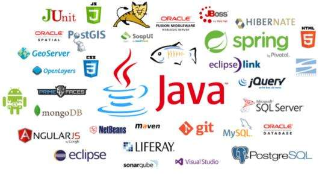
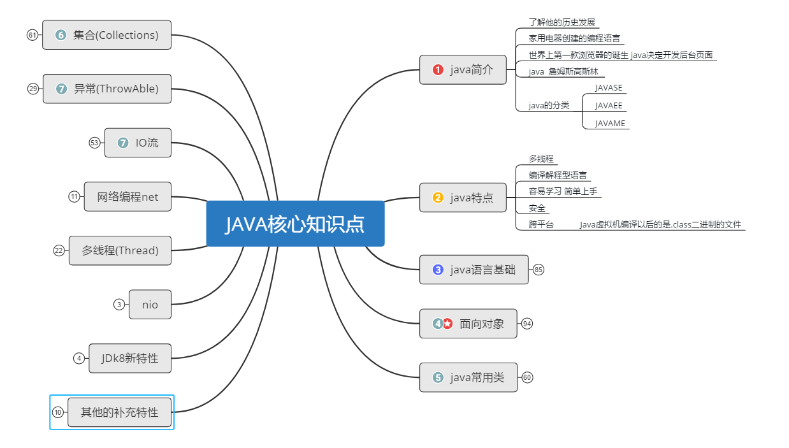

# Java课程大纲

> 最新版JAVASE课程大纲思维导图.

## 学习建议

> 1. 学习的过程中一定要自己去整理笔记。
>    + 课堂笔记老师做，下来自己进行整理
> 2. 纸上得来终觉浅，绝知此事要躬行
>    + 不要认为看完笔记和视频就学会了，一定要加强联系的强度
> 3. 在学习的过程中，不懂就问，问老师，问同学，不要感觉不好意思
> 4. 建立行之有效的学习方法(属于自己的学习方法)
>    + 学习编程的第一捷径就是------敲
>    + 学习编程的规范-----加注释
>    + 温故而知新---定期总结和复习回顾前面的知识

## 学习寄语

> 一台电脑，一个键盘，尽情挥洒智慧的人生；几行数字，几个字母，认真编写生活的美好；一个灵感，一段程序，推动科技进步，促进社会发展。程序员节，用心编写程序，用智慧照亮人生！

> 你把抽象符号变成快乐笑容，你把简单代码变出复杂意义，你演绎枯燥变情趣的游戏，你把辛苦留下捧出生活的神奇。程序员节日里，祝福程序员被幸福刷屏，被快乐链接。

> 作为一个真正的程序员，首先应该尊重编程，热爱你所写下的程序，他是你的伙伴，而不是工具。

> 编程中我们会遇到多少挫折？表放弃，沙漠尽头必是绿洲。

> 我们应该重视团队的精神，一个人作用再大，也不过是一碗水中比较大的一粒水珠而已。

---

___

