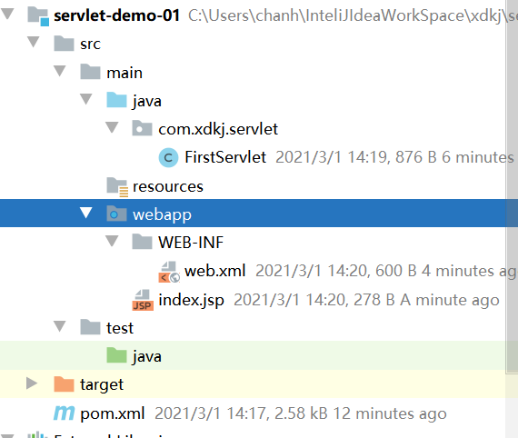
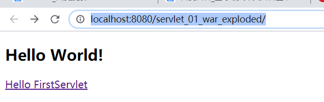
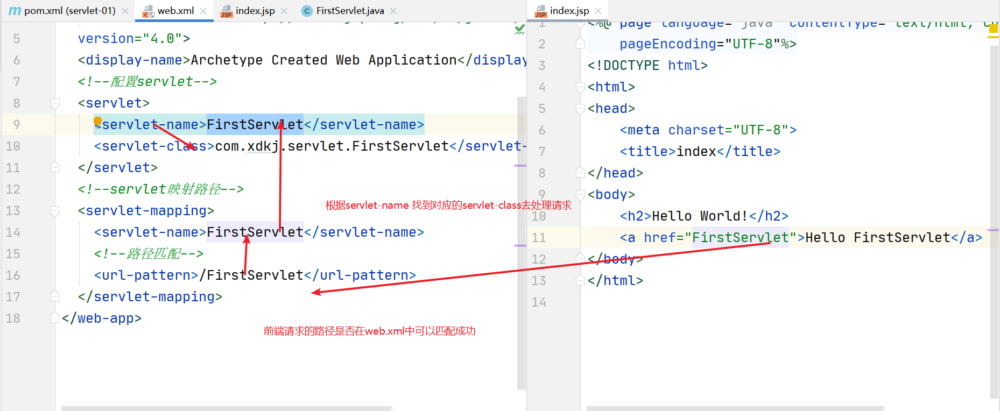
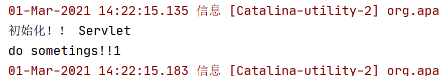

# Servlet

## 1. Http和Https

我们学完了静态页面的创建和美化。javascript页面动态添加。动画....ajax,  json

学完了服务器的搭建，tomcat免费的。

动态web技术，动态页面开发。

### 1.1 Http

> 超文本传输协议（Hypertext Transfer Protocol，HTTP）是一个简单的请求-响应协议，它通常运行在[TCP](https://baike.baidu.com/item/TCP/33012)之上。它指定了客户端可能发送给服务器什么样的消息以及得到什么样的响应。请求和响应消息的头以[ASCII](https://baike.baidu.com/item/ASCII/309296)形式给出；而消息内容则具有一个类似[MIME](https://baike.baidu.com/item/MIME/2900607)的格式。这个简单模型是早期[Web](https://baike.baidu.com/item/Web/150564)成功的有功之臣，因为它使开发和部署非常地直截了当。
>
> HTTP诞生之初主要是应用于WEB端内容获取，那时候内容还不像现在这样丰富，排版也没那么精美，用户交互的场景几乎没有。对于这种简单的获取网页内容的场景，HTTP表现得还算不错。但随着互联网的发展和WEB2．0的诞生，更多的内容开始被展示（更多的图片文件），排版变得更精美（更多的CSS），更复杂的交互也被引入（更多的jS）。用户打开一个网站首页所加载的数据总量和请求的个数也在不断增加。
>
> 今天绝大部分的门户网站首页大小都会超过2M，请求数量可以多达100个。另一个广泛的应用是在移动互联网的客户端app，不同性质的app对HTTP的使用差异很大。对于电商类app，加载首页的请求也可能多达10多个。对于微信这类IM，[HTTP请求](https://baike.baidu.com/item/HTTP请求/10882159)可能仅限于语音和图片文件的下载，请求出现的频率并不算高。

### 1.2 Https

> 　HTTP协议传输的数据都是未加密的，也就是明文的，因此使用HTTP协议传输隐私信息非常不安全，为了保证这些隐私数据能加密传输，于是网景公司设计了SSL（Secure Sockets Layer）协议用于对HTTP协议传输的数据进行加密，从而就诞生了HTTPS。简单来说，HTTPS协议是由SSL+HTTP协议构建的可进行加密传输、身份认证的网络协议，要比http协议安全。
>
> 　　HTTPS和HTTP的区别主要如下：
>
> 　　1、https协议需要到ca申请证书，一般免费证书较少，因而需要一定费用。
>
> 　　2、http是超文本传输协议，信息是明文传输，https则是具有安全性的ssl加密传输协议。
>
> 　　3、http和https使用的是完全不同的连接方式，用的端口也不一样，前者是80，后者是443。
>
> 　　4、http的连接很简单，是无状态的；HTTPS协议是由SSL+HTTP协议构建的可进行加密传输、身份认证的网络协议，比http协议安全。

https特点

>虽然说HTTPS有很大的优势，但其相对来说，还是存在不足之处的：
>
>　　（1）HTTPS协议握手阶段比较费时，会使页面的加载时间延长近50%，增加10%到20%的耗电；
>
>　　（2）HTTPS连接缓存不如HTTP高效，会增加数据开销和功耗，甚至已有的安全措施也会因此而受到影响；
>
>　　（3）SSL证书需要钱，功能越强大的证书费用越高，个人网站、小网站没有必要一般不会用。
>
>　  （4）SSL证书通常需要绑定IP，不能在同一IP上绑定多个域名，IPv4资源不可能支撑这个消耗。
>
>　　（5）HTTPS协议的加密范围也比较有限，在黑客攻击、拒绝服务攻击、服务器劫持等方面几乎起不到什么作用。最关键的，SSL证书的信用链体系并不安全，特别是在某些国家可以控制CA根证书的情况下，中间人攻击一样可行。

## 2. Servlet

> Servlet（Server Applet）是[Java](https://baike.baidu.com/item/Java/85979) Servlet的简称，称为小服务程序或服务连接器，用Java编写的[服务器](https://baike.baidu.com/item/服务器/100571)端程序，具有独立于平台和[协议](https://baike.baidu.com/item/协议/13020269)的特性，主要功能在于交互式地浏览和生成数据，生成动态[Web](https://baike.baidu.com/item/Web/150564)内容。
>
> 狭义的Servlet是指Java语言实现的一个接口，广义的Servlet是指任何实现了这个Servlet接口的类，一般情况下，人们将Servlet理解为后者。Servlet运行于支持Java的应用服务器中。从原理上讲，Servlet可以响应任何类型的请求，但绝大多数情况下Servlet只用来扩展基于[HTTP协议](https://baike.baidu.com/item/HTTP协议/1276942)的Web服务器。
>
> 最早支持Servlet标准的是JavaSoft的Java [Web Server](https://baike.baidu.com/item/Web Server/9306055)，此后，一些其它的基于Java的Web服务器开始支持标准的Servlet。

### 2.1 新建JavaWeb项目

#### 2.1.1 新建maven web项目



**保证项目的目录结构符合maven 项目的目录结构**

#### 2.1.2 添加项目依赖的jar包

**pom.xml**

```xml
<?xml version="1.0" encoding="UTF-8"?>

<project xmlns="http://maven.apache.org/POM/4.0.0" xmlns:xsi="http://www.w3.org/2001/XMLSchema-instance"
  xsi:schemaLocation="http://maven.apache.org/POM/4.0.0 http://maven.apache.org/xsd/maven-4.0.0.xsd">
  <modelVersion>4.0.0</modelVersion>

  <groupId>com.xdkj</groupId>
  <artifactId>servlet-01</artifactId>
  <version>1.0-SNAPSHOT</version>
  <packaging>war</packaging>

  <name>servlet-01 Maven Webapp</name>
  <!-- FIXME change it to the project's website -->
  <url>http://www.example.com</url>

  <properties>
    <project.build.sourceEncoding>UTF-8</project.build.sourceEncoding>
    <maven.compiler.source>1.8</maven.compiler.source>
    <maven.compiler.target>1.8</maven.compiler.target>
  </properties>

  <dependencies>
    <dependency>
      <groupId>junit</groupId>
      <artifactId>junit</artifactId>
      <version>4.12</version>
      <scope>test</scope>
    </dependency>
    <!--servlet的jar包-->
    <dependency>
      <groupId>javax.servlet</groupId>
      <artifactId>javax.servlet-api</artifactId>
      <version>4.0.1</version>
    </dependency>
    <!--jstl1.2-->
    <dependency>
      <groupId>jstl</groupId>
      <artifactId>jstl</artifactId>
      <version>1.2</version>
    </dependency>
  </dependencies>

  <build>
    <finalName>servlet-01</finalName>
    <pluginManagement><!-- lock down plugins versions to avoid using Maven defaults (may be moved to parent pom) -->
      <plugins>
        <plugin>
          <artifactId>maven-clean-plugin</artifactId>
          <version>3.1.0</version>
        </plugin>
        <!-- see http://maven.apache.org/ref/current/maven-core/default-bindings.html#Plugin_bindings_for_war_packaging -->
        <plugin>
          <artifactId>maven-resources-plugin</artifactId>
          <version>3.0.2</version>
        </plugin>
        <plugin>
          <artifactId>maven-compiler-plugin</artifactId>
          <version>3.8.0</version>
        </plugin>
        <plugin>
          <artifactId>maven-surefire-plugin</artifactId>
          <version>2.22.1</version>
        </plugin>
        <plugin>
          <artifactId>maven-war-plugin</artifactId>
          <version>3.2.2</version>
        </plugin>
        <plugin>
          <artifactId>maven-install-plugin</artifactId>
          <version>2.5.2</version>
        </plugin>
        <plugin>
          <artifactId>maven-deploy-plugin</artifactId>
          <version>2.8.2</version>
        </plugin>
      </plugins>
    </pluginManagement>
  </build>
</project>

```
#### 2.1.3 新建FirstServlet 实现Servlet接口

```java
package com.xdkj.servlet;

import javax.servlet.*;
import java.io.IOException;

/**
 * ClassName FirstServlet
 * Description:第一个Servlet
 *
 * @Author:一尘
 * @Version:1.0
 * @Date:2021-03-01-12:12
 */
public class FirstServlet  implements Servlet {
    /*初始化方法  服务器启动的时候初始化 并且只初始化一次*/
    @Override
    public void init(ServletConfig config) throws ServletException {
        System.out.println("初始化servlet");
    }

    @Override
    public ServletConfig getServletConfig() {
        return null;
    }
    /*进行servlet接收请求 发送响应的时候 执行一次调用一次*/
    @Override
    public void service(ServletRequest req, ServletResponse res) throws ServletException, IOException {
        System.out.println("do somethings");
    }

    @Override
    public String getServletInfo() {
        return null;
    }
    /*服务器停止的时候进行销毁*/
    @Override
    public void destroy() {
        System.out.println("servlet销毁！");
    }
}

```
#### 2.1.4 在web.xml中注册实现Servlet接口的类

```xml
<web-app xmlns="http://xmlns.jcp.org/xml/ns/javaee"
  xmlns:xsi="http://www.w3.org/2001/XMLSchema-instance"
  xsi:schemaLocation="http://xmlns.jcp.org/xml/ns/javaee
                      http://xmlns.jcp.org/xml/ns/javaee/web-app_4_0.xsd"
  version="4.0">
  <display-name>Archetype Created Web Application</display-name>
  <!--配置servlet-->
  <servlet>
    <servlet-name>FirstServlet</servlet-name>
    <servlet-class>com.xdkj.servlet.FirstServlet</servlet-class>
  </servlet>
  <!--servlet映射路径-->
  <servlet-mapping>
    <servlet-name>FirstServlet</servlet-name>
    <url-pattern>/FirstServlet</url-pattern>
  </servlet-mapping>
</web-app>
```
#### 2.1.5 在index.jsp中配置Servlet的映射路径

```html
<%@ page language="java" contentType="text/html; charset=UTF-8"
    pageEncoding="UTF-8"%>
<!DOCTYPE html>
<html>
<head>
    <meta charset="UTF-8">
    <title>index</title>
</head>
<body>
    <h2>Hello World!</h2>
    <a href="FirstServlet">Hello FirstServlet</a>
</body>
</html>

```

#### 2.1.6 浏览器打开首页点击查看效果



#### 2.1.7 Servlet接口实现类 如何实现接收请求和处理响应



### 2.2  项目启动控制台输出日志

**第一次点击发送请求 初始化 和 调用 service方法**



**init 方法只调用一次**

**destroy 在服务器停止的时候调用一次**

