# Servlet

## 1. Http和Https

我们学完了静态页面的创建和美化。javascript页面动态添加。动画....ajax,  json

学完了服务器的搭建，tomcat免费的。

动态web技术，动态页面开发。

### 1.1 Http

> 超文本传输协议（Hypertext Transfer Protocol，HTTP）是一个简单的请求-响应协议，它通常运行在[TCP](https://baike.baidu.com/item/TCP/33012)之上。它指定了客户端可能发送给服务器什么样的消息以及得到什么样的响应。请求和响应消息的头以[ASCII](https://baike.baidu.com/item/ASCII/309296)形式给出；而消息内容则具有一个类似[MIME](https://baike.baidu.com/item/MIME/2900607)的格式。这个简单模型是早期[Web](https://baike.baidu.com/item/Web/150564)成功的有功之臣，因为它使开发和部署非常地直截了当。
>
> HTTP诞生之初主要是应用于WEB端内容获取，那时候内容还不像现在这样丰富，排版也没那么精美，用户交互的场景几乎没有。对于这种简单的获取网页内容的场景，HTTP表现得还算不错。但随着互联网的发展和WEB2．0的诞生，更多的内容开始被展示（更多的图片文件），排版变得更精美（更多的CSS），更复杂的交互也被引入（更多的jS）。用户打开一个网站首页所加载的数据总量和请求的个数也在不断增加。
>
> 今天绝大部分的门户网站首页大小都会超过2M，请求数量可以多达100个。另一个广泛的应用是在移动互联网的客户端app，不同性质的app对HTTP的使用差异很大。对于电商类app，加载首页的请求也可能多达10多个。对于微信这类IM，[HTTP请求](https://baike.baidu.com/item/HTTP请求/10882159)可能仅限于语音和图片文件的下载，请求出现的频率并不算高。

### 1.2 Https

> 　HTTP协议传输的数据都是未加密的，也就是明文的，因此使用HTTP协议传输隐私信息非常不安全，为了保证这些隐私数据能加密传输，于是网景公司设计了SSL（Secure Sockets Layer）协议用于对HTTP协议传输的数据进行加密，从而就诞生了HTTPS。简单来说，HTTPS协议是由SSL+HTTP协议构建的可进行加密传输、身份认证的网络协议，要比http协议安全。
>
> 　　HTTPS和HTTP的区别主要如下：
>
> 　　1、https协议需要到ca申请证书，一般免费证书较少，因而需要一定费用。
>
> 　　2、http是超文本传输协议，信息是明文传输，https则是具有安全性的ssl加密传输协议。
>
> 　　3、http和https使用的是完全不同的连接方式，用的端口也不一样，前者是80，后者是443。
>
> 　　4、http的连接很简单，是无状态的；HTTPS协议是由SSL+HTTP协议构建的可进行加密传输、身份认证的网络协议，比http协议安全。

https特点

>虽然说HTTPS有很大的优势，但其相对来说，还是存在不足之处的：
>
>　　（1）HTTPS协议握手阶段比较费时，会使页面的加载时间延长近50%，增加10%到20%的耗电；
>
>　　（2）HTTPS连接缓存不如HTTP高效，会增加数据开销和功耗，甚至已有的安全措施也会因此而受到影响；
>
>　　（3）SSL证书需要钱，功能越强大的证书费用越高，个人网站、小网站没有必要一般不会用。
>
>　  （4）SSL证书通常需要绑定IP，不能在同一IP上绑定多个域名，IPv4资源不可能支撑这个消耗。
>
>　　（5）HTTPS协议的加密范围也比较有限，在黑客攻击、拒绝服务攻击、服务器劫持等方面几乎起不到什么作用。最关键的，SSL证书的信用链体系并不安全，特别是在某些国家可以控制CA根证书的情况下，中间人攻击一样可行。

## 2. Servlet

> Servlet（Server Applet）是[Java](https://baike.baidu.com/item/Java/85979) Servlet的简称，称为小服务程序或服务连接器，用Java编写的[服务器](https://baike.baidu.com/item/服务器/100571)端程序，具有独立于平台和[协议](https://baike.baidu.com/item/协议/13020269)的特性，主要功能在于交互式地浏览和生成数据，生成动态[Web](https://baike.baidu.com/item/Web/150564)内容。
>
> 狭义的Servlet是指Java语言实现的一个接口，广义的Servlet是指任何实现了这个Servlet接口的类，一般情况下，人们将Servlet理解为后者。Servlet运行于支持Java的应用服务器中。从原理上讲，Servlet可以响应任何类型的请求，但绝大多数情况下Servlet只用来扩展基于[HTTP协议](https://baike.baidu.com/item/HTTP协议/1276942)的Web服务器。
>
> 最早支持Servlet标准的是JavaSoft的Java [Web Server](https://baike.baidu.com/item/Web Server/9306055)，此后，一些其它的基于Java的Web服务器开始支持标准的Servlet。

### 2.1 新建JavaWeb项目

#### 2.1.1 新建maven web项目

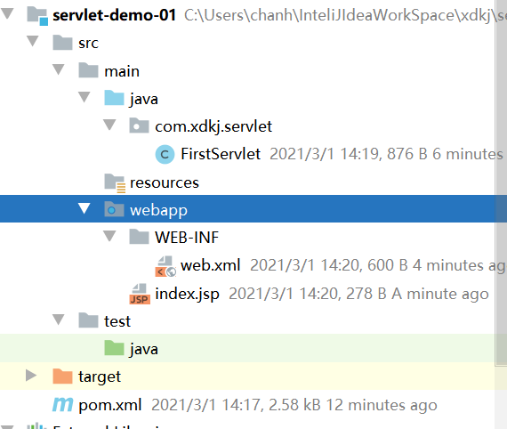

**保证项目的目录结构符合maven 项目的目录结构**

#### 2.1.2 添加项目依赖的jar包

**pom.xml**

```xml
<?xml version="1.0" encoding="UTF-8"?>

<project xmlns="http://maven.apache.org/POM/4.0.0" xmlns:xsi="http://www.w3.org/2001/XMLSchema-instance"
  xsi:schemaLocation="http://maven.apache.org/POM/4.0.0 http://maven.apache.org/xsd/maven-4.0.0.xsd">
  <modelVersion>4.0.0</modelVersion>

  <groupId>com.xdkj</groupId>
  <artifactId>servlet-01</artifactId>
  <version>1.0-SNAPSHOT</version>
  <packaging>war</packaging>

  <name>servlet-01 Maven Webapp</name>
  <!-- FIXME change it to the project's website -->
  <url>http://www.example.com</url>

  <properties>
    <project.build.sourceEncoding>UTF-8</project.build.sourceEncoding>
    <maven.compiler.source>1.8</maven.compiler.source>
    <maven.compiler.target>1.8</maven.compiler.target>
  </properties>

  <dependencies>
    <dependency>
      <groupId>junit</groupId>
      <artifactId>junit</artifactId>
      <version>4.12</version>
      <scope>test</scope>
    </dependency>
    <!--servlet的jar包-->
    <dependency>
      <groupId>javax.servlet</groupId>
      <artifactId>javax.servlet-api</artifactId>
      <version>4.0.1</version>
    </dependency>
    <!--jstl1.2-->
    <dependency>
      <groupId>jstl</groupId>
      <artifactId>jstl</artifactId>
      <version>1.2</version>
    </dependency>
  </dependencies>

  <build>
    <finalName>servlet-01</finalName>
    <pluginManagement><!-- lock down plugins versions to avoid using Maven defaults (may be moved to parent pom) -->
      <plugins>
        <plugin>
          <artifactId>maven-clean-plugin</artifactId>
          <version>3.1.0</version>
        </plugin>
        <!-- see http://maven.apache.org/ref/current/maven-core/default-bindings.html#Plugin_bindings_for_war_packaging -->
        <plugin>
          <artifactId>maven-resources-plugin</artifactId>
          <version>3.0.2</version>
        </plugin>
        <plugin>
          <artifactId>maven-compiler-plugin</artifactId>
          <version>3.8.0</version>
        </plugin>
        <plugin>
          <artifactId>maven-surefire-plugin</artifactId>
          <version>2.22.1</version>
        </plugin>
        <plugin>
          <artifactId>maven-war-plugin</artifactId>
          <version>3.2.2</version>
        </plugin>
        <plugin>
          <artifactId>maven-install-plugin</artifactId>
          <version>2.5.2</version>
        </plugin>
        <plugin>
          <artifactId>maven-deploy-plugin</artifactId>
          <version>2.8.2</version>
        </plugin>
      </plugins>
    </pluginManagement>
  </build>
</project>

```
#### 2.1.3 新建FirstServlet 实现Servlet接口

```java
package com.xdkj.servlet;

import javax.servlet.*;
import java.io.IOException;

/**
 * ClassName FirstServlet
 * Description:第一个Servlet
 *
 * @Author:一尘
 * @Version:1.0
 * @Date:2021-03-01-12:12
 */
public class FirstServlet  implements Servlet {
    /*初始化方法  服务器启动的时候初始化 并且只初始化一次*/
    @Override
    public void init(ServletConfig config) throws ServletException {
        System.out.println("初始化servlet");
    }

    @Override
    public ServletConfig getServletConfig() {
        return null;
    }
    /*进行servlet接收请求 发送响应的时候 执行一次调用一次*/
    @Override
    public void service(ServletRequest req, ServletResponse res) throws ServletException, IOException {
        System.out.println("do somethings");
    }

    @Override
    public String getServletInfo() {
        return null;
    }
    /*服务器停止的时候进行销毁*/
    @Override
    public void destroy() {
        System.out.println("servlet销毁！");
    }
}

```
#### 2.1.4 在web.xml中注册实现Servlet接口的类

```xml
<web-app xmlns="http://xmlns.jcp.org/xml/ns/javaee"
  xmlns:xsi="http://www.w3.org/2001/XMLSchema-instance"
  xsi:schemaLocation="http://xmlns.jcp.org/xml/ns/javaee
                      http://xmlns.jcp.org/xml/ns/javaee/web-app_4_0.xsd"
  version="4.0">
  <display-name>Archetype Created Web Application</display-name>
  <!--配置servlet-->
  <servlet>
    <servlet-name>FirstServlet</servlet-name>
    <servlet-class>com.xdkj.servlet.FirstServlet</servlet-class>
  </servlet>
  <!--servlet映射路径-->
  <servlet-mapping>
    <servlet-name>FirstServlet</servlet-name>
    <url-pattern>/FirstServlet</url-pattern>
  </servlet-mapping>
</web-app>
```
#### 2.1.5 在index.jsp中配置Servlet的映射路径

```html
<%@ page language="java" contentType="text/html; charset=UTF-8"
    pageEncoding="UTF-8"%>
<!DOCTYPE html>
<html>
<head>
    <meta charset="UTF-8">
    <title>index</title>
</head>
<body>
    <h2>Hello World!</h2>
    <a href="FirstServlet">Hello FirstServlet</a>
</body>
</html>

```

#### 2.1.6 浏览器打开首页点击查看效果

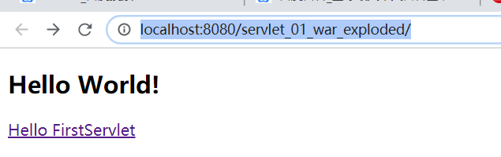

#### 2.1.7 Servlet接口实现类 如何实现接收请求和处理响应

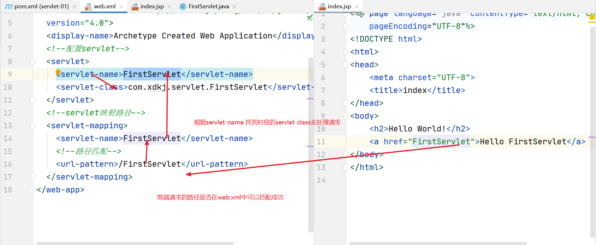

### 2.2 servlet映射路径的配置

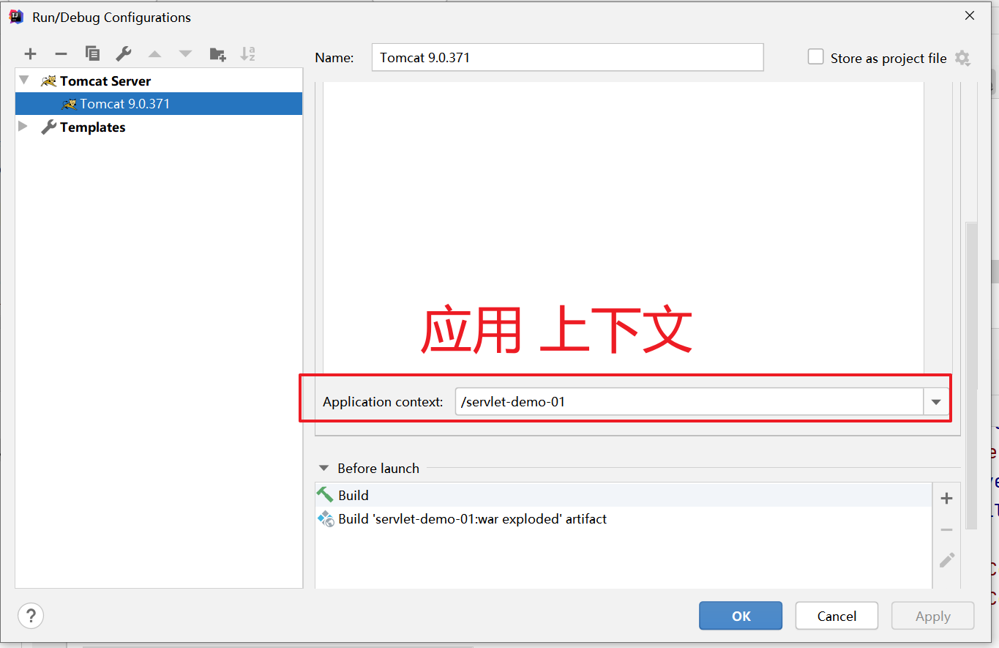

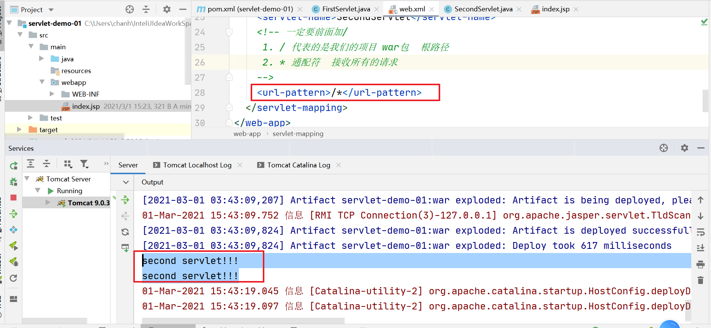

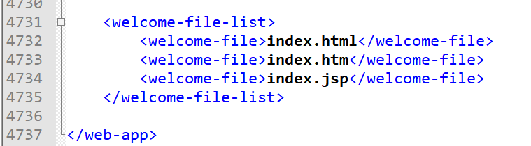

```xml
<web-app xmlns="http://xmlns.jcp.org/xml/ns/javaee"
  xmlns:xsi="http://www.w3.org/2001/XMLSchema-instance"
  xsi:schemaLocation="http://xmlns.jcp.org/xml/ns/javaee
                      http://xmlns.jcp.org/xml/ns/javaee/web-app_4_0.xsd"
  version="4.0">

  <display-name>Archetype Created Web Application</display-name>
  <servlet>
    <servlet-name>FirstServlet</servlet-name>
    <servlet-class>com.xdkj.servlet.FirstServlet</servlet-class>
  </servlet>
  <servlet-mapping>
    <servlet-name>FirstServlet</servlet-name>
    <!--路径的匹配规则-->
    <url-pattern>/login</url-pattern>
  </servlet-mapping>

<servlet>
  <servlet-name>SecondServlet</servlet-name>
  <servlet-class>com.xdkj.servlet.SecondServlet</servlet-class>
</servlet>
  <servlet-mapping>
    <servlet-name>SecondServlet</servlet-name>
    <!-- 一定要前面加/
     1. / 代表的是我们的项目 war包  根路径
     2. * 通配符  接收所有的请求
     3. 多层级的路径配置
    -->
    <url-pattern>/user/login</url-pattern>
  </servlet-mapping>
</web-app>
```

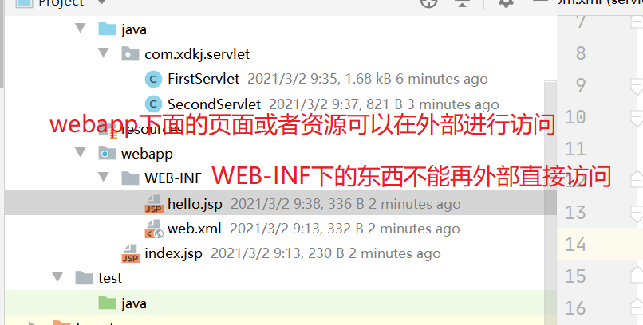

**为什么服务器有直接可以访问的还有不能直接访问的?**


### 2.3  项目启动控制台输出日志

**第一次点击发送请求 初始化 和 调用 service方法**

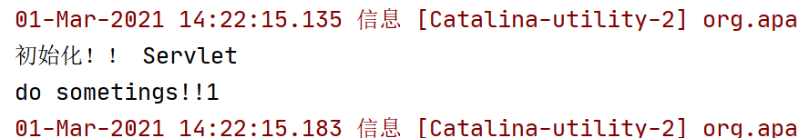

**init 方法只调用一次**

**destroy 在服务器停止的时候调用一次**

### 2.4 Servlet的生命周期

#### 2.4.1 Servlet生命周期

1. The servlet is constructed, then initialized with the `init`  method.构造servlet，然后init方法初始化。 
2. Any calls from clients to the `service` method are  handled.处理客户端对service方法的任何调用。 
3. The servlet is taken out of service, then destroyed with the  `destroy` method, then garbage collected and finalized.  Servlet从服务中取出，然后destory方法清除，接着垃圾收集和终止。 

#### 2.4.2 init 方法

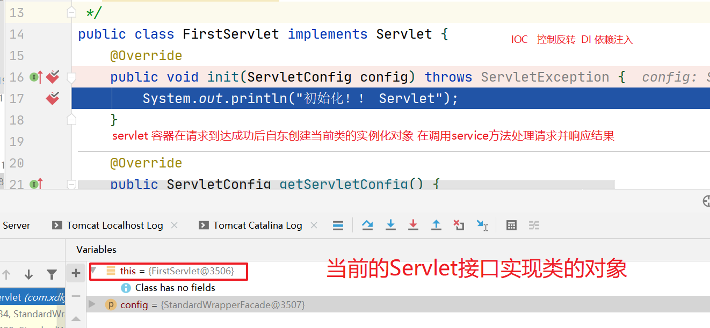

#### 2.4.3 service 方法

> 接受请求 处理请求响应处理后的结果

#### 2.4.4 destroy方法

> 由servlet容器调用，表示servlet正被服务清除。该方法只在servlet的service方法退出或者超时被所有线程调用一次。 servlet容器调用该方法后，servlet不会再次调用service方法。
>
> 移除servlet创建的对象。由垃圾回收机制清理不用的其他对象。

## 3. GenericServlet

> `GenericServlet` makes writing servlets easier. It provides simple  versions of the lifecycle methods `init` and `destroy` and  of the methods in the `ServletConfig` interface.  `GenericServlet` also implements the `log` method,  declared in the `ServletContext` interface.  GenericServlet使得写servlet更容易。它提供了生命周期方法init、destroy和ServletConfig接口方法的简单版本。  GenericServlet也实现了在ServletContext接口中声明的log方法。 

>GenericServlet是Servlet接口的实现类，是对Servlet接口的增强，如果是基于Http协议的，去继承这个GenericServlet的子类HttpServlet.

## 4. HttpServlet

> - public abstract class **HttpServlet**
> - extends [GenericServlet](../../../javax/servlet/GenericServlet.html)
> - implements java.io.Serializable
>
> Provides an abstract class to be subclassed to create an HTTP servlet  suitable for a Web site. A subclass of `HttpServlet` must override at  least one method, usually one of these: 
>
> - `doGet`, if the servlet supports HTTP GET requests 
> - `doPost`, for HTTP POST requests 
> - `doPut`, for HTTP PUT requests 
> - `doDelete`, for HTTP DELETE requests 
> - `init` and `destroy`, to manage resources that are  held for the life of the servlet 
> - `getServletInfo`, which the servlet uses to provide information  about itself 
>
> There's almost no reason to override the `service` method.  `service` handles standard HTTP requests by dispatching them to the  handler methods for each HTTP request type (the `do`*XXX*  methods listed above). 通常没有必要去重写service方法，serice处理标准的http请求去根据http请求的类型分发他们。（doXXX方法去处理）
>
> Likewise, there's almost no reason to override the `doOptions` and  `doTrace` methods. 
>
> Servlets typically run on multithreaded servers, so be aware that a servlet  must handle concurrent requests and be careful to synchronize access to shared  resources. Shared resources include in-memory data such as instance or class  variables and external objects such as files, database connections, and network  connections. See the [Java  Tutorial on Multithreaded Programming](http://java.sun.com/Series/Tutorial/java/threads/multithreaded.html) for more information on handling  multiple threads in a Java program. 

**ThreeHttpServlet.java**

```java
package com.xdkj.servlet;

import javax.servlet.ServletException;
import javax.servlet.http.HttpServlet;
import javax.servlet.http.HttpServletRequest;
import javax.servlet.http.HttpServletResponse;
import java.io.IOException;

/**
 * ClassName ThreeHttpServlet
 * Description:
 *
 * @Author:一尘
 * @Version:1.0
 * @Date:2021-03-01-16:36
 */
public class ThreeHttpServlet  extends HttpServlet {
    @Override
    protected void doGet(HttpServletRequest req, HttpServletResponse resp)
            throws ServletException, IOException {
        System.out.println("get  method!!!");
    }

    @Override
    protected void doPost(HttpServletRequest req, HttpServletResponse resp)
            throws ServletException, IOException {
        System.out.println("post method!!");
    }
}

```

**web.xml**

```xml
<web-app xmlns="http://xmlns.jcp.org/xml/ns/javaee"
  xmlns:xsi="http://www.w3.org/2001/XMLSchema-instance"
  xsi:schemaLocation="http://xmlns.jcp.org/xml/ns/javaee
                      http://xmlns.jcp.org/xml/ns/javaee/web-app_4_0.xsd"
  version="4.0">

  <display-name>Archetype Created Web Application</display-name>
  
  <servlet>
    <servlet-name>ThreeHttpServlet</servlet-name>
    <servlet-class>com.xdkj.servlet.ThreeHttpServlet</servlet-class>
  </servlet>
  <servlet-mapping>
    <servlet-name>ThreeHttpServlet</servlet-name>
    <url-pattern>/three</url-pattern>
  </servlet-mapping>
</web-app>
```

```properties
初始化！！ Servlet
do sometings!!1
get  method!!!
01-Mar-2021 16:39:30.633 信息 [Catalina-utility-2] org.apache.catalina.startup.HostConfig.deployDirectory 把web 应用程序部署到目录 [F:\apache-tomcat-9.0.37\webapps\manager]
01-Mar-2021 16:39:30.675 信息 [Catalina-utility-2] org.apache.catalina.startup.HostConfig.deployDirectory Web应用程序目录[F:\apache-tomcat-9.0.37\webapps\manager]的部署已在[40]毫秒内完成
post method!!
```

**HttpServlet会根据不同的请求方式调用不同的doXXX方法处理请求(由service方法根据请求方式做分发)**

## 5. Servlet注解开发

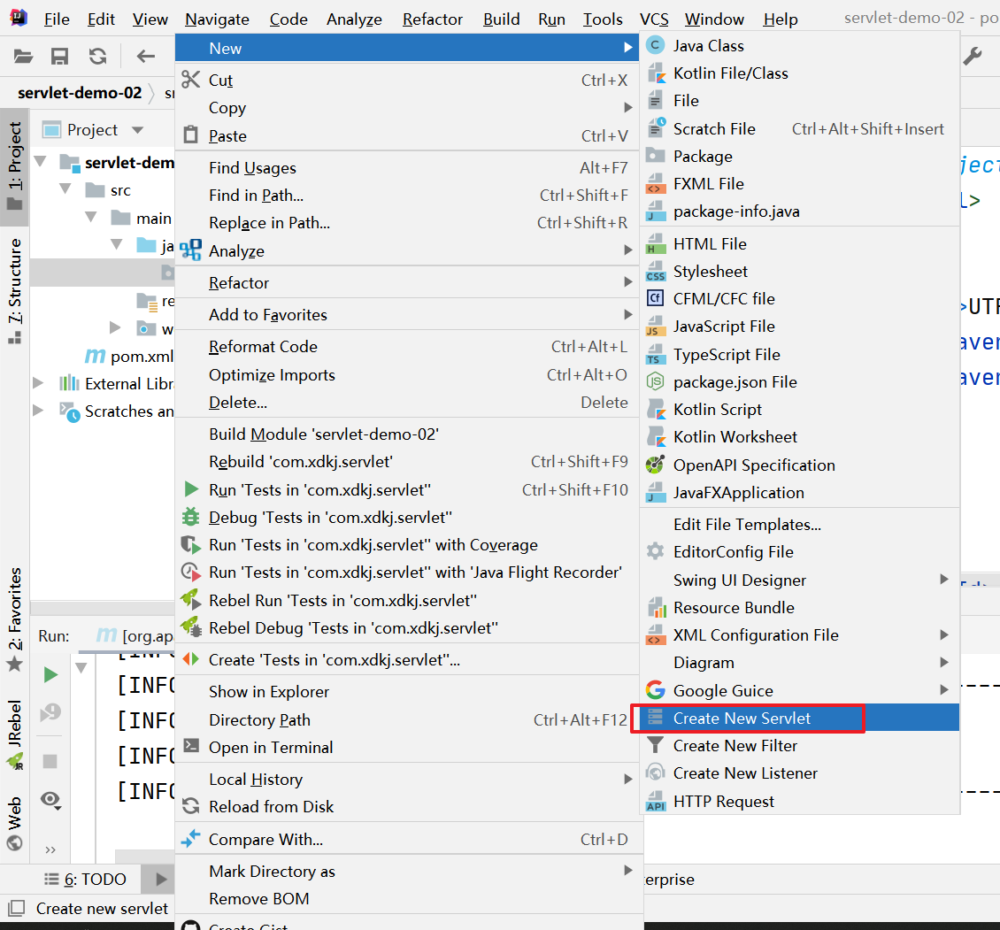

```java
package com.xdkj.servlet;

import javax.servlet.ServletException;
import javax.servlet.annotation.WebServlet;
import javax.servlet.http.HttpServlet;
import javax.servlet.http.HttpServletRequest;
import javax.servlet.http.HttpServletResponse;
import java.io.IOException;
/*servlte注解  name 可以省略  urlPatterns 必须添加*/
@WebServlet(name = "AnnotationServlet",urlPatterns = "/annotation")
public class AnnotationServlet extends HttpServlet {
    protected void doPost(HttpServletRequest request, HttpServletResponse response) throws ServletException, IOException {

    }

    protected void doGet(HttpServletRequest request, HttpServletResponse response) throws ServletException, IOException {
        System.out.println("do get method!!!!!");
    }
}

```

```html
<%@ page language="java" contentType="text/html; charset=UTF-8"
    pageEncoding="UTF-8"%>
<!DOCTYPE html>
<html>
<head>
    <meta charset="UTF-8">
    <title>index</title>
</head>
<body>
    <h2>Hello World!</h2>
    <a href="annotation">AnnotationServlet/a>
</body>
</html>

```


部署运行

## 6. ServletContext

> ServletContext servlet的上下文环境。全局的作用域。
>
> 我们可以在ServletContext中获取彼此的一些信息。和全局的参数等。
>
> ServletContext中配置的信息被所有的Servlet所共享

+ getInitparameter() 获取全局的初始化的参数
+ getInitParameterNames()
+ getRealPath()  获取真实的物理路径
+ getResourceAsStream()  获取资源转换为输入流  指定路径(必须是webapp下面的内容)
+ getServletContextName() 获取根路径
+ setAttribute()  设置属性
+ getAttribute()  获取属性
+ removeAttribute()  移除属性
+ getAttributeNames()  获取所有的属性名
+ getRequestDispacther()  获取资源分发器  

**ServletContextDemo.java**

```java
package com.xdkj.servlet;

import javax.servlet.ServletContext;
import javax.servlet.ServletException;
import javax.servlet.annotation.WebServlet;
import javax.servlet.http.HttpServlet;
import javax.servlet.http.HttpServletRequest;
import javax.servlet.http.HttpServletResponse;
import java.io.IOException;
import java.io.InputStream;
import java.util.Enumeration;
import java.util.Properties;

/**
 * ClassName ServletContextDemo
 * Description:
 *
 * @Author:一尘
 * @Version:1.0
 * @Date:2021-03-02-10:05
 */
@WebServlet("/servletContextDemo")
public class ServletContextDemo extends HttpServlet {
    @Override
    protected void doGet(HttpServletRequest req, HttpServletResponse resp)
            throws ServletException, IOException {
        /*先获取ServletContext的实现类的对象
        * org.apache.catalina.core.ApplicationContextFacade@192e22ed
        * 接口实现类的对象什么时候创建的?
        * 容器帮我们在初始化的时候创建的。
        * */
        ServletContext servletContext =  this.getServletContext();
        System.out.println(servletContext);
        System.out.println(servletContext.getInitParameter("encoding"));
        /*获取所有的共享的数据  多个配置的信息数据*/
        Enumeration<String> initParameterNames = servletContext.getInitParameterNames();
        while(initParameterNames.hasMoreElements()){
            String name = initParameterNames.nextElement();
            String value = servletContext.getInitParameter(name);
            System.out.println(value);
        }
        /*获取资源的真实的物理路径   */
        System.out.println(servletContext.getRealPath("upload"));
        InputStream  inputStream =  servletContext.getResourceAsStream("db.properties");
        Properties properties = new Properties();
        properties.load(inputStream);
        System.out.println(properties.getProperty("jdbc.username"));
        System.out.println(inputStream);
        //Archetype Created Web Application
        System.out.println(servletContext.getServletContextName());
        //向上下文绑定属性
        servletContext.setAttribute("name","HelloWorld");
        /*页面跳转*/
        servletContext.getRequestDispatcher("/hello.html").forward(req,resp);
    }

    @Override
    protected void doPost(HttpServletRequest req, HttpServletResponse resp)
            throws ServletException, IOException {
        doGet(req,resp);
    }
}

```

**SecondServlet.java**

```java
package com.xdkj.servlet;

import javax.servlet.ServletContext;
import javax.servlet.ServletException;
import javax.servlet.annotation.WebServlet;
import javax.servlet.http.HttpServlet;
import javax.servlet.http.HttpServletRequest;
import javax.servlet.http.HttpServletResponse;
import java.io.IOException;

/**
 * ClassName SecondServlet
 * Description:
 *
 * @Author:一尘
 * @Version:1.0
 * @Date:2021-03-02-10:19
 */
@WebServlet("/secondServlet")
public class SecondServlet  extends HttpServlet {
    @Override
    protected void doGet(HttpServletRequest req, HttpServletResponse resp)
            throws ServletException, IOException {
        ServletContext  servletContext = this.getServletContext();
        System.out.println(servletContext.getInitParameter("encoding"));

        //获取上下文对象的属性
        System.out.println(servletContext.getAttribute("name"));

    }

    @Override
    protected void doPost(HttpServletRequest req, HttpServletResponse resp)
            throws ServletException, IOException {
        doGet(req,resp);
    }
}

```

**web.xml**

```xml
<web-app xmlns="http://xmlns.jcp.org/xml/ns/javaee"
  xmlns:xsi="http://www.w3.org/2001/XMLSchema-instance"
  xsi:schemaLocation="http://xmlns.jcp.org/xml/ns/javaee
                      http://xmlns.jcp.org/xml/ns/javaee/web-app_4_0.xsd"
  version="4.0">

  <display-name>Archetype Created Web Application</display-name>
  <!--全局的初始化参数-->
  <context-param>
    <param-name>encoding</param-name>
    <param-value>GBK</param-value>
  </context-param>
  <context-param>
    <param-name>address</param-name>
    <param-value>西安市</param-value>
  </context-param>
</web-app>
```

**index.jsp**

```html
<%@ page language="java" contentType="text/html; charset=UTF-8"
    pageEncoding="UTF-8"%>
<!DOCTYPE html>
<html>
<head>
    <meta charset="UTF-8">
    <title>index</title>
</head>
<body>
    <h2>Hello World!</h2>
    <a href="servletContextDemo">ServletContextDemo</a>
    <br>
    <a href="secondServlet">SecondServlet</a>
    <%--el表达式--%>
    ${name}
</body>
</html>

```

**hello.html**

```html
<!DOCTYPE html>
<html lang="en">
<head>
    <meta charset="UTF-8">
    <title>hello</title>
</head>
<body>
    <h3>Hello html page!!!!!!!!!!!</h3>
</body>
</html>
```


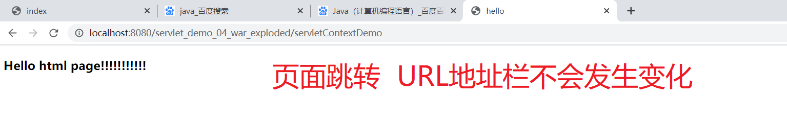

## 7. ServletConfig

> A servlet configuration object used by a servlet container to pass information  to a servlet during initialization. 一个servlet配置对象，在初始化过程中由servlet容器传递信息给servlet。 
>
> ServletConfig 是当前的Servlet的类的配置信息的对象  别的servlet获取不到。

**ServletConfigDemo.java**

```java
package com.xdkj.servlet;

import javax.servlet.ServletConfig;
import javax.servlet.ServletException;
import javax.servlet.http.HttpServlet;
import javax.servlet.http.HttpServletRequest;
import javax.servlet.http.HttpServletResponse;
import java.io.IOException;

/**
 * ClassName ServletConfigDemo
 * Description:
 *
 * @Author:一尘
 * @Version:1.0
 * @Date:2021-03-02-14:16
 */
//@WebServlet("/servletConfigDemo")
public class ServletConfigDemo extends HttpServlet {
    @Override
    protected void doGet(HttpServletRequest req, HttpServletResponse resp)
            throws ServletException, IOException {
        /* ServletConfig 由容器传递信息给Servlet  当servlet初始化的时候*/
        ServletConfig  config =  this.getServletConfig();
        System.out.println(config);
        System.out.println(config.getInitParameter("name"));
        System.out.println(config.getInitParameter("encoding"));
    }

    @Override
    protected void doPost(HttpServletRequest req, HttpServletResponse resp)
            throws ServletException, IOException {
        doGet(req,resp);
    }
}

```


**web.xml**

```xml
<web-app xmlns="http://xmlns.jcp.org/xml/ns/javaee"
  xmlns:xsi="http://www.w3.org/2001/XMLSchema-instance"
  xsi:schemaLocation="http://xmlns.jcp.org/xml/ns/javaee
                      http://xmlns.jcp.org/xml/ns/javaee/web-app_4_0.xsd"
  version="4.0">

  <display-name>Archetype Created Web Application</display-name>
  <!--全局的初始化参数-->
  <context-param>
    <param-name>encoding</param-name>
    <param-value>GBK</param-value>
  </context-param>
  <context-param>
    <param-name>address</param-name>
    <param-value>西安市</param-value>
  </context-param>
  <servlet>
    <servlet-name>ServletConfigDemo</servlet-name>
    <servlet-class>com.xdkj.servlet.ServletConfigDemo</servlet-class>
    <!--当前的servlet初始化参数-->
    <init-param>
      <param-name>encoding</param-name>
      <param-value>utf8</param-value>
    </init-param>
    <init-param>
      <param-name>name</param-name>
      <param-value>joke</param-value>
    </init-param>
  </servlet>
  <servlet-mapping>
    <servlet-name>ServletConfigDemo</servlet-name>
    <url-pattern>/servletConfigDemo</url-pattern>
  </servlet-mapping>
</web-app>
```

**注解配置初始化信息:**

```java
package com.xdkj.servlet;

import javax.servlet.ServletConfig;
import javax.servlet.ServletContext;
import javax.servlet.ServletException;
import javax.servlet.annotation.WebInitParam;
import javax.servlet.annotation.WebServlet;
import javax.servlet.http.HttpServlet;
import javax.servlet.http.HttpServletRequest;
import javax.servlet.http.HttpServletResponse;
import java.io.IOException;
import java.util.Enumeration;

/**
 * ClassName ServletConfigDemo
 * Description:
 *
 * @Author:一尘
 * @Version:1.0
 * @Date:2021-03-02-14:16
 */
@WebServlet(urlPatterns = "/servletConfigDemo",
        initParams = {@WebInitParam(name="encoding",value = "utf8"),
                @WebInitParam(name="address",value = "USA")
})
public class ServletConfigDemo extends HttpServlet {
    @Override
    protected void doGet(HttpServletRequest req, HttpServletResponse resp)
            throws ServletException, IOException {
        /* ServletConfig 由容器传递信息给Servlet  当servlet初始化的时候*/
        ServletConfig  config =  this.getServletConfig();
        System.out.println(config);
        System.out.println(config.getInitParameter("address"));
        System.out.println(config.getInitParameter("encoding"));
        Enumeration<String> initParameterNames = config.getInitParameterNames();
        while(initParameterNames.hasMoreElements()){
            String name = initParameterNames.nextElement();
            String value = config.getInitParameter(name);
            System.out.println(name + "="+ value);
        }
        //        获取servlet全限定性名称
        System.out.println(config.getServletName());
        /*获取全局的配置对象*/
        ServletContext servletContext = config.getServletContext();
        System.out.println(servletContext);
    }

    @Override
    protected void doPost(HttpServletRequest req, HttpServletResponse resp)
            throws ServletException, IOException {
        doGet(req,resp);
    }
}

```

## 8. HttpServletRequest :imp:

> Extends the [`ServletRequest`](../../../javax/servlet/ServletRequest.html)  interface to provide request information for HTTP servlets. 
>
> The servlet container creates an `HttpServletRequest` object and  passes it as an argument to the servlet's service methods (`doGet`,  `doPost`, etc). 
>
> 继承自ServletReuest 
>
> servlrt容器初始化接口的实现类的对象 传递给我们去使用  在请求到达的时候在进行实例化对象，传递给doXXX方法去使用。

+ :star:getContextPath()  获取项目的根路径 :star:
+ :star:getCookies() 获取所有的cookie 
+ getDateHeader()  获取日期头
+ :star:getHeader()  获取请求头信息
+ getHeaderNames() 获取所有的请求名称
+ :star:getMethod() 请求方式
+ getPathInfo()
+ getQueryString() 
+ getRemoteUser()
+ :star:getRequestURL()
+ :star:getRequestURI()
+ getServletPath()
+ :star:getSession()
+ :star:getAttribute()
+ :star:setAttribute()
+ :star:removeAttribute()
+ :star:getCharacterEncoding()
+ getContentLength()
+ getContentTYpe()
+ :star:getInputStream()
+ getLocale()
+ getLocalPort()
+ getLocalName()
+ :star:getParameter()
+ :star:getParameterMap()
+ getParameterNames()
+ getParameterValues()
+ :star:getReader()
+ :star:getRealPath()
+ getRemoteAddr()
+ getRemotePort()
+ :star:getRequestDispatcher()
+ :star:getScheme()  获取网络协议
+ :star:getServerName()  获取主机名称
+ :star:getServerPort()  获取主机端口
+ :star:setCharacterEncoding()

**HttpServletRequestDemo.java**

```java
package com.xdkj.servlet.HttpServletRequestDemo;

import javax.servlet.ServletException;
import javax.servlet.annotation.WebServlet;
import javax.servlet.http.HttpServlet;
import javax.servlet.http.HttpServletRequest;
import javax.servlet.http.HttpServletResponse;
import java.io.IOException;
import java.util.Enumeration;

@WebServlet(name = "HttpServletRequestDemo",urlPatterns = "/httpServletRequestDemo")
public class HttpServletRequestDemo extends HttpServlet {
    @Override
    protected void doPost(HttpServletRequest request, HttpServletResponse response)
            throws ServletException, IOException {
        //org.apache.catalina.connector.RequestFacade@27091857
        /*根据不同的客户端  创建不同的HttpServletRequest对象  请求到达的时候在创建对象*/
            System.out.println(request);
        System.out.println("---------------------获取项目信息------------");
        //项目部署的根路径
        System.out.println(request.getContextPath());
        System.out.println("---------------获取服务器相关的信息--------------");
        System.out.println(request.getScheme());//http
        System.out.println(request.getServerName());//主机
        System.out.println(request.getServerPort());//端口
        //远程服务器
        System.out.println(request.getRemoteUser());
        System.out.println(request.getRemoteAddr());
        System.out.println(request.getRemoteHost());
        System.out.println(request.getRemotePort());
        //本地服务器
        System.out.println(request.getLocalAddr());
        System.out.println(request.getLocalName());
        System.out.println(request.getLocalPort());
        System.out.println("---------------获取请求头信息---------------");
        System.out.println(request.getDateHeader("Date"));
        System.out.println(request.getHeader("Accept"));
        System.out.println(request.getHeader("Connection"));
        /*获取所有请求头的名称*/
        Enumeration<String> names = request.getHeaderNames();
        while(names.hasMoreElements()){
            String name = names.nextElement();
            String value = request.getHeader(name);
            System.out.println(name + "=" + value);
        }
        System.out.println("---------------获取请求方式------");
        System.out.println(request.getMethod());
        System.out.println("-----------***获取资源路径------------");
        System.out.println(request.getRequestURL());//绝对路径
        /* /servlet_demo_httprequest_war_exploded/httpServletRequestDemo */
        System.out.println(request.getRequestURI());//资源路径
    }

    @Override
    protected void doGet(HttpServletRequest request, HttpServletResponse response)
            throws ServletException, IOException {
            doPost(request,response);
    }
}

```

**HttpServletRequestDemo.java**

```java
package com.xdkj.servlet.HttpServletRequestDemo;

import javax.servlet.ServletException;
import javax.servlet.annotation.WebServlet;
import javax.servlet.http.HttpServlet;
import javax.servlet.http.HttpServletRequest;
import javax.servlet.http.HttpServletResponse;
import java.io.IOException;

@WebServlet(name = "HtttpServletRequestDemo2",urlPatterns = "/httpServletRequestDemo2")
public class HttpServletRequestDemo2 extends HttpServlet {
    @Override
    protected void doPost(HttpServletRequest request, HttpServletResponse response) throws ServletException, IOException {
    /*乱码处理:
     *      post 提交请求的方式 使用设置请求和响应的编码
     *      get只能使用字符串解码和编码解决
    * */
        /*String  name = request.getParameter("name");
        String newName = new String(name.getBytes("iso8859-1"),"utf8") ;
        System.out.println(newName);*/
        System.out.println("----------编码获取和设置 仅限于post的提交方式-----------");
        request.setCharacterEncoding("utf8");
        System.out.println(request.getCharacterEncoding());
        System.out.println("-------------获取参数--------------");

        /* name=%27joke%27&age=18 */
        System.out.println(request.getQueryString());
        /*根据参数的名称获取参数的值 从前端页面获取到的所有数据都是字符串*/
        System.out.println(request.getParameter("name"));
        System.out.println(request.getParameter("age"));
        System.out.println("---------------向页面传递值--------------");
        request.setAttribute("address","陕西省西安市");
        /*页面跳转  本质是 有我们的服务器 帮助我们进行页面跳转 并且页面跳转客户端只发送一次请求  所以从头到尾
        * 只有一个request对象
        *  */
        request.getRequestDispatcher("/main.jsp").forward(request,response);

    }

    @Override
    protected void doGet(HttpServletRequest request, HttpServletResponse response) throws ServletException, IOException {
            doPost(request,response);
    }
}

```

**main.jsp**

```html
<%--
  Created by IntelliJ IDEA.
  User: chanh
  Date: 2021/3/2
  Time: 17:17
  To change this template use File | Settings | File Templates.
--%>
<%@ page contentType="text/html;charset=UTF-8" language="java" %>
<html>
<head>
    <title>main</title>
</head>
<body>
    ${address}
</body>
</html>

```

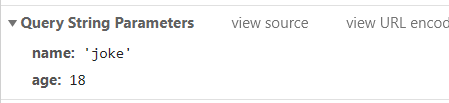


### 8.2 URL解析

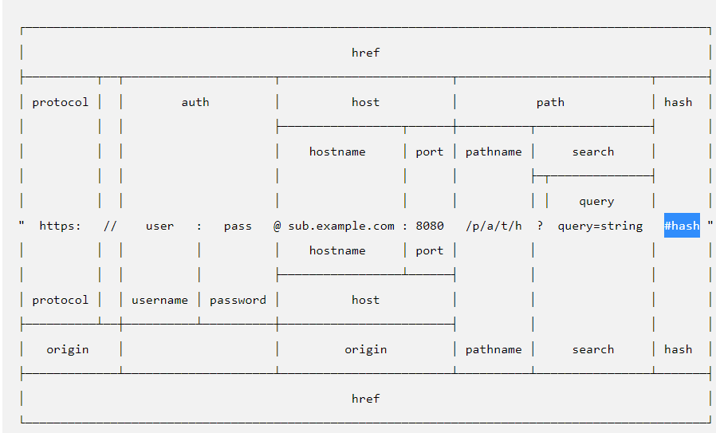

## 9. HttpServletResponse :imp:

> Extends the [`ServletResponse`](../../../javax/servlet/ServletResponse.html)  interface to provide HTTP-specific functionality in sending a response. For  example, it has methods to access HTTP headers and cookies. 
>
> The servlet container creates an `HttpServletResponse` object and  passes it as an argument to the servlet's service methods (`doGet`,  `doPost`, etc). 
>
> 请求到达的时候。由容器进行接口的实现类的对象的实例化创建。

+ getCharacterEncoding()
+ setCharacterEncoding()
+ getBufferSize()
+ getOutputStream()
+ getWriter()
+ getContentType()
+ resetBuffer()
+ setBufferSize()
+ addCookie()
+ addHeader()
+ containsHeader()
+ sendRedirect()
+ setStatus()
+ senError()

```java
package com.xdkj.servlet;

import javax.servlet.ServletException;
import javax.servlet.annotation.WebServlet;
import javax.servlet.http.HttpServlet;
import javax.servlet.http.HttpServletRequest;
import javax.servlet.http.HttpServletResponse;
import java.io.IOException;

/**
 * ClassName HttpServletResponseDemo
 * Description:
 *
 * @Author:一尘
 * @Version:1.0
 * @Date:2021-03-03-10:02
 */
@WebServlet("/httpServletResponse")
public class HttpServletResponseDemo  extends HttpServlet {
    @Override
    protected void doGet(HttpServletRequest req, HttpServletResponse resp)
            throws ServletException, IOException {
        /*org.apache.catalina.connector.ResponseFacade@260fb5d9*/
         System.out.println(resp);
            /*完整的post请求乱码处理*/
            req.setCharacterEncoding("utf8");
            resp.setCharacterEncoding("utf8");
            /*响应的内容的类型*/
            resp.setContentType("text/html;charset=utf8");
            /*添加响应头的信息*/
            resp.setHeader("Address","陕西省西安市");
            /*获取响应的内容类型*/
              System.out.println(resp.getContentType());
            req.getRequestDispatcher("/main.jsp").forward(req,resp);
    }

    @Override
    protected void doPost(HttpServletRequest req, HttpServletResponse resp)
            throws ServletException, IOException {
        doGet(req,resp);
    }
}

```

```java
<%@ page language="java" contentType="text/html; charset=UTF-8"
    pageEncoding="UTF-8"%>
<!DOCTYPE html>
<html>
<head>
    <meta charset="UTF-8">
    <title>index</title>
</head>
<body>
    <h2>Hello World!</h2>
    <a href="httpServletResponse">HttpServletResponse</a>
    <hr>
    <a href="httpServletResponseDemo2">HttpServletResponseDemo2</a>
</body>
</html>

```

### 9.2 响应输出流（为了响应ajax数据）

响应输出流是默认带有缓冲技术的。

````java
package com.xdkj.servlet;

import javax.servlet.ServletException;
import javax.servlet.annotation.WebServlet;
import javax.servlet.http.HttpServlet;
import javax.servlet.http.HttpServletRequest;
import javax.servlet.http.HttpServletResponse;
import java.io.IOException;
import java.io.PrintWriter;

/**
 * ClassName HttpServletResponseDemo2
 * Description:
 *
 * @Author:一尘
 * @Version:1.0
 * @Date:2021-03-03-10:22
 */
@WebServlet("/httpServletResponseDemo2")
public class HttpServletResponseDemo2 extends HttpServlet {
    @Override
    protected void doGet(HttpServletRequest req, HttpServletResponse resp)
            throws ServletException, IOException {
            resp.setCharacterEncoding("utf8");
        /*响应的内容的类型*/
            resp.setContentType("text/html;charset=utf8");
        /*字节输出流*/
        /*ServletOutputStream outputStream = resp.getOutputStream();
             *//*设置缓冲区的大小*//*
            resp.setBufferSize(10420);
            outputStream.write("HelloWorld".getBytes());
            outputStream.write("<h3 style='color:red;'>Hello HttpServletResponse</h3>".getBytes());
            outputStream.print("<h3 style='color:red;'>Hello HttpServletResponse</h3>");
             *//*获取默认的缓冲区大小  8192  8K*//*
         System.out.println(resp.getBufferSize());
            //刷新缓冲区
         resp.flushBuffer();*/
        /*打印流 万能流*/
        PrintWriter writer = resp.getWriter();
             writer.print("<h3>Hello PrintWriter!!!</h3>");
             writer.print("<p>Hello PrintWriter!!!</p>");
            writer.write("Hello world!!!!");
            writer.write("<p>Hello PrintWriter!!!</p>");
            writer.write(122344);

    }

    @Override
    protected void doPost(HttpServletRequest req, HttpServletResponse resp)
            throws ServletException, IOException {
        doGet(req,resp);
    }
}

````

### 9.3 页面重定向 :imp:

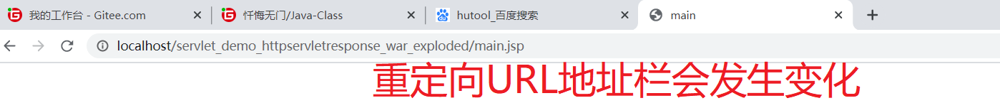

```java
package com.xdkj.servlet;

import javax.servlet.ServletException;
import javax.servlet.annotation.WebServlet;
import javax.servlet.http.HttpServlet;
import javax.servlet.http.HttpServletRequest;
import javax.servlet.http.HttpServletResponse;
import java.io.IOException;

@WebServlet(name = "RedirectServlet",urlPatterns = "/redirectServlet")
public class RedirectServlet extends HttpServlet {
    @Override
    protected void doPost(HttpServletRequest request, HttpServletResponse response)
            throws ServletException, IOException {
            /*页面重定向*/
        	request.setAttribute("score","999999999999");
                response.sendRedirect("main.jsp");
    }

    @Override
    protected void doGet(HttpServletRequest request, HttpServletResponse response)
            throws ServletException, IOException {
        doPost(request,response);
    }
}

```

重定向是: 先由客户端向服务器发送请求，如果使用endRedirect就意味着向服务器重新发送一个资源的请求，服务器能找到资源就进行页面的跳转。

页面重定向是发送了两次请求。

你找张三借钱，张三说我没有，但是李四有，你再去直接找李四借钱，借到了。  登录注册必须使用重定向

### 9.4 Ajax和HttpServletResponse响应数据

**AjaxResponseServlet.java**

```java
package com.xdkj.servlet;

import javax.servlet.ServletException;
import javax.servlet.ServletOutputStream;
import javax.servlet.annotation.WebServlet;
import javax.servlet.http.HttpServlet;
import javax.servlet.http.HttpServletRequest;
import javax.servlet.http.HttpServletResponse;
import java.io.IOException;

@WebServlet(name = "AjaxResponseServlet",urlPatterns = "/ajaxResposne")
public class AjaxResponseServlet extends HttpServlet {
    @Override
    protected void doPost(HttpServletRequest request, HttpServletResponse response) throws ServletException, IOException {
        request.setCharacterEncoding("utf8");
        response.setCharacterEncoding("utf8");
        response.setContentType("text/html;charset=utf8");
        /*接受请求的参数*/
        String name = request.getParameter("name");
        String age = request.getParameter("age");
        System.out.println(name + "===" + age);
        /*向外响应数据*/
        ServletOutputStream outputStream = response.getOutputStream();
            outputStream.write("data recive success!!!".getBytes());
    }

    @Override
    protected void doGet(HttpServletRequest request, HttpServletResponse response) throws ServletException, IOException {
            doPost(request,response);
    }
}

```

**index.jsp**

```html
<%@ page language="java" contentType="text/html; charset=UTF-8"
    pageEncoding="UTF-8"%>
<!DOCTYPE html>
<html>
<head>
    <meta charset="UTF-8">
    <title>index</title>
</head>
<body>
    <h2>Hello World!</h2>
    <a href="httpServletResponse">HttpServletResponse</a>
    <hr>
    <a href="httpServletResponseDemo2">HttpServletResponseDemo2</a>
    <script src="https://cdn.bootcdn.net/ajax/libs/jquery/3.5.1/jquery.min.js"></script>
    <script>
        $(function(){
            $.ajax({
                url:"ajaxResposne",
                type:"get",
                data:{name:"joke",age:18},
                success:function (result) {
                    console.log(result)
                }
            })
        })
    </script>
</body>
</html>

```

### 9.5 Ajax+HttpServletReposne+json

```xml
<!--    导入gson的工具包-->
    <dependency>
      <groupId>com.google.code.gson</groupId>
      <artifactId>gson</artifactId>
      <version>2.8.6</version>
    </dependency>
  </dependencies>
```

**main.jsp**

```jsp
<%--
  Created by IntelliJ IDEA.
  User: chanh
  Date: 2021/3/3
  Time: 10:13
  To change this template use File | Settings | File Templates.
--%>
<%@ page contentType="text/html;charset=UTF-8" language="java" %>
<html>
<head>
    <title>main</title>
</head>
<body>
<script src="https://cdn.bootcdn.net/ajax/libs/jquery/3.5.1/jquery.min.js"></script>
<script>
    $(function(){
        $.ajax({
            url:"ajaxResponseServletJson",
            type:"get",
            data:{name:"joke",age:18},
            dataType:"json",
            /*返回的数据格式是json */
            success:function (result) {
                console.log(result)
            }
        })
    })
</script>
</body>
</html>

```

**AjaxResponseServletJson.java**

```java
package com.xdkj.servlet;

import com.google.gson.Gson;
import com.xdkj.beans.Student;

import javax.servlet.ServletException;
import javax.servlet.ServletOutputStream;
import javax.servlet.annotation.WebServlet;
import javax.servlet.http.HttpServlet;
import javax.servlet.http.HttpServletRequest;
import javax.servlet.http.HttpServletResponse;
import java.io.IOException;

/**
 * ClassName AjaxResponseServletJson
 * Description:
 *
 * @Author:一尘
 * @Version:1.0
 * @Date:2021-03-03-12:04
 */
@WebServlet("/ajaxResponseServletJson")
public class AjaxResponseServletJson  extends HttpServlet {
    @Override
    protected void doGet(HttpServletRequest request, HttpServletResponse response)
            throws ServletException, IOException {
        request.setCharacterEncoding("utf8");
        response.setCharacterEncoding("utf8");
        response.setContentType("text/html;charset=utf8");
        /*接受请求的参数*/
        String name = request.getParameter("name");
        String age = request.getParameter("age");
        System.out.println(name + "===" + age);
        /*返回的数据是Json格式*/
        ServletOutputStream outputStream = response.getOutputStream();
        /*原生的json数据处理很麻烦*/
        /*"{\"name\":\"aaa\",\"id\":123}"*/
        /*使用第三方的json工具类
        *  fastjson
        * jsonObject
        *  hutool
         **/
        Student student = new Student();
            student.setAge(Integer.parseInt(age));
            student.setName(name);
        /*对象转为json数据*/
        Gson gson = new Gson();
        /*将student转为json字符串*/
        String json = gson.toJson(student);
        outputStream.write(json.getBytes());
    }

    @Override
    protected void doPost(HttpServletRequest request, HttpServletResponse response)
            throws ServletException, IOException {
        doGet(request,response);
    }
}

```

**Student.java**

```java
package com.xdkj.beans;

/**
 * ClassName Student
 * Description:
 *
 * @Author:一尘
 * @Version:1.0
 * @Date:2021-03-03-12:13
 */
public class Student {
    private String name;
    private int age;

    public String getName() {
        return name;
    }

    public void setName(String name) {
        this.name = name;
    }

    public int getAge() {
        return age;
    }

    public void setAge(int age) {
        this.age = age;
    }
}

```

## Servlet+数据库+登录验证

### 1. 新建数据库的表Student

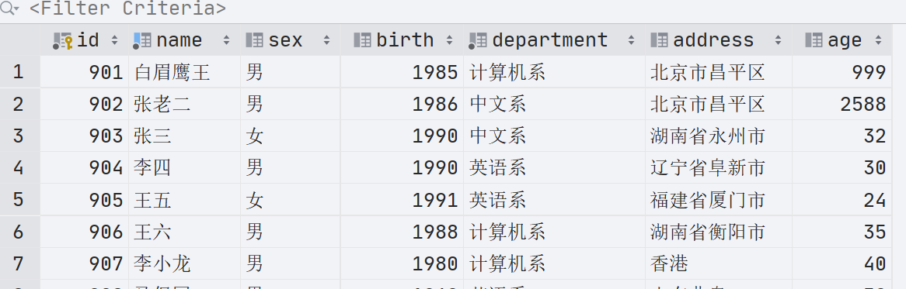

### 2. 新建Mavenweb项目

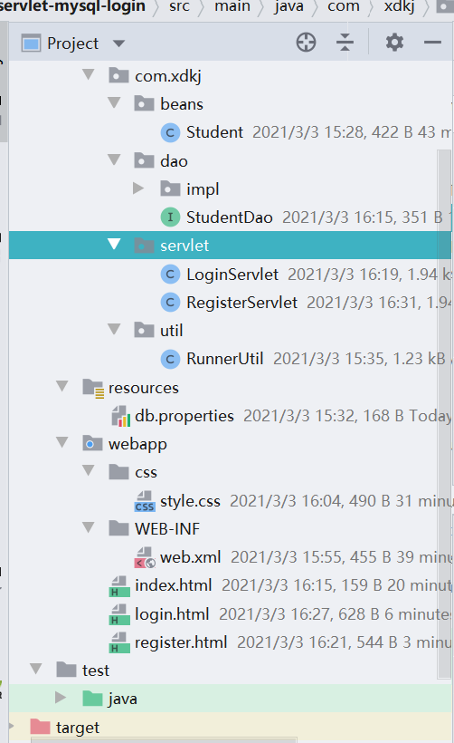

### 3. 添加项目的maven依赖

```xml
<?xml version="1.0" encoding="UTF-8"?>

<project xmlns="http://maven.apache.org/POM/4.0.0" xmlns:xsi="http://www.w3.org/2001/XMLSchema-instance"
  xsi:schemaLocation="http://maven.apache.org/POM/4.0.0 http://maven.apache.org/xsd/maven-4.0.0.xsd">
  <modelVersion>4.0.0</modelVersion>

  <groupId>com.xdkj</groupId>
  <artifactId>servlet-mysql-login</artifactId>
  <version>1.0-SNAPSHOT</version>
  <packaging>war</packaging>

  <name>servlet-mysql-login Maven Webapp</name>
  <!-- FIXME change it to the project's website -->
  <url>http://www.example.com</url>

  <properties>
    <project.build.sourceEncoding>UTF-8</project.build.sourceEncoding>
    <maven.compiler.source>1.8</maven.compiler.source>
    <maven.compiler.target>1.8</maven.compiler.target>
  </properties>

  <dependencies>
    <dependency>
      <groupId>junit</groupId>
      <artifactId>junit</artifactId>
      <version>4.12</version>
      <scope>test</scope>
    </dependency>
    <!--servlet相关的jar包-->
    <dependency>
      <groupId>javax.servlet</groupId>
      <artifactId>javax.servlet-api</artifactId>
      <version>4.0.1</version>
    </dependency>
    <dependency>
      <groupId>jstl</groupId>
      <artifactId>jstl</artifactId>
      <version>1.2</version>
    </dependency>
    <!--数据库相关-->
    <dependency>
      <groupId>mysql</groupId>
      <artifactId>mysql-connector-java</artifactId>
      <version>5.1.49</version>
    </dependency>
    <dependency>
      <groupId>commons-dbutils</groupId>
      <artifactId>commons-dbutils</artifactId>
      <version>1.7</version>
    </dependency>
    <!--json数据转换-->
    <dependency>
      <groupId>com.google.code.gson</groupId>
      <artifactId>gson</artifactId>
      <version>2.8.6</version>
    </dependency>
    <!--lombok-->
    <dependency>
      <groupId>org.projectlombok</groupId>
      <artifactId>lombok</artifactId>
      <version>1.18.10</version>
    </dependency>
  </dependencies>

  <build>
    <finalName>servlet-mysql-login</finalName>
    <pluginManagement><!-- lock down plugins versions to avoid using Maven defaults (may be moved to parent pom) -->
      <plugins>
        <plugin>
          <artifactId>maven-clean-plugin</artifactId>
          <version>3.1.0</version>
        </plugin>
        <!-- see http://maven.apache.org/ref/current/maven-core/default-bindings.html#Plugin_bindings_for_war_packaging -->
        <plugin>
          <artifactId>maven-resources-plugin</artifactId>
          <version>3.0.2</version>
        </plugin>
        <plugin>
          <artifactId>maven-compiler-plugin</artifactId>
          <version>3.8.0</version>
        </plugin>
        <plugin>
          <artifactId>maven-surefire-plugin</artifactId>
          <version>2.22.1</version>
        </plugin>
        <plugin>
          <artifactId>maven-war-plugin</artifactId>
          <version>3.2.2</version>
        </plugin>
        <plugin>
          <artifactId>maven-install-plugin</artifactId>
          <version>2.5.2</version>
        </plugin>
        <plugin>
          <artifactId>maven-deploy-plugin</artifactId>
          <version>2.8.2</version>
        </plugin>
      </plugins>
    </pluginManagement>
  </build>
</project>

```

### 4. 定义表的实体类

```java
@Data
@AllArgsConstructor
@NoArgsConstructor
public class Student {
    private int id;
    private String name;
    private String address;
    private String department;
    private int age;
    private String sex;
    private String birth;

}

```

### 5. 定义业务接口

```java
public interface StudentDao {
    List<Student> queryList();
    Student queryById(int id);
    List<Student> queryLikeName(String  name);
    int addStudent(Student student);
    int updateStudent(Student student);
    int deleteStudent(Student student);

```

### 6. 定义数据库工具类

**db.properties**

```properties
jdbc.Driver=com.mysql.jdbc.Driver
jdbc.Url=jdbc:mysql://localhost:3306/hehe?useEncoding=true&characterEncoding=utf8&useSSL=true
jdbc.UserName=root
jdbc.Password=root
```

**RunnerUtil.java**

```java
package com.xdkj.util;

import com.mysql.jdbc.jdbc2.optional.MysqlDataSource;
import org.apache.commons.dbutils.QueryRunner;

import javax.sql.DataSource;
import java.io.IOException;
import java.io.InputStream;
import java.util.Properties;

/**
 * ClassName RunnerUtil
 * Description:
 *
 * @Author:一尘
 * @Version:1.0
 * @Date:2021-03-03-15:31
 */
public class RunnerUtil {
    public static  DataSource  getDataSource(){
        InputStream inputStream = RunnerUtil.class.getClassLoader().getResourceAsStream("db.properties");
        Properties  properties = new Properties();
        MysqlDataSource mysqlDataSource  = new MysqlDataSource();
        try {
            properties.load(inputStream);
            mysqlDataSource.setUser(properties.getProperty("jdbc.UserName"));
            mysqlDataSource.setPassword(properties.getProperty("jdbc.Password"));
            mysqlDataSource.setURL(properties.getProperty("jdbc.Url"));

        } catch (IOException e) {
            e.printStackTrace();
        }
        return  mysqlDataSource;

    }
    /*DButils的核心工具对象*/
    public static QueryRunner  getRunner(){
        return  new QueryRunner(getDataSource());
    }
}

```

### 7. 定义接口的实现类

```java
package com.xdkj.dao.impl;

import com.xdkj.beans.Student;
import com.xdkj.dao.StudentDao;
import com.xdkj.util.RunnerUtil;
import org.apache.commons.dbutils.QueryRunner;
import org.apache.commons.dbutils.handlers.BeanHandler;
import org.apache.commons.dbutils.handlers.BeanListHandler;

import java.sql.SQLException;
import java.util.List;

/**
 * ClassName StudentDaoImpl
 * Description:
 *
 * @Author:一尘
 * @Version:1.0
 * @Date:2021-03-03-15:36
 */
public class StudentDaoImpl implements StudentDao {
    private QueryRunner runner = RunnerUtil.getRunner();
    @Override
    public List<Student> queryList() {
        List<Student> list = null;
        try {
            list = runner.query("select * from student",new BeanListHandler<>(Student.class));
        } catch (SQLException throwables) {
            throwables.printStackTrace();
        }
        return list;
    }

    @Override
    public Student queryById(int id) {
        Student student = null;
        try {
            student = runner.query("select * from student where id = ?",
                    new BeanHandler<>(Student.class),
                    id);
        } catch (SQLException throwables) {
            throwables.printStackTrace();
        }

        return student;
    }

    @Override
    public List<Student> queryLikeName(String name) {
        List<Student> list = null;
        try {
            list = runner.query("select * from student where name like concat('%',?,'%')",new BeanListHandler<>(Student.class),name);
        } catch (SQLException throwables) {
            throwables.printStackTrace();
        }

        return list;
    }

    @Override
    public int addStudent(Student student) {
        int result = 0;
        try {
            result = runner.update("insert into student values(null,?,?,?,?,?,?)",
                    student.getName(),
                    student.getSex(),
                    student.getBirth(),
                    student.getDepartment(),
                    student.getAddress(),
                    student.getAge());
        } catch (SQLException throwables) {
            throwables.printStackTrace();
        }
        return result;
    }

    @Override
    public int updateStudent(Student student) {
        return 0;
    }

    @Override
    public int deleteStudent(Student student) {
        return 0;
    }
}

```

### 8. 定义接口实现类的测试类

```java
package com.xdkj.test;

import com.xdkj.beans.Student;
import com.xdkj.dao.StudentDao;
import com.xdkj.dao.impl.StudentDaoImpl;
import org.junit.Test;

/**
 * ClassName StudentTest
 * Description:
 *
 * @Author:一尘
 * @Version:1.0
 * @Date:2021-03-03-15:43
 */
public class StudentTest {
    StudentDao studentDao = new StudentDaoImpl();
    @Test
    public  void queryAll(){
        System.out.println(studentDao.queryList());
    }
    @Test
    public  void queryById(){
        System.out.println(studentDao.queryById(903));
    }
    @Test
public  void queryLikeName(){
        System.out.println(studentDao.queryLikeName("张三"));
    }
    @Test
    public  void addStudent(){
        Student student = new Student();
        student.setName("姜子牙");
        student.setAddress("渭水");
        student.setDepartment("众神之长");
        student.setAge(75);
        student.setSex("男");
        student.setBirth("10");
        System.out.println(studentDao.addStudent(student));
    }
}

```

### 9. 定义页面

**login.html**

```html
<!DOCTYPE html>
<html lang="en">
<head>
    <meta charset="UTF-8">
    <title>login</title>
    <link rel="stylesheet" href="css/style.css">
</head>
<body>
    <div class="login">
        <form action="login" method="post">
            <label for="name">用户名:</label>
            <input type="text" name="name" id="name">
            <br>
            <label for="age">年&ensp;&ensp;龄:</label>
            <input type="text" name="age" id="age">
            <br>
            <input type="submit" value="登录">
        </form>
        <a href="register.html">请注册</a>
    </div>
</body>
</html>
```

**style.css**

```css
body,html,ul,li,img,a,p,h1,h2,h3,h4,h5,h6{
    margin: 0;
    padding: 0;
}
a{
    text-decoration: none;
}
ul{
    list-style: none;
}
body{
    background: #f5f5f5;
}
.login{
    position: relative;
    top: 200px;
    width:400px ;
    height: 300px;
    margin: 0 auto;
    border: 1px solid red;
    border-radius: 10px;
    background: #fff;
}
input{
    height: 35px;
    width: 80%;
    margin-top:15px;
}
input[type='submit']{
    margin-left: 55px;
}
```

**register.html**

```html
<!DOCTYPE html>
<html lang="en">
<head>
    <meta charset="UTF-8">
    <title>注册</title>
</head>
<body>
<form action="register" method="post">
    <input type="text" name="name" id="name"><br>
    <input type="text" name="sex" id="sex"><br>
    <input type="text" name="address" id="address"><br>
    <input type="text" name="age" id="age"><br>
    <input type="text" name="department" id="department"><br>
    <input type="text" name="birth" id="birth"><br>
    <input type="submit" value="注册">
</form>
</body>
</html>
```

### 10.登录和注册的业务交互

**Loginservlet.java**

```java
package com.xdkj.servlet;

import com.xdkj.beans.Student;
import com.xdkj.dao.StudentDao;
import com.xdkj.dao.impl.StudentDaoImpl;

import javax.servlet.ServletException;
import javax.servlet.annotation.WebServlet;
import javax.servlet.http.HttpServlet;
import javax.servlet.http.HttpServletRequest;
import javax.servlet.http.HttpServletResponse;
import java.io.IOException;
import java.util.List;

/**
 * ClassName StudentServlet
 * Description:
 *
 * @Author:一尘
 * @Version:1.0
 * @Date:2021-03-03-15:53
 */
@WebServlet("/login")
public class LoginServlet extends HttpServlet {
    /*业务接口的实现类对象*/
    private StudentDao  studentDao = new StudentDaoImpl();
    @Override
    protected void doGet(HttpServletRequest req, HttpServletResponse resp)
            throws ServletException, IOException {
        req.setCharacterEncoding("utf8");
        resp.setCharacterEncoding("utf8");
        /*接受收参数*/
        String name = req.getParameter("name");
        String age = req.getParameter("age");
        Student student = new Student();
            student.setName(name);
             student.setAge(Integer.parseInt(age));
        List<Student> students = studentDao.queryLikeName(name);
            if(students==null){//没查到数据
                resp.getOutputStream().write("javascrpt:alert('数据不存在')".getBytes());
            }else{
                //名字相等的年龄有没有
               if(name.equals("张三")){
                   resp.sendRedirect("index.html");
               }else{
                   System.out.println("登录失败！！！");
                   resp.sendRedirect("login.html");
               }
            }
    }

    @Override
    protected void doPost(HttpServletRequest req, HttpServletResponse resp)
            throws ServletException, IOException {
        doGet(req,resp);
    }
}

```

**RegisterServlet.java**

```java
package com.xdkj.servlet;

import com.xdkj.beans.Student;
import com.xdkj.dao.StudentDao;
import com.xdkj.dao.impl.StudentDaoImpl;

import javax.servlet.ServletException;
import javax.servlet.annotation.WebServlet;
import javax.servlet.http.HttpServlet;
import javax.servlet.http.HttpServletRequest;
import javax.servlet.http.HttpServletResponse;
import java.io.IOException;

@WebServlet(name = "RegisterServlet",urlPatterns = "/register")
public class RegisterServlet extends HttpServlet {
    private StudentDao studentDao = new StudentDaoImpl();
    @Override
    protected void doPost(HttpServletRequest request, HttpServletResponse response) throws ServletException, IOException {
        request.setCharacterEncoding("utf8");
        response.setCharacterEncoding("utf8");
            String name  = request.getParameter("name");
            String age  = request.getParameter("age");
            String sex  = request.getParameter("sex");
            String birth  = request.getParameter("birth");
            String address  = request.getParameter("address");
            String department  = request.getParameter("department");
        /*数据封装*/
        Student student = new Student();
        student.setName(name);
        student.setAddress(address);
        student.setDepartment(department);
        student.setAge(Integer.parseInt(age));
        student.setSex(sex);
        student.setBirth(birth);
        int i = studentDao.addStudent(student);
        if(i>=0){
            //注册成功
            response.sendRedirect("login.html");
        }else {
            //注册失败
            request.getRequestDispatcher("/register.html").forward(request,response);
        }

    }

    @Override
    protected void doGet(HttpServletRequest request, HttpServletResponse response) throws ServletException, IOException {
        doPost(request,response);
    }
}

```

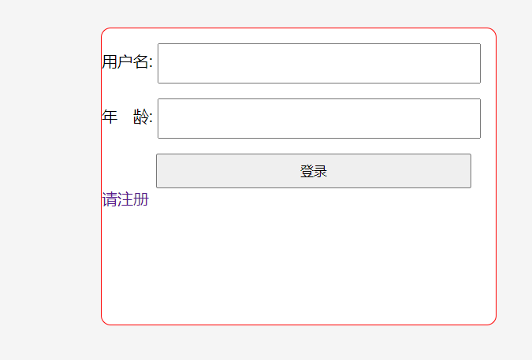

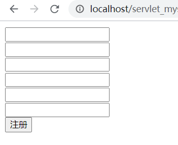

## Servlet完整的生命周期 :imp:

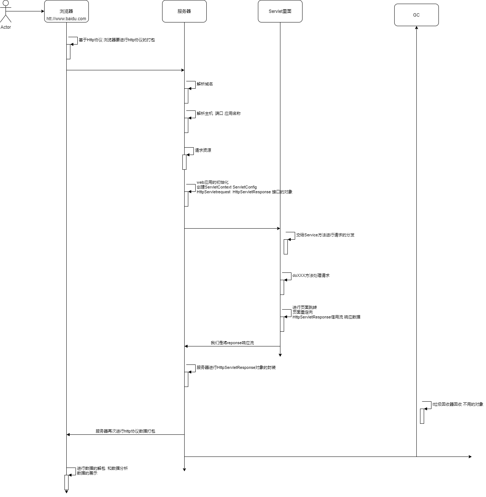

## 10.文件上传和下载

### 10.1 文件上传

**pom.xml**

```xml
<?xml version="1.0" encoding="UTF-8"?>

<project xmlns="http://maven.apache.org/POM/4.0.0" xmlns:xsi="http://www.w3.org/2001/XMLSchema-instance"
  xsi:schemaLocation="http://maven.apache.org/POM/4.0.0 http://maven.apache.org/xsd/maven-4.0.0.xsd">
  <modelVersion>4.0.0</modelVersion>

  <groupId>com.xdkj</groupId>
  <artifactId>servlet-upload</artifactId>
  <version>1.0-SNAPSHOT</version>
  <packaging>war</packaging>

  <name>servlet-upload Maven Webapp</name>
  <!-- FIXME change it to the project's website -->
  <url>http://www.example.com</url>

  <properties>
    <project.build.sourceEncoding>UTF-8</project.build.sourceEncoding>
    <maven.compiler.source>1.8</maven.compiler.source>
    <maven.compiler.target>1.8</maven.compiler.target>
  </properties>

  <dependencies>
    <dependency>
      <groupId>junit</groupId>
      <artifactId>junit</artifactId>
      <version>4.12</version>
      <scope>test</scope>
    </dependency>
    <dependency>
      <groupId>javax.servlet</groupId>
      <artifactId>javax.servlet-api</artifactId>
      <version>4.0.1</version>
    </dependency>
    <dependency>
      <groupId>jstl</groupId>
      <artifactId>jstl</artifactId>
      <version>1.2</version>
    </dependency>
    <!--文件上传的jar-->
    <dependency>
      <groupId>commons-fileupload</groupId>
      <artifactId>commons-fileupload</artifactId>
      <version>1.4</version>
    </dependency>
    <dependency>
      <groupId>commons-io</groupId>
      <artifactId>commons-io</artifactId>
      <version>2.7</version>
    </dependency>
  </dependencies>

  <build>
    <finalName>servlet-upload</finalName>
    <pluginManagement><!-- lock down plugins versions to avoid using Maven defaults (may be moved to parent pom) -->
      <plugins>
        <plugin>
          <artifactId>maven-clean-plugin</artifactId>
          <version>3.1.0</version>
        </plugin>
        <!-- see http://maven.apache.org/ref/current/maven-core/default-bindings.html#Plugin_bindings_for_war_packaging -->
        <plugin>
          <artifactId>maven-resources-plugin</artifactId>
          <version>3.0.2</version>
        </plugin>
        <plugin>
          <artifactId>maven-compiler-plugin</artifactId>
          <version>3.8.0</version>
        </plugin>
        <plugin>
          <artifactId>maven-surefire-plugin</artifactId>
          <version>2.22.1</version>
        </plugin>
        <plugin>
          <artifactId>maven-war-plugin</artifactId>
          <version>3.2.2</version>
        </plugin>
        <plugin>
          <artifactId>maven-install-plugin</artifactId>
          <version>2.5.2</version>
        </plugin>
        <plugin>
          <artifactId>maven-deploy-plugin</artifactId>
          <version>2.8.2</version>
        </plugin>
      </plugins>
    </pluginManagement>
  </build>
</project>

```

**index.html**

```html
<!DOCTYPE html>
<html lang="en">
<head>
    <meta charset="UTF-8">
    <title>index</title>
</head>
<body>
<form action="upload" method="post" enctype="multipart/form-data">
    <input type="file" name="file" id="file">
    <br>
    <input type="submit" value="上传">
</form>
</body>
</html>
```

**FileUploadServlet.java**

```java
package com.xdkj.servlet.FileUploadServlet;

import javax.servlet.ServletException;
import javax.servlet.annotation.MultipartConfig;
import javax.servlet.annotation.WebServlet;
import javax.servlet.http.HttpServlet;
import javax.servlet.http.HttpServletRequest;
import javax.servlet.http.HttpServletResponse;
import javax.servlet.http.Part;
import java.io.File;
import java.io.IOException;
import java.time.LocalDate;
import java.util.Date;

@WebServlet(name = "FileUploadServlet",urlPatterns = "/upload")
/*文件上传的注解*/
@MultipartConfig
public class FileUploadServlet extends HttpServlet {
    @Override
    protected void doPost(HttpServletRequest request, HttpServletResponse response)
            throws ServletException, IOException {
        request.setCharacterEncoding("utf8");
        response.setCharacterEncoding("utf8");
            /*文件上传 servlet3.0 api 中的内容
            *
            * content-disposition
             *   form-data; name="file"; filename="20180412031959734.jpg"
             *   content-type
              *  image/jpeg
            * */
            //先获取上传的内容
        Part part = request.getPart("file");
        String filename = part.getHeader("content-disposition");
        //获取文件的全名称  截取文件的扩展名
        String str =    filename.substring(filename.indexOf("."),filename.length()-1);
        //文件上传的真实的五路路径
      String realPath =   this.getServletContext().getRealPath("upload");
      //按照年月日进行文件分类保存
      File realFile = new File(realPath, LocalDate.now().toString());
       if(!realFile.exists()){
           //文件夹不存在就创建
           realFile.mkdirs();
       }
       //写入文件的路径 文件名称加入时间戳
        File newFile = new File(realFile,File.separator+new Date().getTime()+str);
        System.out.println(newFile);
        //写入就可以了
        part.write(newFile.toString());
    }

    @Override
    protected void doGet(HttpServletRequest request, HttpServletResponse response)
            throws ServletException, IOException {
        doPost(request,response);
    }
}

```

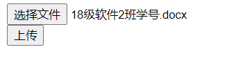

**文件上传成功！！！！！**

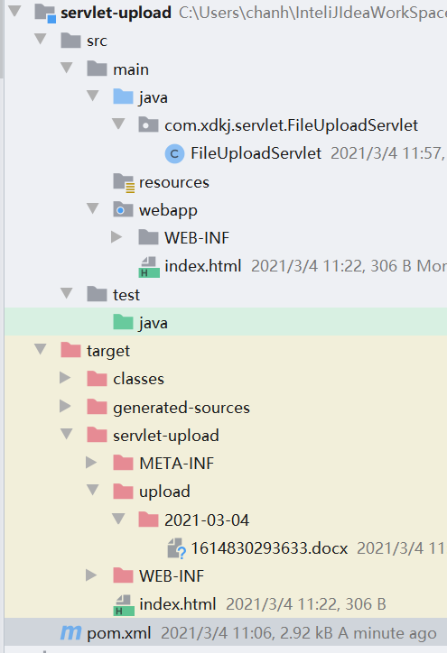

### 10.2 文件下载

**infos.html*

```html
<!DOCTYPE html>
<html lang="en">
<head>
    <meta charset="UTF-8">
    <title>下载</title>
    <link rel="stylesheet" href="font-awesome-4.7.0/font-awesome-4.7.0/css/font-awesome.min.css">
    <style>
        ul{
            width: 600px;
            height: 70px;
            list-style: none;
            border: 1px solid red;
        }
        li{
            color: #ff9000;
            border: 1px solid #f5f5f5;
            float: left;
            padding: 0 20px;
        }
        i:hover{
            cursor: pointer;
            color: #ff5000;
        }
        img{
            transition: all 2s ease;
        }
        img:hover{
            transform: rotateZ(180deg) scale(1.2);
        }
    </style>
</head>
<body>
    <div>
        <ul>
            <li><a href="#"></a><i class="fa fa-download" aria-hidden="true"></i></li>
            <li><a href="#"></a><i class="fa fa-download" aria-hidden="true"></i></li>
            <li><a href="#"></a><i class="fa fa-download" aria-hidden="true"></i></li>
            <li><a href="#"></a><i class="fa fa-download" aria-hidden="true"></i></li>
        </ul>
    </div>
    <script src="https://cdn.bootcdn.net/ajax/libs/jquery/3.5.1/jquery.min.js"></script>
<script>
    $(function(){
        let tags = $("i");
        $.each(tags,(index,item)=>{
            $(item).click(()=>{
                console.log($(item).prev().find("img").attr("src"));
                window.location.href="download?imgSrc="+$(item).prev().find("img").attr("src");
            })
        })
    })
</script>
</body>
</html>
```

**FileDownloadServlet.java**

```java
package com.xdkj.servlet.FileUploadServlet;

import javax.servlet.ServletException;
import javax.servlet.ServletOutputStream;
import javax.servlet.annotation.WebServlet;
import javax.servlet.http.HttpServlet;
import javax.servlet.http.HttpServletRequest;
import javax.servlet.http.HttpServletResponse;
import java.io.*;

@WebServlet(name = "FileDowloadServlet",urlPatterns = "/download")
public class FileDowloadServlet extends HttpServlet {
    @Override
    protected void doPost(HttpServletRequest request, HttpServletResponse response) throws ServletException, IOException {
        //接受下载资源的参数
        String name = request.getParameter("imgSrc");
        //获取资源在真实物理盘符中的路径
        String realPath = this.getServletContext().getRealPath(name);
        System.out.println(realPath);
        File  file  = new File(realPath);
        //设置响应头信息
        response.setHeader("Content-Disposition","attachment;filename="+file.getName());
        response.setHeader("Content-Type","img/jpeg");
        //完了就使用响应输出流读取文件内容 写出去
        ServletOutputStream outputStream = response.getOutputStream();
        InputStream  inputStream = new FileInputStream(file);
        BufferedInputStream  bufferedInputStream = new BufferedInputStream(inputStream);
        BufferedOutputStream  bufferedOutputStream  = new BufferedOutputStream(outputStream);
        byte[] by = new byte[1024];
        int len = 0;
        while((len = bufferedInputStream.read(by))!=-1){
            bufferedOutputStream.write(by,0,len);
        }
        bufferedOutputStream.flush();
        bufferedOutputStream.close();
        bufferedInputStream.close();
    }

    @Override
    protected void doGet(HttpServletRequest request, HttpServletResponse response) throws ServletException, IOException {
        doPost(request,response);
    }
}

```

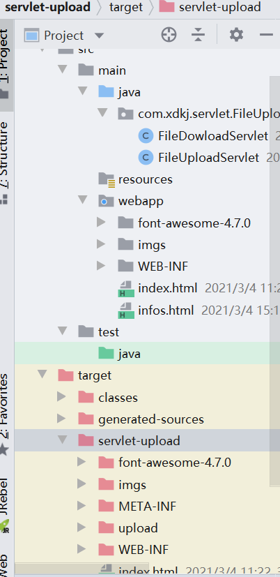

## 11.Session和Cookie

### 11.1 Session(会话)

> Session：在计算机中，尤其是在网络应用中，称为“会话控制”。[Session对象](https://baike.baidu.com/item/Session对象/5250998)存储特定用户会话所需的属性及配置信息。这样，当用户在应用程序的Web页之间跳转时，存储在Session对象中的变量将不会丢失，而是在整个用户会话中一直存在下去。当用户请求来自应用程序的 Web页时，如果该用户还没有会话，则Web服务器将自动创建一个 Session对象。当会话过期或被放弃后，服务器将终止该会话。Session 对象最常见的一个用法就是存储用户的首选项。例如，如果用户指明不喜欢查看图形，就可以将该信息存储在Session对象中。有关使用Session 对象的详细信息，请参阅“ASP应用程序”部分的“管理会话”。注意会话状态仅在支持cookie的浏览器中保留
>
> 在浏览器打开网站访问网站多个页面直到浏览器关闭(网站关闭)为一次会话。

+ getId()  获取session的ID值
+ getAttribute()
+ setAttribute()
+ getLastAccessTime()  最后一次访问的时间
+ invilidate()  会话失效

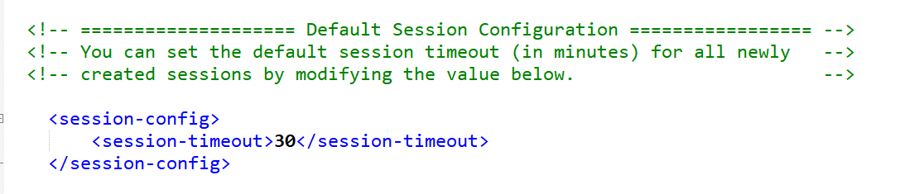

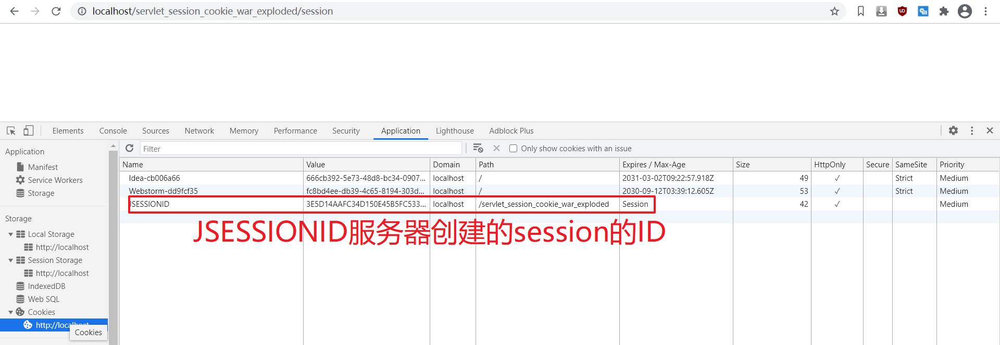

**SessionServlet.java**

```java
package com.xdkj.servlet;

import javax.servlet.ServletException;
import javax.servlet.annotation.WebServlet;
import javax.servlet.http.HttpServlet;
import javax.servlet.http.HttpServletRequest;
import javax.servlet.http.HttpServletResponse;
import javax.servlet.http.HttpSession;
import java.io.IOException;

@WebServlet(name = "SessionServlet",urlPatterns = "/session")
public class SessionServlet extends HttpServlet {
    @Override
    protected void doPost(HttpServletRequest request, HttpServletResponse response) throws ServletException, IOException {
        HttpSession session = request.getSession();
     String name =    request.getParameter("username");
        /*org.apache.catalina.session.StandardSessionFacade@33090aa9
        * session是由服务器创建 每一个会话session都是不一样的
        * sessionID是32为的字符串
        * session失效时间默认是30分钟
        * session存储用户信息
        * invalidate()
         */
        System.out.println(session);
        /*91728ED6DE1178066594A8CBC4819CA2*/
        System.out.println(session.getId());
        session.setAttribute("username",name);
        /*最后一次访问的时间*/
        System.out.println(session.getLastAccessedTime());
        /* 60 */
        System.out.println(session.getMaxInactiveInterval());
    }

    @Override
    protected void doGet(HttpServletRequest request, HttpServletResponse response) throws ServletException, IOException {
            doPost(request,response);
    }
}

```

**HelloSession.java**

```java
package com.xdkj.servlet;

import javax.servlet.ServletException;
import javax.servlet.annotation.WebServlet;
import javax.servlet.http.HttpServlet;
import javax.servlet.http.HttpServletRequest;
import javax.servlet.http.HttpServletResponse;
import java.io.IOException;

@WebServlet(name = "HelloServlet",urlPatterns = "/hello")
public class HelloServlet extends HttpServlet {
    @Override
    protected void doPost(HttpServletRequest request, HttpServletResponse response) throws ServletException, IOException {
        System.out.println(request.getSession().getAttribute("username"));
    }

    @Override
    protected void doGet(HttpServletRequest request, HttpServletResponse response) throws ServletException, IOException {
        doPost(request,response);
    }
}

```

**Logout.Servlet.java**

```java
package com.xdkj.servlet;

import javax.servlet.ServletException;
import javax.servlet.annotation.WebServlet;
import javax.servlet.http.HttpServlet;
import javax.servlet.http.HttpServletRequest;
import javax.servlet.http.HttpServletResponse;
import java.io.IOException;

@WebServlet(name = "LogoutServlet",urlPatterns = "/logout")
public class LogoutServlet extends HttpServlet {
    @Override
    protected void doPost(HttpServletRequest request, HttpServletResponse response)
            throws ServletException, IOException {
        /*清空session*/
        request.getSession().invalidate();
    }

    @Override
    protected void doGet(HttpServletRequest request, HttpServletResponse response) throws ServletException, IOException {
        doPost(request,response);
    }
}

```

**index.jsp**

```html
<%@ page language="java" contentType="text/html; charset=UTF-8"
    pageEncoding="UTF-8"%>
<!DOCTYPE html>
<html>
<head>
    <meta charset="UTF-8">
    <title>index</title>
</head>
<body>
    <h2>Hello World!</h2>
    ${username}
    <a href="session">SessionServlet</a>
    <hr>
    <form action="session" method="post">
        <input type="text" name="username" id="username">
        <br>
        <input type="submit" value="登录">
    </form>
    <a href="logout">退出</a>
</body>
</html>

```

```html
<%--
  Created by IntelliJ IDEA.
  User: chanh
  Date: 2021/3/5
  Time: 10:17
  To change this template use File | Settings | File Templates.
--%>
<%@ page contentType="text/html;charset=UTF-8" language="java" %>
<html>
<head>
    <title>main</title>
</head>
<body>
    ${username}
</body>
</html>

```

**web.xml**

```xml
<web-app xmlns="http://xmlns.jcp.org/xml/ns/javaee"
  xmlns:xsi="http://www.w3.org/2001/XMLSchema-instance"
  xsi:schemaLocation="http://xmlns.jcp.org/xml/ns/javaee
                      http://xmlns.jcp.org/xml/ns/javaee/web-app_4_0.xsd"
  version="4.0">

  <display-name>Archetype Created Web Application</display-name>
  <session-config>
    <session-timeout>1</session-timeout>
  </session-config>
</web-app>
```


## 12. 过滤器(Filter) :imp:

## 13 监听器(Lisetner) :imp


