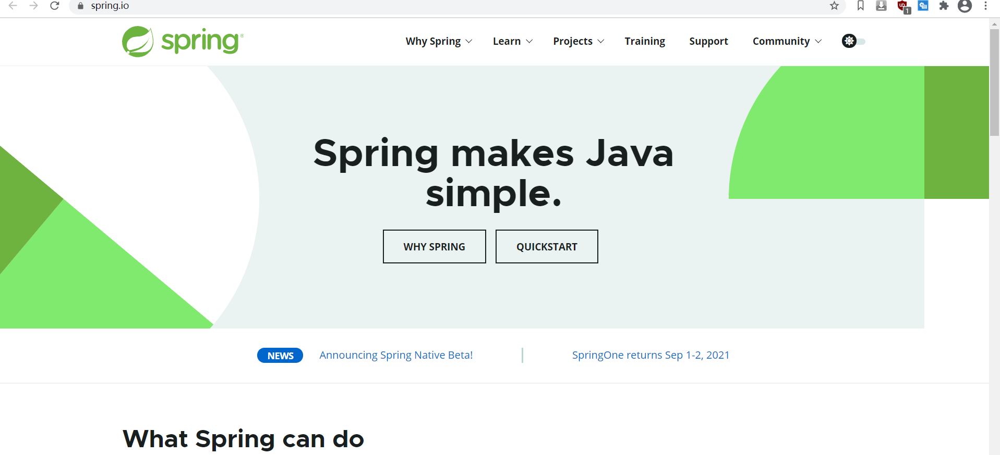
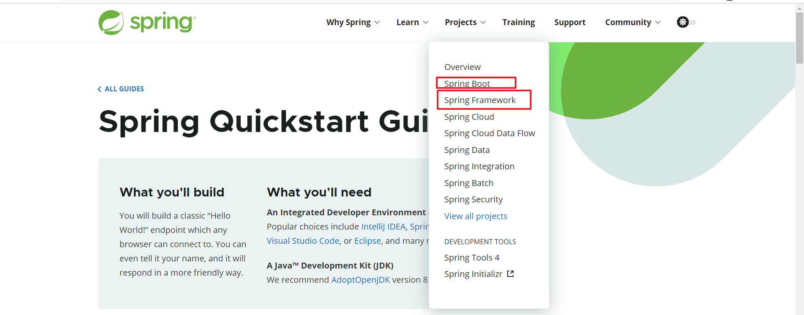
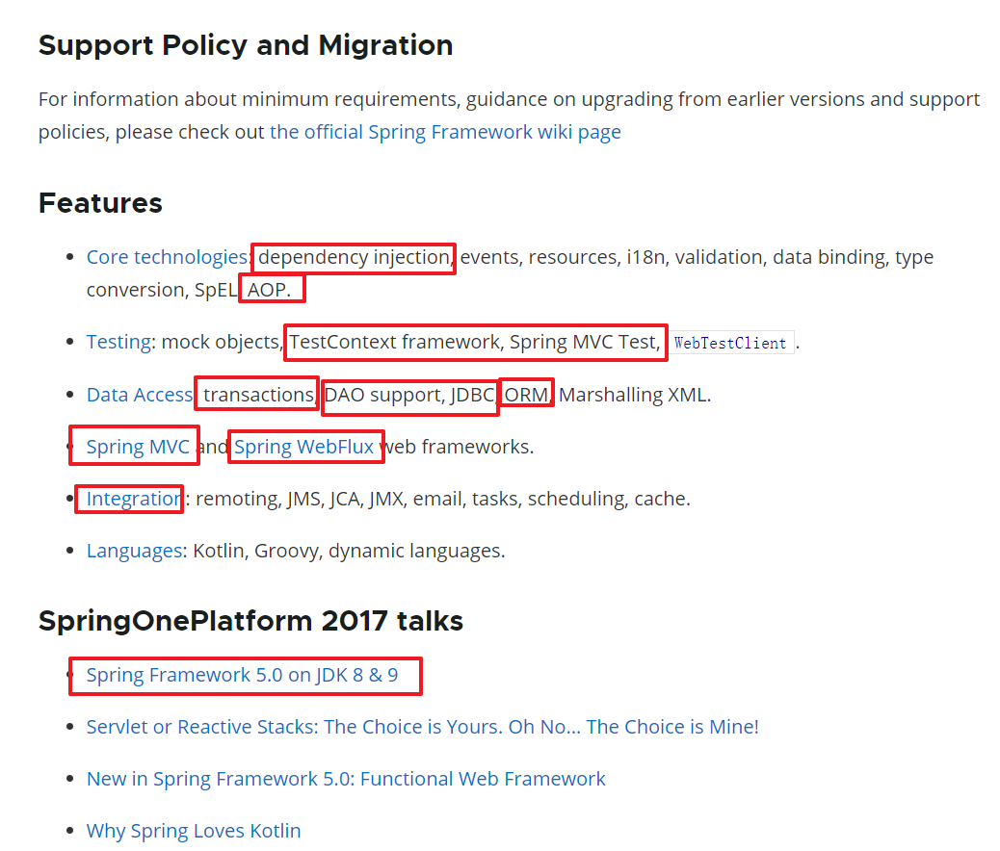
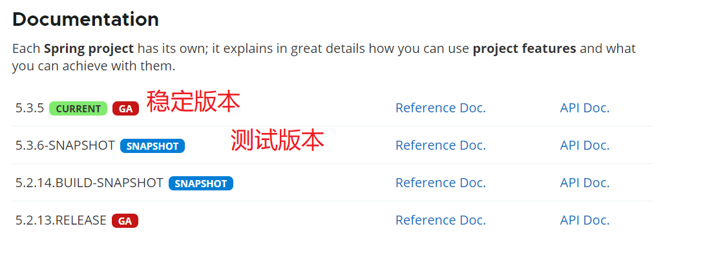
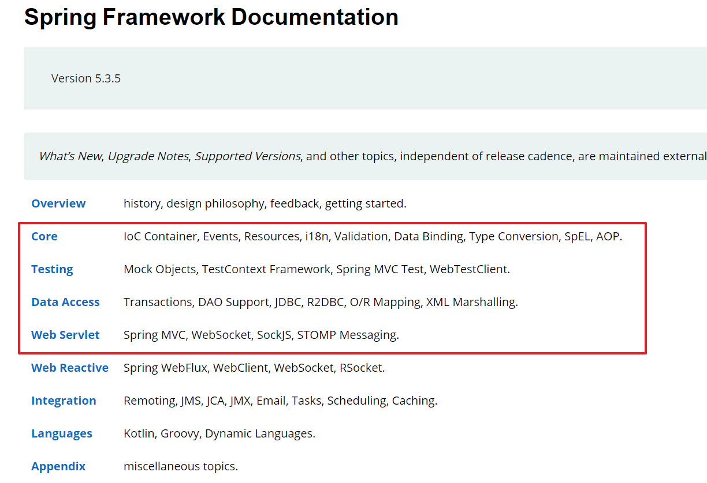
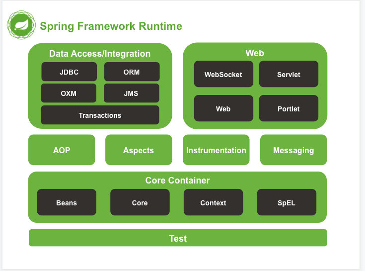
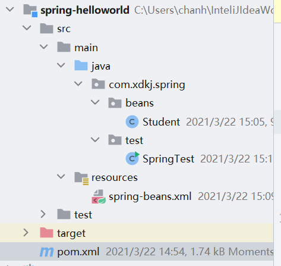
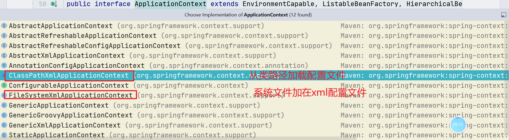
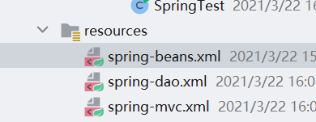
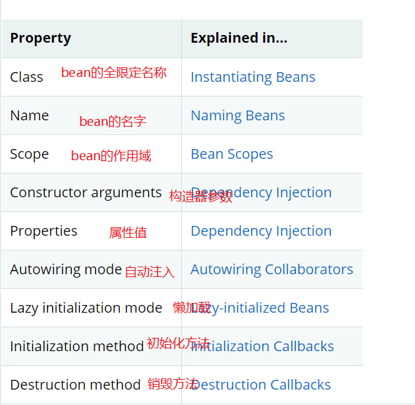

# Spring

## 1. Spring简介

>Spring框架是由于[软件开发](https://baike.baidu.com/item/软件开发/3448966)的复杂性而创建的。Spring使用的是基本的JavaBean来完成以前只可能由[EJB](https://baike.baidu.com/item/EJB/144195)完成的事情。然而，Spring的用途不仅仅限于服务器端的开发。从简单性、可测试性和松耦合性角度而言，绝大部分Java应用都可以从Spring中受益。
>
>◆目的：解决企业应用开发的复杂性
>
>◆功能：使用基本的JavaBean代替EJB，并提供了更多的企业应用功能
>
>◆范围：任何Java应用
>
>Spring是一个轻量级控制反转(IoC)和面向切面(AOP)的容器框架。

### 1.1 什么是EJB

> EJB是的Enterprise Java Beans技术的简称, 又被称为企业Java Beans。这种技术最早是由美国计算公司研发出来的。EJB技术的诞生标志着Java Beans的运行正式从客户端领域扩展到服务器领域。在[电子商务](https://baike.baidu.com/item/电子商务/98106)领域运用EJB技术可以简化应用系统的开发, 这是由该技术的结构和特点所决定的。
>
> 我们在WEB阶段我们发现我们所有的Servlet只要被放置在了服务器的容器中我们既可以不用自己去创建Servlet接口的实现类的实例化对象。不需要手动在new对象和引用对象。
>
> EJB太依赖与服务器了。没有服务器就不可能是实现其他的类的自动创建，(IOC  DI).发现除了我们的Servlet接口的实现类。其他的都不能实现EJB规范。

### 1.2 Spring官网











### 1.3 Spring模块



### 1.4 Spring-HelloWorld



```xml
<?xml version="1.0" encoding="UTF-8"?>
<project xmlns="http://maven.apache.org/POM/4.0.0"
         xmlns:xsi="http://www.w3.org/2001/XMLSchema-instance"
         xsi:schemaLocation="http://maven.apache.org/POM/4.0.0 http://maven.apache.org/xsd/maven-4.0.0.xsd">
    <modelVersion>4.0.0</modelVersion>

    <groupId>com.xdkj</groupId>
    <artifactId>spring-helloworld</artifactId>
    <version>1.0-SNAPSHOT</version>

    <properties>
        <maven.compiler.source>8</maven.compiler.source>
        <maven.compiler.target>8</maven.compiler.target>
    </properties>
        <!--spring的核心的jar包导入-->
    <dependencies>
        <!--core 核心-->
        <dependency>
            <groupId>org.springframework</groupId>
            <artifactId>spring-core</artifactId>
            <version>5.2.5.RELEASE</version>
        </dependency>
        <!--上下文-->
        <dependency>
            <groupId>org.springframework</groupId>
            <artifactId>spring-context</artifactId>
            <version>5.2.5.RELEASE</version>
        </dependency>
        <!--test测试jar包-->
        <dependency>
            <groupId>org.springframework</groupId>
            <artifactId>spring-test</artifactId>
            <version>5.2.5.RELEASE</version>
        </dependency>
        <!--aop切面-->
        <dependency>
            <groupId>org.springframework</groupId>
            <artifactId>spring-aop</artifactId>
            <version>5.2.5.RELEASE</version>
        </dependency>
        <!--ioc di 的jar-->
        <dependency>
            <groupId>org.springframework</groupId>
            <artifactId>spring-beans</artifactId>
            <version>5.2.5.RELEASE</version>
        </dependency>

    </dependencies>
</project>
```

**Student.java**

```java
public class Student {
    private Integer id;
    private String name;
    private String address;
    -----get  set ------
}
```

**spring-beans.xml**

```xml
<?xml version="1.0" encoding="UTF-8"?>
<beans xmlns="http://www.springframework.org/schema/beans"
       xmlns:xsi="http://www.w3.org/2001/XMLSchema-instance"
       xsi:schemaLocation="http://www.springframework.org/schema/beans
        https://www.springframework.org/schema/beans/spring-beans.xsd">
    <!--spring是一个容器  容器自动帮助我们进行对象的实例化
    score bean的作用域 默认是单例模式
      prototype 获取一次new一个对象-->
    <bean id="student" class="com.xdkj.spring.beans.Student" scope="singleton"></bean>
</beans>
```

**SpringTest.java**

```java
package com.xdkj.spring.test;

import com.xdkj.spring.beans.Student;
import org.springframework.context.ApplicationContext;
import org.springframework.context.support.ClassPathXmlApplicationContext;

/**
 * ClassName SpringTest
 * Description:
 *
 * @Author:一尘
 * @Version:1.0
 * @Date:2021-03-22-15:00
 */
public class SpringTest {
    public static void main(String[] args) {
        //Student  stu = new Student();
        //加载spring核心的配置文件  启动Spring容器  类路径  编译后的classes文件夹
        ApplicationContext context  = new ClassPathXmlApplicationContext("classpath:spring-beans.xml");
        //就是ioc
      Student student =   context.getBean("student", Student.class);
        Student student1 =   context.getBean("student", Student.class);
      //com.xdkj.spring.beans.Student@42e26948
        System.out.println(student);
        System.out.println(student1);
    }
}
```

## 2. Inversion of Control (IoC) container/dependency injection (DI).

> IOC 控制反转: 是一种思想 不是一种技术只是Spring将他发扬光大了。
>
> 在传统的开发中我们的代码严重 的存在耦合关系。类和类之间存在依赖。
>
> 所谓的控制反转就是将类的创建对象实例化的权利交给了Spring容器，在我们使用AppliacationContext 实现类去加载Spring的配置文件的时候，spring容器就会帮助我们创建类的实例化对象，
>
> 默认是以单例的设计模式去创建的。底层使用的是BeanFactory创建。再在我们使用的时候使用getBean()从容器中获取创建好的对象，拿过来使用。
>
> DI:依赖注入 
>
> 我们要使用的类的实例化对象依赖于Spring容器去创建，在使用getBean()的时候有容器注入给我们去使用。

### 2.1 ApplicationContext




**SpringTest.java**

```java
package com.xdkj.spring.test;

import com.xdkj.spring.beans.Student;
import org.springframework.context.ApplicationContext;
import org.springframework.context.support.ClassPathXmlApplicationContext;
import org.springframework.context.support.FileSystemXmlApplicationContext;

/**
 * ClassName SpringTest
 * Description:
 *
 * @Author:一尘
 * @Version:1.0
 * @Date:2021-03-22-15:00
 */
public class SpringTest {
    public static void main(String[] args) {
        //Student  stu = new Student();
        //加载spring核心的配置文件  启动Spring容器  类路径  编译后的classes文件夹
        ApplicationContext context  = new ClassPathXmlApplicationContext("classpath:spring-beans.xml");
        //就是ioc
      Student student =   context.getBean("student", Student.class);
        Student student1 =   context.getBean("student", Student.class);
      //com.xdkj.spring.beans.Student@42e26948
        System.out.println(student);
        System.out.println(student1);
        //从文件系统加载配置
        ApplicationContext  context1 = new FileSystemXmlApplicationContext("D:\\spring-beans.xml");
        Student student2 = context1.getBean("student", Student.class);
        System.out.println(student2);
    }
}

```

### 2.2 Spring的多模块配置文件



每一个配置文件就是一个容器

```java
package com.xdkj.spring.test;

import com.xdkj.spring.beans.Student;
import org.springframework.context.ApplicationContext;
import org.springframework.context.support.ClassPathXmlApplicationContext;
import org.springframework.context.support.FileSystemXmlApplicationContext;

/**
 * ClassName SpringTest
 * Description:
 *
 * @Author:一尘
 * @Version:1.0
 * @Date:2021-03-22-15:00
 */
public class SpringTest {
    public static void main(String[] args) {
        //Student  stu = new Student();
        //加载spring核心的配置文件  启动Spring容器  类路径  编译后的classes文件夹
        ApplicationContext context  = new ClassPathXmlApplicationContext("classpath:spring-beans.xml","classpath:spring-dao.xml");
        //就是ioc
      Student student =   context.getBean("student", Student.class);
        Student student1 =   context.getBean("student", Student.class);
        Student student3 =   context.getBean("student1", Student.class);
      //com.xdkj.spring.beans.Student@42e26948
        System.out.println(student);
        System.out.println(student1);
        System.out.println("--------------多配置整合以后的-------");
        System.out.println(student3);
    }
}

```


也可以进行容器的整合

### 2.3 spring多配置文件整合

```xml
<?xml version="1.0" encoding="UTF-8"?>
<beans xmlns="http://www.springframework.org/schema/beans"
       xmlns:xsi="http://www.w3.org/2001/XMLSchema-instance"
       xsi:schemaLocation="http://www.springframework.org/schema/beans
        https://www.springframework.org/schema/beans/spring-beans.xsd">

    <!--整合多个配置文件-->
    <import resource="spring-dao.xml"></import>
    <import resource="spring-mvc.xml"/>
    <!--spring是一个容器  容器自动帮助我们进行对象的实例化
        score bean的作用域 默认是单例模式
        prototype 获取一次new一个对象
        lazy-int 就是懒加载 就是程序执行到的时候在进行bean的初始化
      -->
    <bean id="student" class="com.xdkj.spring.beans.Student" scope="singleton"
          lazy-init="true"></bean>
</beans>
```

### 2.4 Bean的概述



1. Class  使用bean的类的全限定性名称 包名+类名
2. name

```xml
<!--nameBean
        使用name 对bean进行命名
        name 可以有多个值 中间使用,隔开 命名方式可以不遵守驼峰命名法 
		所以不使用name 命名
    -->
    <bean name="stu,ss,sd" class="com.xdkj.spring.beans.Student" scope="singleton"></bean>
```

3. 使用id命名

>id命名严格遵守驼峰命名法 习惯于id值是class类名的小驼峰写法。

4. scope 作用域 默认是singleton 单例设计模式  prototype是原型模式

### 2.5 Spring的别名机制

```xml
<?xml version="1.0" encoding="UTF-8"?>
<beans xmlns="http://www.springframework.org/schema/beans"
       xmlns:xsi="http://www.w3.org/2001/XMLSchema-instance"
       xsi:schemaLocation="http://www.springframework.org/schema/beans
        https://www.springframework.org/schema/beans/spring-beans.xsd">

    <!--整合多个配置文件-->
    <import resource="spring-dao.xml"></import>
    <import resource="spring-mvc.xml"/>
    <!--spring是一个容器  容器自动帮助我们进行对象的实例化
        score bean的作用域 默认是单例模式
        prototype 获取一次new一个对象
        lazy-int 就是懒加载 就是程序执行到的时候在进行bean的初始化
      -->

    <bean id="student" class="com.xdkj.spring.beans.Student" scope="singleton"
          lazy-init="true"></bean>
    <!--nameBean
        使用name 对bean进行命名
        name 可以有多个值 中间使用,隔开 命名方式可以不遵守驼峰命名法
    -->
    <bean name="stu,ss,sd" class="com.xdkj.spring.beans.Student" scope="singleton"></bean>

    <!--Spring 的别名机制-->
    <alias name="student" alias="s"></alias>
</beans>
```

## 3. Bean的注入

```java
@Data
@AllArgsConstructor
@NoArgsConstructor
public class Student {
    private Integer id;
    private String name;
    private int age;
    private String address;
}

```

### 3.1 无参构造器注入

```xml
<?xml version="1.0" encoding="UTF-8"?>
<beans xmlns="http://www.springframework.org/schema/beans"
       xmlns:xsi="http://www.w3.org/2001/XMLSchema-instance"
       xsi:schemaLocation="http://www.springframework.org/schema/beans http://www.springframework.org/schema/beans/spring-beans.xsd">
    <!--Spring注入bean的方式-->
    <!--使用的是无参构造器 实例化对象  new Student()-->
    <bean id="student" class="com.xdkj.beans.Student"></bean>
</beans>
```

### 3.2 setter方法注入

> 类要有对应的带参数的构造器 不然就会报错

```xml
<!--使用get set 方法设置属性值-->
    <bean id="student1" class="com.xdkj.beans.Student">
        <property name="id" value="11111"/>
        <property name="age" value="888"/>
        <property name="name" value="joke"/>
        <property name="address" value="北京市"/>
    </bean>
```

### 3.3 构造器注入

+ 名称注入
+ 索引注入
+ 类型注入

```xml
<!--使用带参数的构造器输入属性值-->
    <bean id="student2" class="com.xdkj.beans.Student">
        <constructor-arg name="id" value="123"/>
        <constructor-arg name="address" value="北京市朝阳区"/>
        <constructor-arg name="age" value="88"/>
        <constructor-arg name="name" value="张三"/>
    </bean>
<!--注意书写顺序要和  构造器属性顺序一致-->
    <bean id="student3" class="com.xdkj.beans.Student">
        <constructor-arg type="java.lang.Integer" value="123"/>
        <constructor-arg type="java.lang.String" value="北京市朝阳区"/>
        <constructor-arg type="int" value="88"/>
        <constructor-arg type="java.lang.String" value="张三"/>
    </bean>
    <!--通过构造器中属性的索引值-->
    <bean id="student4" class="com.xdkj.beans.Student">
        <constructor-arg index="0" value="123"/>
        <constructor-arg index="3" value="北京市朝阳区"/>
        <constructor-arg index="2" value="88"/>
        <constructor-arg index="1" value="张三"/>
    </bean>
```

### 3.4 p/c命名空间注入

```xml
<?xml version="1.0" encoding="UTF-8"?>
<beans xmlns="http://www.springframework.org/schema/beans"
       xmlns:xsi="http://www.w3.org/2001/XMLSchema-instance"
       xmlns:p="http://www.springframework.org/schema/p"
       xsi:schemaLocation="http://www.springframework.org/schema/beans
       http://www.springframework.org/schema/beans/spring-beans.xsd">
     <!--p property/c constructor命名空间输入 就是简化写法-->
    <bean id="student5" class="com.xdkj.beans.Student" p:id="6666" p:name="hahah" p:address="陕西省" p:age="99"></bean>
</beans>
```

```xml
<?xml version="1.0" encoding="UTF-8"?>
<beans xmlns="http://www.springframework.org/schema/beans"
       xmlns:xsi="http://www.w3.org/2001/XMLSchema-instance"
       xmlns:p="http://www.springframework.org/schema/p"
       xmlns:c="http://www.springframework.org/schema/c"
       xsi:schemaLocation="http://www.springframework.org/schema/beans
       http://www.springframework.org/schema/beans/spring-beans.xsd">
    <!--c  命名空间 -->
    <bean id="student6" class="com.xdkj.beans.Student" c:id="3636" c:address="南京市" c:age="863" c:name="李四"></bean>
</beans>
```

**SpringDemoTest.java**

```java
package com.xdkj.test;

import com.xdkj.beans.Student;
import org.springframework.context.ApplicationContext;
import org.springframework.context.support.ClassPathXmlApplicationContext;

/**
 * ClassName SpringDemoTest
 * Description:
 *
 * @Author:一尘
 * @Version:1.0
 * @Date:2021-03-22-16:55
 */
public class SpringDemoTest {
    public static void main(String[] args) {
        ApplicationContext  context =new  ClassPathXmlApplicationContext("classpath:spring-beans.xml");
        Student student = context.getBean("student", Student.class);
        //Student student = (Student) context.getBean("student");
        /*System.out.println(student);
            student.setId(123);
            student.setName("admin");
            student.setAddress("西安市");*/
        System.out.println(student);
        System.out.println("----------------set 方法注入属性值---------");
        Student student1 = context.getBean("student1", Student.class);
        System.out.println(student1);
        System.out.println("----------------构造器 参数名称 注入属性值---------");
        Student student2 = context.getBean("student2", Student.class);
        System.out.println(student2);
        System.out.println("----------------构造器 参数类型 注入属性值---------");
        Student student3 = context.getBean("student3", Student.class);
        System.out.println(student3);
        System.out.println("----------------构造器 参数的索引值 注入属性值---------");
        Student student4 = context.getBean("student4", Student.class);
        System.out.println(student4);
        System.out.println("----------------p命名空间 注入属性值---------");
        Student student5 = context.getBean("student5", Student.class);
        System.out.println(student5);
        System.out.println("----------------c命名空间 注入属性值---------");
        Student student6 = context.getBean("student6", Student.class);
        System.out.println(student6);
    }
}

```

### 3.5 数组注入

### 3.6 list集合注入

### 3.7 set集合注入

### 3.8 Map集合注入

### 3.9 Properties注入

### 3.10 工厂方法注入

#### 3.10.1动态工厂方法注入

#### 3.10.2 静态工厂方法注入

### 3.11 自动注入

#### 3.11.1按类型注入

#### 3.11.2 按名称注入

