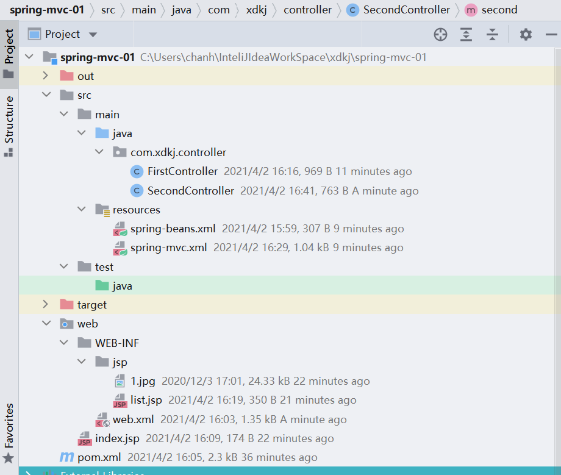
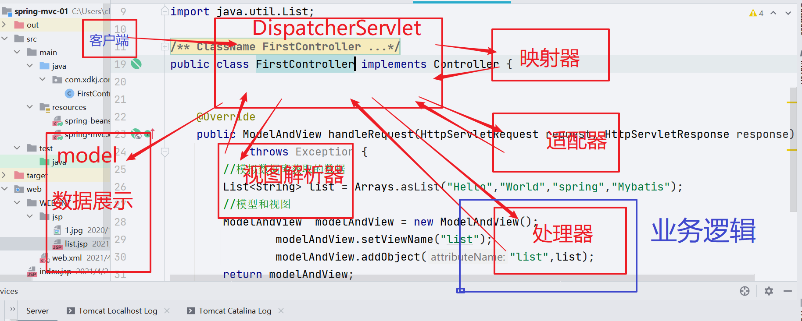
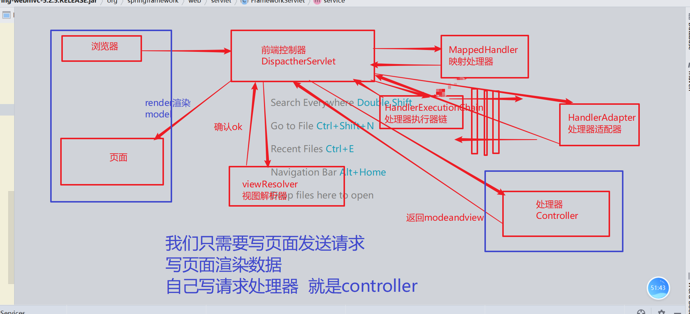
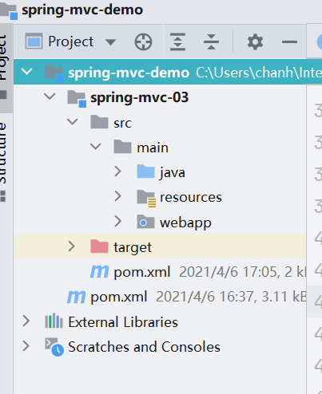
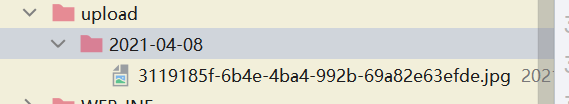
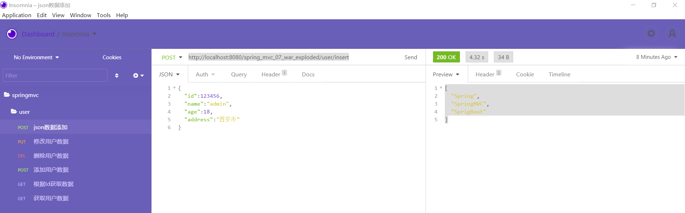
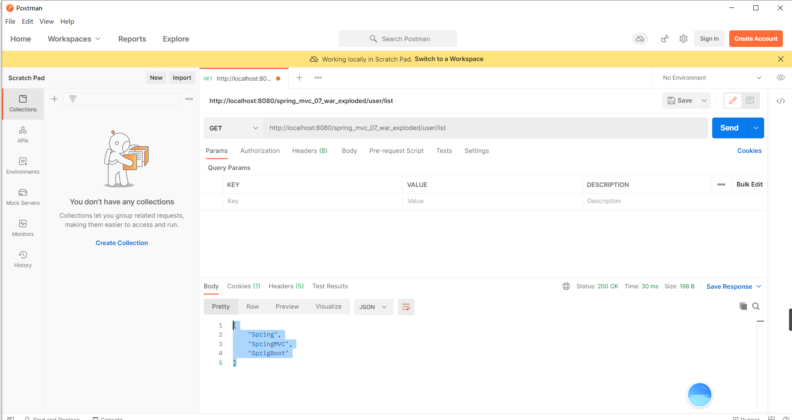

# SpringMVC

## 1.SpringMVC简介

> 传统的web开发早期我们是基于servlet和jsp技术 servlet我们只能在doGET  doPost中处理业务，页面跳转重定向，响应数据。
>
> struts2 技术，框架 大量的配置和struts.xml 当spring出现以后，spring是一个容器，ioc di aop的核心思想。所以就基于Spring容器 开发出了SpringMVC.
>
> 他不是一个新的技术，他是一个Spring的web模块、核心的DispactherServlet 基于servlet-api研发的。
>
> Web阶段的开发模式结构:
>
>  m  model 模型  处理数据业务  beans dao service
>
> v  view jsp html thymleaf freemark
>
> c controller servlet作为controller

+ spring-web
+ spring-webmvc





**pom.xml**

```xml
<?xml version="1.0" encoding="UTF-8"?>
<project xmlns="http://maven.apache.org/POM/4.0.0"
         xmlns:xsi="http://www.w3.org/2001/XMLSchema-instance"
         xsi:schemaLocation="http://maven.apache.org/POM/4.0.0 http://maven.apache.org/xsd/maven-4.0.0.xsd">
    <modelVersion>4.0.0</modelVersion>

    <groupId>com.xdkj</groupId>
    <artifactId>spring-mvc-01</artifactId>
    <version>1.0-SNAPSHOT</version>

    <properties>
        <maven.compiler.source>8</maven.compiler.source>
        <maven.compiler.target>8</maven.compiler.target>
    </properties>
    <dependencies>
        <dependency>
            <groupId>org.springframework</groupId>
            <artifactId>spring-core</artifactId>
            <version>5.2.5.RELEASE</version>
        </dependency>
        <dependency>
            <groupId>org.springframework</groupId>
            <artifactId>spring-context</artifactId>
            <version>5.2.5.RELEASE</version>
        </dependency>
        <dependency>
            <groupId>org.springframework</groupId>
            <artifactId>spring-context-support</artifactId>
            <version>5.2.5.RELEASE</version>
        </dependency>
        <dependency>
            <groupId>org.springframework</groupId>
            <artifactId>spring-aop</artifactId>
            <version>5.2.5.RELEASE</version>
        </dependency>
        <dependency>
            <groupId>org.springframework</groupId>
            <artifactId>spring-test</artifactId>
            <version>5.2.5.RELEASE</version>
        </dependency>
        <!--springmvc相关的jar-->
        <dependency>
            <groupId>org.springframework</groupId>
            <artifactId>spring-web</artifactId>
            <version>5.2.5.RELEASE</version>
        </dependency>
        <dependency>
        <groupId>org.springframework</groupId>
        <artifactId>spring-webmvc</artifactId>
        <version>5.2.5.RELEASE</version>
    </dependency>
        <dependency>
            <groupId>javax.servlet</groupId>
            <artifactId>javax.servlet-api</artifactId>
            <version>4.0.1</version>
        </dependency>
        <dependency>
            <groupId>jstl</groupId>
            <artifactId>jstl</artifactId>
            <version>1.2</version>
        </dependency>
    </dependencies>
</project>
```

**web.xml**

```xml
<?xml version="1.0" encoding="UTF-8"?>
<web-app xmlns="http://xmlns.jcp.org/xml/ns/javaee"
         xmlns:xsi="http://www.w3.org/2001/XMLSchema-instance"
         xsi:schemaLocation="http://xmlns.jcp.org/xml/ns/javaee
         http://xmlns.jcp.org/xml/ns/javaee/web-app_4_0.xsd"
         version="4.0">
    <!--配置Spring的配置文件-->
    <context-param>
        <param-name>contextConfigLocation</param-name>
        <param-value>classpath*:spring-beans.xml</param-value>
    </context-param>
    <!--配置spring环境加载监听器-->
    <listener>
        <listener-class>org.springframework.web.context.ContextLoaderListener</listener-class>
    </listener>
    <!--配置SpringMVC的核心servlet-->
    <servlet>
        <servlet-name>springmvc</servlet-name>
        <servlet-class>org.springframework.web.servlet.DispatcherServlet</servlet-class>
        <init-param>
            <param-name>contextConfigLocation</param-name>
            <!--springmvc配置文件-->
            <param-value>classpath*:spring-mvc.xml</param-value>
        </init-param>
        <load-on-startup>1</load-on-startup>
    </servlet>
    <servlet-mapping>
        <servlet-name>springmvc</servlet-name>
        <!--springmvc请求路径  会把请求和静态资源都拦截下来-->
        <url-pattern>/</url-pattern>
    </servlet-mapping>
</web-app>
```

**spring-beans.xml**

```xml
<?xml version="1.0" encoding="UTF-8"?>
<beans xmlns="http://www.springframework.org/schema/beans"
       xmlns:xsi="http://www.w3.org/2001/XMLSchema-instance"
       xsi:schemaLocation="http://www.springframework.org/schema/beans http://www.springframework.org/schema/beans/spring-beans.xsd">

</beans>
```

**spring-mvc.xml**

```xml
<?xml version="1.0" encoding="UTF-8"?>
<beans xmlns="http://www.springframework.org/schema/beans"
       xmlns:xsi="http://www.w3.org/2001/XMLSchema-instance"
       xmlns:context="http://www.springframework.org/schema/context"
       xsi:schemaLocation="http://www.springframework.org/schema/beans http://www.springframework.org/schema/beans/spring-beans.xsd http://www.springframework.org/schema/context https://www.springframework.org/schema/context/spring-context.xsd">
       <!--请求转发的路径-->
        <bean id="/first" class="com.xdkj.controller.FirstController"></bean>
        <context:component-scan base-package="com.xdkj.controller"></context:component-scan>
    <!--试图解析器-->
    <bean id="viewResolver" class="org.springframework.web.servlet.view.InternalResourceViewResolver">
        <property name="viewClass" value="org.springframework.web.servlet.view.JstlView"/>
        <property name="prefix" value="/WEB-INF/jsp/"/>
        <property name="suffix" value=".jsp"/>
    </bean>

</beans>
```

**FirstController.java**

```java
package com.xdkj.controller;

import org.springframework.web.servlet.ModelAndView;
import org.springframework.web.servlet.mvc.Controller;

import javax.servlet.http.HttpServletRequest;
import javax.servlet.http.HttpServletResponse;
import java.util.Arrays;
import java.util.List;

/**
 * ClassName FirstController
 * Description:
 *
 * @Author:一尘
 * @Version:1.0
 * @Date:2021-04-02-16:04
 */
public class FirstController implements Controller {


    @Override
    public ModelAndView handleRequest(HttpServletRequest request, HttpServletResponse response)
            throws Exception {
        //模拟数据库获取的数据
        List<String> list = Arrays.asList("Hello","World","spring","Mybatis");
        //模型和视图
        ModelAndView  modelAndView = new ModelAndView();
                modelAndView.setViewName("list");
                modelAndView.addObject("list",list);
        return modelAndView;
    }
}

```

**SecondController.java**

```java
package com.xdkj.controller;

import org.springframework.stereotype.Controller;
import org.springframework.web.bind.annotation.RequestMapping;
import org.springframework.web.servlet.ModelAndView;

import java.util.Arrays;
import java.util.List;

/**
 * ClassName SecondController
 * Description:
 *
 * @Author:一尘
 * @Version:1.0
 * @Date:2021-04-02-16:27
 */
@Controller
public class SecondController {


    @RequestMapping("/second")
    public ModelAndView second(){
        List<String> list = Arrays.asList("Hello","World","spring","Mybatis");
        ModelAndView modelAndView = new ModelAndView();
        modelAndView.setViewName("list");
        modelAndView.addObject("list",list);
        return modelAndView;
    }
}

```

**list.jsp**

```jsp
<%--
  Created by IntelliJ IDEA.
  User: chanh
  Date: 2021/4/2
  Time: 16:08
  To change this template use File | Settings | File Templates.
--%>
<%@ page contentType="text/html;charset=UTF-8" language="java" %>
<html>
<head>
    <title>list</title>
</head>
<body>
    ${list}
    <hr>
    
</body>
</html>

```

## 2.SpringMVC生命周期

### 2.1 生命周期



1. 客户端发送请求到DispatcherServlet
2. Dispactherservlet 调用MappedHandler 去查找处理器适配器
3. 处理器适配器去调用处理器处理请求
4. 处理器返回ModelAndView给DispactherServlet
5. DispactherServlet根据ModelAndView去找视图解析器 是否有合适的视图
6. 试图存在就解析视图路径
7. 带着数据去页面渲染。

### 2.2 SpringMVC默认的配置文件

**DispactherServlet.properties**

```properties
# Default implementation classes for DispatcherServlet's strategy interfaces.
# Used as fallback when no matching beans are found in the DispatcherServlet context.
# Not meant to be customized by application developers.

org.springframework.web.servlet.LocaleResolver=org.springframework.web.servlet.i18n.AcceptHeaderLocaleResolver

org.springframework.web.servlet.ThemeResolver=org.springframework.web.servlet.theme.FixedThemeResolver

org.springframework.web.servlet.HandlerMapping=org.springframework.web.servlet.handler.BeanNameUrlHandlerMapping,\
	org.springframework.web.servlet.mvc.method.annotation.RequestMappingHandlerMapping,\
	org.springframework.web.servlet.function.support.RouterFunctionMapping

org.springframework.web.servlet.HandlerAdapter=org.springframework.web.servlet.mvc.HttpRequestHandlerAdapter,\
	org.springframework.web.servlet.mvc.SimpleControllerHandlerAdapter,\
	org.springframework.web.servlet.mvc.method.annotation.RequestMappingHandlerAdapter,\
	org.springframework.web.servlet.function.support.HandlerFunctionAdapter


org.springframework.web.servlet.HandlerExceptionResolver=org.springframework.web.servlet.mvc.method.annotation.ExceptionHandlerExceptionResolver,\
	org.springframework.web.servlet.mvc.annotation.ResponseStatusExceptionResolver,\
	org.springframework.web.servlet.mvc.support.DefaultHandlerExceptionResolver

org.springframework.web.servlet.RequestToViewNameTranslator=org.springframework.web.servlet.view.DefaultRequestToViewNameTranslator

org.springframework.web.servlet.ViewResolver=org.springframework.web.servlet.view.InternalResourceViewResolver

org.springframework.web.servlet.FlashMapManager=org.springframework.web.servlet.support.SessionFlashMapManager
```

## 3. SpringMVC注解开发



**父项目的pom.xml**

```xml
<?xml version="1.0" encoding="UTF-8"?>
<project xmlns="http://maven.apache.org/POM/4.0.0"
         xmlns:xsi="http://www.w3.org/2001/XMLSchema-instance"
         xsi:schemaLocation="http://maven.apache.org/POM/4.0.0 http://maven.apache.org/xsd/maven-4.0.0.xsd">
    <modelVersion>4.0.0</modelVersion>

    <groupId>com.xdkj</groupId>
    <artifactId>spring-mvc-demo</artifactId>
    <!--打包方式是pom-->
    <packaging>pom</packaging>
    <version>1.0-SNAPSHOT</version>
    <modules>
        <module>spring-mvc-03</module>
    </modules>
    <properties>
        <maven.compiler.source>8</maven.compiler.source>
        <maven.compiler.target>8</maven.compiler.target>
        <junit.version>4.12</junit.version>
    </properties>
    <!--规定子模块的jar版本依赖和插件等-->
   <dependencyManagement>
       <dependencies>
           <dependency>
               <groupId>junit</groupId>
               <artifactId>junit</artifactId>
               <version>${junit.version}</version>
               <scope>test</scope>
           </dependency>
           <dependency>
               <groupId>org.springframework</groupId>
               <artifactId>spring-core</artifactId>
               <version>5.2.5.RELEASE</version>
           </dependency>
           <dependency>
               <groupId>org.springframework</groupId>
               <artifactId>spring-context</artifactId>
               <version>5.2.5.RELEASE</version>
           </dependency>
           <dependency>
               <groupId>org.springframework</groupId>
               <artifactId>spring-context-support</artifactId>
               <version>5.2.5.RELEASE</version>
           </dependency>
           <dependency>
               <groupId>org.springframework</groupId>
               <artifactId>spring-aop</artifactId>
               <version>5.2.5.RELEASE</version>
           </dependency>
           <dependency>
               <groupId>org.springframework</groupId>
               <artifactId>spring-test</artifactId>
               <version>5.2.5.RELEASE</version>
           </dependency>
           <dependency>
               <groupId>org.springframework</groupId>
               <artifactId>spring-web</artifactId>
               <version>5.2.5.RELEASE</version>
           </dependency>
           <dependency>
               <groupId>org.springframework</groupId>
               <artifactId>spring-webmvc</artifactId>
               <version>5.2.5.RELEASE</version>
           </dependency>
           <dependency>
               <groupId>javax.servlet</groupId>
               <artifactId>javax.servlet-api</artifactId>
               <version>4.0.1</version>
           </dependency>
           <dependency>
               <groupId>jstl</groupId>
               <artifactId>jstl</artifactId>
               <version>1.2</version>
           </dependency>
           <dependency>
               <groupId>org.projectlombok</groupId>
               <artifactId>lombok</artifactId>
               <version>1.18.10</version>
           </dependency>
       </dependencies>
   </dependencyManagement>
</project>
```

**spring-mvc-03.pom.xml**

```xml
<?xml version="1.0" encoding="UTF-8"?>
<project xmlns="http://maven.apache.org/POM/4.0.0"
         xmlns:xsi="http://www.w3.org/2001/XMLSchema-instance"
         xsi:schemaLocation="http://maven.apache.org/POM/4.0.0 http://maven.apache.org/xsd/maven-4.0.0.xsd">
    <parent>
        <artifactId>spring-mvc-demo</artifactId>
        <groupId>com.xdkj</groupId>
        <version>1.0-SNAPSHOT</version>
    </parent>
    <modelVersion>4.0.0</modelVersion>
    <artifactId>spring-mvc-03</artifactId>
    <packaging>war</packaging>

    <properties>
        <maven.compiler.source>8</maven.compiler.source>
        <maven.compiler.target>8</maven.compiler.target>
    </properties>
    <dependencies>
        <dependency>
            <groupId>junit</groupId>
            <artifactId>junit</artifactId>
            <scope>test</scope>
        </dependency>
        <dependency>
            <groupId>org.springframework</groupId>
            <artifactId>spring-context</artifactId>
        </dependency>
        <dependency>
            <groupId>org.springframework</groupId>
            <artifactId>spring-context-support</artifactId>
        </dependency>
        <dependency>
            <groupId>org.springframework</groupId>
            <artifactId>spring-web</artifactId>
        </dependency>
        <dependency>
            <groupId>org.springframework</groupId>
            <artifactId>spring-webmvc</artifactId>
        </dependency>
        <dependency>
            <groupId>org.springframework</groupId>
            <artifactId>spring-test</artifactId>
        </dependency>
        <dependency>
            <groupId>javax.servlet</groupId>
            <artifactId>javax.servlet-api</artifactId>
        </dependency>
        <dependency>
            <groupId>jstl</groupId>
            <artifactId>jstl</artifactId>
        </dependency>
        <!--jackson springmvc默认集成的json数据处理的jar-->
    </dependencies>

</project>
```

**spring-mvc.xml**

```xml
<?xml version="1.0" encoding="UTF-8"?>
<beans xmlns="http://www.springframework.org/schema/beans"
       xmlns:xsi="http://www.w3.org/2001/XMLSchema-instance"
       xmlns:context="http://www.springframework.org/schema/context"
       xmlns:mvc="http://www.springframework.org/schema/mvc"
       xsi:schemaLocation="http://www.springframework.org/schema/beans http://www.springframework.org/schema/beans/spring-beans.xsd http://www.springframework.org/schema/context https://www.springframework.org/schema/context/spring-context.xsd http://www.springframework.org/schema/mvc https://www.springframework.org/schema/mvc/spring-mvc.xsd">
        <!--组件扫描-->
    <context:component-scan base-package="com.xdkj"></context:component-scan>
    <!--视图解析器-->
    <bean id="viewResolver" class="org.springframework.web.servlet.view.InternalResourceViewResolver">
        <property name="viewClass" value="org.springframework.web.servlet.view.JstlView"/>
        <property name="prefix" value="/WEB-INF/jsp/"/>
        <property name="suffix" value=".jsp"/>
    </bean>
     <!--注解驱动  springmvc中注解驱动是 自动适配 映射处理器 适配器
        注解驱动可以自动帮助我们进行数据的json准换
     -->
    <mvc:annotation-driven></mvc:annotation-driven>
</beans>
```


**web.xml**

```xml
<web-app xmlns="http://xmlns.jcp.org/xml/ns/javaee"
  xmlns:xsi="http://www.w3.org/2001/XMLSchema-instance"
  xsi:schemaLocation="http://xmlns.jcp.org/xml/ns/javaee
                      http://xmlns.jcp.org/xml/ns/javaee/web-app_4_0.xsd"
  version="4.0">

  <display-name>Archetype Created Web Application</display-name>
  <!--服务器容器启动的时候就加载Spring的配置信息-->
  <context-param>
    <param-name>contextConfigLocation</param-name>
    <param-value>classpath*:spring-core.xml</param-value>
  </context-param>
  <!--上下文加载的监听器-->
  <listener>
    <listener-class>org.springframework.web.context.ContextLoaderListener</listener-class>
  </listener>
  <servlet>
    <servlet-name>springMvc</servlet-name>
    <servlet-class>org.springframework.web.servlet.DispatcherServlet</servlet-class>
    <init-param>
      <param-name>contextConfigLocation</param-name>
      <param-value>classpath*:spring-mvc.xml</param-value>
    </init-param>
    <!--服务器启动的时候就加载-->
    <load-on-startup>1</load-on-startup>
  </servlet>
  <servlet-mapping>
    <servlet-name>springMvc</servlet-name>
    <!--/ 拦截所有的请求  请求和静态资源的请求-->
    <url-pattern>/</url-pattern>
  </servlet-mapping>
</web-app>
```

**FirstController.java**

```java
package com.xdkj.controller;

import org.springframework.stereotype.Controller;
import org.springframework.web.bind.annotation.RequestMapping;
import org.springframework.web.bind.annotation.RequestMethod;
import org.springframework.web.servlet.ModelAndView;

import java.util.Arrays;

/**
 * ClassName FirstController
 * Description:
 *
 * @Author:一尘
 * @Version:1.0
 * @Date:2021-04-06-16:39
 */
@Controller
//@RequestMapping("/first")
public class FirstController {
    /*请求映射 根据页面的请求路径找到方法去处理*/
    @RequestMapping(value = "/hello")
    public ModelAndView hello(){
        ModelAndView modelAndView = new ModelAndView();
            modelAndView.setViewName("list");
            modelAndView.addObject("list", Arrays.asList("Spring","SpringMVC","Servlet"));
        return modelAndView;
    }

    @RequestMapping("/world")
    public ModelAndView world(){
        ModelAndView modelAndView = new ModelAndView();
        modelAndView.setViewName("list");
        modelAndView.addObject("list", Arrays.asList("Spring","SpringMVC","Servlet"));
        return modelAndView;
    }
    //path  请求路径 value请求的路径名称  method请求方式  produces响应头格式
    @RequestMapping(value = "/helloWorld",method = RequestMethod.GET,produces = "text/html;charset=utf8")
    public ModelAndView helloWorld(){
        ModelAndView modelAndView = new ModelAndView();
        modelAndView.setViewName("list");
        modelAndView.addObject("list", Arrays.asList("Spring","SpringMVC","Servlet"));
        return modelAndView;
    }

    //path  请求路径 value请求的路径名称  method请求方式  produces响应头格式
    @RequestMapping(value = "/haha",method = RequestMethod.GET,produces = "application/json;charset=utf8")
    public ModelAndView haha(){
        ModelAndView modelAndView = new ModelAndView();
        modelAndView.setViewName("list");
        modelAndView.addObject("list", Arrays.asList("Spring","SpringMVC","Servlet"));
        return modelAndView;
    }
}

```

**SecondController.java**

```java
package com.xdkj.controller;

import org.springframework.stereotype.Controller;
import org.springframework.web.bind.annotation.*;
import org.springframework.web.servlet.ModelAndView;

import java.util.Arrays;

/**
 * ClassName SecondController
 * Description:
 *
 * @Author:一尘
 * @Version:1.0
 * @Date:2021-04-06-17:05
 */
@Controller
@RequestMapping("/second")
public class SecondController {

    @RequestMapping(value = "/hello")
    public ModelAndView hello(){
        ModelAndView modelAndView = new ModelAndView();
        modelAndView.setViewName("list");
        modelAndView.addObject("list", Arrays.asList("Spring","SpringMVC","Servlet"));
        return modelAndView;
    }


}

```

**ThreeController.java**

```java
package com.xdkj.controller;

import org.springframework.stereotype.Controller;
import org.springframework.web.bind.annotation.GetMapping;

import javax.servlet.ServletException;
import javax.servlet.http.HttpServletRequest;
import javax.servlet.http.HttpServletResponse;
import java.io.IOException;
import java.util.Arrays;

/**
 * ClassName ThreeController
 * Description:
 *
 * @Author:一尘
 * @Version:1.0
 * @Date:2021-04-06-17:14
 */
@Controller
public class ThreeController {
    //使用传统的servletAPI 处理请求
    //传统的servlet-api不会走springmvc配置的字节的视图解析器
    @GetMapping("/list")
    public void handlerRequest(HttpServletRequest request , HttpServletResponse response)
            throws ServletException, IOException {
        //添加数据和页面跳转
        request.setAttribute("list", Arrays.asList("Spring","SpringMVC","Servlet"));
        request.getRequestDispatcher("/WEB-INF/jsp/list.jsp").forward(request,response);
    }

    @GetMapping("/info")
    public void info(HttpServletRequest request , HttpServletResponse response)
            throws ServletException, IOException {
        //添加数据和页面重定向
        request.getSession().setAttribute("list",Arrays.asList("Spring","SpringMVC","Servlet"));
        //WEB_INF下的页面不能直接访问
        //请求重定向
        response.sendRedirect("list");
    }
    //接收参数  处理请求
    @GetMapping("/param")
    public void handlerParam(HttpServletRequest request , HttpServletResponse response)
            throws ServletException, IOException {
        String name = request.getParameter("name");
        String age = request.getParameter("age");
        System.out.println(name +"------"+ age);
        //添加数据和页面重定向
        request.getSession().setAttribute("list",Arrays.asList("Spring","SpringMVC","Servlet"));
        //WEB_INF下的页面不能直接访问
        //请求重定向
        request.getRequestDispatcher("/WEB-INF/jsp/list.jsp").forward(request,response);
    }
}

```

**FourController.java**

```java
package com.xdkj.controller;

import org.springframework.stereotype.Controller;
import org.springframework.ui.Model;
import org.springframework.web.bind.annotation.GetMapping;
import org.springframework.web.bind.annotation.RequestParam;

import javax.servlet.http.HttpServletRequest;

/**
 * ClassName FourController
 * Description:
 *
 * @Author:一尘
 * @Version:1.0
 * @Date:2021-04-06-17:28
 */
@Controller
public class FourController {

    @GetMapping("/one")
    public  String  one(){
        //在springmv中我们可以返回一个视图的名字 他会被视图解析器解析 进行页面跳转
        return  "list";
    }

    @GetMapping("/two")
    public  String  two(HttpServletRequest request){
        //在springmv中我们可以返回一个视图的名字 他会被视图解析器解析 进行页面跳转
        request.setAttribute("list","数据展示！！！！！！");
        return  "list";
    }

    @GetMapping("/three")
    public  String  three(Model model){
        //在springmv中我们可以返回一个视图的名字 他会被视图解析器解析 进行页面跳转
        model.addAttribute("list","Model 数据传输！！");
        return  "list";
    }
    //页面传输的所有数据都是字符串
    //参数的自动数据类型转换  基本数据类型
    @GetMapping("/four")
    public  String  four(String name,int age){
        //在springmv中我们可以返回一个视图的名字 他会被视图解析器解析 进行页面跳转
        System.out.println(name+"---------"+age);
        return  "list";
    }
    /*@RequestParam 别名映射  获取到的值赋给后边的变量*/
    @GetMapping("/five")
    public  String  five(@RequestParam("name") String username, @RequestParam("age") int userage){
        //在springmv中我们可以返回一个视图的名字 他会被视图解析器解析 进行页面跳转
        System.out.println(username+"---------"+userage);
        return  "list";
    }
}

```

**index.jsp**

```jsp
<%@ page language="java" contentType="text/html; charset=UTF-8"
    pageEncoding="UTF-8"%>
<!DOCTYPE html>
<html>
<head>
    <meta charset="UTF-8">
    <title>index</title>
</head>
<body>
    <h2>Hello World!</h2>
    <a href="hello">FirstController Hello方法处理请求</a>
    <br>
    <a href="world">FirstController World</a>
    <br>
    <a href="helloWorld">FirstController HelloWorld</a>
    <br>
    <a href="haha">FirstController haha</a>
    <br>
    <a href="second/hello">SecondController haha</a>
    <br>---------------servlet-api处理请求-----<br>
    <a href="list">ThreeController list</a>
    <br>
    <a href="info">ThreeController info</a>
    <br>
    <a href="param?name=admin&age=123">ThreeController param</a>
    <br>--------------返回视图名称--------------<br>
    <a href="one">FourController one</a>
    <br>
    <a href="two">FourController two</a>
    <br>
    <a href="three">FourController three</a>
    <br>
    <a href="four?name=admin&age=12">FourController four</a>
    <br>
    <a href="five?name=admin&age=12">FourController five</a>
</body>
</html>

```

**list.jsp**

```jsp
<%--
  Created by IntelliJ IDEA.
  User: chanh
  Date: 2021/4/6
  Time: 16:49
  To change this template use File | Settings | File Templates.
--%>
<%@ page contentType="text/html;charset=UTF-8" language="java" %>
<html>
<head>
    <title>list</title>
</head>
<body>
<h3>List Page!!!!!</h3>
    ${list}
</body>
</html>
```

## 4.SpringMVC自定义对象数据封装

自定义数据封装的时候 一定注意表单的字段名必须和对象的属性名一致

```java
package com.xdkj.beans;

import lombok.AllArgsConstructor;
import lombok.Data;
import lombok.NoArgsConstructor;

/**
 * ClassName Student
 * Description:
 *
 * @Author:一尘
 * @Version:1.0
 * @Date:2021-04-07-14:54
 */
@Data
@AllArgsConstructor
@NoArgsConstructor
public class Student {
    private String username;
    private int age;
    private  String password;
}

```


```html
<%@ page language="java" contentType="text/html; charset=UTF-8"
    pageEncoding="UTF-8"%>
<!DOCTYPE html>
<html>
<head>
    <meta charset="UTF-8">
    <title>index</title>
</head>
<body>
    <h2>Hello World!</h2>
    <a href="hello/one">HelloController one method</a>
    <br>
    <a href="hello/two">HelloController two method</a>
    <br>
    <a href="hello/three">HelloController Three method</a>
    <br>
    <a href="hello/four?name=joke&age=999">HelloController four method</a>
    <br>
    <form action="hello/four" method="get">
        <input type="text" name="name" id="name">
        <br>
        <input type="text" name="age" id="age">
        <br>
        <input type="submit" value="提交">
    </form>
    <hr>
    <br>--------------自定义对象数据封装-------------<br>
    <form action="hello/five" method="post">
        <input type="text" name="username" id="username">
        <br>
        <input type="text" name="age" id="userage">
        <br>
        <input type="password" name="password" id="">
        <br>
        <input type="submit" value="提交">
    </form>
</body>
</html>

```

```java
package com.xdkj.controller;

import com.xdkj.beans.Student;
import org.springframework.stereotype.Controller;
import org.springframework.ui.Model;
import org.springframework.web.bind.annotation.GetMapping;
import org.springframework.web.bind.annotation.PostMapping;
import org.springframework.web.bind.annotation.RequestMapping;
import org.springframework.web.bind.annotation.RequestParam;
import org.springframework.web.servlet.ModelAndView;

import javax.servlet.http.HttpServletRequest;
import java.util.Arrays;

/**
 * ClassName HelloCntroller
 * Description:
 *
 * @Author:一尘
 * @Version:1.0
 * @Date:2021-04-07-14:33
 */
@Controller
@RequestMapping("/hello")
public class HelloController {

    @GetMapping("/one")
    public ModelAndView one(){
        ModelAndView  modelAndView = new ModelAndView();
            modelAndView.setViewName("list");
            modelAndView.addObject("list", Arrays.asList("Spring","SpringMVC","Mybatis","SpringBoot"));
        return modelAndView;
    }

    @GetMapping("/two")
    public String two(HttpServletRequest  request){
        request.setAttribute("list",Arrays.asList("Spring","SpringMVC","Mybatis","SpringBoot"));
        //返回的是视图名字 页面跳转
        return "list";
    }
    @GetMapping("/three")
    public String three(Model model){
        model.addAttribute("list",Arrays.asList("Spring","SpringMVC","Mybatis","SpringBoot"));
        //返回的是视图名字 页面跳转
        return "list";
    }
        /*springmvc 自动封装参数  参数的数据类型转换*/
   /* @GetMapping("/four")
    public String four(String name,int age){
        System.out.println(name + "-----"+age);
        //返回的是视图名字 页面跳转
        return "list";
    }*/
        @GetMapping("/four")
        public String four(@RequestParam("name") String name, @RequestParam("age") int age){
            System.out.println(name + "-----"+age);
            //返回的是视图名字 页面跳转
            return "list";
        }

    /*@PostMapping("/five")
    public String five(String username,int age ,String password){
        System.out.println(username + "-----"+age+"------------"+password);
        //返回的是视图名字 页面跳转
        return "list";
    }*/


    //    参数的名称必须是的属性名称
    @PostMapping("/five")
    public String five(Student student){
        System.out.println(student);
        //返回的是视图名字 页面跳转
        return "list";
    }

}

```

## 5. SpringMVC乱码过滤器

```xml
<web-app xmlns="http://xmlns.jcp.org/xml/ns/javaee"
  xmlns:xsi="http://www.w3.org/2001/XMLSchema-instance"
  xsi:schemaLocation="http://xmlns.jcp.org/xml/ns/javaee
                      http://xmlns.jcp.org/xml/ns/javaee/web-app_4_0.xsd"
  version="4.0">
  <display-name>Archetype Created Web Application</display-name>
  <context-param>
    <param-name>contextConfigLocation</param-name>
    <param-value>classpath*:spring-beans.xml</param-value>
  </context-param>
  <listener>
    <listener-class>org.springframework.web.context.ContextLoaderListener</listener-class>
  </listener>
  <!--乱码的过滤器-->
  <filter>
    <filter-name>encodingFilter</filter-name>
    <filter-class>org.springframework.web.filter.CharacterEncodingFilter</filter-class>
    <init-param>
      <param-name>encoding</param-name>
      <param-value>utf8</param-value>
    </init-param>
    <init-param>
      <!--强制转换请求编码-->
      <param-name>forceRequestEncoding</param-name>
      <param-value>true</param-value>
    </init-param>
  </filter>
  <filter-mapping>
    <!--所有请求乱码处理-->
    <filter-name>encodingFilter</filter-name>
    <url-pattern>/*</url-pattern>
  </filter-mapping>

  <servlet>
    <servlet-name>diapsctherServlet</servlet-name>
    <servlet-class>org.springframework.web.servlet.DispatcherServlet</servlet-class>
    <init-param>
      <param-name>contextConfigLocation</param-name>
      <param-value>classpath*:spring-mvc.xml</param-value>
    </init-param>
    <load-on-startup>1</load-on-startup>
  </servlet>
  <servlet-mapping>
    <servlet-name>diapsctherServlet</servlet-name>
    <url-pattern>/</url-pattern>
  </servlet-mapping>
</web-app>
```


## 6. SpringMVC和异步数据交互

+ 添加@ResponseBody 一定要添加 \<mvc:annotation-drivern> 和jackson-databind,jackson-core,jackson-annotaions的jar包
+ @ReponseBody在方法上代表方法返回值必须是Json数据格式
+ @ResponseBody在处理器上代表处理器中所有的方法返回值必须是json数据格式
+ @RequestBody 代表传入的数据是json格式的字符串，使用对象自动封装的时候必须添加的注解

```html
<%@ page contentType="text/html;charset=UTF-8" language="java" %>
<html>
<head>
    <title>ajax</title>
    <script src="https://cdn.bootcdn.net/ajax/libs/jquery/3.0.0/jquery.min.js"></script>
    <script src="https://cdn.bootcdn.net/ajax/libs/axios/0.21.1/axios.min.js"></script>
</head>
<body>
    <button id="one">点击一下</button>
    <button id="two">点击一下</button>
    <button id="three">点击一下</button>
    <script>
       $("#one").click(()=>{
           // axios.get("ajax/one", {"name": "小黑", "age": 88})
           //     .then((response) => {
           //         console.log(response)
           //     }).catch((error) => {
           //     console.log(error)
           // });

           $.ajax({
               url:"ajax/one",
               type:'get',
               data:{"name":"admin","age":88},
               dataType:'json',
               success:(result)=>{
                   console.log(result)
               }
           })
       })

       $("#two").click(()=>{
           $.ajax({
               url:"ajax/two",
               type:'get',
               data:{"username":"admin","age":88,"password":"123456"},
               dataType:'json',
               success:(result)=>{
                   console.log(result)
               }
           })
       })

       $("#three").click(()=>{
           $.ajax({
               url:"ajax/three",
               type:'post',
               data:JSON.stringify({"username":"hanmeimei","age":999999,"password":"8888888"}),
               dataType:'json',
               contentType:"application/json;charset=utf8",
               success:(result)=>{
                   console.log(result)
               }
           })
       })
    </script>
</body>
</html>

```

```java
package com.xdkj.controller;

import com.xdkj.beans.Student;
import com.xdkj.util.Result;
import org.springframework.stereotype.Controller;
import org.springframework.web.bind.annotation.*;

/**
 * ClassName AjaxDataController
 * Description:
 *
 * @Author:一尘
 * @Version:1.0
 * @Date:2021-04-07-15:14
 */
@Controller
@RequestMapping("/ajax")
//控制器中所有的方法返回值都是json数据格式
//@ResponseBody
public class AjaxDataController {

    @GetMapping("/one")
    /*ResponseBody 加上以后springmvc会自动将方法的返回值转为json数据的格式*/
    @ResponseBody
    //RequestBody获取请求中的json数据
    public  String one( String name,  String age){
        System.out.println(name + "------------"+ age);
        return "{\"code\":200,\"message\": \"数据获取成功!\"}";
    }


    @GetMapping("/two")
    /*ResponseBody 加上以后springmvc会自动将方法的返回值转为json数据的格式*/
    @ResponseBody
    //RequestBody获取请求中的json数据
    public Result two(String username, int age, String password){
        System.out.println(username + "------------"+ age+ "-----"+password);
        return Result.ok();
    }

    @PostMapping(value = "/three",produces = "application/json;charset=utf8")
    /*ResponseBody 加上以后springmvc会自动将方法的返回值转为json数据的格式*/
    @ResponseBody
    //RequestBody获取请求中的json字符串数据  post 方式提交ajax请求时 自动做对象封装
    public Result three(@RequestBody Student student){
        System.out.println(student);
        return Result.ok();
    }
}

```

```java
package com.xdkj.util;

import lombok.Data;

/**
 * ClassName Result
 * Description:
 *
 * @Author:一尘
 * @Version:1.0
 * @Date:2021-04-07-15:34
 */
@Data
public class Result {
    private int code;
    private String message;
    private Object  data;

    public  static  Result ok(){
        Result result = new Result();
        result.setCode(200);
        result.setMessage("数据查询成功!");
        result.setData(null);
        return  result;
    }
}

```

## 请求占位符

```java
package com.xdkj.controller;

import org.springframework.stereotype.Controller;
import org.springframework.web.bind.annotation.GetMapping;
import org.springframework.web.bind.annotation.PathVariable;
import org.springframework.web.bind.annotation.RequestMapping;

/**
 * ClassName PageController
 * Description:
 *
 * @Author:一尘
 * @Version:1.0
 * @Date:2021-04-08-15:03
 */
@Controller
@RequestMapping("/meishi")
public class PageController {
    //占位符请求
    @GetMapping("/{id}")
    public  String getById(@PathVariable("id") String id){
        System.out.println(id);
        return "list";
    }
    @GetMapping("/{type}/{id}")
    public  String getId(@PathVariable("type") String type,@PathVariable("id") String id){
        System.out.println(id+"------"+type);
        return "list";
    }
}

```

```html
<a href="meishi/123456">火锅店 011111</a>
    <br>
    <a href="meishi/huoguo/8888888">火锅店 011111</a>
```

## 7. 请求重定向

```java
package com.xdkj.controller;

import org.springframework.stereotype.Controller;
import org.springframework.web.bind.annotation.GetMapping;
import org.springframework.web.bind.annotation.RequestMapping;

@Controller
@RequestMapping("/redirect")
public class RedirectController {

    @GetMapping("/one")
    public String hello(){
        //页面跳转
        return "list";
    }

    @GetMapping("/two")
    public String two(){
        //页面跳转
        //return "redirect:/WEB-INF/jsp/list.jsp";
        //return "redirect:/ajax.jsp";
        //请求重定向
        return "redirect:/redirect/one";
    }
}

```

```html
<br>--------------页面重定向-------------<br>
    <a href="redirect/one">RedirectController dispacther </a>
    <br>
    <a href="redirect/two">RedirectController redirect </a>
```

## 8. 拦截器机制

```java
package com.xdkj.interceptor;

import org.slf4j.Logger;
import org.slf4j.LoggerFactory;
import org.springframework.web.servlet.HandlerInterceptor;
import org.springframework.web.servlet.ModelAndView;

import javax.servlet.http.HttpServletRequest;
import javax.servlet.http.HttpServletResponse;

/**
 * ClassName MyInterceptor
 * Description:
 *
 * @Author:一尘
 * @Version:1.0
 * @Date:2021-04-08-15:17
 */
public class MyInterceptor implements HandlerInterceptor {
    Logger logger = LoggerFactory.getLogger(MyInterceptor.class);
        //    请求进入处理器之前
    @Override
    public boolean preHandle(HttpServletRequest request, HttpServletResponse response, Object handler) throws Exception {
        System.out.println("-----------------------prepared handler----------------");
        logger.debug(request.getRequestURI());
        logger.debug(handler.toString());
        //请求放行
        return true;
    }
    /*处理器处理完请求 进入视图解析器之前*/
    @Override
    public void postHandle(HttpServletRequest request, HttpServletResponse response, Object handler, ModelAndView modelAndView) throws Exception {
        System.out.println("-----------------------处理之后----------------");
    }
        /*完成所有的请求以后*/
    @Override
    public void afterCompletion(HttpServletRequest request, HttpServletResponse response, Object handler, Exception ex) throws Exception {
        System.out.println("-----------------------finished----------------");
    }
}

```

**注册拦截器**

```xml
 <!--注解拦截器-->
    <mvc:interceptors>
        <mvc:interceptor>
            <!--拦截所有请求路径-->
            <mvc:mapping path="/**"/>
            <!--请求放行-->
            <mvc:exclude-mapping path="/meishi/**"/>
            <bean class="com.xdkj.interceptor.MyInterceptor"></bean>
        </mvc:interceptor>
    </mvc:interceptors>
```

## 9. 转换器

> ​	自定义日期转换器

```java
package com.xdkj.convertor;

import org.springframework.core.convert.converter.Converter;

import java.text.ParseException;
import java.text.SimpleDateFormat;
import java.util.Date;

/**
 * ClassName MyDateConvertor
 * Description:
 *
 * @Author:一尘
 * @Version:1.0
 * @Date:2021-04-07-16:51
 */
public class MyDateConvertor implements Converter<String,Date>{
    @Override
    public Date convert(String source) {
        System.out.println("---------开始转换--------------");
        SimpleDateFormat simpleDateFormat = new SimpleDateFormat("yyyy-MM-dd");
        Date date = null;
        try {
            date = simpleDateFormat.parse(source);
        } catch (ParseException e) {
            e.printStackTrace();
        }
        return date;
    }
}

```

**注册自定义的日期转换器**

```xml
<?xml version="1.0" encoding="UTF-8"?>
<beans xmlns="http://www.springframework.org/schema/beans"
       xmlns:xsi="http://www.w3.org/2001/XMLSchema-instance"
       xmlns:context="http://www.springframework.org/schema/context"
       xmlns:mvc="http://www.springframework.org/schema/mvc"
       xsi:schemaLocation="http://www.springframework.org/schema/beans http://www.springframework.org/schema/beans/spring-beans.xsd http://www.springframework.org/schema/context https://www.springframework.org/schema/context/spring-context.xsd http://www.springframework.org/schema/mvc https://www.springframework.org/schema/mvc/spring-mvc.xsd">
<!--组件扫描-->
    <context:component-scan base-package="com.xdkj.controller"></context:component-scan>
    <!--注解驱动-->
    <mvc:annotation-driven conversion-service="conversionService">
    </mvc:annotation-driven>

    <bean id="conversionService"
          class="org.springframework.format.support.FormattingConversionServiceFactoryBean">
        <property name="converters">
            <list>
                <!--日期转换-->
                <bean class="com.xdkj.convertor.MyDateConvertor"></bean>
            </list>
        </property>
    </bean>

    <!--视图解析器-->
    <bean id="viewResolver" class="org.springframework.web.servlet.view.InternalResourceViewResolver">
        <property name="viewClass" value="org.springframework.web.servlet.view.JstlView"></property>
        <property name="suffix" value=".jsp"/>
        <property name="prefix" value="/WEB-INF/jsp/"/>
    </bean>

</beans>
```

## 10. 文件上传

```xml
<!--文件上传jar-->
    <dependency>
      <groupId>commons-fileupload</groupId>
      <artifactId>commons-fileupload</artifactId>
      <version>1.4</version>
    </dependency>
    <dependency>
      <groupId>commons-io</groupId>
      <artifactId>commons-io</artifactId>
      <version>2.7</version>
    </dependency>
```

```html
<!DOCTYPE html>
<html lang="en">
<head>
    <meta charset="UTF-8">
    <title>文件上传</title>
</head>
<body>
<form action="upload" method="post" enctype="multipart/form-data">
    <input type="file" name="file">
    <br>
    <input type="submit" value="上传">
</form>
</body>
</html>
```

**配置文件上传解析器**

```xml
 <!--文件上传解析器-->
    <bean id="multipartResolver" class="org.springframework.web.multipart.commons.CommonsMultipartResolver">
        <property name="defaultEncoding" value="utf8"></property>
        <!--文件上传最大尺寸-->
        <property name="maxUploadSize" value="10240"/>
    </bean>
```

```java
package com.xdkj.controller;

import org.springframework.stereotype.Controller;
import org.springframework.web.bind.annotation.PostMapping;
import org.springframework.web.multipart.MultipartFile;

import javax.servlet.http.HttpServletRequest;
import java.io.*;
import java.time.LocalDate;
import java.util.UUID;

/**
 * ClassName MyFileUploadController
 * Description:
 *
 * @Author:一尘
 * @Version:1.0
 * @Date:2021-04-08-16:04
 */
@Controller
public class MyFileUploadController {

    @PostMapping("/upload")
    public String upload(MultipartFile file, HttpServletRequest  request){
        //获取文件的名称
        String originName = file.getOriginalFilename();
        //扩展名
        String newName = originName.substring(originName.indexOf("."));
        //文件上传以后的路径
      String path =   request.getServletContext().getRealPath("upload");
        //完整的路径
      String finalPath =   path+File.separator+ LocalDate.now() ;
        System.out.println(finalPath);
        File finalFile = new File(finalPath);
        if(!finalFile.exists()){
            //创建路径
            finalFile.mkdirs();
        }
        //获取文件上传的内容
        try {
            InputStream inputStream = file.getInputStream();
            BufferedOutputStream bufferedOutputStream = new BufferedOutputStream(new FileOutputStream(finalPath+ File.separator+ UUID.randomUUID()+newName));
            byte[] by = new byte[1024];
            int len = 0;
            while((len = inputStream.read(by))!=-1){
                bufferedOutputStream.write(by,0,len);
            }
            bufferedOutputStream.flush();
            bufferedOutputStream.close();
            inputStream.close();
        } catch (IOException  e) {
            e.printStackTrace();
        }

        return "list";
    }
}

```



## 11.静态资源放行

```xml
<!--静态资源放行-->
    <!--<mvc:resources mapping="/images/**" location="/images/"></mvc:resources>
    <mvc:resources mapping="/css/**" location="/css/"></mvc:resources>
    <mvc:resources mapping="/js/**" location="/js/"></mvc:resources>-->
    <!--静态资源放行第二种方式-->
    <mvc:default-servlet-handler></mvc:default-servlet-handler>
```

## 12.数据校验

```xml
 <!--hibernate提供的数据校验-->
    <dependency>
      <groupId>org.hibernate</groupId>
      <artifactId>hibernate-validator</artifactId>
      <version>5.3.6.Final</version>
    </dependency>
    <!--orm hibernate orm -->
    <dependency>
      <groupId>org.springframework</groupId>
      <artifactId>spring-orm</artifactId>
      <version>5.2.5.RELEASE</version>
    </dependency>
```

```java
@Data
public class Teacher {
    private  Integer id;
    @NotEmpty(message = "用户名不能为空" )
    @Length(max = 18,min = 6)
    private String name;
    @NotEmpty(message = "密码不能为空")
    @Length(max = 20,min = 6,message = "密码长度不正确")
    private String password;
    private String desc;

}
```

```java
package com.xdkj.controller;

import com.xdkj.beans.R;
import com.xdkj.beans.Teacher;
import org.springframework.stereotype.Controller;
import org.springframework.validation.BindingResult;
import org.springframework.validation.ObjectError;
import org.springframework.web.bind.annotation.GetMapping;
import org.springframework.web.bind.annotation.ResponseBody;
import org.springframework.web.bind.annotation.SessionAttributes;
import org.springframework.web.bind.support.SessionStatus;

import javax.validation.Valid;
import java.util.List;

/**
 * ClassName LoginController
 * Description:
 *
 * @Author:一尘
 * @Version:1.0
 * @Date:2021-04-08-16:38
 */
@Controller
@SessionAttributes("teacher")
public class LoginController {

    @GetMapping("/login")
    @ResponseBody
    public R login(@Valid  Teacher teacher , BindingResult  result){
            if(result.hasErrors()){
                List<ObjectError> allErrors = result.getAllErrors();
                for (ObjectError allError : allErrors) {
                    System.out.println(allError.getDefaultMessage());
                    //throw  new RuntimeException(allError.getDefaultMessage());
                    return R.error(allError.getDefaultMessage());
                }
            }
        System.out.println(teacher);
        return null;
    }

    @GetMapping("/logout")
    public String logout(SessionStatus sessionStatus){
        //session 完成 清除session
        sessionStatus.setComplete();
        return "list";
    }
}

```

```java
package com.xdkj.beans;

import lombok.Data;

/**
 * ClassName R
 * Description:
 *
 * @Author:一尘
 * @Version:1.0
 * @Date:2021-04-08-17:27
 */
@Data
public class R {
    private int code;
    private  String message;
    private Object data;

    public  static  R error(String message){
        R r = new R();
        r.setMessage(message);
        return r;
    }
}

```

## 13. RESULTFUl讲解 :imp:

> [RESTful](http://www.ruanyifeng.com/blog/2011/09/restful.html) 是目前最流行的 API 设计规范，用于 Web 数据接口的设计。
>
> 它的大原则容易把握，但是细节不容易做对。本文总结 RESTful 的设计细节，介绍如何设计出易于理解和使用的 API
>
> 在网络中进行资源请求的时候 ，一个URL就代表着一种资源的请求.html json 
>
> get post  delete put 每种请求方式就代表着对资源的一种操作方式，对应到数据库就是  CRUD
>
> get  获取信息
>
> put  修改信息
>
> post 添加
>
> delete 删除信息

```java
package com.xdkj.controller;

import com.xdkj.beans.Student;
import org.springframework.stereotype.Controller;
import org.springframework.web.bind.annotation.*;

import java.util.Arrays;
import java.util.List;

/**
 * ClassName ResultfulController
 * Description:
 *
 * @Author:一尘
 * @Version:1.0
 * @Date:2021-04-09-14:35
 */
@Controller
@RequestMapping("/user")
public class RestfulController {
    /**
     * 获取user所有数据
     * */
    @GetMapping("/list")
    @ResponseBody
    public List<String> getUserList(){
        return Arrays.asList("Spring","SpringMVC","SprigBoot");
    }
    /**
     * 根据id获取数据
    * */
    @GetMapping("/{id}")
    @ResponseBody
    public List<String> getUserById(@PathVariable("id")int id){
        System.out.format("----------根据%d获取数据----",id);
        return Arrays.asList("Spring","SpringMVC","SprigBoot");
    }
    /**
     * 添加用户数据
     * */
    @PostMapping("/add")
    @ResponseBody
    public List<String> addUser(String name,String email,int age){
        System.out.format("----------用户名:%s----邮箱:%s-----年龄:%d",name,email,age);
        return Arrays.asList("Spring","SpringMVC","SprigBoot");
    }
    /**
     * 根据id删除用户数据
     * */
    @DeleteMapping("/{id}")
    @ResponseBody
    public List<String> deleteById(@PathVariable("id")int id){
        System.out.format("----------根据%d删除数据---",id);
        return Arrays.asList("Spring","SpringMVC","SprigBoot");
    }

    /**
     * 修改用户数据
     * */
    @PutMapping("/update")
    @ResponseBody
    public List<String> updateUser(String name,String email,Integer age){
        System.out.format("----------用户名:%s----邮箱:%s-----年龄:%d",name,email,age);
        return Arrays.asList("Spring","SpringMVC","SprigBoot");
    }


    /**
     * 修改用户数据
     * */
    @PostMapping("/insert")
    @ResponseBody
    public List<String> insertUser(@RequestBody Student student){
        System.out.println(student);
        return Arrays.asList("Spring","SpringMVC","SprigBoot");
    }

}

```

```jsp
<%@ page language="java" contentType="text/html; charset=UTF-8"
    pageEncoding="UTF-8"%>
<!DOCTYPE html>
<html>
<head>
    <meta charset="UTF-8">
    <title>index</title>
</head>
<body>
    <h2>Hello World!</h2>
    <a href="user/list">获取用户数据</a>
    <br>
    <a href="user/123">根据id值获取用户数据</a>
    <hr>
    <form action="user/add" method="post">
        <input type="text" name="name" id="name"><br>
        <input type="text" name="age" id="age"><br>
        <input type="email" name="email" id="email"><br>
        <input type="submit" value="添加">
    </form>
    <hr>
    <h3>使用delete覆盖post请求</h3>
    <form action="user/123" method="post">
        <input type="hidden" name="_method" value="delete">
        <input type="text" name="name" ><br>
        <input type="text" name="age" ><br>
        <input type="email" name="email" ><br>
        <input type="submit" value="添加">
    </form>
    <h3>使用put覆盖post请求</h3>
    <form action="user/update" method="post">
        <input type="hidden" name="_method" value="put">
        <input type="text" name="name" ><br>
        <input type="text" name="age" ><br>
        <input type="email" name="email" ><br>
        <input type="submit" value="添加">
    </form>
</body>
</html>

```



**PostMan使用**



## 14. session处理

```java
package com.xdkj.controller;

import com.xdkj.beans.Teacher;
import org.springframework.stereotype.Controller;
import org.springframework.web.bind.annotation.GetMapping;
import org.springframework.web.bind.annotation.SessionAttributes;
import org.springframework.web.bind.support.SessionStatus;

/**
 * ClassName LoginController
 * Description:
 *
 * @Author:一尘
 * @Version:1.0
 * @Date:2021-04-08-16:38
 */
@Controller
@SessionAttributes("teacher")
public class LoginController {

    @GetMapping("/login")
    public String login( Teacher teacher){
        System.out.println(teacher);
        return "list";
    }

    @GetMapping("/logout")
    public String logout(SessionStatus sessionStatus){
        //session 完成 清除session
        sessionStatus.setComplete();
        return "list";
    }
}

```

## 15 纯java代码开发springmvc

## 16. 异常处理机制

## 17 日志

## 18 跨域处理

IP地址网段不一样 

192.168.59.1

192.168.59.78  

端口不一样

https://img30.360buyimg.com/pop/s1180x940_jfs/t1/173129/26/1731/96321/6066f547E4abf9981/ebdac3a5e3e0af93.jpg.webp

+ 基于java代码配置

+ 基于注解配置  @CrossOrigin

1. 前端解决跨域
2. 服务器解决跨域

```java
@Controller
@RequestMapping("/hello")
@CrossOrigin
public class HelloController {
private static Logger logger = LoggerFactory.getLogger(HelloController.class);
    @PostMapping("/list")
    public String list(Teacher teacher){
        logger.debug("--------"+teacher);
        System.out.println(teacher);
        return "list";
    }
}
```


## 19  SSM整合


