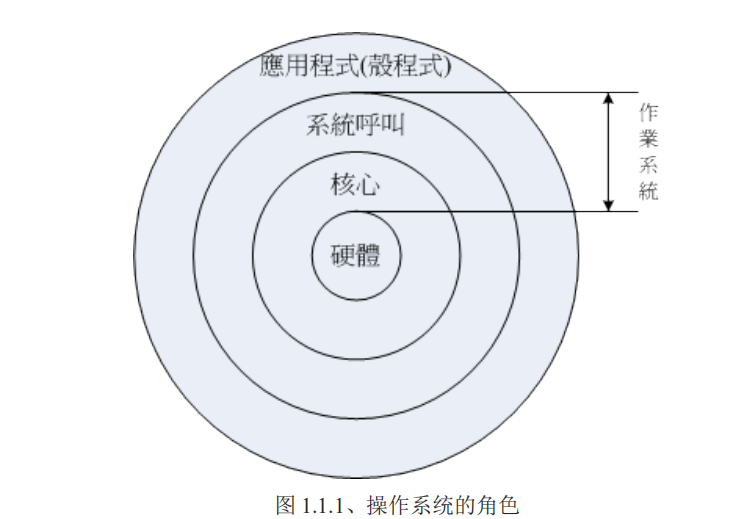

# Linux

## 1. Linux简介

> Unix是20世纪70年代初出现的一个操作系统，除了作为网络操作系统之外，还可以作为单机操作系统使用。Unix作为一种开发平台和台式操作系统获得了广泛使用，目前主要用于工程应用和科学计算等领域
>
> UNIX系统是一个分时系统。最早的UNIX系统于1970年问世。此前，只有面向批处理作业的操作系统，这样的系统对于需要立即得到响应的用户来说是太慢了。在60年代末，Kenneth Thompson和Dennis Ritchie都曾参加过交互方式[分时系统](https://baike.baidu.com/item/分时系统/9706663)Multics的设计，而开发该系统所使用的工具是[CTSS](https://baike.baidu.com/item/CTSS/10533936)。这两个系统在操作系统的发展过程中都产生过重大影响。在此基础上，在对当时现有的技术进行精选提炼和发展的过程中，K.Thompson于1969年在小型计算机上开发UNIX系统，后于1970年投入运行。 [2] 
>
> 1973年，DennisRitchie开发出[C语言](https://baike.baidu.com/item/C语言/105958)，用来改写原来用[汇编语言](https://baike.baidu.com/item/汇编语言/61826)编写的UNIX，由此产生了UNIX VersionV。1974年，Kenneth Thompson和Dennis Ritchie合写的“The UNIX Time-Sharing System"在Communication of ACM上发表，正式向外界披露了UNIX系统。 [2]
>
> Linux，全称GNU/Linux，是一种免费使用和自由传播的[类UNIX](https://baike.baidu.com/item/类UNIX/9032872)操作系统，其内核由[林纳斯·本纳第克特·托瓦兹](https://baike.baidu.com/item/林纳斯·本纳第克特·托瓦兹/1034429)于1991年10月5日首次发布，它主要受到[Minix](https://baike.baidu.com/item/Minix/7106045)和Unix思想的启发，是一个基于[POSIX](https://baike.baidu.com/item/POSIX)的多用户、[多任务](https://baike.baidu.com/item/多任务/1011764)、支持[多线程](https://baike.baidu.com/item/多线程/1190404)和多[CPU](https://baike.baidu.com/item/CPU)的操作系统。它能运行主要的[Unix](https://baike.baidu.com/item/Unix/219943)工具软件、应用程序和网络协议。它支持[32位](https://baike.baidu.com/item/32位/5812218)和[64位](https://baike.baidu.com/item/64位)硬件。Linux继承了Unix以网络为核心的设计思想，是一个性能稳定的多用户网络操作系统。Linux有上百种不同的发行版，如基于社区开发的[debian](https://baike.baidu.com/item/debian/748667)、[archlinux](https://baike.baidu.com/item/archlinux/10857530)，和基于商业开发的[Red Hat Enterprise Linux](https://baike.baidu.com/item/Red Hat Enterprise Linux/10770503)、[SUSE](https://baike.baidu.com/item/SUSE/60409)、[Oracle Linux](https://baike.baidu.com/item/Oracle Linux/6876458)等。



## 2.Linux系统的版本

+ Redhat  红帽
+ centos  基于redhat 免费的
+ Ubuntu  
+ debian  
+ archliux  linux高级人员使用
+ majaro 
+ 红旗
+ deepin 深度
+ 优麒麟

## 3. Centos下载安装


## 4. 安装Centos

## 4.1 虚拟机


下一步


## 5.设置静态IP地址


```shell
[root@localhost ~]# vim /etc/sysconfig/network-scripts/ifcfg-ens33
```


```shell
[root@localhost ~]# service network restart
Restarting network (via systemctl):                        [  确定  ]
[root@localhost ~]# 
```

```shell
[root@localhost ~]# ifconfig
ens33: flags=4163<UP,BROADCAST,RUNNING,MULTICAST>  mtu 1500
        inet 192.168.59.154  netmask 255.255.255.0  broadcast 192.168.59.255
        inet6 fe80::a5b9:5dbc:dec5:28b0  prefixlen 64  scopeid 0x20<link>
        ether 00:0c:29:a8:94:5b  txqueuelen 1000  (Ethernet)
        RX packets 2256  bytes 2052179 (1.9 MiB)
        RX errors 0  dropped 0  overruns 0  frame 0
        TX packets 1401  bytes 189880 (185.4 KiB)
        TX errors 0  dropped 0 overruns 0  carrier 0  collisions 0
```

静态IP配置成功!!!!

## 6.Vim 编辑


## 7. 配置yum的阿里云加速镜像地址

**备份原始的镜像 /etc/yum.repos.d**

```shell
[root@www yum]#
cp CentOS-Base.repo  ./CentOS-Base.repo.back
```

**安装新的**

```shell
 wget -O CentOS-Base.repo http://mirrors.aliyun.com/repo/Centos-7.repo
 wget -O /etc/yum.repos.d/epel.repo http://mirrors.aliyun.com/repo/epel-7.repo

```

**刷新缓存**

```shell
yum clean all
  293  yum makecache

```

## 8. 安装jdk配置环境变量

**安装gcc-c++**

```shell
yum install gcc-c++ -y
```

**上传jdk**

**解压jdk**

```shell
tar -zxvf jdk-8u241-linux-i586.tar.gz
```

**卸载旧的jdk openjdk**

**查看所有的openjdk相关的**

```shell
rpm -qa | grep java
```

**删除不需要的**

```shell
rpm -e --nodeps java-1.8.0-openjdk-1.8.0.242.b08-1.el7.x86_64
   rpm -e --nodeps java-1.7.0-openjdk-headless-1.7.0.251-2.6.21.1.el7.x86_64
    rpm -e --nodeps java-1.7.0-openjdk-1.7.0.251-2.6.21.1.el7.x86_64
```

**配置环境变量**


```shell
export JAVA_HOME=/opt/jdk1.8.0_241
export CLASSPATH=.:${JAVA_HOME}/jre/lib/rt.jar:${JAVA_HOME}/lib/dt.jar:${JAVA_HOME}/lib/tools.jar
export PATH=$PATH:${JAVA_HOME}/bin
```

**刷新文件**

```shell
source /etc/profile
```

**报错**

```
sudo yum install glibc.i686
```

**查看版本**

```
java -version
```

