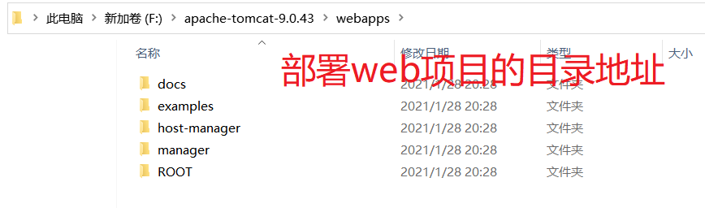
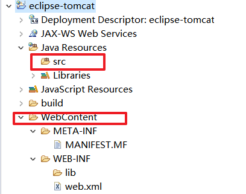

# 服务器

> 服务器是计算机的一种，它比普通[计算机](https://baike.baidu.com/item/计算机/140338)运行更快、负载更高、价格更贵。服务器在网络中为其它客户机（如PC机、智能手机、ATM等终端甚至是火车系统等大型设备）提供计算或者应用服务。服务器具有高速的CPU运算能力、长时间的可靠运行、强大的I/O外部数据吞吐能力以及更好的扩展性。根据服务器所提供的服务，一般来说服务器都具备承担响应服务请求、承担服务、保障服务的能力。服务器作为电子设备，其内部的结构十分的复杂，但与普通的计算机内部结构相差不大，如：[cpu](https://baike.baidu.com/item/cpu/120556)、[硬盘](https://baike.baidu.com/item/硬盘/159825)、[内存](https://baike.baidu.com/item/内存/103614)，系统、[系统总线](https://baike.baidu.com/item/系统总线/1190546)等。

## 1. 服务器的分类

### 1.1 硬件服务器  (计算机)

### 1.2 软件服务器

> [服务器管理软件](https://baike.baidu.com/item/服务器管理软件/1503503)是一套处理[硬件](https://baike.baidu.com/item/硬件/479446)、[操作系统](https://baike.baidu.com/item/操作系统/192)及应用软件等不同层级|软件管理及升级、系统资源管理、性能维护和监控配置|的程序。

> Web服务器一般指网站服务器，是指驻留于[因特网](https://baike.baidu.com/item/因特网/114119)上某种类型计算机的程序，可以处理浏览器等Web客户端的请求并返回相应响应，也可以放置网站文件，让全世界浏览；可以放置数据文件，让全世界下载。目前最主流的三个Web服务器是Apache、 Nginx 、IIS。

## 2. Tomcat

>Tomcat是Apache 软件基金会（Apache Software Foundation）的Jakarta 项目中的一个核心项目，由[Apache](https://baike.baidu.com/item/Apache/6265)、Sun 和其他一些公司及个人共同开发而成。由于有了Sun 的参与和支持，最新的Servlet 和JSP 规范总是能在Tomcat 中得到体现，Tomcat 5支持最新的Servlet 2.4 和JSP 2.0 规范。因为Tomcat 技术先进、性能稳定，而且免费，因而深受Java 爱好者的喜爱并得到了部分软件开发商的认可，成为目前比较流行的Web 应用服务器。
>
>Tomcat 服务器是一个免费的开放源代码的Web 应用服务器，属于轻量级应用[服务器](https://baike.baidu.com/item/服务器)，在中小型系统和并发访问用户不是很多的场合下被普遍使用，是开发和调试JSP 程序的首选。对于一个初学者来说，可以这样认为，当在一台机器上配置好Apache 服务器，可利用它响应[HTML](https://baike.baidu.com/item/HTML)（[标准通用标记语言](https://baike.baidu.com/item/标准通用标记语言/6805073)下的一个应用）页面的访问请求。实际上Tomcat是Apache 服务器的扩展，但运行时它是独立运行的，所以当你运行tomcat 时，它实际上作为一个与Apache 独立的进程单独运行的。

### 2.1 下载tomcat

#### 2.1.2 核心配置文件

#### webapps 2.1.2部署文件夹

#### 2.1.2 tomcat目录简介

## 3.IDEA配置tomcat

### 3.1 创建web项目

### 3.2 配置tomcat

### 3.3 关于服务器启动

修改了web.xml必须重新启动服务器

### 3.4 idea控制台日志输出乱码

## 4. Eclipse配置Tomcat

