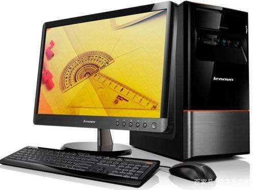
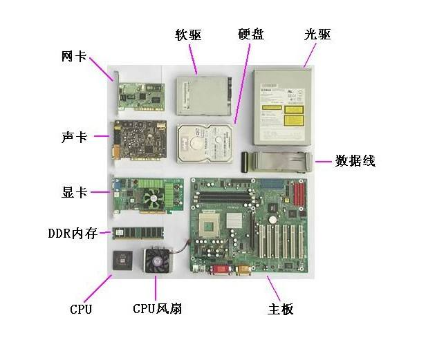
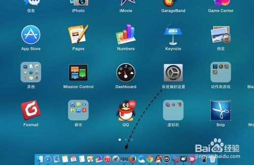
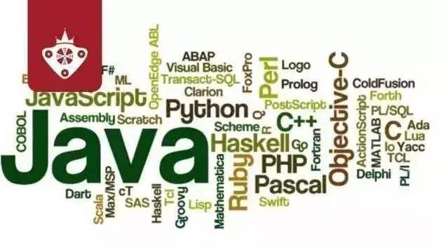
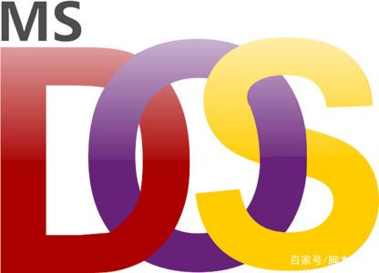
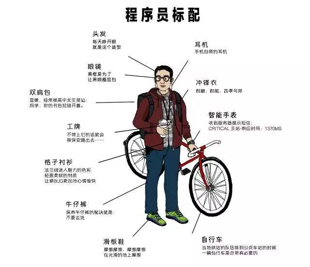

# 软件开发的基础知识
## 1. 基础常识

### 1.1 计算机

> 计算机:
>
> 计算机（Computer）全称：电子计算机，俗称电脑。是一种能够按照程序运行，自动、高速处理海量数据的现代化智能电子设备。由硬件和软件所组成，没有安装任何软件的计算机称为裸机。常见的形式有台式计算机、笔记本计算机、大型计算机等

### 1.2 计算机硬件

> 计算机硬件: 
>
> 计算机硬件（Computer Hardware）是指计算机系统中由电子，机械和光电元件等组成的各种物理装置的总称。这些物理装置按系统结构的要求构成一个有机整体为计算机软件运行提供物质基础。
>
> 计算机通常由CPU、主板、内存、电源、主机箱、硬盘、显卡、键盘、鼠标，显示器等多个部件组成。

### 1.3 计算机软件

> 计算机软件:
>
> 计算机软件是使用计算机过程中必不可少的东西，计算机软件可以使计算机按照事先预定好的顺序完成特定的功能，计算机软件按照其功能划分为系统软件与应用软件
>
> 系统软件： DOS(Disk Operating System), Windows, Linux, Unix, Mac, Android, iOS
> 应用软件：office  QQ聊天  YY语言  扫雷

### 1.4 软件开发

> 软件
> 		按照特定顺序组织的计算机数据和指令的集合
> 开发
> 			软件的制作过程
> 软件开发
>           借助开发工具与计算机语言制作软件

### 1.5 计算机语言

> 语言:
> 		人类进行沟通交流的各种表达符号，方便人与人之间进行沟通与信息交换
> 计算机语言:
> 		人与计算机之间进行信息交流沟通的一种特殊语言
> 计算机语言中也有字符，符号等等
> 		常见的计算机语言如C,C++,C#,JAVA,python,php,go.....

### 1.6 人机交互

> 软件的出现实现了人与计算机之间更好的交互。
> 交互方式
> 		图形化界面：这种方式简单直观，使用者易于接受，容易上手操作。
> 		命令行方式：需要有一个控制台，输入特定的指令，让计算机完成一些操作。较为麻烦，需要记录住一些命令。

### 1.7 常用的DOS命令

> d: 回车	盘符切换
> dir(directory):列出当前目录下的文件以及文件夹
> md (make directory) : 创建目录
> rd (remove directory): 删除目录
> cd (change directory)改变指定目录(进入指定目录)
> cd.. : 退回到上一级目录
> cd\: 退回到根目录
> del (delete): 删除文件,删除一堆后缀名一样的文件*.txt
> exit : 退出dos命令行
> cls : (clear screen)清屏

## 1.8 计算机应用

> 1. 科学计算
>    科学计算也称数值计算。计算机最开始是为解决科学研究和工程设计中遇到的大量数学问题的数值计算而研制的计算工具。例如，人造卫星轨迹的计算，房屋抗震强度的计算，火箭、宇宙飞船的研究设计都离不开计算机的精确计算。就连我们每天收听收看的天气预报都离不开计算机的科学计算。 
> 2. 数据处理
>    在科学研究和工程技术中，会得到大量的原始数据，其中包括大量图片、文字、声音等信息处理就是对数据进行收集、分类、排序、存储、计算、传输、制表等操作。
> 3. 自动控制
>    自动控制是指通过计算机对某一过程进行自动操作，它不需人工干预，能按人预定的目标和预定的状态进行过程控制。例如，无人驾驶飞机、导弹、人造卫星和宇宙飞船等飞行器的控制，都是靠计算机实现的。
> 4. 计算机辅助设计
>    计算机辅助设计(Computer Aided Design，简称CAD)是指。借助计算机的帮助，人们可以自动或半自动地完成各类工程设计工作。目前CAD技术已应用于飞机设计、船舶设计、建筑设计、机械设计、大规模集成电路设计等。在京九铁路的勘测设计中，使用计算机辅助设计系统绘制一张图纸仅需几个小时，而过去人工完成同样工作则要一周甚至更长时间。可见采用计算机辅助设计，可缩短设计时间，提高工作效率，节省人力、物力和财力，更重要的是提高了设计质量。
> 5. 人工智能
>    人工智能(Artificial Intelligence，简称AI)是指计算机模拟人类某些智力行为的理论、技术和应用。例如，用计算机模拟人脑的部分功能进行思维学习、推理、联想和决策，使计算机具有一定“思维能力”。我国已开发成功一些中医专家诊断系统，可以模拟名医给患者诊病开方。 还有就是机器人也是计算机人工智能的典型例子。
> 6. 多媒体应用
>    随着电子技术特别是通信和计算机技术的发展，人们已经有能力把文本、音频、视频、动画、图形和图像等各种媒体综合起来，构成一种全新的概念—“多媒体”(Multimedia)。比如一些flash广告，网页游戏等。
> 7. 计算机网络
>    计算机网络是由一些独立的和具备信息交换能力的计算机互联构成，以实现资源共享的系统。如在全国范围内的银行信用卡的使用，火车和飞机票系统的使用等。

### 1.9 标准的程序员

