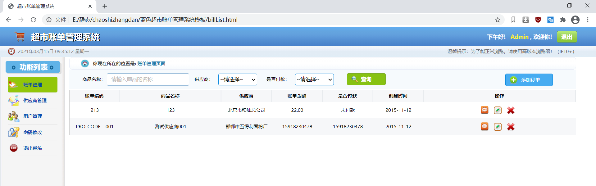
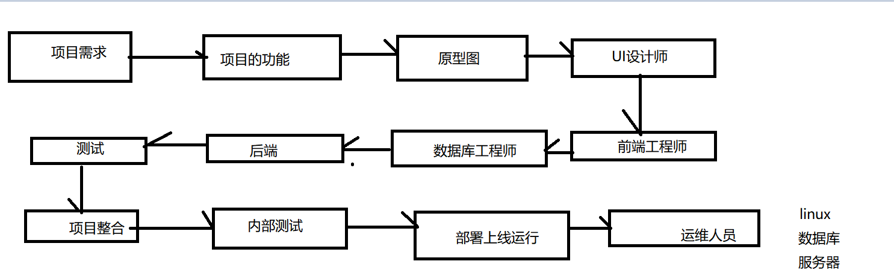
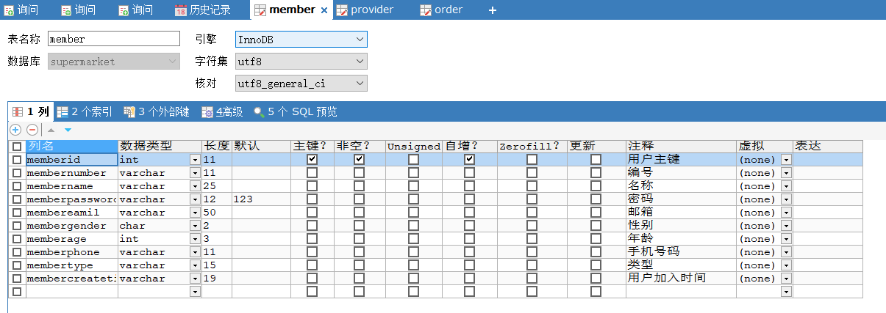
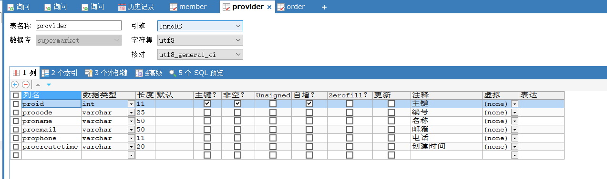
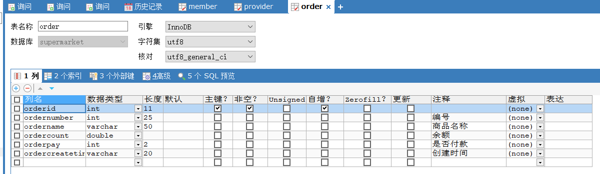
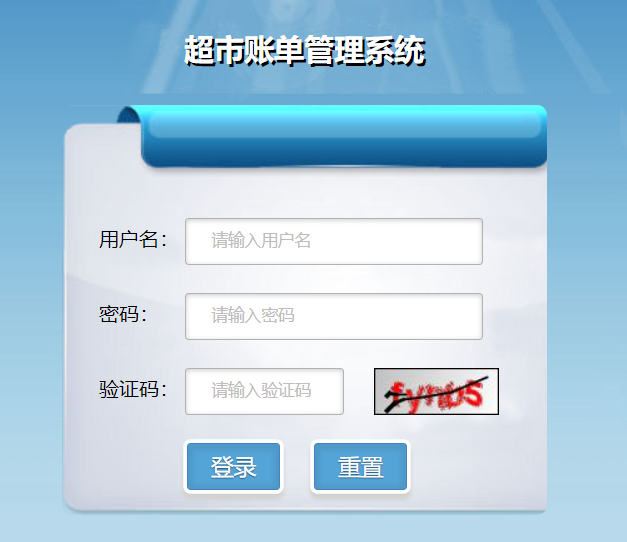

```
<%@ page language="java" contentType="text/html; charset=UTF-8"
         pageEncoding="UTF-8"%>
<!DOCTYPE html>
<html>
<head lang="en">
    <meta charset="UTF-8">
    <title>超市账单管理系统</title>
    <link rel="stylesheet" href="css/public.css"/>
    <link rel="stylesheet" href="css/style.css"/>
</head>
<body>
<!--头部-->
    <header class="publicHeader">
        <h1>超市账单管理系统</h1>
        <div class="publicHeaderR">
            <p><span>下午好！</span><span style="color: #fff21b"> Admin</span> , 欢迎你！</p>
            <a href="login.html">退出</a>
        </div>
    </header>
<!--时间-->
    <section class="publicTime">
        <span id="time">2015年1月1日 11:11  星期一</span>
        <a href="#">温馨提示：为了能正常浏览，请使用高版本浏览器！（IE10+）</a>
    </section>
<!--主体内容-->
    <section class="publicMian ">
       <jsp:include page="left.jsp"></jsp:include>
        <div class="right">
            <div class="location">
                <strong>你现在所在的位置是:</strong>
                <span>用户管理页面</span>
            </div>
            <div class="search">
                <span>用户名：</span>
                <input type="text" placeholder="请输入用户名"/>
                <input type="button" value="查询"/>
                <a href="userAdd.html">添加用户</a>
            </div>
            <!--用户-->
            <table class="providerTable" cellpadding="0" cellspacing="0">
                <thead>
                <tr class="firstTr">
                    <th width="10%">用户编码</th>
                    <th width="20%">用户名称</th>
                    <th width="10%">性别</th>
                    <th width="10%">年龄</th>
                    <th width="10%">电话</th>
                    <th width="10%">用户类型</th>
                    <th width="30%">操作</th>
                </tr>
                </thead>
                <tbody></tbody>
                <%--<tr>
                    <td>hanlu</td>
                    <td>韩露</td>
                    <td>女</td>
                    <td>20</td>
                    <td>15918230478</td>
                    <td>经理</td>
                    <td>
                        <a href="userView.html"></a>
                        <a href="userUpdate.html"></a>
                        <a href="#" class="removeUser"></a>
                    </td>
                </tr>--%>
            </table>

        </div>
    </section>

<!--点击删除按钮后弹出的页面-->
<div class="zhezhao"></div>
<div class="remove" id="removeUse">
    <div class="removerChid">
        <h2>提示</h2>
        <div class="removeMain">
            <p>你确定要删除该用户吗？</p>
            <a href="#" id="yes">确定</a>
            <a href="#" id="no">取消</a>
        </div>
    </div>
</div>

    <footer class="footer">
    </footer>

<script src="js/jquery.js"></script>
<script src="js/js.js"></script>
<script src="js/time.js"></script>
<script>
    $(()=>{
        //进行异步的数据加载
        $.ajax({
            url:"member?action=queryAll",
            type:"post",
            data:"",
            success:function (result){
                console.log(result)
                //json字符串转为js对象
                let data = JSON.parse(result);
                //获取数据
                let memberList = data.data;
                let str = '';
                $.each(memberList,(inedex,item)=>{
                    console.log(item.memberName)
                    //当做了el表达式了 所以获取不到值
                    str+=`<tr>
                    <td>\${item.memberNumber}</td>
                    <td>\${item.memberName}</td>
                    <td>\${item.memberGender}</td>
                    <td>\${item.memberAge}</td>
                    <td>\${item.memberPhone}</td>
                    <td>\${item.memberType}</td>
                    <td>
                        <a href="userView.html"></a>
                        <a href="userUpdate.html"></a>
                        <a href="#" class="removeUser"></a>
                    </td>
                </tr>`;
                });
                //数据填充
                $("tbody").html(str);
            }

        })
    })
</script>
</body>
</html>
```

# 项目实战1（蓝色超市账单管理系统）

## 1. 项目的静态页面



## 2. 项目开发文档

没有文档

## 3. 项目开发流程



## 4. 项目开发环境

+ win10
+ idea2020.1
+ tomcat9.0.37
+ mysql5.7
+ sqlyong10

##5. 技术框架

+ Servlet4.0
+ jsp
+ gson
+ commons-upload
+ commons-io
+ commons-dbutils
+ druid
+ kaptcha 谷歌验证码

## 6.项目需求规范

+ 阿里巴巴java开发手册执行
+ 类的字段名称 方法名 小驼峰命名法
  + userId
  + user_id 数据库字段
+ 类名 大驼峰  静态字段 大写

+ servlet开发遵循 servlet3.1规范  使用注解开发

## 7. 数据设计







## 8. 项目创建

**pom.xml**

```xml
<?xml version="1.0" encoding="UTF-8"?>

<project xmlns="http://maven.apache.org/POM/4.0.0" xmlns:xsi="http://www.w3.org/2001/XMLSchema-instance"
  xsi:schemaLocation="http://maven.apache.org/POM/4.0.0 http://maven.apache.org/xsd/maven-4.0.0.xsd">
  <modelVersion>4.0.0</modelVersion>

  <groupId>org.supermarket</groupId>
  <artifactId>supermarket-manager</artifactId>
  <version>1.0-SNAPSHOT</version>
  <packaging>war</packaging>

  <name>supermarket-manager Maven Webapp</name>
  <!-- FIXME change it to the project's website -->
  <url>http://www.example.com</url>

  <properties>
    <project.build.sourceEncoding>UTF-8</project.build.sourceEncoding>
    <maven.compiler.source>1.8</maven.compiler.source>
    <maven.compiler.target>1.8</maven.compiler.target>
  </properties>

  <dependencies>
    <dependency>
      <groupId>junit</groupId>
      <artifactId>junit</artifactId>
      <version>4.12</version>
      <scope>test</scope>
    </dependency>
    <!--servlet-api-->
    <dependency>
      <groupId>javax.servlet</groupId>
      <artifactId>javax.servlet-api</artifactId>
      <version>4.0.1</version>
    </dependency>
    <dependency>
      <groupId>jstl</groupId>
      <artifactId>jstl</artifactId>
      <version>1.2</version>
    </dependency>
    <!--数据库-->
    <dependency>
      <groupId>mysql</groupId>
      <artifactId>mysql-connector-java</artifactId>
      <version>5.1.49</version>
    </dependency>
    <dependency>
      <groupId>com.alibaba</groupId>
      <artifactId>druid</artifactId>
      <version>1.2.0</version>
    </dependency>
    <!--commons工具类-->
    <dependency>
      <groupId>commons-dbutils</groupId>
      <artifactId>commons-dbutils</artifactId>
      <version>1.7</version>
    </dependency>
    <dependency>
      <groupId>commons-beanutils</groupId>
      <artifactId>commons-beanutils</artifactId>
      <version>1.9.4</version>
    </dependency>
    <dependency>
      <groupId>commons-io</groupId>
      <artifactId>commons-io</artifactId>
      <version>2.7</version>
    </dependency>
    <dependency>
      <groupId>commons-fileupload</groupId>
      <artifactId>commons-fileupload</artifactId>
      <version>1.4</version>
    </dependency>
    <!--gson-->
    <dependency>
      <groupId>com.google.code.gson</groupId>
      <artifactId>gson</artifactId>
      <version>2.8.6</version>
    </dependency>
    <!--验证码-->
    <dependency>
      <groupId>com.github.penggle</groupId>
      <artifactId>kaptcha</artifactId>
      <version>2.3.2</version>
    </dependency>
  </dependencies>

  <build>
    <finalName>supermarket-manager</finalName>
    <pluginManagement><!-- lock down plugins versions to avoid using Maven defaults (may be moved to parent pom) -->
      <plugins>
        <plugin>
          <artifactId>maven-clean-plugin</artifactId>
          <version>3.1.0</version>
        </plugin>
        <!-- see http://maven.apache.org/ref/current/maven-core/default-bindings.html#Plugin_bindings_for_war_packaging -->
        <plugin>
          <artifactId>maven-resources-plugin</artifactId>
          <version>3.0.2</version>
        </plugin>
        <plugin>
          <artifactId>maven-compiler-plugin</artifactId>
          <version>3.8.0</version>
        </plugin>
        <plugin>
          <artifactId>maven-surefire-plugin</artifactId>
          <version>2.22.1</version>
        </plugin>
        <plugin>
          <artifactId>maven-war-plugin</artifactId>
          <version>3.2.2</version>
        </plugin>
        <plugin>
          <artifactId>maven-install-plugin</artifactId>
          <version>2.5.2</version>
        </plugin>
        <plugin>
          <artifactId>maven-deploy-plugin</artifactId>
          <version>2.8.2</version>
        </plugin>
      </plugins>
    </pluginManagement>
  </build>
</project>

```

**Member.java**

```java
package com.supermarket.beans;

import lombok.*;

/**
 * ClassName Member
 * Description:用户信息
 *
 * @Author:一尘
 * @Version:1.0
 * @Date:2021-03-15-10:30
 */
@Data
@AllArgsConstructor
@NoArgsConstructor
@RequiredArgsConstructor
public class Member {
    private Integer memberId;
    @NonNull
    private Integer memberNumber;
    @NonNull
    private String memberName;
    @NonNull
    private String memberPassword;
    @NonNull
    private String memberEmail;
    @NonNull
    private  String memberType;
    @NonNull
    private String memberCreateTime;
    @NonNull
    private String memberGender;
    @NonNull
    private int memberAge;
    @NonNull
    private String memberPhone;
}

```

**Provider.java**

```java
package com.supermarket.beans;

import lombok.*;

/**
 * ClassName Provider
 * Description:供应商
 *
 * @Author:一尘
 * @Version:1.0
 * @Date:2021-03-15-10:34
 */
@Data
@AllArgsConstructor
@NoArgsConstructor
@RequiredArgsConstructor
public class Provider {
    private Integer proId;
    @NonNull
    private Integer proCode;
    @NonNull
    private String proName;
    @NonNull
    private String proEmail;
    @NonNull
    private String proPhone;
    @NonNull
    private String proCreateTime;
}

```

**Order.java**

```java
package com.supermarket.beans;

import lombok.*;

/**
 * ClassName Order
 * Description:订单
 *
 * @Author:一尘
 * @Version:1.0
 * @Date:2021-03-15-10:36
 */
@Data
@AllArgsConstructor
@RequiredArgsConstructor
@NoArgsConstructor
public class Order {
    private  Integer orderId;
    @NonNull
    private Integer orderNumber;
    @NonNull
    private String orderName;
    @NonNull
    private double orderCount;
    @NonNull
    private int orderPay;
    @NonNull
    private String orderCreateTime;

}

```

**Page.java**

```java
package com.supermarket.beans;

import lombok.Data;

/**
 * ClassName Page
 * Description:分页
 *
 * @Author:一尘
 * @Version:1.0
 * @Date:2021-03-15-10:41
 */
@Data
public class Page {
    private  int totalCount;
    private int totalPage;
    private int pageSize=20;
    private int startIndex;
    private int currentPage;

    public Page(int totalCount, int currentPage) {
        this.totalCount = totalCount;
        this.currentPage = currentPage;
        calculate(totalCount,currentPage);
    }

    public  void calculate(int totalCount, int currentPage){
        //总页数
        this.totalPage = totalCount % pageSize==0?(totalCount/this.pageSize):(totalCount/this.pageSize+1);
        //判断
        if(currentPage <= 1){
            this.currentPage = 1;
        }
        if(currentPage>=this.totalPage){
            this.currentPage = this.totalPage;
        }
        //开始的记录数
        this.startIndex = (currentPage -1) * pageSize;
    }
}

```


## 9. 业务实体接口

**MemberDao.java**

```java
package com.supermarket.dao;

import com.supermarket.beans.Member;
import com.supermarket.beans.Page;

import java.util.List;

public interface MemberDao {
    List<Member> queryAll();
    List<Member> queryByName(String memberName);
    List<Member> queryByPage(Page page);
    Member queryById(int memberId);
    int addMember(Member member);
    int updateMember(Member member);
    int deleteMember(int memberId);
}

```

**RunnerUtil.java**

```java
package com.supermarket.util;

import com.alibaba.druid.pool.DruidDataSource;
import org.apache.commons.dbutils.QueryRunner;

import javax.sql.DataSource;
import java.io.InputStream;
import java.sql.DriverManager;
import java.util.Properties;

/**
 * ClassName RunnerUtil
 * Description:
 *
 * @Author:一尘
 * @Version:1.0
 * @Date:2021-03-15-10:48
 */
public class RunnerUtil {
    private   static DataSource getDataSource(){
        InputStream stream = RunnerUtil.class.getClassLoader().getResourceAsStream("db.properties");
        Properties properties = new Properties();
        DruidDataSource  druidDataSource = null;
        try {
            properties.load(stream);
            druidDataSource = new DruidDataSource();
            Class.forName(properties.getProperty("jdbc.Driver"));
            druidDataSource.setDriver(DriverManager.getDriver(properties.getProperty("jdbc.Url")));
            druidDataSource.setUsername(properties.getProperty("jdbc.UserName"));
            druidDataSource.setPassword(properties.getProperty("jdbc.Password"));
            druidDataSource.setUrl(properties.getProperty("jdbc.Url"));

        } catch (Exception e) {
            e.printStackTrace();
        }
        return  druidDataSource;
    }
    public  static QueryRunner  getQueryRunner(){
        return  new QueryRunner(getDataSource());
    }
}

```

**MemberDaoImpl.java**``

```java
package com.supermarket.dao.impl;

import com.supermarket.beans.Member;
import com.supermarket.beans.Page;
import com.supermarket.dao.MemberDao;
import com.supermarket.util.RunnerUtil;
import org.apache.commons.dbutils.QueryRunner;
import org.apache.commons.dbutils.handlers.BeanListHandler;

import java.sql.SQLException;
import java.util.List;

/**
 * ClassName MemberDaoImpl
 * Description:Member业务实现
 *
 * @Author:一尘
 * @Version:1.0
 * @Date:2021-03-15-10:47
 */
public class MemberDaoImpl implements MemberDao {
    private QueryRunner  runner = RunnerUtil.getQueryRunner();

    @Override
    public List<Member> queryAll() {
        List<Member> list = null;
        try {
            list = runner.query("select * from member ",new BeanListHandler<>(Member.class));
        } catch (SQLException throwables) {
            throwables.printStackTrace();
        }
        return list;
    }

    @Override
    public List<Member> queryByName(String memberName) {
        return null;
    }

    @Override
    public List<Member> queryByPage(Page page) {
        return null;
    }

    @Override
    public Member queryById(int memberId) {
        return null;
    }

    @Override
    public int addMember(Member member) {
        return 0;
    }

    @Override
    public int updateMember(Member member) {
        return 0;
    }

    @Override
    public int deleteMember(int memberId) {
        return 0;
    }
}

```

## 10. 静态页面转为动态页面

**login.html**

```html
<!DOCTYPE html>
<html>
<head lang="en">
    <meta charset="UTF-8">
    <title>系统登录 - 超市账单管理系统</title>
    <link rel="stylesheet" href="css/style.css"/>
</head>
<body class="login_bg">
    <section class="loginBox">
        <header class="loginHeader">
            <h1>超市账单管理系统</h1>
        </header>
        <section class="loginCont">
            <form class="loginForm" action="welcome.html">
                <div class="inputbox">
                    <label for="user">用户名：</label>
                    <input id="user" type="text" name="username" placeholder="请输入用户名" required/>
                </div>
                <div class="inputbox">
                    <label for="mima">密码：</label>
                    <input id="mima" type="password" name="password" placeholder="请输入密码" required/>
                </div>
                <div class="inputbox">
                    <label for="yzm">验证码：</label>
                    <input id="yzm" type="text" name="yzm" placeholder="请输入验证码" required/>
                    
                </div>
                <div class="subBtn">
                    <input type="submit" value="登录" />
                    <input type="reset" value="重置"/>
                </div>

            </form>
        </section>
    </section>
    <script src="js/jquery.js"></script>
    <script>
        $(()=>{
            /*点击刷新验证码*/
            $("#code").click(()=>{
                /*加时间戳*/
                $("#code").attr("src","yzm?date="+new Date().toLocaleString());
            })
        })
    </script>
</body>
</html>
```

**web.xml**

```xml
<web-app xmlns="http://xmlns.jcp.org/xml/ns/javaee"
  xmlns:xsi="http://www.w3.org/2001/XMLSchema-instance"
  xsi:schemaLocation="http://xmlns.jcp.org/xml/ns/javaee
                      http://xmlns.jcp.org/xml/ns/javaee/web-app_4_0.xsd"
  version="4.0">

  <display-name>Archetype Created Web Application</display-name>
  <welcome-file-list>
    <welcome-file>login.html</welcome-file>
  </welcome-file-list>
  <servlet>
    <servlet-name>yzm</servlet-name>
    <servlet-class>com.google.code.kaptcha.servlet.KaptchaServlet</servlet-class>
    <init-param>
      <param-name>kaptcha.image.height</param-name>
      <param-value>38</param-value>
    </init-param>
    <init-param>
      <param-name>kaptcha.image.width</param-name>
      <param-value>100</param-value>
    </init-param>
    <init-param>
      <param-name>kaptcha.textproducer.font.size</param-name>
      <param-value>28</param-value>
    </init-param>
    <init-param>
      <param-name>kaptcha.textproducer.font.color</param-name>
      <param-value>red</param-value>
    </init-param>
    <load-on-startup>1</load-on-startup>
  </servlet>
  <servlet-mapping>
    <servlet-name>yzm</servlet-name>
    <url-pattern>/yzm</url-pattern>
  </servlet-mapping>
</web-app>
```



## 11. 登录表单非空判断

+ 引入layer.js 弹窗组件

```html
<!DOCTYPE html>
<html>
<head lang="en">
    <meta charset="UTF-8">
    <title>系统登录 - 超市账单管理系统</title>
    <link rel="stylesheet" href="css/style.css"/>
</head>
<body class="login_bg">
    <section class="loginBox">
        <header class="loginHeader">
            <h1>超市账单管理系统</h1>
        </header>
        <section class="loginCont">
            <form class="loginForm" >
                <div class="inputbox">
                    <label for="memberName">用户名：</label>
                    <input id="memberName" type="text" name="memberName" placeholder="请输入用户名"  />
                </div>
                <div class="inputbox">
                    <label for="memberPassword">密码：</label>
                    <input id="memberPassword" type="password" name="memberPassword" placeholder="请输入密码" />
                </div>
                <div class="inputbox">
                    <label for="yzm">验证码：</label>
                    <input id="yzm" type="text" name="yzm" placeholder="请输入验证码" />
                    
                </div>
                <div class="subBtn">
                    <input type="button" value="登录" />
                    <input type="reset" value="重置"/>
                </div>

            </form>
        </section>
    </section>
    <script src="js/jquery.js"></script>
    <script src="https://cdn.bootcdn.net/ajax/libs/layer/3.1.1/layer.min.js"></script>
    <script>
        $(()=>{
            /*点击刷新验证码*/
            $("#code").click(()=>{
                /*加时间戳*/
                $("#code").attr("src","yzm?date="+new Date().toLocaleString());
            })
            //表单提交的验证
            $("input[type='button']").click(()=>{
                //获取输入框的内容
              let password =   $("#memberPassword").val();
              let name =   $("#memberName").val();
              let yzm = $("#yzm").val();
              if(name == ""){
                  //提示信息
                    layer.msg("用户名不能为空",{"icon":5,"time":1000});
                  return false;
              }
              if(password==""){
                  //提示信息
                  layer.msg("密码不能为空",{"icon":5,"time":1000});
                  return false;
              }
                if(yzm==""){
                    //提示信息
                    layer.msg("验证码不能为空",{"icon":5,"time":1000});
                    return false;
                }
                //登录验证
                $.ajax({
                    url:"login",
                    type:"post",
                    data:{"memberName":name,"memberPassword":password,"yzm":yzm},
                    success:function (result){
                        if(result.code==1000){
                            layer.msg(result.msg,{"icon":5,"time":1000});
                    }else{
                            //登录成功
                            layer.msg(result.msg,{"icon":6,"time":1000});
                            //登录成功进行页面跳转
                            //后端可以存储session前端也可以
                            window.location.href="index.jsp";
                        }

                    }
                })
            })
        })
    </script>
</body>
</html>
```

**AjaxResult.java 结果工具类的封装**

```java
package com.supermarket.util;

import lombok.Data;

/**
 * ClassName AjaxResult
 * Description:输出响应结果
 *
 * @Author:一尘
 * @Version:1.0
 * @Date:2021-03-15-16:05
 */
@Data
public class AjaxResult {
    private int code;//状态码
    private String msg;//错误信息
    private Object data;//带数据

    //结果成功
    public  static AjaxResult ok(int code){
        AjaxResult ajaxResult = new AjaxResult();
        ajaxResult.setCode(200);
        ajaxResult.setMsg(null);
        ajaxResult.setData(null);
        return ajaxResult;
    }
    public  static AjaxResult ok(int code,String msg){
        AjaxResult ajaxResult = new AjaxResult();
        ajaxResult.setCode(200);
        ajaxResult.setMsg(msg);
        ajaxResult.setData(null);
        return ajaxResult;
    }
    public  static AjaxResult ok(int code,String msg,Object data){
        AjaxResult ajaxResult = new AjaxResult();
        ajaxResult.setCode(200);
        ajaxResult.setMsg(msg);
        ajaxResult.setData(data);
        return ajaxResult;
    }
    //结果不成功
    public  static AjaxResult error(int code){
        AjaxResult ajaxResult = new AjaxResult();
        ajaxResult.setCode(code);
        ajaxResult.setMsg(null);
        ajaxResult.setData(null);
        return ajaxResult;
    }
    public  static AjaxResult error(int code,String msg){
        AjaxResult ajaxResult = new AjaxResult();
        ajaxResult.setCode(code);
        ajaxResult.setMsg(msg);
        ajaxResult.setData(null);
        return ajaxResult;
    }
    public  static AjaxResult error(int code,String msg,Object data){
        AjaxResult ajaxResult = new AjaxResult();
        ajaxResult.setCode(code);
        ajaxResult.setMsg(msg);
        ajaxResult.setData(data);
        return ajaxResult;
    }
}

```

**LoginServlet.java**

```java
package com.supermarket.servlet;

import com.google.gson.Gson;
import com.supermarket.beans.Member;
import com.supermarket.dao.MemberDao;
import com.supermarket.dao.impl.MemberDaoImpl;
import com.supermarket.util.AjaxResult;

import javax.servlet.ServletException;
import javax.servlet.annotation.WebServlet;
import javax.servlet.http.HttpServlet;
import javax.servlet.http.HttpServletRequest;
import javax.servlet.http.HttpServletResponse;
import javax.servlet.http.HttpSession;
import java.io.IOException;
import java.io.PrintWriter;

@WebServlet("/login")
public class LoginServlet extends HttpServlet {
    private MemberDao memberDao = new MemberDaoImpl();
    @Override
    protected void doPost(HttpServletRequest request, HttpServletResponse response)
            throws ServletException, IOException {
        //响应的结果是json
            response.setContentType("application/json;charset=utf8");
        //接受参数
            String memberName = request.getParameter("memberName");
            String memberPassword = request.getParameter("memberPassword");
            String yzm = request.getParameter("yzm");
        System.out.println(memberName+"---"+memberPassword + "----"+yzm);
        HttpSession session = request.getSession();
        PrintWriter writer = response.getWriter();
        String sessionYzm =   (String)session.getAttribute("KAPTCHA_SESSION_KEY");
        AjaxResult ajaxResult = null;
        if(!sessionYzm.equals(yzm)){
                //验证码不相等给出提示信息
                //返回json数据
                ajaxResult = AjaxResult.error(1000,"验证码不正确，请重新输入");
            }else{//验证码ok
                //判断用户名密码
                //查询用户名是否存在
                Member member = memberDao.queryByName(memberName);
                if(member!=null){
                    if(!member.getMemberPassword().equals(memberPassword)){
                        //密码不正确
                       ajaxResult =  AjaxResult.error(1000,"密码不正确");
                    }else{
                        //密码正确
                        //到达首页
                        //session存储用户信息
                        session.setAttribute("memberName",memberName);
                        ajaxResult =  AjaxResult.error(200,"用户验证通过,登录成功！",memberName);
                    }
                }else{
                    //用户不存在
                    ajaxResult =  AjaxResult.error(1000,"用户不存在");
                }
            }
            Gson gson = new Gson();
            String toJson = gson.toJson(ajaxResult);
            writer.write(toJson);
    }

    @Override
    protected void doGet(HttpServletRequest request, HttpServletResponse response) throws ServletException, IOException {
        doPost(request,response);
    }
}

```

## 12登出

**index.jsp**

```jsp
<%@ page import="java.util.Date" %>
<%@ page import="java.time.LocalDateTime" %>
<%@ page language="java" contentType="text/html; charset=UTF-8"
         pageEncoding="UTF-8"%>
<!DOCTYPE html>
<html>
<head lang="en">
    <meta charset="UTF-8">
    <title>超市账单管理系统</title>
    <link rel="stylesheet" href="css/public.css"/>
    <link rel="stylesheet" href="css/style.css"/>
</head>
<body>
<!--头部-->
<header class="publicHeader">
    <h1>超市账单管理系统</h1>

    <div class="publicHeaderR">
        <p><span>下午好！</span><span style="color: #fff21b"> ${sessionScope.memberName}</span> , 欢迎你！</p>
        <a href="login?action=memberLogout">退出</a>
    </div>
</header>
<!--时间-->
<section class="publicTime">
    <span id="time">2015年1月1日 11:11  星期一</span>
    <a href="#">温馨提示：为了能正常浏览，请使用高版本浏览器！（IE10+）</a>
</section>
<!--主体内容-->
<section class="publicMian">
    <jsp:include page="left.jsp"></jsp:include>
    <div class="right">
        
        <div class="wFont">
            <h2>${sessionScope.memberName}</h2>
            <p>欢迎来到超市账单管理系统!</p>
			<span id="hours"></span>
            <h5><%=LocalDateTime.now()%></h5>
        </div>
        <br>
        
    </div>
</section>
<footer class="footer">
</footer>
<script src="js/time.js"></script>
<div style="text-align:center;">
</div>
</body>
</html>
```

**loginServlet.java**

```java
package com.supermarket.servlet;

import com.google.gson.Gson;
import com.supermarket.beans.Member;
import com.supermarket.dao.MemberDao;
import com.supermarket.dao.impl.MemberDaoImpl;
import com.supermarket.util.AjaxResult;

import javax.servlet.ServletException;
import javax.servlet.annotation.WebServlet;
import javax.servlet.http.HttpServlet;
import javax.servlet.http.HttpServletRequest;
import javax.servlet.http.HttpServletResponse;
import javax.servlet.http.HttpSession;
import java.io.IOException;
import java.io.PrintWriter;
import java.util.Map;
import java.util.Set;

@WebServlet("/login")
public class LoginServlet extends HttpServlet {
    private MemberDao memberDao = new MemberDaoImpl();
    @Override
      protected void doPost(HttpServletRequest request, HttpServletResponse response)
            throws ServletException, IOException {
   String action =    request.getParameter("action");
     if(action.equals("memberLogin")){
         memberLogin(request, response);
     }else{
            memberLogout(request,response);
     }
    }
    //登录
    public void  memberLogin(HttpServletRequest request, HttpServletResponse response)
            throws IOException {
        response.setContentType("application/json;charset=utf8");
        Map<String, String[]> parameterMap = request.getParameterMap();
        Set<Map.Entry<String, String[]>> entries = parameterMap.entrySet();
        for (Map.Entry<String, String[]> entry : entries) {
            System.out.println(entry.getKey()+"===="+entry.getValue());
        }
        //接受参数
        String memberName = request.getParameter("memberName");
        String memberPassword = request.getParameter("memberPassword");
        String yzm = request.getParameter("yzm");
        System.out.println(memberName+"---"+memberPassword + "----"+yzm);
        HttpSession session = request.getSession();
        PrintWriter writer = response.getWriter();
        String sessionYzm =   (String)session.getAttribute("KAPTCHA_SESSION_KEY");
        AjaxResult ajaxResult = null;
        if(!sessionYzm.equals(yzm)){
                //验证码不相等给出提示信息
                //返回json数据
                ajaxResult = AjaxResult.error(1000,"验证码不正确，请重新输入");
            }else{//验证码ok
                //判断用户名密码
                //查询用户名是否存在
                Member member = memberDao.queryByName(memberName);
                if(member!=null){
                    if(!member.getMemberPassword().equals(memberPassword)){
                        //密码不正确
                       ajaxResult =  AjaxResult.error(1000,"密码不正确");
                    }else{
                        //密码正确
                        //到达首页
                        //session存储用户信息
                        session.setAttribute("memberName",memberName);
                        ajaxResult =  AjaxResult.error(200,"用户验证通过,登录成功！",memberName);
                    }
                }else{
                    //用户不存在
                    ajaxResult =  AjaxResult.error(1000,"用户不存在");
                }
            }
       Gson gson = new Gson();
        String toJson = gson.toJson(ajaxResult);
        writer.write(toJson);
    }


    public    void  memberLogout(HttpServletRequest request, HttpServletResponse response)throws ServletException, IOException {
        HttpSession session = request.getSession();
        session.invalidate();
        //进行页面重定向
        response.sendRedirect("login.html");
     /*  return  "redirect:login.html";*/
    }

    @Override
    protected void doGet(HttpServletRequest request, HttpServletResponse response) throws ServletException, IOException {
        doPost(request,response);
    }
}

```

## 13. 用户管理

**left.jsp**

```jsp
<%--
  Created by IntelliJ IDEA.
  User: chanh
  Date: 2021/3/16
  Time: 10:57
  To change this template use File | Settings | File Templates.
--%>
<%@ page contentType="text/html;charset=UTF-8" language="java" %>
<div class="left">
    <h2 class="leftH2"><span class="span1"></span>功能列表 <span></span></h2>
    <nav>
        <ul class="list">
            <li ><a href="billList.html">账单管理</a></li>
            <li><a href="providerList.html">供应商管理</a></li>
            <li><a href="userList.jsp">用户管理</a></li>
            <li><a href="password.html">密码修改</a></li>
            <li><a href="login.html">退出系统</a></li>
        </ul>
    </nav>
</div>

```

**index.jsp**

```jsp
<%@ page import="java.util.Date" %>
<%@ page import="java.time.LocalDateTime" %>
<%@ page language="java" contentType="text/html; charset=UTF-8"
         pageEncoding="UTF-8"%>
<!DOCTYPE html>
<html>
<head lang="en">
    <meta charset="UTF-8">
    <title>超市账单管理系统</title>
    <link rel="stylesheet" href="css/public.css"/>
    <link rel="stylesheet" href="css/style.css"/>
</head>
<body>
<!--头部-->
<header class="publicHeader">
    <h1>超市账单管理系统</h1>

    <div class="publicHeaderR">
        <p><span>下午好！</span><span style="color: #fff21b"> ${sessionScope.memberName}</span> , 欢迎你！</p>
        <a href="login?action=memberLogout">退出</a>
    </div>
</header>
<!--时间-->
<section class="publicTime">
    <span id="time">2015年1月1日 11:11  星期一</span>
    <a href="#">温馨提示：为了能正常浏览，请使用高版本浏览器！（IE10+）</a>
</section>
<!--主体内容-->
<section class="publicMian">
    <jsp:include page="left.jsp"></jsp:include>
    <div class="right">
        
        <div class="wFont">
            <h2>${sessionScope.memberName}</h2>
            <p>欢迎来到超市账单管理系统!</p>
			<span id="hours"></span>
            <h5><%=LocalDateTime.now()%></h5>
        </div>
        <br>
        
    </div>
</section>
<footer class="footer">
</footer>
<script src="js/time.js"></script>
<div style="text-align:center;">
</div>
</body>
</html>
```

**MemberServlet.java**

```java
package com.supermarket.servlet;

import com.google.gson.Gson;
import com.supermarket.beans.Member;
import com.supermarket.dao.MemberDao;
import com.supermarket.dao.impl.MemberDaoImpl;
import com.supermarket.util.AjaxResult;

import javax.servlet.ServletException;
import javax.servlet.ServletOutputStream;
import javax.servlet.annotation.WebServlet;
import javax.servlet.http.HttpServlet;
import javax.servlet.http.HttpServletRequest;
import javax.servlet.http.HttpServletResponse;
import java.io.IOException;
import java.util.List;

@WebServlet("/member")
public class MemberServlet extends HttpServlet {
    private MemberDao memberDao = new MemberDaoImpl();
    @Override
    protected void doPost(HttpServletRequest request, HttpServletResponse response) throws ServletException, IOException {
            request.setCharacterEncoding("utf8");
            response.setCharacterEncoding("utf8");
        String action = request.getParameter("action");
        AjaxResult  result = null;
        if(action.equals("queryAll")){
            result = getMemberByPage();
        }
        Gson gson = new Gson();
        String s = gson.toJson(result);
        ServletOutputStream outputStream = response.getOutputStream();
        outputStream.write(s.getBytes());
    }
        //分页查询数据
    private AjaxResult getMemberByPage() {
        AjaxResult result;
        List<Member> members = memberDao.queryAll();
        if(members!=null){
           result =  AjaxResult.ok(200,"数据查询成功!",members);
        }else{
            result =  AjaxResult.ok(1000,"数据查询失败。稍后再试!");
        }
        return result;
    }

    @Override
    protected void doGet(HttpServletRequest request, HttpServletResponse response) throws ServletException, IOException {
        doPost(request,response);
    }
}

```

**userList.jsp**

```jsp
<%@ page language="java" contentType="text/html; charset=UTF-8"
         pageEncoding="UTF-8"%>
<!DOCTYPE html>
<html>
<head lang="en">
    <meta charset="UTF-8">
    <title>超市账单管理系统</title>
    <link rel="stylesheet" href="css/public.css"/>
    <link rel="stylesheet" href="css/style.css"/>
</head>
<body>
<!--头部-->
    <header class="publicHeader">
        <h1>超市账单管理系统</h1>
        <div class="publicHeaderR">
            <p><span>下午好！</span><span style="color: #fff21b"> Admin</span> , 欢迎你！</p>
            <a href="login.html">退出</a>
        </div>
    </header>
<!--时间-->
    <section class="publicTime">
        <span id="time">2015年1月1日 11:11  星期一</span>
        <a href="#">温馨提示：为了能正常浏览，请使用高版本浏览器！（IE10+）</a>
    </section>
<!--主体内容-->
    <section class="publicMian ">
       <jsp:include page="left.jsp"></jsp:include>
        <div class="right">
            <div class="location">
                <strong>你现在所在的位置是:</strong>
                <span>用户管理页面</span>
            </div>
            <div class="search">
                <span>用户名：</span>
                <input type="text" placeholder="请输入用户名"/>
                <input type="button" value="查询"/>
                <a href="userAdd.html">添加用户</a>
            </div>
            <!--用户-->
            <table class="providerTable" cellpadding="0" cellspacing="0">
                <thead>
                <tr class="firstTr">
                    <th width="10%">用户编码</th>
                    <th width="20%">用户名称</th>
                    <th width="10%">性别</th>
                    <th width="10%">年龄</th>
                    <th width="10%">电话</th>
                    <th width="10%">用户类型</th>
                    <th width="30%">操作</th>
                </tr>
                </thead>
                <tbody></tbody>
                <%--<tr>
                    <td>hanlu</td>
                    <td>韩露</td>
                    <td>女</td>
                    <td>20</td>
                    <td>15918230478</td>
                    <td>经理</td>
                    <td>
                        <a href="userView.html"></a>
                        <a href="userUpdate.html"></a>
                        <a href="#" class="removeUser"></a>
                    </td>
                </tr>--%>
            </table>

        </div>
    </section>

<!--点击删除按钮后弹出的页面-->
<div class="zhezhao"></div>
<div class="remove" id="removeUse">
    <div class="removerChid">
        <h2>提示</h2>
        <div class="removeMain">
            <p>你确定要删除该用户吗？</p>
            <a href="#" id="yes">确定</a>
            <a href="#" id="no">取消</a>
        </div>
    </div>
</div>

    <footer class="footer">
    </footer>

<script src="js/jquery.js"></script>
<script src="js/js.js"></script>
<script src="js/time.js"></script>
<script>
    $(()=>{
        //进行异步的数据加载
        $.ajax({
            url:"member?action=queryAll",
            type:"post",
            data:"",
            success:function (result){
                console.log(result)
                //json字符串转为js对象
                let data = JSON.parse(result);
                //获取数据
                let memberList = data.data;
                let str = '';
                $.each(memberList,(inedex,item)=>{
                    console.log(item.memberName)
                    //当做了el表达式了 所以获取不到值
                    str+=`<tr>
                    <td>\${item.memberNumber}</td>
                    <td>\${item.memberName}</td>
                    <td>\${item.memberGender}</td>
                    <td>\${item.memberAge}</td>
                    <td>\${item.memberPhone}</td>
                    <td>\${item.memberType}</td>
                    <td>
                        <a href="userView.html"></a>
                        <a href="userUpdate.html"></a>
                        <a href="#" class="removeUser"></a>
                    </td>
                </tr>`;
                });
                //数据填充
                $("tbody").html(str);
            }

        })
    })
</script>
</body>
</html>
```

